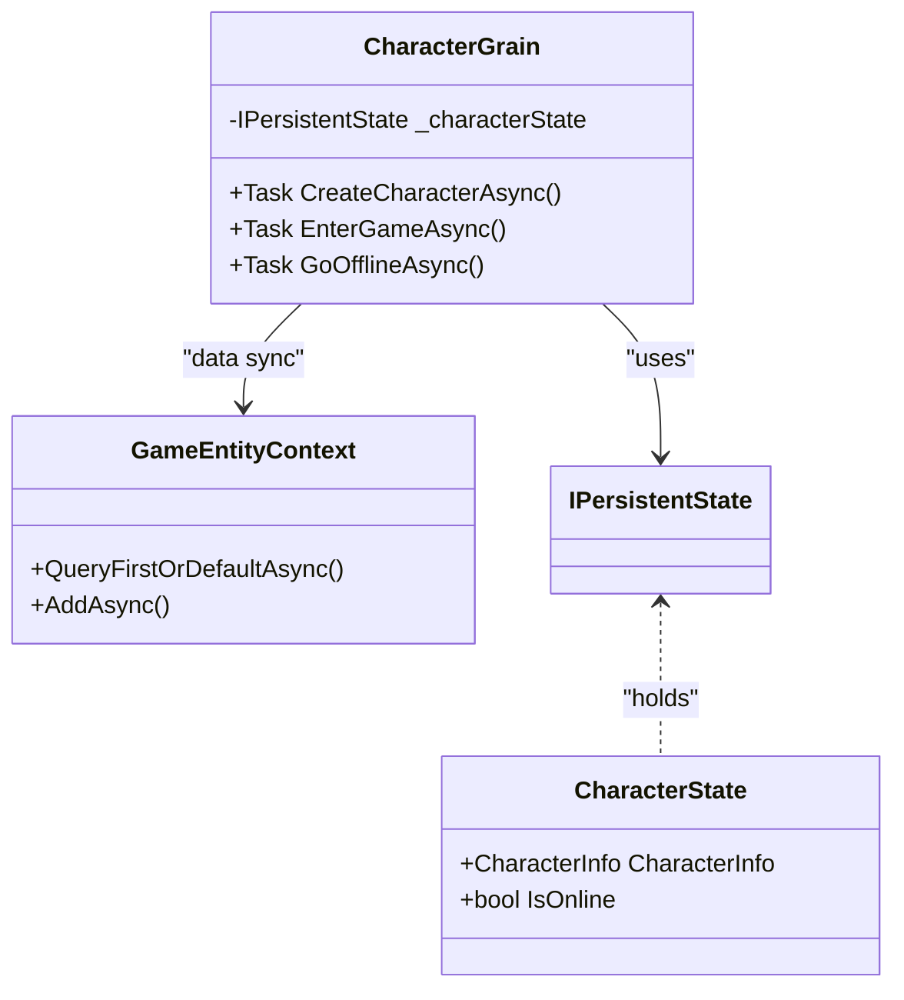

<cite>
**本文档中引用的文件**
- [CharacterGrain.cs](file://Horizon.Orleans.Grains\CharacterGrain.cs)
- [ICharacterGrain.cs](file://Horizon.Orleans.Interface\ICharacterGrain.cs)
</cite>

# 角色生命周期管理

## 目录
1. [引言](#引言)
2. [核心流程分析](#核心流程分析)
3. [状态持久化与数据同步机制](#状态持久化与数据同步机制)
4. [角色创建逻辑详解](#角色创建逻辑详解)
5. [状态恢复与资源回收](#状态恢复与资源回收)
6. [性能优化建议](#性能优化建议)
7. [结论](#结论)

## 引言

本文档旨在深入解析游戏系统中角色（Character）的完整生命周期管理机制。该机制基于Orleans框架实现，通过`CharacterGrain`类来封装所有与角色相关的业务逻辑和数据状态。文档将详细阐述角色从创建、进入游戏、离线到状态恢复等核心流程，并重点分析其背后的状态持久化策略、数据同步方法以及高并发场景下的性能考量。

## 核心流程分析

角色的生命周期由一系列异步方法驱动，这些方法构成了玩家与游戏世界交互的基础。

### 角色创建 (CreateCharacterAsync)

`CreateCharacterAsync` 方法是角色生命周期的起点。当玩家请求创建新角色时，此方法被调用。它首先检查当前Grain实例是否已存在角色数据，以防止重复创建。随后，它会验证关联的用户账户状态，确保账户未被封禁。在创建过程中，系统会执行敏感词过滤，对输入的角色名称进行净化处理。接着，通过查询数据库检查角色名称的唯一性。如果校验通过，则初始化一个包含默认属性（如等级为1、经验值为0、创建时间为UTC时间）的新角色实体，并将其持久化到数据库。最后，将数据库中的实体映射到内存中的`CharacterState`，并写入持久化存储，完成角色的创建。

**Section sources**
- [CharacterGrain.cs](file://Horizon.Orleans.Grains\CharacterGrain.cs#L96-L138)

### 进入游戏 (EnterGameAsync)

`EnterGameAsync` 方法标志着角色正式进入游戏世界。该方法首先确认角色数据已成功加载。一旦验证通过，它会将`CharacterState`中的`IsOnline`标志设置为`true`，并通过调用`WriteStateAsync`将这一在线状态变更立即持久化，确保状态的一致性。此操作完成后，系统会记录日志并返回包含角色信息的成功响应，允许客户端开始加载游戏内容。

**Section sources**
- [CharacterGrain.cs](file://Horizon.Orleans.Grains\CharacterGrain.cs#L151-L170)

### 离线处理 (GoOfflineAsync)

`GoOfflineAsync` 方法负责处理角色退出游戏的逻辑。它的主要任务是将`CharacterState`中的`IsOnline`标志重置为`false`，并通过`WriteStateAsync`将最终的离线状态安全地保存到持久化存储中。这一步骤至关重要，因为它保证了即使服务器重启，也能准确还原角色的离线状态。在完成状态持久化后，该方法会调用`DeactivateOnIdle`，主动请求Orleans运行时停用当前的Grain实例，从而释放宝贵的服务器资源。

**Section sources**
- [CharacterGrain.cs](file://Horizon.Orleans.Grains\CharacterGrain.cs#L202-L216)

## 状态持久化与数据同步机制

系统采用Orleans框架提供的`IPersistentState<T>`模式来管理角色的核心状态。

### IPersistentState<CharacterState> 机制

`CharacterState` 类是一个简单的POCO（Plain Old CLR Object），使用`[MemoryPackable]`和`[GenerateSerializer]`等特性标记，使其能够被高效序列化。它包含了两个核心字段：`CharacterInfo`（角色的具体信息）和`IsOnline`（在线状态）。`CharacterGrain`通过依赖注入获得一个名为`_characterState`的`IPersistentState<CharacterState>`实例。这个实例充当了内存状态与底层持久化存储（在此配置为"GameStore"）之间的桥梁。开发者无需关心具体的数据库操作，只需通过`_characterState.State`读取或修改状态，并调用`_characterState.WriteStateAsync()`来触发异步持久化，Orleans运行时会自动处理后续的序列化、存储和潜在的错误重试。

**Diagram sources**
- [CharacterGrain.cs](file://Horizon.Orleans.Grains\CharacterGrain.cs#L26-L35)
- [CharacterGrain.cs](file://Horizon.Orleans.Grains\CharacterGrain.cs#L41-L74)

### 与GameEntityContext的数据同步策略

虽然`IPersistentState`提供了便捷的状态管理，但某些操作（如创建角色时检查用户名唯一性）需要直接访问关系型数据库。为此，`CharacterGrain`还注入了`IDataContext<GameEntityContext, CharacterEntity, long>`类型的`_gameCharacterContext`。这种设计体现了“混合持久化”策略：
1.  **高频、低延迟操作**：使用`IPersistentState`进行，因为它通常基于高性能的NoSQL存储或内存数据库，读写速度快。
2.  **复杂查询与事务性操作**：使用`GameEntityContext`（基于Entity Framework Core）进行，利用其强大的LINQ查询能力和ACID事务支持。
在`CreateCharacterAsync`中，系统先通过`GameEntityContext`查询数据库确保名称唯一，然后在创建成功后，将数据更新同步到`IPersistentState`中，实现了两种存储优势的结合。

**Section sources**
- [CharacterGrain.cs](file://Horizon.Orleans.Grains\CharacterGrain.cs#L119-L138)

## 角色创建逻辑详解

角色创建过程是一系列严谨的校验和初始化步骤的组合。

### 敏感词过滤

在创建角色前，系统会调用`StringHelper`扩展方法`FilterSensitiveWords`对传入的角色名称进行过滤。此方法会扫描名称中的敏感词汇，并将其替换为星号(*)或其他占位符，有效防止不当名称的出现，维护了游戏社区的健康环境。

### 名称唯一性校验

为了保证每个角色名称的全球唯一性，系统执行了一次数据库查询`_gameCharacterContext.QueryFirstOrDefaultAsync(c => c.CharacterName == request.CharacterName)`。如果查询返回非空结果，则立即终止创建流程，并向客户端返回“角色名已存在”的错误信息。

### 默认属性初始化

当所有校验均通过后，系统使用AutoMapper将`CreateCharacterRequest` DTO映射为`CharacterEntity`。在此之后，代码显式地设置了若干关键的默认属性：
*   `Level = 1`: 新角色起始等级为1级。
*   `Experience = 0`: 初始经验值为0。
*   `CreateTime = DateTime.UtcNow`: 记录精确的创建时间戳。
*   其他如`ServerId`, `AreaId`, `GameId`, `UserId`等则从请求参数中获取并赋值。

这些初始化操作确保了新角色拥有一个一致且符合游戏规则的初始状态。

**Section sources**
- [CharacterGrain.cs](file://Horizon.Orleans.Grains\CharacterGrain.cs#L96-L138)

## 状态恢复与资源回收

### OnActivateAsync 中的状态恢复

`OnActivateAsync` 是Orleans Grains的一个生命周期钩子，在每次Grain被激活（无论是首次创建还是从非活动状态唤醒）时调用。其实现逻辑如下：
1.  首先记录激活日志。
2.  检查`_characterState.State.CharacterInfo`是否为空。如果为空，说明这是首次激活或之前的状态丢失。
3.  在此情况下，系统会作为“后备”方案，直接查询`GameEntityContext`数据库，尝试根据Grain的Key（即`CharacterId`）加载完整的角色数据。
4.  如果数据库中找到对应角色，则将其映射回`CharacterState`，并调用`WriteStateAsync`将数据重新填充到持久化状态存储中，以便后续操作可以直接使用高速的`IPersistentState`。
5.  如果数据库中也找不到，则记录警告日志。

这一机制确保了系统的健壮性，即使持久化状态意外丢失，也能从主数据库中恢复。

**Section sources**
- [CharacterGrain.cs](file://Horizon.Orleans.Grains\CharacterGrain.cs#L41-L74)

### DeactivateOnIdle 资源回收最佳实践

`DeactivateOnIdle`是Orleans提供的一个关键资源管理方法。在`GoOfflineAsync`的末尾调用它，是一种最佳实践。其工作原理是通知Orleans运行时：“这个Grain实例目前处于空闲状态，如果没有新的请求到来，可以安全地将其从内存中移除”。这极大地减少了服务器上活跃Grain的数量，从而节省了内存和CPU资源。当未来有新的请求（如再次登录）到达时，Orleans会自动重新激活该Grain，整个过程对开发者透明。

**Section sources**
- [CharacterGrain.cs](file://Horizon.Orleans.Grains\CharacterGrain.cs#L202-L216)

## 性能优化建议

在高并发的游戏环境中，频繁的操作可能成为性能瓶颈。

### 避免在移动中调用 WriteStateAsync

`MoveAsync`方法的注释明确指出了一个重要的性能陷阱：“In a real game, you would not write state for every move.”。角色的移动是一个极其频繁的操作（每秒可能数十次）。如果每次移动都调用`WriteStateAsync`，将会产生海量的I/O操作，严重拖慢系统性能并增加数据库压力。

**推荐做法**：
*   **仅在内存中更新状态**：在`MoveAsync`中，只更新`_characterState.State.CharacterInfo.Position`，而不调用`WriteStateAsync`。
*   **定期持久化**：通过后台定时器（Timer）或基于事件（如角色离开某个区域）的方式，周期性地批量保存位置和其他状态。
*   **按需持久化**：仅在角色登出、死亡或进行重要操作时才强制写入状态。

这种“延迟写入”或“批量写入”策略能显著提升系统的吞吐量和响应速度。

**Section sources**
- [CharacterGrain.cs](file://Horizon.Orleans.Grains\CharacterGrain.cs#L176-L180)

## 结论

综上所述，该角色生命周期管理系统设计精巧，充分利用了Orleans框架的优势。它通过`IPersistentState`实现了高效的状态管理，并结合`GameEntityContext`完成了复杂的业务校验，形成了互补的数据同步策略。从创建时的多重校验，到在线/离线的状态流转，再到激活时的容错恢复和离线时的资源回收，整个流程清晰且健壮。遵循避免在高频操作中持久化状态的建议，能够确保系统在高负载下依然保持卓越的性能表现。