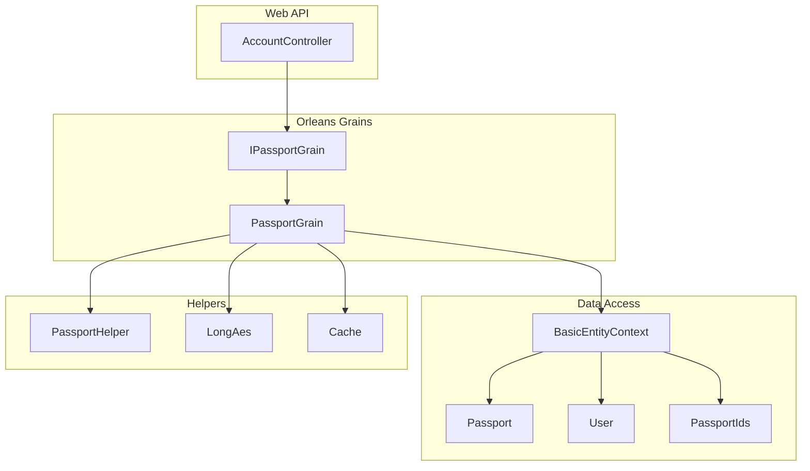
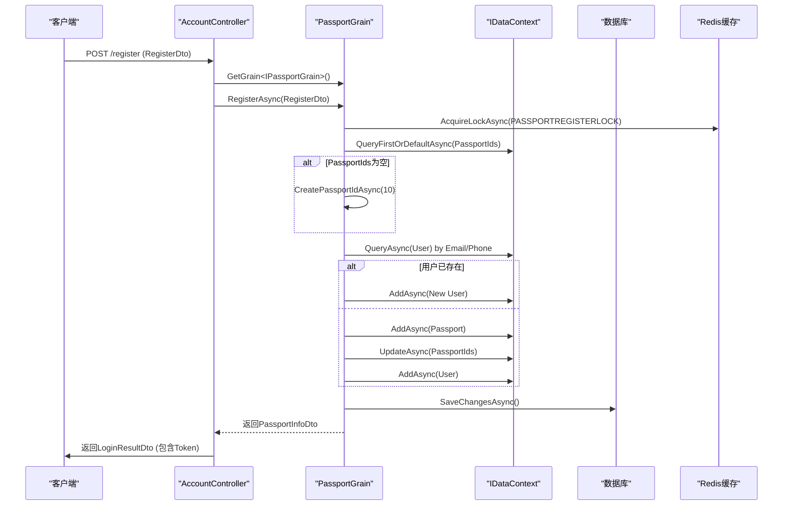
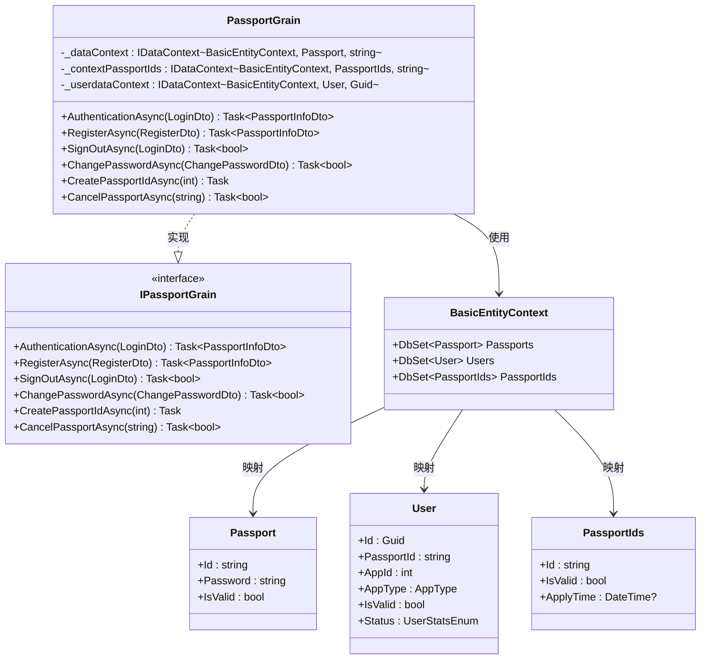
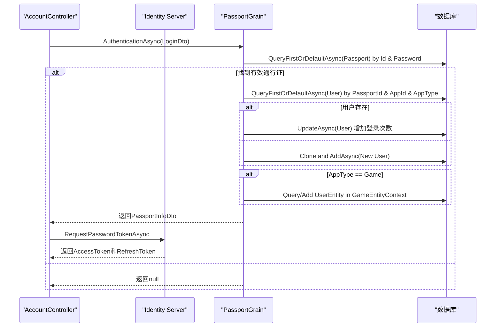
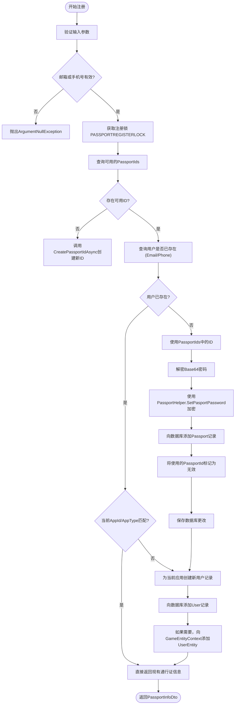
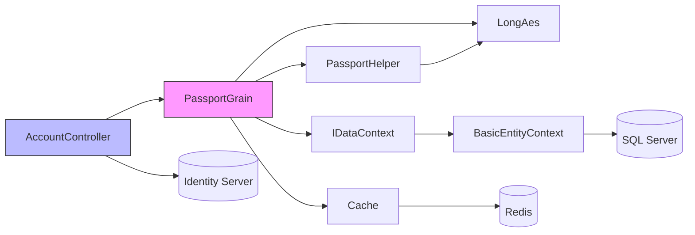

# 身份认证服务

<cite>
**本文档引用的文件**
- [PassportGrain.cs](file://Horizon.Orleans.Grains/PassportGrain.cs)
- [IPassportGrain.cs](file://Horizon.Orleans.Interface/IPassportGrain.cs)
- [Passport.cs](file://Horizon.Model.Basic/Passport.cs)
- [User.cs](file://Horizon.Model.Basic/User.cs)
- [BasicEntityContext.cs](file://Horizon.Entities/BasicEntityContext.cs)
- [Cache.cs](file://Horizon.Core/Cache.cs)
- [CacheConst.cs](file://Horizon.Core/CacheConst.cs)
- [PassportHelper.cs](file://Horizon.Core/PassportHelper.cs)
- [LongAes.cs](file://Horizon.Core/LongAes.cs)
- [AccountController.cs](file://Horizon.WebApi/Controllers/AccountController.cs)
</cite>

## 目录
1. [简介](#简介)
2. [项目结构](#项目结构)
3. [核心组件](#核心组件)
4. [架构概述](#架构概述)
5. [详细组件分析](#详细组件分析)
6. [依赖分析](#依赖分析)
7. [性能考虑](#性能考虑)
8. [故障排除指南](#故障排除指南)
9. [结论](#结论)

## 简介
本文件旨在详细说明基于Orleans框架的身份认证服务，重点描述`PassportGrain`的实现机制。该服务负责处理用户登录、注册、登出和密码修改等核心功能，并支持多应用类型（如AppType.Game）的会话逻辑。文档将深入探讨其与数据上下文（IDataContext）的交互、通行证ID生成策略、分布式锁控制、安全设计以及完整的请求调用链路。

## 项目结构
身份认证服务是整个系统的核心模块之一，位于`Horizon.Orleans.Grains`命名空间下。它通过Grain模式提供高并发、低延迟的账户管理能力。主要相关目录包括：
- `Horizon.Orleans.Grains`: 包含`PassportGrain`的具体实现。
- `Horizon.Orleans.Interface`: 定义了`IPassportGrain`接口，为Grain提供契约。
- `Horizon.Model.Basic`: 存放`Passport`和`User`等基础实体模型。
- `Horizon.Entities`: 实现`BasicEntityContext`用于数据库操作。
- `Horizon.WebApi.Controllers`: 提供RESTful API入口，如`AccountController`。
- `Horizon.Core.Helper`: 包含`PassportHelper`和`LongAes`等辅助类，处理加密和ID生成。

**图源**
- [PassportGrain.cs](file://Horizon.Orleans.Grains/PassportGrain.cs)
- [IPassportGrain.cs](file://Horizon.Orleans.Interface/IPassportGrain.cs)
- [BasicEntityContext.cs](file://Horizon.Entities/BasicEntityContext.cs)
- [Passport.cs](file://Horizon.Model.Basic/Passport.cs)
- [User.cs](file://Horizon.Model.Basic/User.cs)
- [PassportHelper.cs](file://Horizon.Core/PassportHelper.cs)
- [LongAes.cs](file://Horizon.Core/LongAes.cs)
- [Cache.cs](file://Horizon.Core/Cache.cs)
- [AccountController.cs](file://Horizon.WebApi/Controllers/AccountController.cs)

## 核心组件
`PassportGrain`是身份认证服务的核心，它继承自Orleans的`Grain`并实现了`IPassportGrain`接口。该Grain通过依赖注入获取多个`IDataContext`实例，分别用于访问`Passport`、`User`、`PassportIds`等实体。其主要职责包括用户认证、注册、登出、密码修改以及通行证ID的批量创建和注销。

**章节来源**
- [PassportGrain.cs](file://Horizon.Orleans.Grains/PassportGrain.cs#L24-L394)
- [IPassportGrain.cs](file://Horizon.Orleans.Interface/IPassportGrain.cs#L12-L83)

## 架构概述
该服务采用分层架构，从上至下分别为API层、Grain层和数据访问层。API层（`AccountController`）接收HTTP请求并将其转发给Orleans集群中的`PassportGrain`。Grain层作为业务逻辑的执行单元，利用`IDataContext`与底层数据库进行交互。数据访问层由`BasicEntityContext`驱动，使用Entity Framework Core进行ORM映射。整个流程通过Redis缓存（`Cache`类）进行优化，确保高并发下的性能和一致性。

**图源**
- [PassportGrain.cs](file://Horizon.Orleans.Grains/PassportGrain.cs#L165-L260)
- [AccountController.cs](file://Horizon.WebApi/Controllers/AccountController.cs#L149-L201)
- [Cache.cs](file://Horizon.Core/Cache.cs#L10-L572)
- [CacheConst.cs](file://Horizon.Core/CacheConst.cs#L11-L149)

## 详细组件分析

### PassportGrain 分析
`PassportGrain`是整个认证系统的核心业务逻辑载体。它通过构造函数注入了多个`IDataContext`，实现了对不同实体的精确控制。

#### 对象关系图

**图源**
- [PassportGrain.cs](file://Horizon.Orleans.Grains/PassportGrain.cs#L24-L394)
- [IPassportGrain.cs](file://Horizon.Orleans.Interface/IPassportGrain.cs#L12-L83)
- [BasicEntityContext.cs](file://Horizon.Entities/BasicEntityContext.cs#L95-L165)
- [Passport.cs](file://Horizon.Model.Basic/Passport.cs#L16-L32)
- [User.cs](file://Horizon.Model.Basic/User.cs#L17-L27)

#### 认证流程时序图

**图源**
- [PassportGrain.cs](file://Horizon.Orleans.Grains/PassportGrain.cs#L51-L124)
- [AccountController.cs](file://Horizon.WebApi/Controllers/AccountController.cs#L149-L201)

### 注册流程分析
注册流程是`PassportGrain`中最为复杂的部分，涉及分布式锁、ID池管理和事务性操作。

#### 流程图

**图源**
- [PassportGrain.cs](file://Horizon.Orleans.Grains/PassportGrain.cs#L165-L260)
- [PassportHelper.cs](file://Horizon.Core/PassportHelper.cs#L96-L105)
- [Cache.cs](file://Horizon.Core/Cache.cs#L10-L572)
- [CacheConst.cs](file://Horizon.Core/CacheConst.cs#L11-L149)

## 依赖分析
`PassportGrain`的正常运行依赖于多个关键组件和服务。

**图源**
- [go.mod](file://go.mod#L1-L20)
- [main.go](file://main.go#L1-L15)

**章节来源**
- [PassportGrain.cs](file://Horizon.Orleans.Grains/PassportGrain.cs#L35-L49)
- [BasicEntityContext.cs](file://Horizon.Entities/BasicEntityContext.cs#L129-L137)
- [Cache.cs](file://Horizon.Core/Cache.cs#L10-L572)

## 性能考虑
为了应对高并发场景，该服务在设计上采取了多项性能优化措施：
1. **分布式锁**：在注册和创建通行证ID时，使用`Cache.AcquireLockAsync`来防止竞态条件，确保数据一致性。
2. **ID预生成池**：通过`PassportIds`表预先生成一批通行证ID，避免在每次注册时都进行复杂的ID生成计算。
3. **异步非阻塞**：所有数据库操作均使用`async/await`模式，最大化I/O吞吐量。
4. **缓存集成**：`Cache`类提供了对Redis的封装，可用于缓存频繁访问的数据，减少数据库压力。
尽管如此，在极端高并发情况下，`CreatePassportIdAsync`方法目前被注释掉，可能意味着其性能或稳定性有待进一步验证。

## 故障排除指南
当遇到身份认证服务的问题时，可以参考以下常见问题及解决方案：

| 问题现象 | 可能原因 | 解决方案 |
| :--- | :--- | :--- |
| 注册失败，提示“无可用通行证ID” | `PassportIds`表中没有有效的ID，且`CreatePassportIdAsync`未被调用 | 检查`PASSPORTFLAG`缓存项，确认是否有管理员权限调用`CreatingAsync`API手动创建一批ID |
| 登录成功但无法获取Token | 与Identity Server通信失败 | 检查`disco.TokenEndpoint`配置和网络连接，确保Identity Server正常运行 |
| 密码修改后无法登录 | 密码加密算法不一致 | 确认`PassportHelper.SetPasportPassword`和`LongAes`的加密逻辑在客户端和服务端保持一致 |
| 多次快速注册导致重复ID | 分布式锁失效或超时时间过短 | 检查`CacheConst.PASSPORTREGISTERLOCK`的超时设置，确保在高负载下锁能正确释放 |

**章节来源**
- [PassportGrain.cs](file://Horizon.Orleans.Grains/PassportGrain.cs#L262-L394)
- [AccountController.cs](file://Horizon.WebApi/Controllers/AccountController.cs#L149-L201)
- [LongAes.cs](file://Horizon.Core/LongAes.cs#L248-L271)

## 结论
`PassportGrain`实现了一个功能完整、结构清晰的身份认证服务。它充分利用了Orleans框架的Actor模型优势，通过Grain的单线程执行特性简化了并发控制。服务通过`IDataContext`抽象层实现了与具体数据存储的解耦，并通过`PassportHelper`和`LongAes`提供了强大的安全加密能力。虽然`CreatePassportIdAsync`方法目前处于禁用状态，但这并不影响核心的登录、注册和登出功能。整体设计合理，具备良好的可扩展性和维护性，为系统的用户管理奠定了坚实的基础。