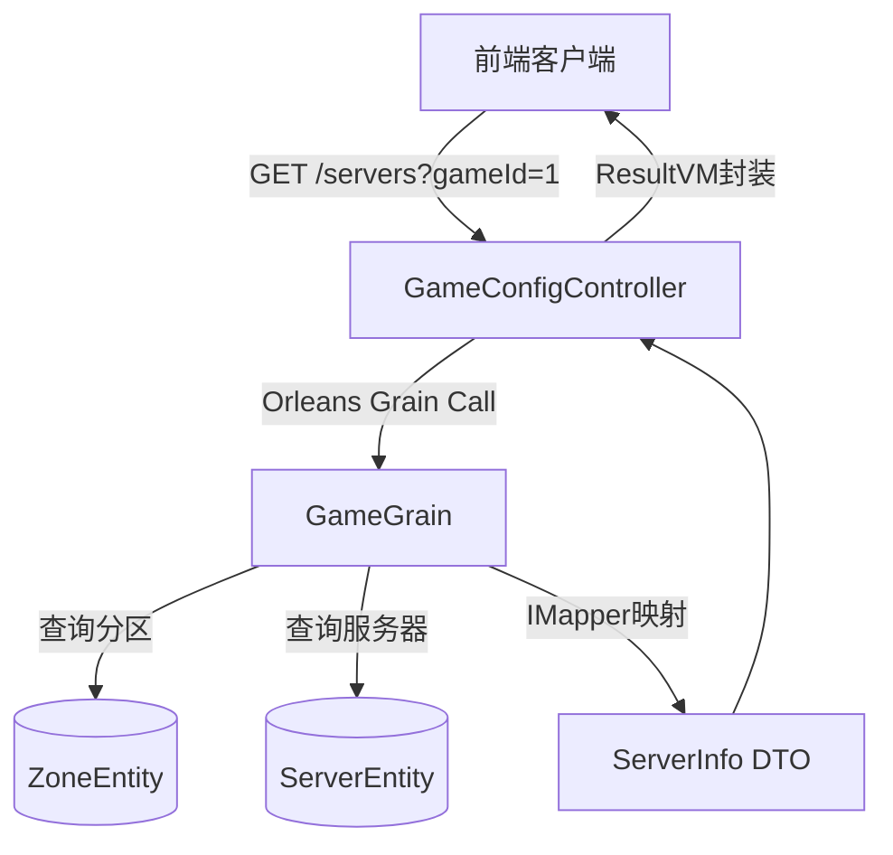
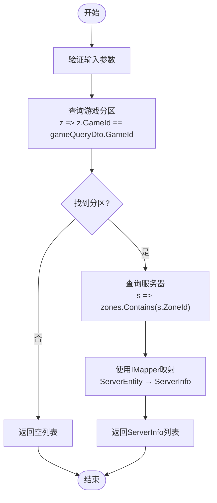
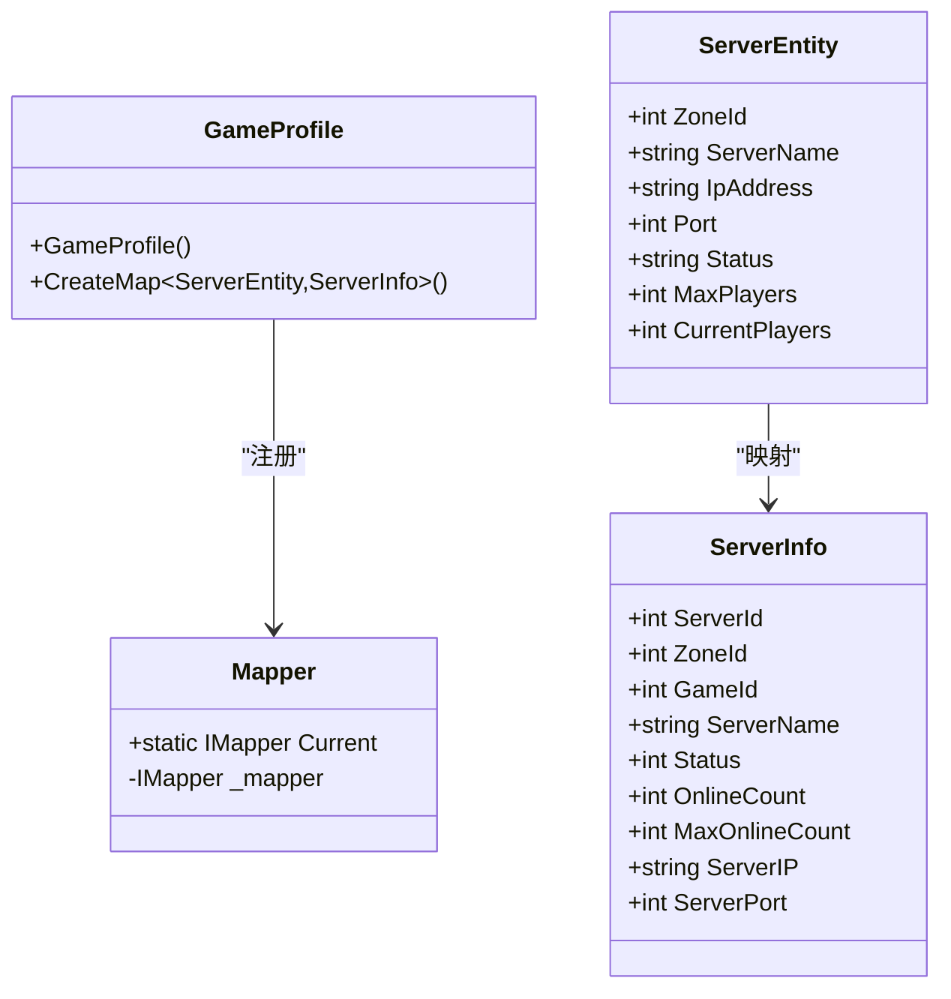
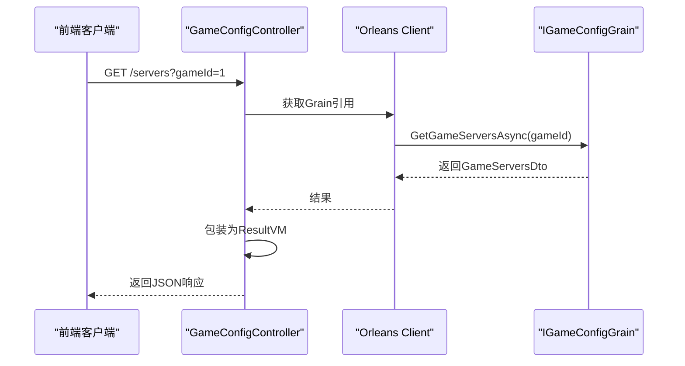

# 游戏服务

<cite>
**本文档引用的文件**  
- [GameGrain.cs](file://Horizon.Orleans.Grains/GameGrain.cs)
- [GameQueryDto.cs](file://Horizon.Share/Dtos/Games/GameQueryDto.cs)
- [ServerEntity.cs](file://Horizon.Model/GameModel/ServerEntity.cs)
- [ServerInfo.cs](file://Horizon.Game.Message/Network/AccountMessages.cs)
- [Mapper.cs](file://Horizon.Core/Mapper.cs)
- [GameProfile.cs](file://Horizon.Mapper/GameProfile.cs)
- [GameConfigController.cs](file://Horizon.WebApi/Controllers/Games/GameConfigController.cs)
- [IGameGrain.cs](file://Horizon.Orleans.Interface/IGameGrain.cs)
- [GameEntityContext.cs](file://Horizon.Entities/GameEntityContext.cs)
- [ZoneEntity.cs](file://Horizon.Model/GameModel/ZoneEntity.cs)
- [ResultVM.cs](file://Horizon.Share/VMs/ResultVM.cs)
</cite>

## 目录
1. [简介](#简介)
2. [核心组件分析](#核心组件分析)
3. [架构概览](#架构概览)
4. [详细组件分析](#详细组件分析)
5. [依赖关系分析](#依赖关系分析)
6. [性能考虑](#性能考虑)
7. [故障排除指南](#故障排除指南)
8. [结论](#结论)

## 简介
本文档详细说明了游戏服务的核心功能，重点介绍 `GameGrain` 提供的服务器列表获取机制。文档涵盖从外部 REST API 调用到内部数据查询与映射的完整流程，包括 `GetServerListAsync` 方法的实现逻辑、`GameQueryDto` 参数的作用、实体到 DTO 的映射机制，并提供数据库优化建议和错误处理方案。

## 核心组件分析
本节分析实现服务器列表功能的核心组件及其交互方式。

**Section sources**
- [GameGrain.cs](file://Horizon.Orleans.Grains/GameGrain.cs#L34-L40)
- [GameQueryDto.cs](file://Horizon.Share/Dtos/Games/GameQueryDto.cs#L9-L34)
- [ServerEntity.cs](file://Horizon.Model/GameModel/ServerEntity.cs#L17-L84)
- [ServerInfo.cs](file://Horizon.Game.Message/Network/AccountMessages.cs#L689-L758)
- [Mapper.cs](file://Horizon.Core/Mapper.cs#L10-L14)
- [GameConfigController.cs](file://Horizon.WebApi/Controllers/Games/GameConfigController.cs#L20-L122)

## 架构概览
下图展示了从客户端请求到返回服务器列表的完整调用链路。



**Diagram sources**
- [GameConfigController.cs](file://Horizon.WebApi/Controllers/Games/GameConfigController.cs#L20-L75)
- [GameGrain.cs](file://Horizon.Orleans.Grains/GameGrain.cs#L34-L40)
- [GameEntityContext.cs](file://Horizon.Entities/GameEntityContext.cs#L148)
- [ZoneEntity.cs](file://Horizon.Model/GameModel/ZoneEntity.cs#L10-L48)

## 详细组件分析
本节深入分析各关键组件的实现细节。

### GameGrain 服务分析
`GameGrain` 是 Orleans 框架中的核心业务单元，负责处理游戏相关的聚合操作。

#### GetServerListAsync 实现逻辑
该方法实现了根据游戏ID查询可用服务器列表的核心逻辑：

1. 首先通过 `_gzContext.QueryAsync` 查询指定 `GameId` 的所有游戏分区（Zone）
2. 然后使用这些分区的 ID 列表作为条件，通过 `_gsContext.QueryAsync` 查询关联的所有服务器
3. 最后使用 AutoMapper 将 `ServerEntity` 实体列表映射为 `ServerInfo` DTO 列表返回

此实现采用了分步查询策略，避免了复杂的跨表连接操作，提高了查询灵活性。



**Diagram sources**
- [GameGrain.cs](file://Horizon.Orleans.Grains/GameGrain.cs#L34-L40)
- [GameQueryDto.cs](file://Horizon.Share/Dtos/Games/GameQueryDto.cs#L9-L34)

**Section sources**
- [GameGrain.cs](file://Horizon.Orleans.Grains/GameGrain.cs#L34-L40)

### GameQueryDto 参数分析
`GameQueryDto` 数据传输对象定义了查询服务器时可使用的过滤条件。

| 属性 | 类型 | 描述 | 是否必需 |
|------|------|------|----------|
| `GameId` | int | 游戏唯一标识符 | 是 |
| `AreaId` | int | 游戏分区ID | 否 |
| `ServerId` | int | 服务器ID | 否 |
| `GameUserId` | long | 游戏用户ID | 否 |
| `CharacterId` | long | 角色ID | 否 |

当前实现主要使用 `GameId` 进行过滤，其他字段可用于未来扩展更精细的查询功能。

**Section sources**
- [GameQueryDto.cs](file://Horizon.Share/Dtos/Games/GameQueryDto.cs#L9-L34)

### 映射机制分析
系统使用 AutoMapper 实现实体与 DTO 之间的类型转换。

#### 映射配置
在 `GameProfile` 中定义了从 `ServerEntity` 到 `ServerInfo` 的映射规则：

```csharp
CreateMap<ServerEntity, ServerInfo>();
```

此配置自动将源对象的属性映射到目标对象的对应属性，如：
- `ServerEntity.ServerName` → `ServerInfo.ServerName`
- `ServerEntity.IpAddress` → `ServerInfo.ServerIP`
- `ServerEntity.Port` → `ServerInfo.ServerPort`

#### IMapper 实例管理
全局 `IMapper` 实例通过静态属性 `Mapper.Current` 进行管理，确保在整个应用程序中使用统一的映射配置。



**Diagram sources**
- [GameProfile.cs](file://Horizon.Mapper/GameProfile.cs#L15-L25)
- [Mapper.cs](file://Horizon.Core/Mapper.cs#L10-L14)
- [ServerEntity.cs](file://Horizon.Model/GameModel/ServerEntity.cs#L17-L84)
- [ServerInfo.cs](file://Horizon.Game.Message/Network/AccountMessages.cs#L689-L758)

**Section sources**
- [GameProfile.cs](file://Horizon.Mapper/GameProfile.cs#L15-L25)

### REST API 接口分析
`GameConfigController` 提供了外部系统访问游戏配置的 HTTP 接口。

#### GET /servers 接口
- **路径**: `/GameConfig/servers`
- **方法**: GET
- **参数**: `gameId` (int, 必需)
- **认证**: 需要授权 ([Authorize] 特性)
- **返回**: `ResultVM<GameServersDto>`

接口通过 Orleans 客户端调用 `IGameConfigGrain.GetGameServersAsync` 方法获取数据，并使用 `ResultVM` 封装结果。



**Diagram sources**
- [GameConfigController.cs](file://Horizon.WebApi/Controllers/Games/GameConfigController.cs#L35-L75)
- [ResultVM.cs](file://Horizon.Share/VMs/ResultVM.cs#L9-L31)

**Section sources**
- [GameConfigController.cs](file://Horizon.WebApi/Controllers/Games/GameConfigController.cs#L35-L75)

## 依赖关系分析
分析各组件间的依赖关系，确保系统架构清晰。

```mermaid
dependency-graph
GameConfigController --> IGameConfigGrain
GameConfigController --> ResultVM
GameGrain --> GameEntityContext
GameGrain --> IMapper
GameEntityContext --> ServerEntity
GameEntityContext --> ZoneEntity
GameProfile --> AutoMapper
GameProfile --> ServerEntity
GameProfile --> ServerInfo
```

**Diagram sources**
- [GameConfigController.cs](file://Horizon.WebApi/Controllers/Games/GameConfigController.cs#L20-L122)
- [GameGrain.cs](file://Horizon.Orleans.Grains/GameGrain.cs#L34-L40)
- [GameEntityContext.cs](file://Horizon.Entities/GameEntityContext.cs#L148)
- [GameProfile.cs](file://Horizon.Mapper/GameProfile.cs#L15-L25)

## 性能考虑
针对服务器列表查询功能提出以下性能优化建议：

### 数据库索引优化
应在以下列上创建索引以提高查询性能：
- `ZoneEntity.GameId`：加速按游戏ID查询分区
- `ServerEntity.ZoneId`：加速按分区ID查询服务器
- 复合索引 `(GameId, ZoneId)`：支持联合查询

### 分页处理
当前实现返回所有匹配服务器，建议添加分页支持：
- 在 `GameQueryDto` 中增加 `PageNumber` 和 `PageSize` 属性
- 修改 `GetServerListAsync` 实现分页查询
- 返回包含分页信息的 `PageItems<ServerInfo>` 而非简单列表

### 缓存策略
对于频繁访问但不常变更的数据，建议实施缓存：
- 使用 Redis 缓存热门游戏的服务器列表
- 设置合理的过期时间（如 5-10 分钟）
- 在数据更新时清除相关缓存

## 故障排除指南
列出可能遇到的错误情况及相应的解决方案。

### 常见错误情况

| 错误场景 | HTTP状态码 | 响应码 | 错误消息示例 | 解决方案 |
|---------|-----------|--------|-------------|----------|
| 未授权访问 | 401 | 401 | "未经授权" | 确保请求包含有效身份令牌 |
| 游戏ID无效 | 200 | 200 | 空列表或null | 验证游戏ID是否存在 |
| 服务不可用 | 500 | 500 | 异常消息 | 检查Orleans集群状态和数据库连接 |
| 参数缺失 | 400 | 400 | "缺少必要参数" | 确保提供gameId参数 |

### 请求-响应示例
**请求**:
```
GET /GameConfig/servers?gameId=1 HTTP/1.1
Authorization: Bearer <token>
```

**成功响应**:
```json
{
  "code": 200,
  "isSuccess": true,
  "errorMessage": null,
  "data": {
    "servers": [
      {
        "serverId": 1,
        "zoneId": 1,
        "gameId": 1,
        "serverName": "新手服",
        "status": 1,
        "onlineCount": 1500,
        "maxOnlineCount": 2000,
        "serverIP": "192.168.1.100",
        "serverPort": 8080
      }
    ]
  }
}
```

**失败响应**:
```json
{
  "code": 500,
  "isSuccess": false,
  "errorMessage": "数据库连接失败",
  "data": null
}
```

**Section sources**
- [GameConfigController.cs](file://Horizon.WebApi/Controllers/Games/GameConfigController.cs#L35-L75)
- [ResultVM.cs](file://Horizon.Share/VMs/ResultVM.cs#L9-L31)

## 结论
游戏服务通过 Orleans 分布式框架实现了高效的服务器列表查询功能。系统采用分层架构，从 REST API 到 Grain 服务再到数据访问层，职责分明。通过 AutoMapper 实现了实体与 DTO 的高效转换，确保了数据的安全传输。建议未来增加分页、缓存和更完善的错误处理机制，以进一步提升系统性能和可靠性。