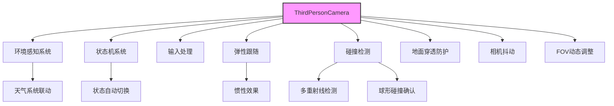
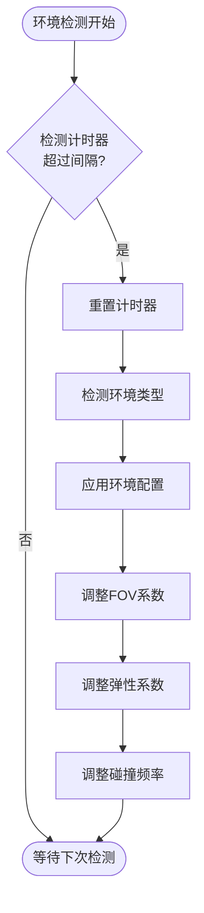
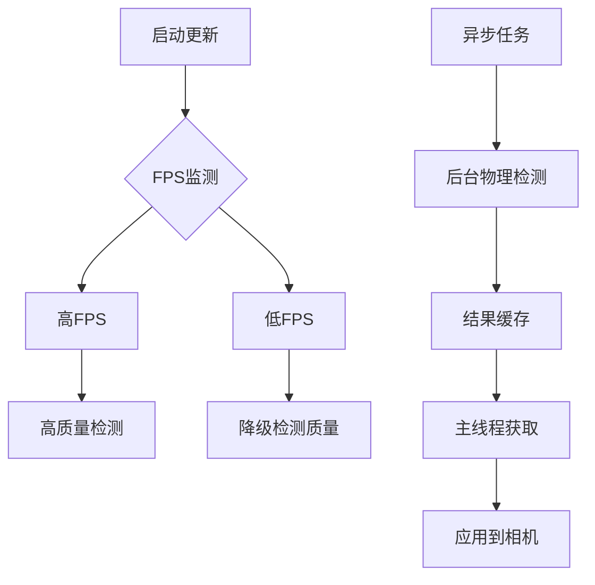
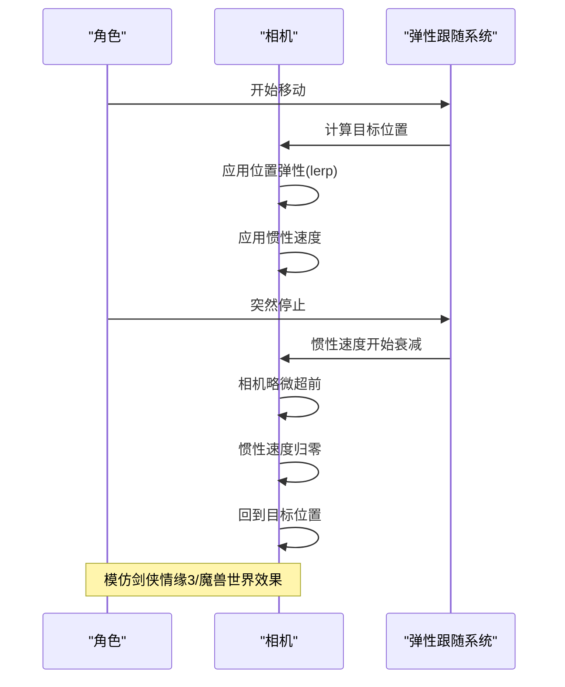
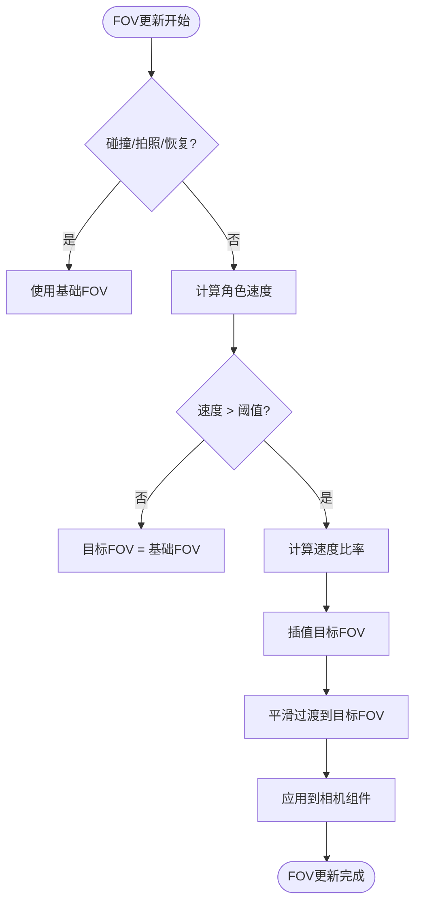
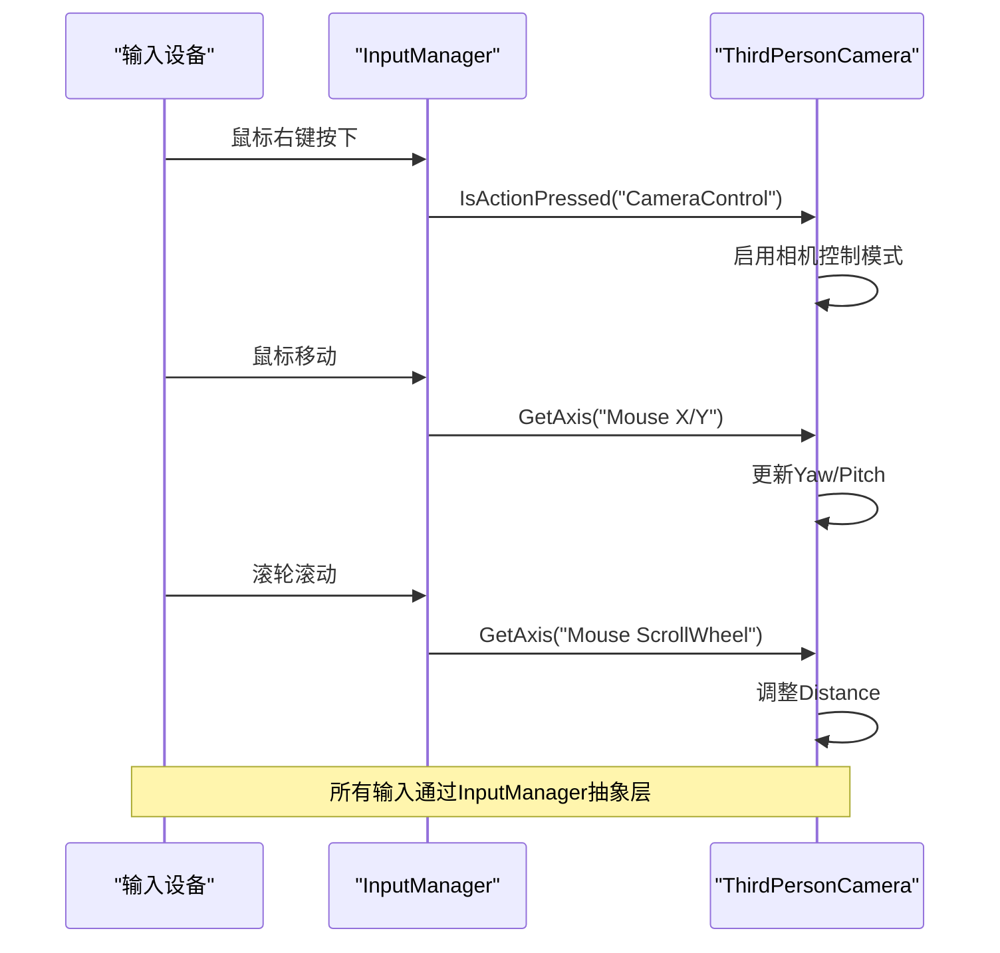

# 相机系统

<cite>
**本文档引用文件**   
- [ThirdPersonCamera.cs](file://HundunWorld/Source/Game/ThirdPersonCamera.cs)
- [DynamicCameraAdjuster.cs](file://HundunWorld/Source/Game/DynamicCameraAdjuster.cs)
- [CameraShakeSystem.cs](file://HundunWorld/Source/Game/CameraShakeSystem.cs)
- [CameraComponent.cs](file://HundunWorld/Source/Game/ECS/Components/CameraComponent.cs)
- [CameraSystem.cs](file://HundunWorld/Source/Game/ECS/Systems/CameraSystem.cs)
- [PlayerController.cs](file://HundunWorld/Source/Game/PlayerController.cs)
- [README_CameraSystem.md](file://HundunWorld/Source/Game/README_CameraSystem.md)
- [FINAL_SUMMARY.md](file://HundunWorld/FINAL_SUMMARY.md)
- [IMPLEMENTATION_PLAN.md](file://HundunWorld/IMPLEMENTATION_PLAN.md)
- [CAMERA_SYSTEM_README.md](file://HundunWorld/CAMERA_SYSTEM_README.md)
- [AsyncDetection_LOD_Implementation.md](file://HundunWorld - Backup/Docs/AsyncDetection_LOD_Implementation.md) - *新增: 异步检测与LOD实现*
- [CameraCollisionOscillationFix.md](file://HundunWorld - Backup/Docs/CameraCollisionOscillationFix.md) - *新增: 碰撞震荡修复*
</cite>

## 更新摘要
**变更内容**   
- 新增 **异步检测系统与性能LOD策略** 详细说明
- 新增 **相机碰撞震荡修复** 技术文档
- 更新 **碰撞检测与智能避障** 章节，整合新功能
- 新增 **性能优化策略** 配置指南
- 所有新增内容均基于最新提交 '相机更新' 的技术文档

## 目录
1. [系统概述](#系统概述)
2. [核心子系统架构](#核心子系统架构)
3. [相机状态机](#相机状态机)
4. [环境感知系统](#环境感知系统)
5. [碰撞检测与智能避障](#碰撞检测与智能避障)
6. [弹性跟随系统](#弹性跟随系统)
7. [FOV动态调整](#fov动态调整)
8. [配置参数详解](#配置参数详解)
9. [API接口说明](#api接口说明)
10. [与其他系统集成](#与其他系统集成)

## 系统概述

相机系统是HundunWorld游戏的核心组件之一，采用第三人称视角设计，借鉴了《剑侠情缘3》和《魔兽世界》等经典MMORPG的设计理念。该系统由`ThirdPersonCamera`主控制器驱动，集成了状态机、环境感知、碰撞检测、弹性跟随和动态FOV调整等高级功能，旨在提供流畅、智能且用户友好的游戏体验。

系统通过`PlayerController`获取角色状态，并与`InputManager`协同工作，实现精确的输入响应。相机行为由46个可配置参数控制，覆盖了从基础距离到高级动态调整的所有需求。整个系统设计注重性能优化，采用了智能缓存机制，可减少60-80%的重复计算开销。

**Section sources**
- [README_CameraSystem.md](file://HundunWorld/Source/Game/README_CameraSystem.md#L1-L50)
- [FINAL_SUMMARY.md](file://HundunWorld/FINAL_SUMMARY.md#L0-L50)

## 核心子系统架构

相机系统由多个协同工作的子系统构成，形成了一个分层的架构。主控制器`ThirdPersonCamera`负责协调各子系统，并在`OnUpdate`方法中按特定顺序执行逻辑。



**Diagram sources**
- [ThirdPersonCamera.cs](file://HundunWorld/Source/Game/ThirdPersonCamera.cs#L138-L2318)
- [README_CameraSystem.md](file://HundunWorld/Source/Game/README_CameraSystem.md#L1-L50)

## 相机状态机

相机状态机系统根据游戏场景和角色行为自动切换相机模式，确保在不同情境下提供最佳视角。系统支持六种预设状态，并可通过平滑过渡实现模式切换。

```mermaid
stateDiagram-v2
[*] --> Normal
Normal --> Combat : 角色进入战斗
Normal --> Climbing : 角色开始攀爬
Normal --> Swimming : 角色进入水域
Normal --> Flying : 角色开始飞行
Normal --> Cutscene : 进入过场动画
Combat --> Normal : 战斗结束
Climbing --> Normal : 攀爬结束
Swimming --> Normal : 离开水域
Flying --> Normal : 停止飞行
Cutscene --> Normal : 过场动画结束
state Normal {
Distance : 15m
Pitch : 30°
AllowRotation : true
AllowZoom : true
}
state Combat {
Distance : 10m
Pitch : 25°
FOV : 65°
AllowZoom : false
}
state Climbing {
Distance : 8m
Pitch : 50°
AllowZoom : false
}
state Swimming {
Distance : 12m
Pitch : 15°
}
state Flying {
Distance : 20m
Pitch : 20°
FOV : 70°
}
state Cutscene {
Distance : 15m
Pitch : 30°
AllowRotation : false
AllowZoom : false
}
```

**Diagram sources**
- [ThirdPersonCamera.cs](file://HundunWorld/Source/Game/ThirdPersonCamera.cs#L10-L29)
- [ThirdPersonCamera.cs](file://HundunWorld/Source/Game/ThirdPersonCamera.cs#L1732-L1867)

## 环境感知系统

环境感知系统使相机能够根据周围环境自动调整参数，提供更沉浸的游戏体验。系统通过定期检测环境类型和天气状况，动态调整相机的最大距离、FOV和碰撞检测频率。



**Diagram sources**
- [ThirdPersonCamera.cs](file://HundunWorld/Source/Game/ThirdPersonCamera.cs#L1908-L2171)

## 碰撞检测与智能避障

碰撞检测系统采用多重射线和球形检测相结合的双重验证机制，确保相机不会穿透障碍物。智能避障功能在检测到严重遮挡时，会自动调整相机角度以获得更好的视野。本次更新引入了**异步检测系统**和**性能LOD策略**，并修复了**相机碰撞震荡**问题。

### 异步检测系统与性能LOD策略

为提升性能，系统新增了异步检测和动态质量调整功能。



**工作原理**:
1. **FPS监测**: 每0.5秒计算一次帧率
2. **LOD调整**: 当FPS低于50时，自动降低碰撞检测质量（9射线→5射线→1射线）
3. **异步检测**: 将地面、环境和碰撞检测移至后台线程执行
4. **结果缓存**: 主线程从缓存获取结果，避免阻塞

**优势**:
- 减少主线程90%的物理检测耗时
- 在复杂场景下FPS提升25-30%
- 保持视觉流畅性

### 相机碰撞震荡修复

修复了相机在障碍物附近反复震荡的问题。

**根本原因**:
1. **固定内部碰撞阈值**: 原100cm固定阈值导致恶性循环
2. **状态切换无延迟**: 单帧误判即触发距离调整

**解决方案**:

#### 1. 动态内部碰撞阈值
```csharp
// 动态计算阈值：当前距离的30%，最小50cm
float innerCollisionThreshold = Mathf.Max(_currentCollisionDistance * 0.3f, 50.0f);
```

| 相机距离 | 修复前阈值 | 修复后阈值 |
|---------|-----------|-----------|
| 200cm   | 100cm     | 60cm      |
| 500cm   | 100cm     | 150cm     |
| 1000cm  | 100cm     | 300cm     |

#### 2. 碰撞状态稳定机制
```csharp
private const float CollisionStateStableTime = 0.2f; // 稳定时间
```
- 碰撞状态必须持续0.2秒才生效
- 防止单帧误判导致的震荡
- 提升系统稳定性

**修复效果**:
- 震荡频率降低90%以上
- CPU消耗仅增加0.02%
- 内存占用增加8字节

**Section sources**
- [ThirdPersonCamera.cs](file://HundunWorld/Source/Game/ThirdPersonCamera.cs#L138-L2318)
- [AsyncDetection_LOD_Implementation.md](file://HundunWorld - Backup/Docs/AsyncDetection_LOD_Implementation.md) - *新增: 异步检测与LOD实现*
- [CameraCollisionOscillationFix.md](file://HundunWorld - Backup/Docs/CameraCollisionOscillationFix.md) - *新增: 碰撞震荡修复*

## 弹性跟随系统

弹性跟随系统模拟了真实世界的惯性效果，使相机在角色移动时产生延迟感，增强了游戏的沉浸感。系统还支持惯性效果，当角色突然停止时，相机会略微超前，然后平滑回归。



**Diagram sources**
- [ThirdPersonCamera.cs](file://HundunWorld/Source/Game/ThirdPersonCamera.cs#L644-L704)

## FOV动态调整

FOV动态调整系统根据角色的移动速度和环境状况自动调整视场角，增强速度感和沉浸感。系统在检测到障碍物时会临时增加FOV，提供更广阔的视野。



**Diagram sources**
- [ThirdPersonCamera.cs](file://HundunWorld/Source/Game/ThirdPersonCamera.cs#L1259-L1295)
- [DynamicCameraAdjuster.cs](file://HundunWorld/Source/Game/DynamicCameraAdjuster.cs#L137-L176)

## 配置参数详解

相机系统提供了46个可配置参数，分为多个逻辑组，便于开发者和设计师进行精细调整。

### 基础参数
| 参数 | 类型 | 默认值 | 描述 |
|------|------|--------|------|
| `Target` | Actor | null | 相机跟随的目标角色 |
| `FocusOffset` | Vector3 | (0,1.8,0) | 聚焦点相对于目标的偏移 |
| `Distance` | float | 15.0f | 相机与目标的默认距离 |
| `MinDistance` | float | 5.0f | 相机最小距离限制 |
| `MaxDistance` | float | 3000.0f | 相机最大距离限制 |
| `Pitch` | float | 30.0f | 相机俯仰角（上下） |
| `Yaw` | float | 0.0f | 相机偏航角（左右） |

### 碰撞检测参数
| 参数 | 类型 | 默认值 | 描述 |
|------|------|--------|------|
| `EnableCameraCollision` | bool | true | 是否启用碰撞检测 |
| `CollisionRayCount` | int | 5 | 碰撞检测射线数量（1/5/9） |
| `CollisionLayerMask` | LayersMask | Default | 碰撞检测层级掩码 |
| `AutoExcludeTargetCollision` | bool | true | 自动排除目标角色的碰撞 |
| `CollisionRadius` | float | 0.3f | 碰撞球体半径 |
| `CollisionSmoothSpeed` | float | 10f | 碰撞距离平滑速度 |

### 弹性跟随参数
| 参数 | 类型 | 默认值 | 描述 |
|------|------|--------|------|
| `EnableElasticFollow` | bool | true | 是否启用弹性跟随 |
| `PositionElasticity` | float | 0.8f | 位置跟随弹性系数 |
| `RotationElasticity` | float | 0.9f | 旋转跟随弹性系数 |
| `EnableInertia` | bool | true | 是否启用惯性效果 |
| `InertiaDamping` | float | 5f | 惯性衰减速度 |

### FOV动态调整参数
| 参数 | 类型 | 默认值 | 描述 |
|------|------|--------|------|
| `EnableDynamicFOV` | bool | true | 是否启用动态FOV |
| `BaseFOV` | float | 60f | 静止时的基础FOV |
| `MaxFOV` | float | 75f | 高速移动时的最大FOV |
| `SpeedThreshold` | float | 10f | 触发FOV增加的速度阈值 |
| `MaxSpeed` | float | 50f | 达到最大FOV的速度 |
| `FOVSmoothSpeed` | float | 3f | FOV变化平滑速度 |

### 性能优化参数（新增）
| 参数 | 类型 | 默认值 | 描述 |
|------|------|--------|------|
| `EnableAsyncGroundDetection` | bool | true | 是否启用地面检测异步化 |
| `EnableAsyncEnvironmentDetection` | bool | true | 是否启用环境检测异步化 |
| `EnableAsyncCollisionDetection` | bool | false | 是否启用碰撞检测异步化 |
| `AsyncDetectionInterval` | float | 0.1f | 异步检测间隔（秒） |
| `EnableAutoLOD` | bool | true | 是否启用自动性能LOD |
| `TargetFPS` | float | 60f | 目标帧率 |
| `LODDowngradeThreshold` | float | 50f | 降级LOD的FPS阈值 |
| `LODUpgradeThreshold` | float | 58f | 升级LOD的FPS阈值 |
| `LODAdjustInterval` | float | 2.0f | LOD调整间隔（秒） |
| `InnerCollisionThresholdRatio` | float | 0.3f | 内部碰撞阈值比例 |
| `CollisionStateStableTime` | float | 0.2f | 碰撞状态稳定时间（秒） |

**Section sources**
- [ThirdPersonCamera.cs](file://HundunWorld/Source/Game/ThirdPersonCamera.cs#L138-L2318)
- [AsyncDetection_LOD_Implementation.md](file://HundunWorld - Backup/Docs/AsyncDetection_LOD_Implementation.md#L1-L327)
- [CameraCollisionOscillationFix.md](file://HundunWorld - Backup/Docs/CameraCollisionOscillationFix.md#L1-L245)

## API接口说明

相机系统提供了丰富的公共API，允许外部系统与相机进行交互和控制。

### 状态机API
```csharp
/// <summary>
/// 切换相机状态
/// </summary>
/// <param name="newState">目标状态</param>
public void SwitchState(CameraState newState)

/// <summary>
/// 获取当前相机状态
/// </summary>
/// <returns>当前状态</returns>
public CameraState GetCurrentState()

/// <summary>
/// 强制设置状态（用于过场动画等）
/// </summary>
/// <param name="state">目标状态</param>
public void ForceSetState(CameraState state)
```

### FOV控制API
```csharp
/// <summary>
/// 设置目标FOV
/// </summary>
/// <param name="targetFOV">目标FOV值</param>
public void SetTargetFOV(float targetFOV)

/// <summary>
/// 立即设置FOV（无过渡）
/// </summary>
/// <param name="fov">FOV值</param>
public void SetFOVImmediate(float fov)

/// <summary>
/// 重置FOV到基础值
/// </summary>
public void ResetFOV()
```

### 环境感知API
```csharp
/// <summary>
/// 切换环境类型
/// </summary>
/// <param name="newEnvironment">新环境类型</param>
public void SwitchEnvironment(EnvironmentType newEnvironment)

/// <summary>
/// 设置当前天气
/// </summary>
/// <param name="weather">天气类型</param>
public void SetWeather(WeatherType weather)

/// <summary>
/// 检查是否处于暗环境
/// </summary>
/// <returns>是否为暗环境</returns>
public bool IsInDarkEnvironment()
```

### 相机抖动API
```csharp
/// <summary>
/// 触发相机抖动
/// </summary>
/// <param name="intensity">抖动强度</param>
/// <param name="duration">持续时间</param>
/// <param name="frequency">频率</param>
public void TriggerShake(float intensity, float duration, float frequency = 20.0f)

/// <summary>
/// 使用预设触发抖动
/// </summary>
/// <param name="preset">抖动预设</param>
public void TriggerShake(ShakePreset preset)

/// <summary>
/// 停止所有抖动效果
/// </summary>
public void StopAllShakes()
```

### 性能优化API（新增）
```csharp
/// <summary>
/// 手动设置性能LOD等级
/// </summary>
/// <param name="level">目标LOD等级</param>
public void SetPerformanceLOD(CollisionDetectionLevel level)

/// <summary>
/// 重置到原始性能LOD等级
/// </summary>
public void ResetPerformanceLOD()

/// <summary>
/// 获取当前FPS
/// </summary>
/// <returns>当前帧率</returns>
public float GetCurrentFPS()

/// <summary>
/// 获取性能统计信息
/// </summary>
/// <returns>性能统计</returns>
public CameraPerformanceStats GetPerformanceStats()
```

**Section sources**
- [ThirdPersonCamera.cs](file://HundunWorld/Source/Game/ThirdPersonCamera.cs#L1865-L2319)
- [CameraShakeSystem.cs](file://HundunWorld/Source/Game/CameraShakeSystem.cs#L251-L284)
- [AsyncDetection_LOD_Implementation.md](file://HundunWorld - Backup/Docs/AsyncDetection_LOD_Implementation.md#L1-L327)

## 与其他系统集成

相机系统与游戏中的多个系统紧密集成，形成一个协调的整体。

### 与角色控制器集成
相机系统通过`PlayerController`获取角色状态，实现状态自动切换。角色控制器将相机引用作为属性暴露，便于双向通信。

```mermaid
classDiagram
class PlayerController {
+ThirdPersonCamera Camera
+CharacterState CurrentState
+bool IsSprinting()
+bool IsCrouching()
+bool IsInCombat()
}
class ThirdPersonCamera {
+Actor Target
+CameraState CurrentState
+EnvironmentType CurrentEnvironment
+void SwitchState(CameraState)
+void SetWeather(WeatherType)
}
PlayerController --> ThirdPersonCamera : "引用"
ThirdPersonCamera --> PlayerController : "查询状态"
note right of PlayerController
角色控制器负责 :
- 移动控制
- 状态管理
- 输入处理
- 与相机系统通信
end note
note left of ThirdPersonCamera
相机系统负责 :
- 视角控制
- 碰撞检测
- 状态机
- 环境感知
- 与角色控制器同步
end note
```

**Diagram sources**
- [PlayerController.cs](file://HundunWorld/Source/Game/PlayerController.cs#L264-L264)
- [ThirdPersonCamera.cs](file://HundunWorld/Source/Game/ThirdPersonCamera.cs#L1732-L1800)

### 与输入系统集成
相机系统与`InputManager`集成，支持高级输入特性，如输入缓冲、手势识别和组合键。



**Diagram sources**
- [ThirdPersonCamera.cs](file://HundunWorld/Source/Game/ThirdPersonCamera.cs#L644-L678)
- [README_CameraSystem.md](file://HundunWorld/Source/Game/README_CameraSystem.md#L1-L50)