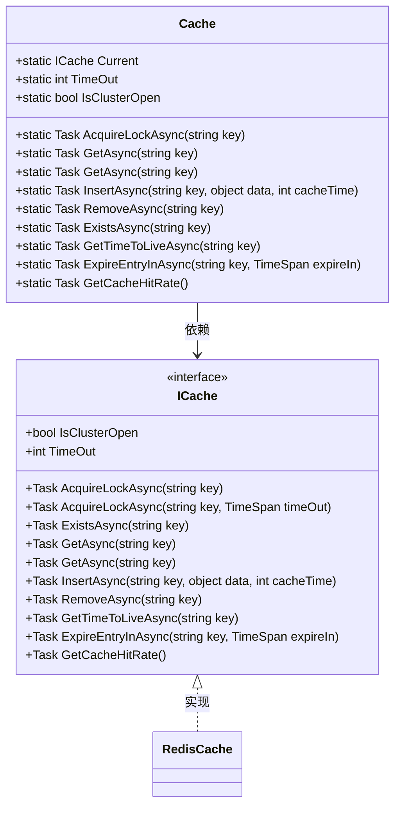
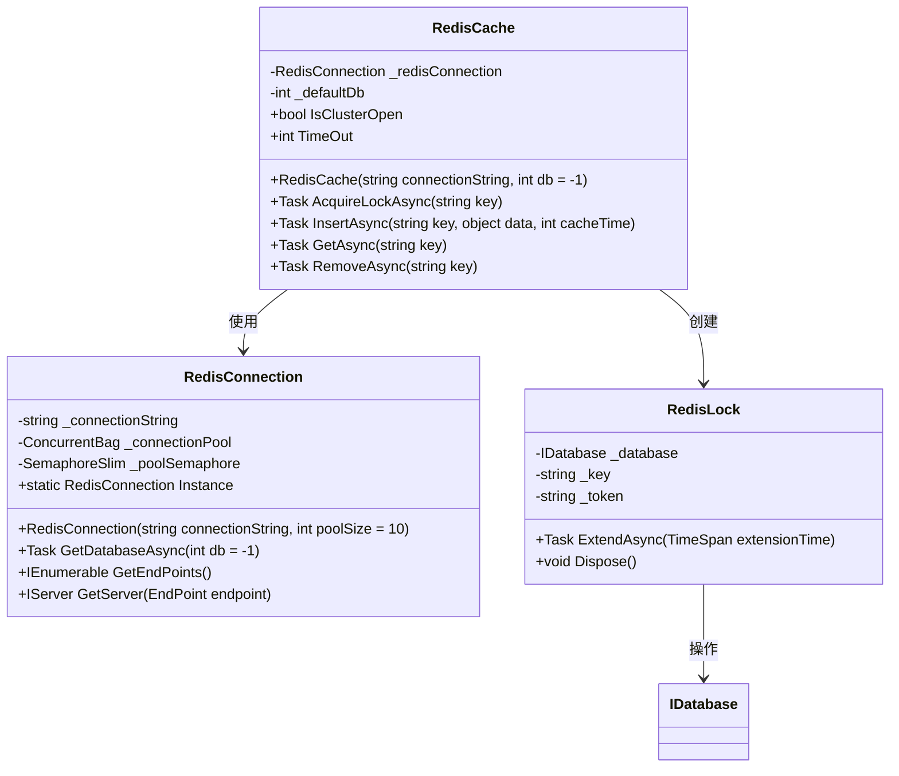
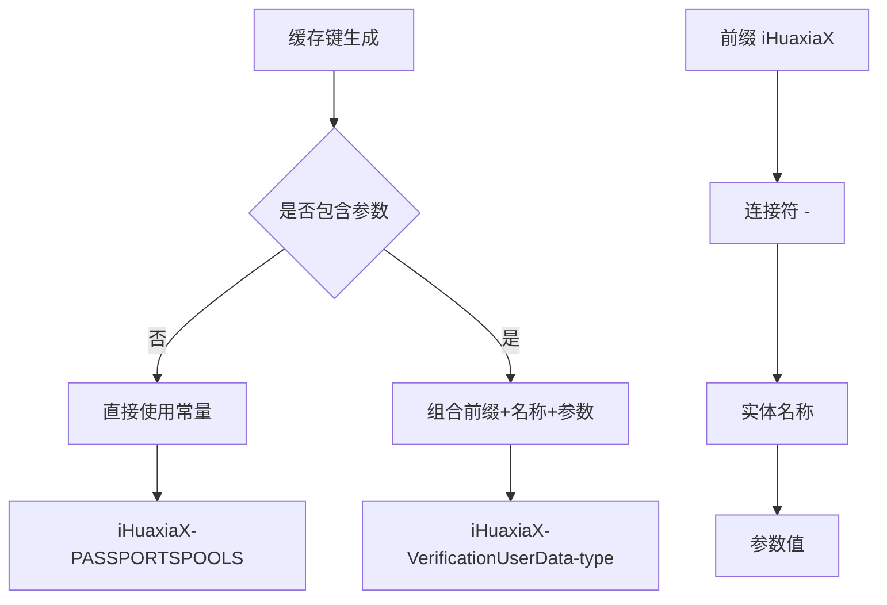
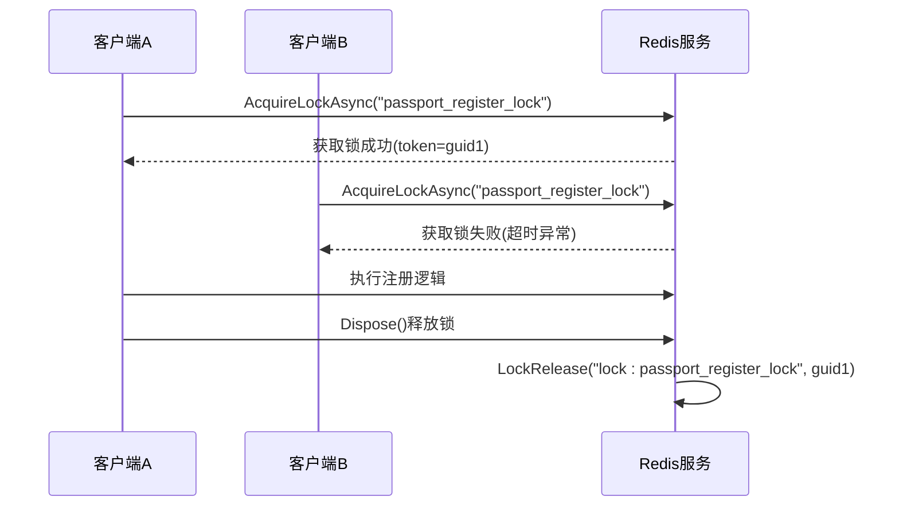
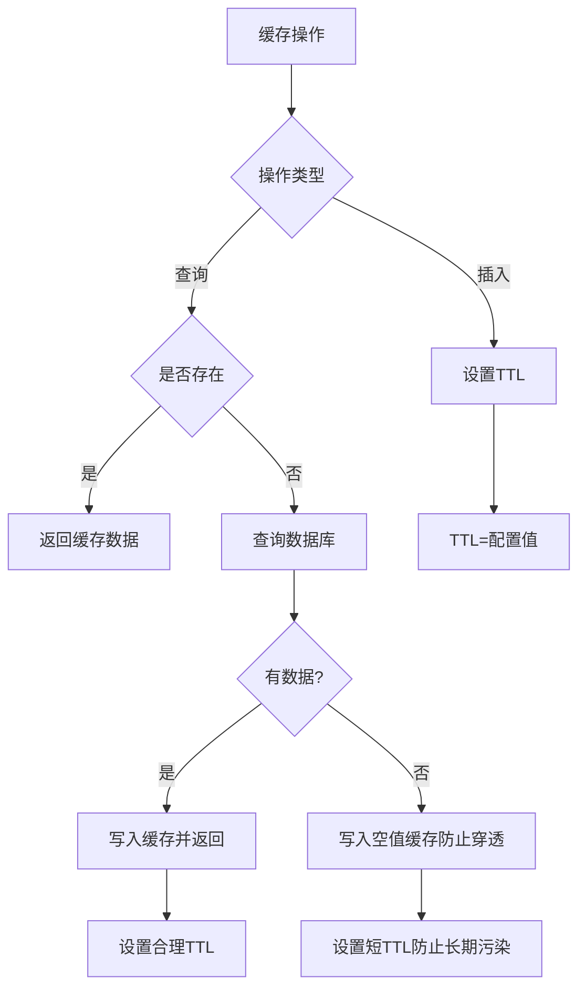
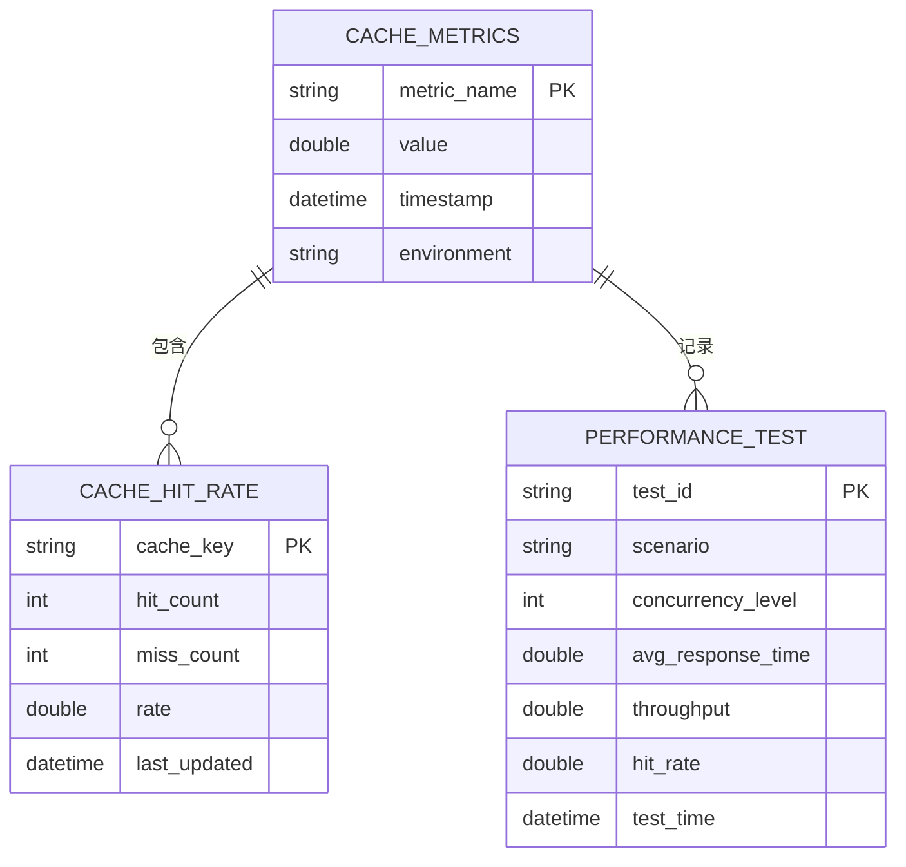
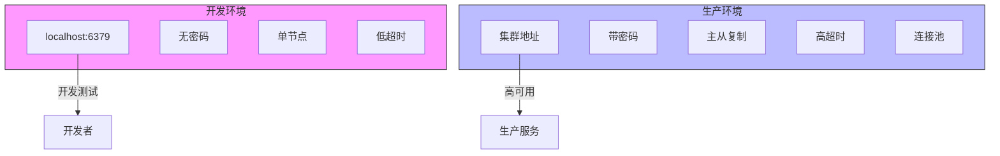

# 缓存策略

<cite>
**本文档中引用的文件**  
- [Cache.cs](file://Horizon.Core\Cache.cs)
- [ICache.cs](file://Horizon.Core.Abstract\ICache.cs)
- [RedisCache.cs](file://Horizon.Strategy.Storage.Redis\RedisCache.cs)
- [RedisConnection.cs](file://Horizon.Strategy.Storage.Redis\RedisConnection.cs)
- [CacheConst.cs](file://Horizon.Core\CacheConst.cs)
- [RedisOptions.cs](file://Horizon.Core\Options\RedisOptions.cs)
</cite>

## 目录
1. [引言](#引言)
2. [缓存抽象层设计](#缓存抽象层设计)
3. [Redis实现机制](#redis实现机制)
4. [缓存键命名规范](#缓存键命名规范)
5. [分布式锁应用](#分布式锁应用)
6. [缓存失效与保护策略](#缓存失效与保护策略)
7. [监控与性能测试](#监控与性能测试)
8. [环境配置差异](#环境配置差异)

## 引言
本系统采用Redis作为高性能数据缓存解决方案，通过抽象层设计实现了缓存功能与具体实现的解耦。该架构支持灵活的缓存策略配置、高效的并发控制以及可靠的缓存管理机制，为系统的高性能和高可用性提供了坚实基础。

## 缓存抽象层设计
系统通过定义`ICache`接口建立了统一的缓存访问契约，实现了业务代码与具体缓存实现的完全解耦。`Cache`静态类作为门面模式的实现，封装了所有缓存操作，提供了一致且简洁的API供上层调用。

**图源**
- [ICache.cs](file://Horizon.Core.Abstract\ICache.cs#L15-L319)
- [Cache.cs](file://Horizon.Core\Cache.cs#L10-L572)

**节源**
- [ICache.cs](file://Horizon.Core.Abstract\ICache.cs#L15-L319)
- [Cache.cs](file://Horizon.Core\Cache.cs#L10-L572)

## Redis实现机制
`RedisCache`类实现了`ICache`接口，基于StackExchange.Redis客户端库构建，提供了完整的Redis功能支持。通过`RedisConnection`连接池管理器确保了连接的高效复用和可靠性。

**图源**
- [RedisCache.cs](file://Horizon.Strategy.Storage.Redis\RedisCache.cs#L9-L483)
- [RedisConnection.cs](file://Horizon.Strategy.Storage.Redis\RedisConnection.cs#L15-L337)

**节源**
- [RedisCache.cs](file://Horizon.Strategy.Storage.Redis\RedisCache.cs#L9-L483)
- [RedisConnection.cs](file://Horizon.Strategy.Storage.Redis\RedisConnection.cs#L15-L337)

## 缓存键命名规范
系统通过`CacheConst`类集中管理所有缓存键的命名规则，采用统一的前缀和分隔符，确保了缓存键的可读性和一致性。

**图源**
- [CacheConst.cs](file://Horizon.Core\CacheConst.cs#L11-L149)

**节源**
- [CacheConst.cs](file://Horizon.Core\CacheConst.cs#L11-L149)

## 分布式锁应用
系统通过`AcquireLockAsync`方法实现分布式锁机制，有效防止了并发场景下的数据竞争问题，特别是在用户注册等关键业务流程中发挥了重要作用。

**图源**
- [Cache.cs](file://Horizon.Core\Cache.cs#L100-L115)
- [RedisCache.cs](file://Horizon.Strategy.Storage.Redis\RedisCache.cs#L17-L35)

**节源**
- [Cache.cs](file://Horizon.Core\Cache.cs#L100-L115)
- [RedisCache.cs](file://Horizon.Strategy.Storage.Redis\RedisCache.cs#L17-L35)

## 缓存失效与保护策略
系统实现了完善的缓存生命周期管理机制，包括TTL设置、过期时间更新和穿透保护措施，确保了缓存数据的一致性和可靠性。

**图源**
- [RedisCache.cs](file://Horizon.Strategy.Storage.Redis\RedisCache.cs#L100-L150)
- [Cache.cs](file://Horizon.Core\Cache.cs#L200-L250)

**节源**
- [RedisCache.cs](file://Horizon.Strategy.Storage.Redis\RedisCache.cs#L100-L150)
- [Cache.cs](file://Horizon.Core\Cache.cs#L200-L250)

## 监控与性能测试
系统提供了缓存命中率监控接口，并可通过基准测试评估缓存性能表现，为性能优化提供数据支持。

**图源**
- [ICache.cs](file://Horizon.Core.Abstract\ICache.cs#L300-L310)
- [RedisCache.cs](file://Horizon.Strategy.Storage.Redis\RedisCache.cs#L450-L460)

**节源**
- [ICache.cs](file://Horizon.Core.Abstract\ICache.cs#L300-L310)
- [RedisCache.cs](file://Horizon.Strategy.Storage.Redis\RedisCache.cs#L450-L460)

## 环境配置差异
不同环境下的Redis配置存在显著差异，主要体现在连接字符串、超时设置和资源分配等方面，以适应各环境的特性和需求。

**图源**
- [RedisOptions.cs](file://Horizon.Core\Options\RedisOptions.cs#L8-L11)
- [RedisConnection.cs](file://Horizon.Strategy.Storage.Redis\RedisConnection.cs#L40-L55)

**节源**
- [RedisOptions.cs](file://Horizon.Core\Options\RedisOptions.cs#L8-L11)
- [RedisConnection.cs](file://Horizon.Strategy.Storage.Redis\RedisConnection.cs#L40-L55)