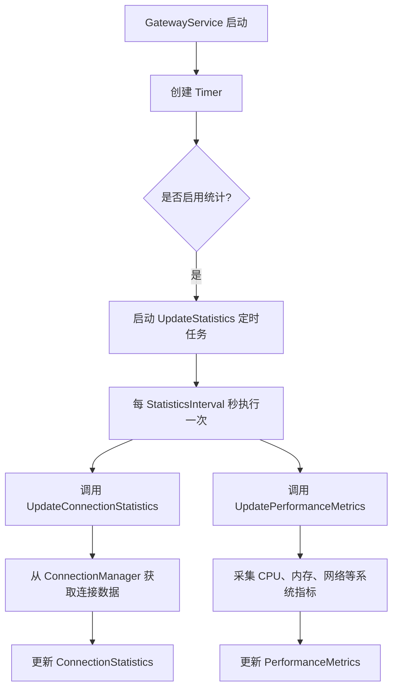
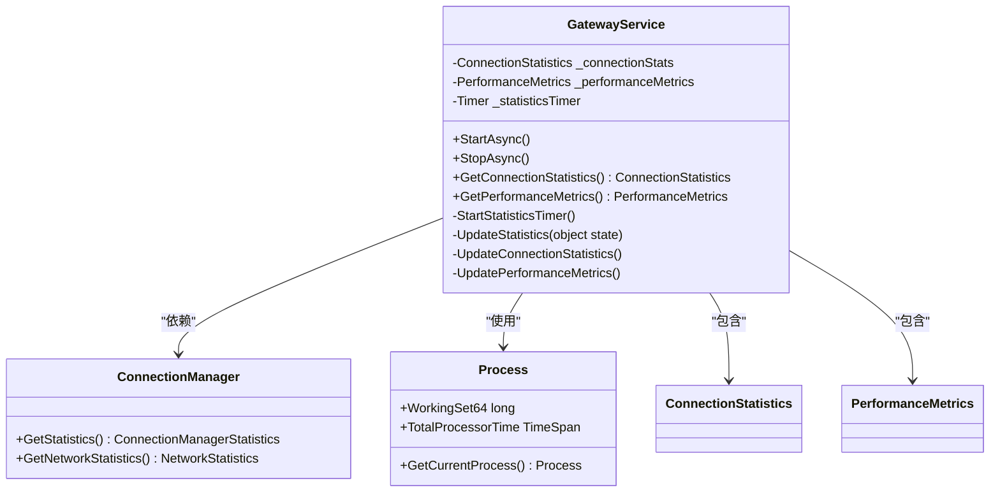
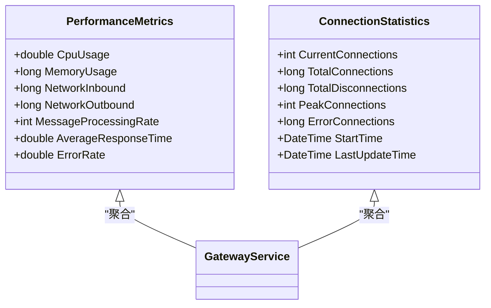
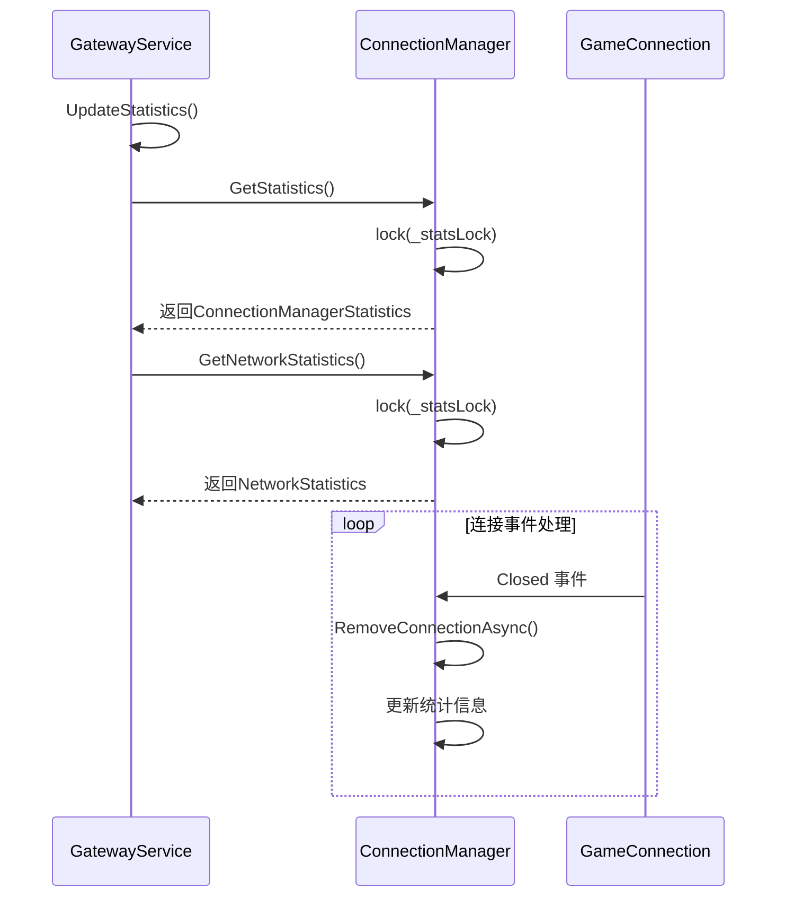
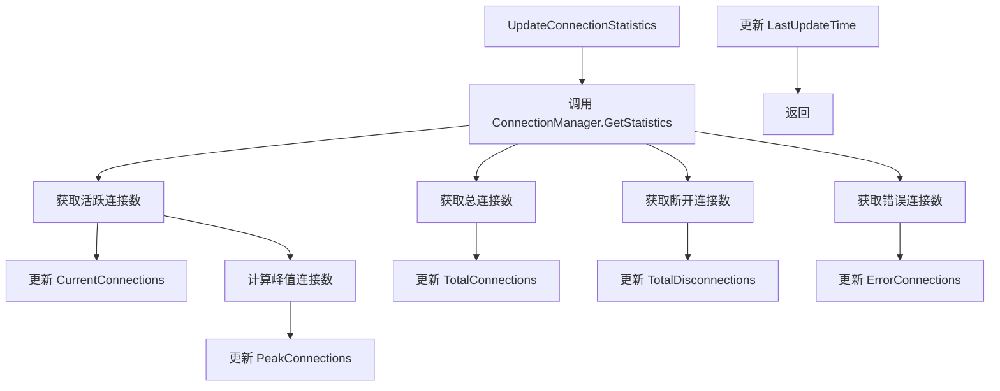
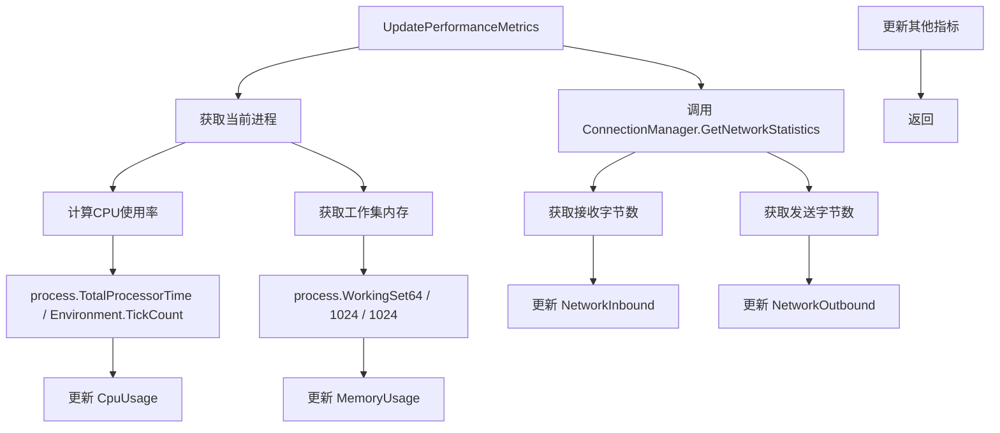
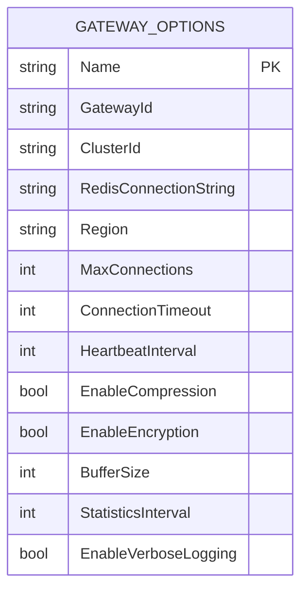

# 性能监控

<cite>
**Referenced Files in This Document **   
- [GatewayService.cs](file://Horizon.Game.Gateway/Services/GatewayService.cs)
- [PerformanceMetrics.cs](file://Horizon.Game.Gateway/Services/IGatewayService.cs#L78-L114)
- [ConnectionStatistics.cs](file://Horizon.Game.Gateway/Services/IGatewayService.cs#L36-L36)
- [GatewayOptions.cs](file://Horizon.Game.Gateway/Configuration/GatewayOptions.cs)
- [ConnectionManager.cs](file://Horizon.Game.Gateway/Services/ConnectionManager.cs)
- [IConnectionManager.cs](file://Horizon.Game.Gateway/Services/IConnectionManager.cs)
- [GameConnection.cs](file://Horizon.Game.Gateway/Network/GameConnection.cs)
</cite>

## 目录
1. [性能监控机制概述](#性能监控机制概述)
2. [核心组件分析](#核心组件分析)
3. [统计信息更新流程](#统计信息更新流程)
4. [配置项说明](#配置项说明)
5. [指标暴露与集成](#指标暴露与集成)
6. [性能瓶颈分析技巧](#性能瓶颈分析技巧)
7. [常见问题排查指南](#常见问题排查指南)

## 性能监控机制概述

本系统通过`GatewayService`中的定时器机制实现周期性性能数据采集。该服务在启动时创建一个`Timer`，根据配置的间隔时间定期调用`UpdateStatistics`方法，收集并更新系统的各项关键性能指标。



**Diagram sources**
- [GatewayService.cs](file://Horizon.Game.Gateway/Services/GatewayService.cs#L190-L200)
- [GatewayOptions.cs](file://Horizon.Game.Gateway/Configuration/GatewayOptions.cs#L65-L68)

**Section sources**
- [GatewayService.cs](file://Horizon.Game.Gateway/Services/GatewayService.cs#L180-L240)

## 核心组件分析

### GatewayService 统计功能

`GatewayService`是性能监控的核心协调者，负责调度和整合来自不同组件的性能数据。



**Diagram sources**
- [GatewayService.cs](file://Horizon.Game.Gateway/Services/GatewayService.cs#L150-L240)
- [ConnectionManager.cs](file://Horizon.Game.Gateway/Services/ConnectionManager.cs#L318-L355)

**Section sources**
- [GatewayService.cs](file://Horizon.Game.Gateway/Services/GatewayService.cs#L150-L240)

### PerformanceMetrics 类分析

`PerformanceMetrics`类用于封装网关服务的关键性能指标，包括CPU使用率、内存占用、网络吞吐量等。



**Diagram sources**
- [PerformanceMetrics.cs](file://Horizon.Game.Gateway/Services/IGatewayService.cs#L119-L155)
- [ConnectionStatistics.cs](file://Horizon.Game.Gateway/Services/IGatewayService.cs#L78-L114)

**Section sources**
- [PerformanceMetrics.cs](file://Horizon.Game.Gateway/Services/IGatewayService.cs#L119-L155)
- [ConnectionStatistics.cs](file://Horizon.Game.Gateway/Services/IGatewayService.cs#L78-L114)

### ConnectionManager 数据采集

`ConnectionManager`负责管理所有客户端连接，并提供详细的连接统计信息。



**Diagram sources**
- [ConnectionManager.cs](file://Horizon.Game.Gateway/Services/ConnectionManager.cs#L318-L355)
- [GameConnection.cs](file://Horizon.Game.Gateway/Network/GameConnection.cs#L12-L191)

**Section sources**
- [ConnectionManager.cs](file://Horizon.Game.Gateway/Services/ConnectionManager.cs#L318-L355)

## 统计信息更新流程

### 更新连接统计信息

`UpdateConnectionStatistics`方法从`ConnectionManager`获取最新的连接统计数据，并更新本地的`_connectionStats`对象。



**Diagram sources**
- [ConnectionManager.cs](file://Horizon.Game.Gateway/Services/ConnectionManager.cs#L318-L336)
- [GatewayService.cs](file://Horizon.Game.Gateway/Services/GatewayService.cs#L210-L217)

**Section sources**
- [GatewayService.cs](file://Horizon.Game.Gateway/Services/GatewayService.cs#L210-L217)

### 更新性能指标

`UpdatePerformanceMetrics`方法采集系统级别的性能指标，包括CPU、内存和网络流量。



**Diagram sources**
- [GatewayService.cs](file://Horizon.Game.Gateway/Services/GatewayService.cs#L220-L238)
- [ConnectionManager.cs](file://Horizon.Game.Gateway/Services/ConnectionManager.cs#L341-L355)

**Section sources**
- [GatewayService.cs](file://Horizon.Game.Gateway/Services/GatewayService.cs#L220-L238)

## 配置项说明

### GatewayOptions 配置

`GatewayOptions`类定义了网关服务的各项配置参数，其中与性能监控相关的配置项如下：



**Table sources**
- [GatewayOptions.cs](file://Horizon.Game.Gateway/Configuration/GatewayOptions.cs#L10-L80)

#### 关键配置项

| 配置项 | 类型 | 默认值 | 描述 |
|--------|------|--------|------|
| `StatisticsInterval` | int | 60 | 统计信息更新间隔（秒），控制`UpdateStatistics`方法的执行频率 |
| `EnableVerboseLogging` | bool | false | 是否启用详细日志，当启用时会记录每次统计更新的详细信息 |

**Section sources**
- [GatewayOptions.cs](file://Horizon.Game.Gateway/Configuration/GatewayOptions.cs#L65-L70)

## 指标暴露与集成

### 日志输出

当`EnableVerboseLogging`配置项启用时，系统会在每次更新统计信息后输出详细的日志记录。

```csharp
_logger.LogDebug("统计信息更新: 连接数={CurrentConnections}, CPU={CpuUsage:F1}%, 内存={MemoryUsage}MB",
    _connectionStats.CurrentConnections,
    _performanceMetrics.CpuUsage,
    _performanceMetrics.MemoryUsage);
```

此日志包含了当前连接数、CPU使用率和内存占用等关键指标，便于开发人员实时监控系统状态。

**Section sources**
- [GatewayService.cs](file://Horizon.Game.Gateway/Services/GatewayService.cs#L225-L230)

### 外部监控系统集成

系统提供了标准的API接口，可以方便地与Prometheus等外部监控系统集成。


通过实现相应的端点，可以将`GetPerformanceMetrics`和`GetConnectionStatistics`方法返回的数据以Prometheus兼容的格式暴露出来，实现全面的监控和可视化。

**Section sources**
- [GatewayService.cs](file://Horizon.Game.Gateway/Services/GatewayService.cs#L153-L184)

## 性能瓶颈分析技巧

### CPU 使用率过高

当发现CPU使用率持续偏高时，应重点关注以下方面：

1. **检查消息处理速率**：高消息处理速率可能导致CPU负载增加
2. **分析GC活动**：频繁的垃圾回收会消耗大量CPU资源
3. **检查锁竞争**：过多的线程同步操作可能导致CPU空转

### 内存占用异常

内存占用异常增长可能由以下原因引起：

1. **连接泄漏**：未正确清理的连接会导致内存持续增长
2. **缓存膨胀**：缓存策略不当可能导致内存占用失控
3. **大对象分配**：频繁分配大对象可能导致内存碎片

### 网络吞吐量下降

网络吞吐量下降可能表明存在以下问题：

1. **网络带宽饱和**：物理网络达到上限
2. **序列化/反序列化瓶颈**：消息编解码效率低下
3. **IO线程阻塞**：网络IO操作被长时间阻塞

**Section sources**
- [PerformanceMetrics.cs](file://Horizon.Game.Gateway/Services/IGatewayService.cs#L119-L155)
- [ConnectionManager.cs](file://Horizon.Game.Gateway/Services/ConnectionManager.cs)

## 常见问题排查指南

### 统计数据不准确

**现象**：统计数据显示的连接数与实际不符

**排查步骤**：
1. 检查`ConnectionManager`的`_connections`字典是否正确维护
2. 验证`OnConnectionClosed`事件处理器是否正常工作
3. 确认`RemoveConnectionAsync`方法是否被正确调用

**相关代码**：
- [ConnectionManager.cs](file://Horizon.Game.Gateway/Services/ConnectionManager.cs#L220-L280)
- [GameConnection.cs](file://Horizon.Game.Gateway/Network/GameConnection.cs#L120-L140)

### 定时器未按预期执行

**现象**：`UpdateStatistics`方法没有按配置的间隔执行

**排查步骤**：
1. 检查`StartStatisticsTimer`方法是否被正确调用
2. 验证`StatisticsInterval`配置值是否合理（1-300秒）
3. 确认`Timer`对象未被意外释放或设置为null

**相关代码**：
- [GatewayService.cs](file://Horizon.Game.Gateway/Services/GatewayService.cs#L190-L200)
- [GatewayOptions.cs](file://Horizon.Game.Gateway/Configuration/GatewayOptions.cs#L65-L68)

### 性能指标突增或突降

**现象**：CPU或内存使用率出现异常波动

**排查步骤**：
1. 检查是否有大规模的连接建立或断开事件
2. 分析是否有突发的消息洪峰
3. 查看系统日志中是否存在异常或错误记录

**相关代码**：
- [GatewayService.cs](file://Horizon.Game.Gateway/Services/GatewayService.cs#L220-L238)
- [ConnectionManager.cs](file://Horizon.Game.Gateway/Services/ConnectionManager.cs)