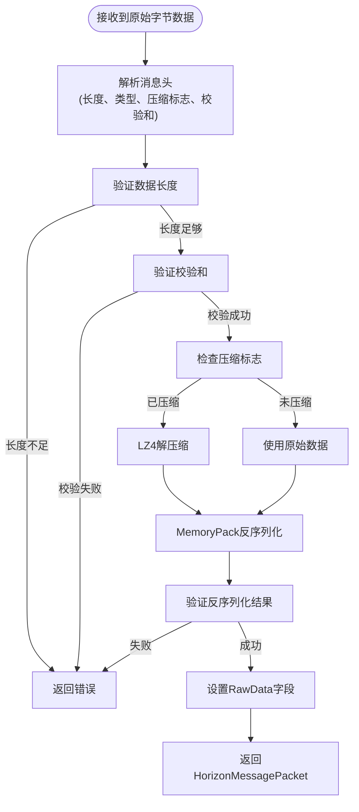
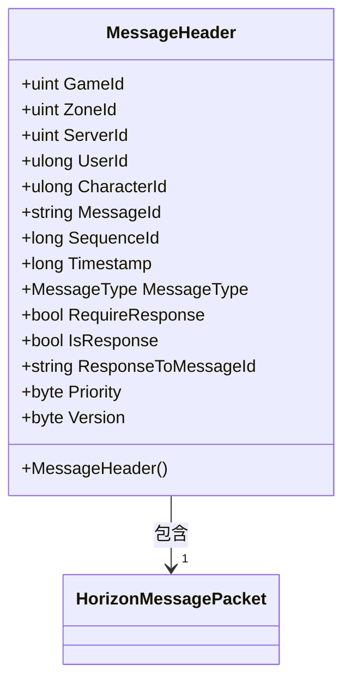
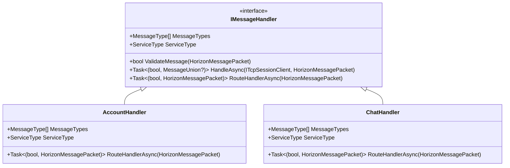
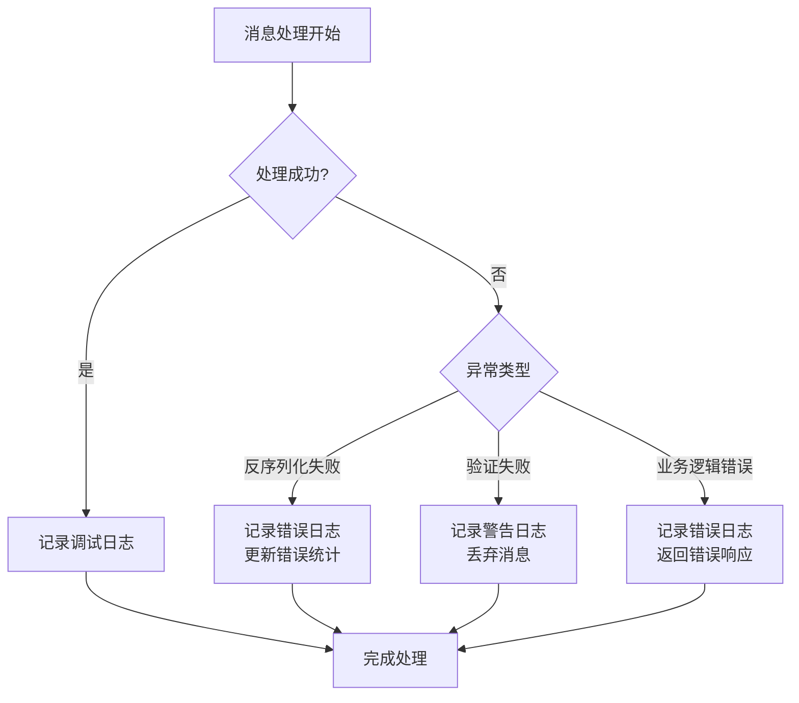
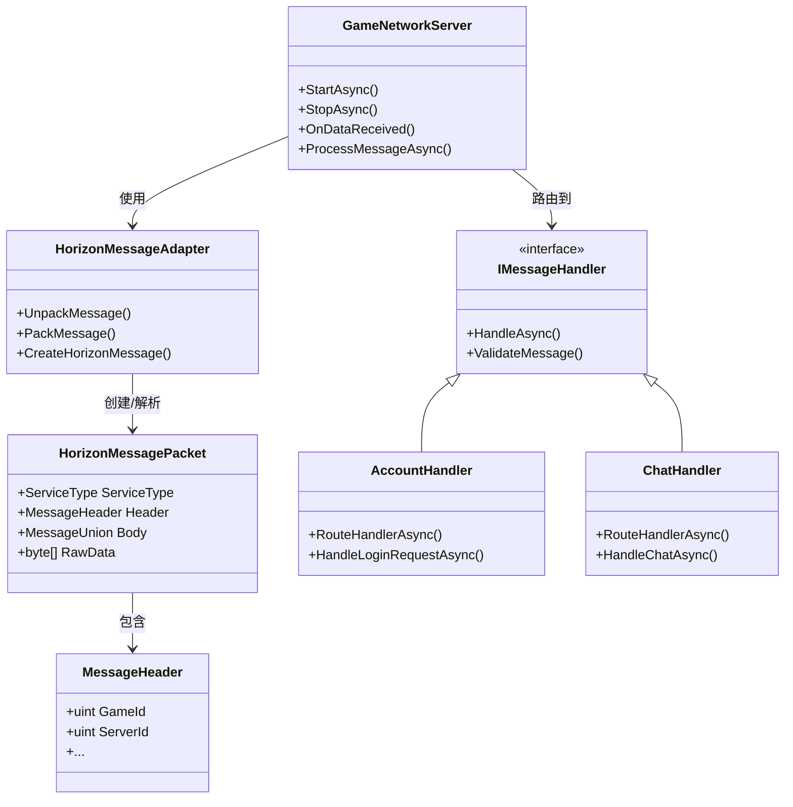

# 消息处理

<cite>
**Referenced Files in This Document**   
- [HorizonMessageAdapter.cs](file://Horizon.Game.Core/Adapters/HorizonMessageAdapter.cs)
- [HorizonMessagePacket.cs](file://Horizon.Game.Message/Network/HorizonMessagePacket.cs)
- [MessageHeader.cs](file://Horizon.Game.Message/Network/MessageHeader.cs)
- [GameNetworkServer.cs](file://Horizon.Game.Gateway/Network/GameNetworkServer.cs)
- [AccountHandler.cs](file://Horizon.Game.Core/Handlers/AccountHandler.cs)
- [ChatHandler.cs](file://Horizon.Game.Core/Handlers/ChatHandler.cs)
</cite>

## 目录
1. [消息处理流程概述](#消息处理流程概述)
2. [消息反序列化与验证](#消息反序列化与验证)
3. [消息路由与分发](#消息路由与分发)
4. [消息处理管道执行顺序](#消息处理管道执行顺序)
5. [异常处理与日志记录](#异常处理与日志记录)
6. [核心组件关系图](#核心组件关系图)

## 消息处理流程概述

本系统实现了一套完整的网络消息处理机制，从原始字节数据的接收开始，经过反序列化、验证、路由到最终的业务逻辑处理，形成一个高效的消息处理管道。该机制主要由`HorizonMessageAdapter`、`HorizonMessagePacket`、`MessageHeader`、`IMessageHandler`接口及其实现类（如`AccountHandler`、`ChatHandler`）等核心组件构成。

当客户端发送原始字节数据到服务器时，`GameNetworkServer`的`OnDataReceived`方法会捕获这些数据。系统首先通过`HorizonMessageAdapter`将二进制数据反序列化为`HorizonMessagePacket`对象，然后对消息头中的关键字段进行验证。验证通过后，系统根据消息的`ServiceType`将消息路由到相应的`IMessageHandler`实现进行业务处理。整个流程确保了消息处理的安全性、可靠性和可扩展性。

**Section sources**
- [HorizonMessageAdapter.cs](file://Horizon.Game.Core/Adapters/HorizonMessageAdapter.cs#L22-L312)
- [GameNetworkServer.cs](file://Horizon.Game.Gateway/Network/GameNetworkServer.cs#L52-L64)

## 消息反序列化与验证

### HorizonMessageAdapter反序列化流程

`HorizonMessageAdapter`是消息处理的核心适配器，负责将原始字节数据转换为可处理的`HorizonMessagePacket`对象。其`UnpackMessage`方法实现了完整的反序列化流程：

1. **消息头解析**：从数据流的前8个字节读取消息长度、消息类型、压缩标志和校验和。
2. **数据完整性验证**：检查数据长度是否满足消息头要求。
3. **校验和验证**：计算消息体的校验和并与消息头中的校验和进行比对，确保数据传输的完整性。
4. **解压缩处理**：根据压缩标志判断是否需要对消息体进行LZ4解压缩。
5. **反序列化**：使用MemoryPack反序列化器将处理后的字节数据转换为`HorizonMessagePacket`对象。



**Diagram sources**
- [HorizonMessageAdapter.cs](file://Horizon.Game.Core/Adapters/HorizonMessageAdapter.cs#L221-L270)

### MessageHeader字段验证规则

`MessageHeader`类定义了消息头的结构和验证规则，其中`GameId`和`ServerId`的验证规则如下：

- **GameId验证**：必须为正整数（大于0），在`MessageHeader`的`GameId`属性的setter中通过`ArgumentException`进行验证。
- **ServerId验证**：必须为正整数（大于0），同样在`ServerId`属性的setter中进行验证。

这些验证规则确保了消息来源的合法性，防止无效或恶意数据进入系统。在`GameNetworkServer`的`OnDataReceived`方法中，系统会显式检查这两个字段的有效性，如果验证失败，将记录警告日志并丢弃该消息。



**Diagram sources**
- [MessageHeader.cs](file://Horizon.Game.Message/Network/MessageHeader.cs#L10-L153)
- [HorizonMessagePacket.cs](file://Horizon.Game.Message/Network/HorizonMessagePacket.cs#L28-L30)

**Section sources**
- [MessageHeader.cs](file://Horizon.Game.Message/Network/MessageHeader.cs#L18-L29)
- [MessageHeader.cs](file://Horizon.Game.Message/Network/MessageHeader.cs#L52-L63)
- [GameNetworkServer.cs](file://Horizon.Game.Gateway/Network/GameNetworkServer.cs#L238-L268)

## 消息路由与分发

### ProcessMessageAsync路由机制

`ProcessMessageAsync`方法是消息路由的核心，它根据消息的`ServiceType`将消息分发到相应的处理器。该方法遍历所有注册的`IMessageHandler`实例，找到与消息`ServiceType`匹配的处理器，并调用其`ValidateMessage`方法进行消息验证。验证通过后，调用`HandleAsync`方法进行实际的消息处理。

这种基于`ServiceType`的路由机制实现了消息处理的模块化和可扩展性。新的业务模块只需实现`IMessageHandler`接口并注册到系统中，即可处理特定类型的消息，而无需修改核心路由逻辑。

```mermaid
sequenceDiagram
participant Client as "客户端"
participant Server as "GameNetworkServer"
participant Handler as "IMessageHandler"
Client->>Server : 发送消息
Server->>Server : OnDataReceived(接收到数据)
Server->>Server : UnpackMessage(反序列化)
Server->>Server : 验证GameId和ServerId
Server->>Server : ProcessMessageAsync(路由消息)
loop 遍历所有处理器
Server->>Handler : 检查ServiceType匹配
Handler-->>Server : 返回匹配结果
alt 匹配且验证通过
Server->>Handler : HandleAsync(处理消息)
Handler-->>Server : 返回处理结果
Server->>Client : 发送响应
break
end
end
```

**Diagram sources**
- [GameNetworkServer.cs](file://Horizon.Game.Gateway/Network/GameNetworkServer.cs#L52-L64)
- [IMessageHandler.cs](file://Horizon.Game.Core/IMessageHandler.cs#L32-L32)

### IMessageHandler实现类

系统提供了多个`IMessageHandler`的实现类来处理不同业务领域的消息：

- **AccountHandler**：处理账户相关消息，如登录、注册、角色管理等，支持`ServiceType.Account`。
- **ChatHandler**：处理聊天相关消息，如发送消息、获取聊天历史等，支持`ServiceType.Chat`。

每个处理器通过`MessageTypes`属性声明其支持的消息类型，并通过`RouteHandlerAsync`方法实现具体的消息路由逻辑。这种设计模式使得消息处理逻辑清晰分离，便于维护和扩展。



**Diagram sources**
- [AccountHandler.cs](file://Horizon.Game.Core/Handlers/AccountHandler.cs#L22-L369)
- [ChatHandler.cs](file://Horizon.Game.Core/Handlers/ChatHandler.cs#L15-L94)

**Section sources**
- [AccountHandler.cs](file://Horizon.Game.Core/Handlers/AccountHandler.cs#L22-L369)
- [ChatHandler.cs](file://Horizon.Game.Core/Handlers/ChatHandler.cs#L15-L94)

## 消息处理管道执行顺序

消息处理管道的执行顺序遵循严格的流程，确保每个消息都经过完整的处理周期：

1. **数据接收**：`GameNetworkServer`的`OnDataReceived`事件捕获客户端发送的原始字节数据。
2. **反序列化**：调用`HorizonMessageAdapter.UnpackMessage`将字节数据转换为`HorizonMessagePacket`对象。
3. **消息验证**：验证`MessageHeader`中的`GameId`和`ServerId`是否为正数。
4. **消息路由**：调用`ProcessMessageAsync`根据`ServiceType`找到匹配的`IMessageHandler`。
5. **业务处理**：调用处理器的`HandleAsync`方法执行具体的业务逻辑。
6. **响应生成**：业务处理完成后，生成响应消息并通过网络发送回客户端。

以`AccountHandler`处理登录请求为例，其执行流程如下：
- 接收登录请求消息
- 反序列化为`LoginRequest`对象
- 验证请求参数
- 调用Orleans Grain进行用户认证
- 生成`LoginResponse`响应
- 序列化并发送响应消息

**Section sources**
- [GameNetworkServer.cs](file://Horizon.Game.Gateway/Network/GameNetworkServer.cs#L238-L268)
- [AccountHandler.cs](file://Horizon.Game.Core/Handlers/AccountHandler.cs#L105-L180)

## 异常处理与日志记录

系统实现了完善的异常处理和日志记录机制，确保消息处理过程的稳定性和可追溯性：

- **反序列化异常**：在`UnpackMessage`方法中，任何反序列化失败都会被捕获，更新错误统计并抛出`InvalidOperationException`，同时记录错误日志。
- **消息验证异常**：对于无效的`GameId`或`ServerId`，系统会记录警告日志并丢弃消息，防止无效数据进入业务处理层。
- **业务处理异常**：在`AccountHandler`和`ChatHandler`中，每个消息处理方法都包含try-catch块，捕获并记录异常，同时返回适当的错误响应。

日志记录使用`ILogger`接口，记录不同级别的日志信息，包括调试信息、警告和错误。这些日志对于系统监控、故障排查和性能分析至关重要。



**Section sources**
- [HorizonMessageAdapter.cs](file://Horizon.Game.Core/Adapters/HorizonMessageAdapter.cs#L244-L278)
- [GameNetworkServer.cs](file://Horizon.Game.Gateway/Network/GameNetworkServer.cs#L250-L265)
- [AccountHandler.cs](file://Horizon.Game.Core/Handlers/AccountHandler.cs#L105-L180)

## 核心组件关系图



**Diagram sources**
- [GameNetworkServer.cs](file://Horizon.Game.Gateway/Network/GameNetworkServer.cs#L52-L64)
- [HorizonMessageAdapter.cs](file://Horizon.Game.Core/Adapters/HorizonMessageAdapter.cs#L221-L270)
- [HorizonMessagePacket.cs](file://Horizon.Game.Message/Network/HorizonMessagePacket.cs#L13-L70)
- [MessageHeader.cs](file://Horizon.Game.Message/Network/MessageHeader.cs#L10-L153)
- [AccountHandler.cs](file://Horizon.Game.Core/Handlers/AccountHandler.cs#L22-L369)
- [ChatHandler.cs](file://Horizon.Game.Core/Handlers/ChatHandler.cs#L15-L94)