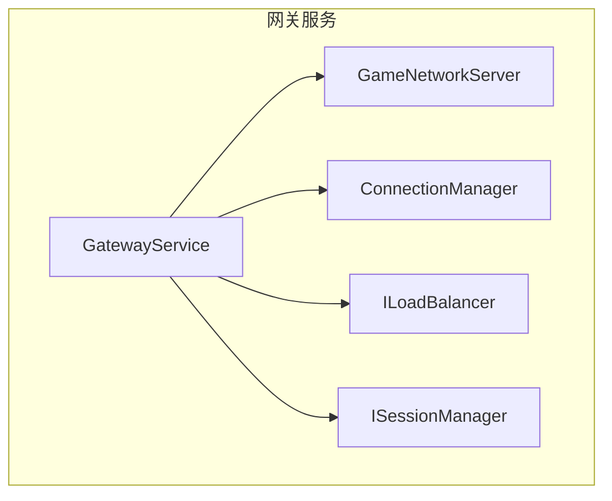
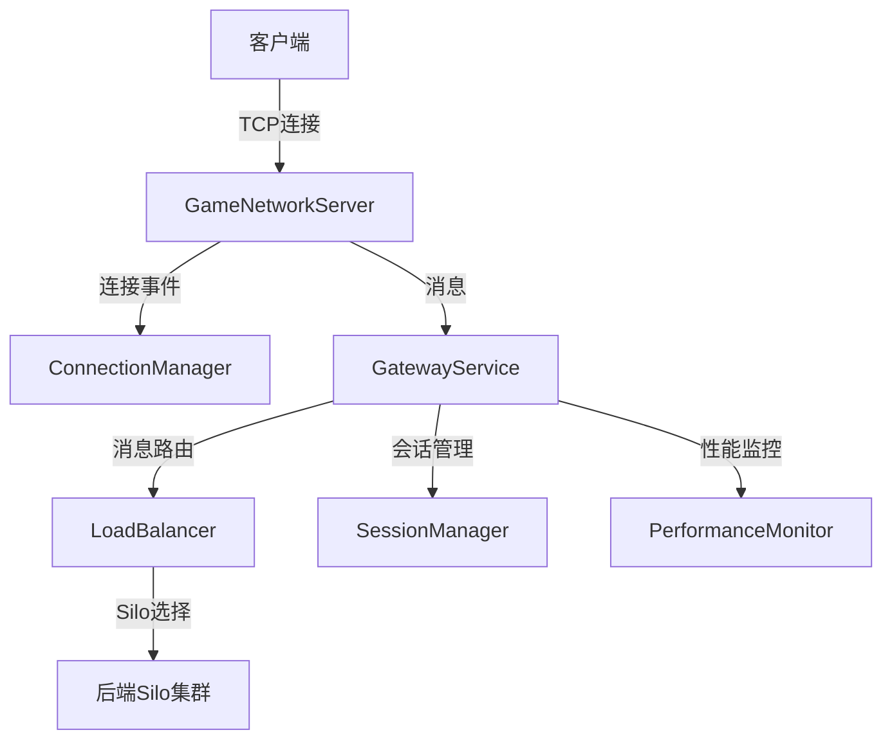
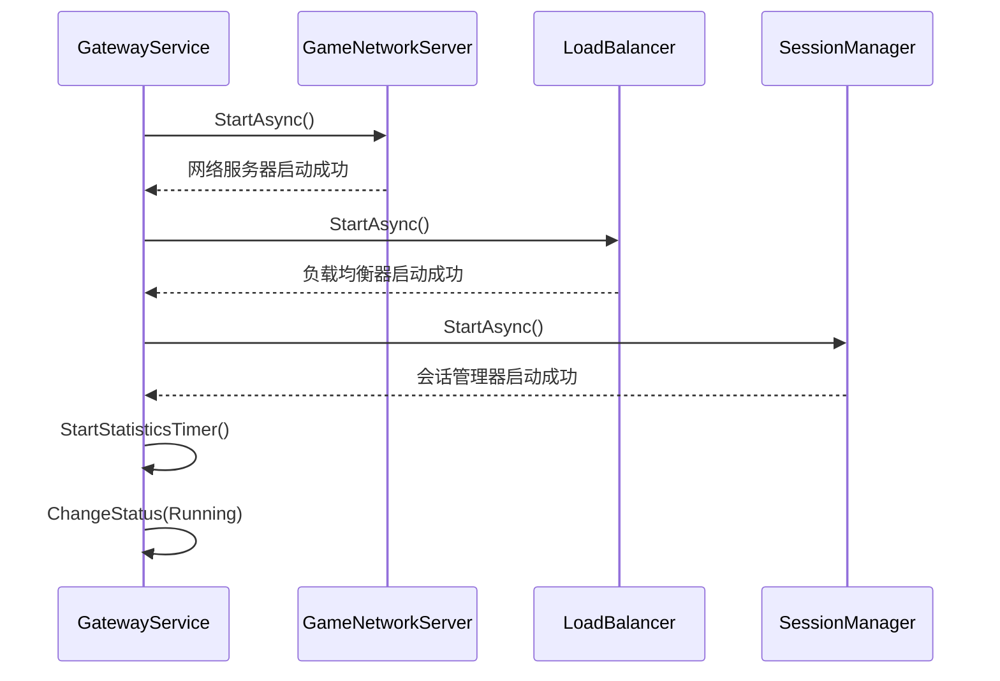
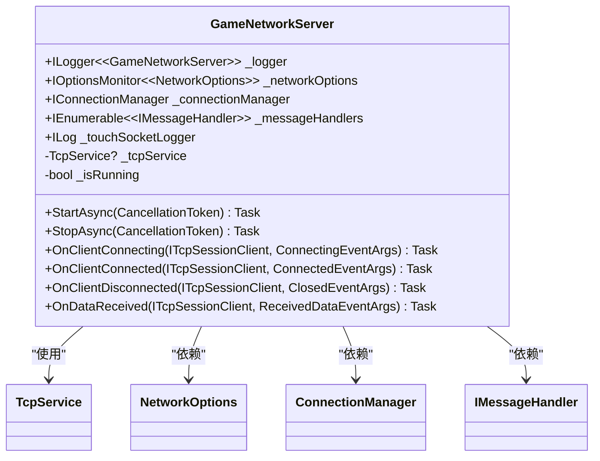
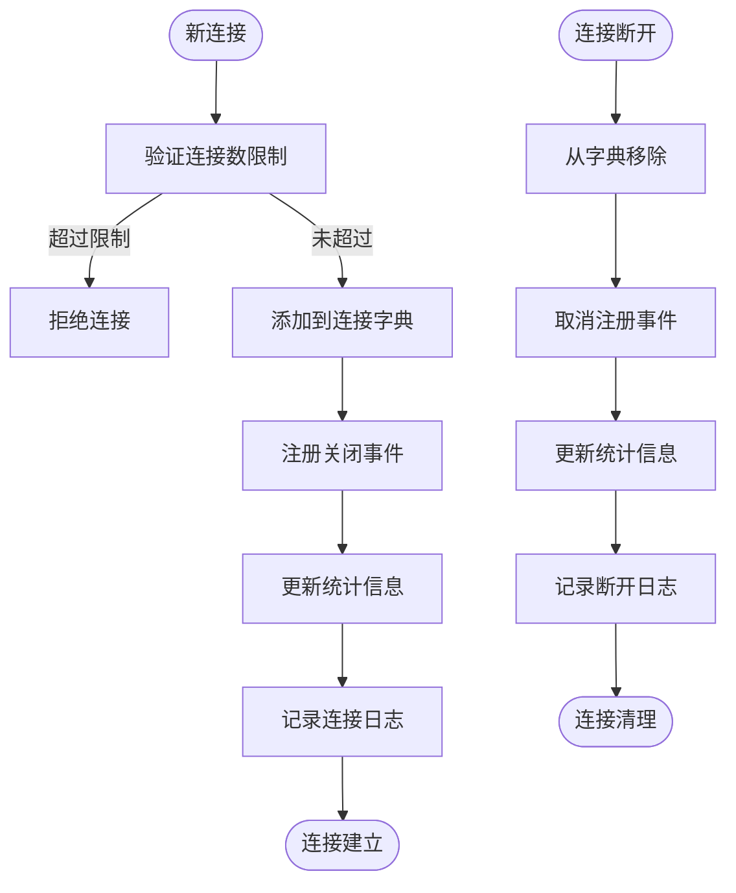
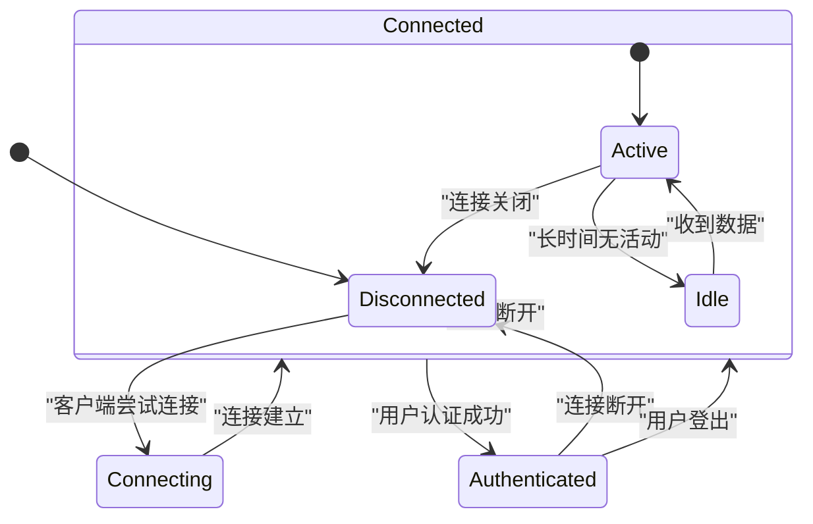
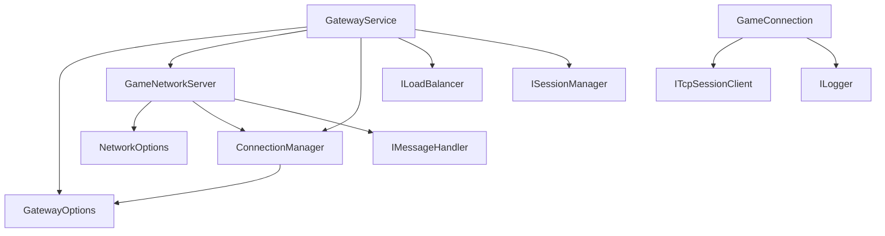
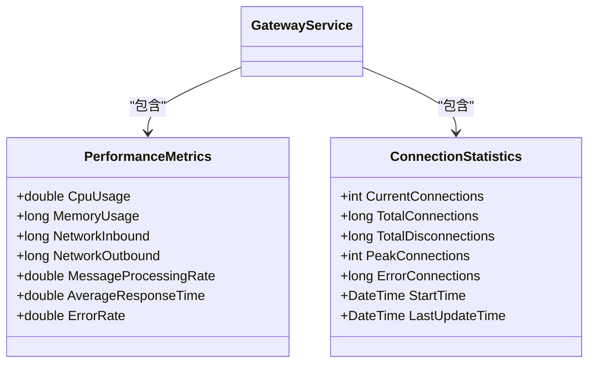

# 网关服务

<cite>
**Referenced Files in This Document**  
- [GatewayService.cs](file://Horizon.Game.Gateway/Services/GatewayService.cs)
- [GameNetworkServer.cs](file://Horizon.Game.Gateway/Network/GameNetworkServer.cs)
- [OrleansOptions.cs](file://Horizon.Game.Gateway/Configuration/OrleansOptions.cs)
- [GatewayOptions.cs](file://Horizon.Game.Gateway/Configuration/GatewayOptions.cs)
- [NetworkOptions.cs](file://Horizon.Game.Gateway/Configuration/NetworkOptions.cs)
- [ConnectionManager.cs](file://Horizon.Game.Gateway/Services/ConnectionManager.cs)
- [GameConnection.cs](file://Horizon.Game.Gateway/Network/GameConnection.cs)
- [ILoadBalancer.cs](file://Horizon.Game.Gateway/Services/IGameServices.cs)
</cite>

## 目录
1. [简介](#简介)
2. [项目结构](#项目结构)
3. [核心组件](#核心组件)
4. [架构概述](#架构概述)
5. [详细组件分析](#详细组件分析)
6. [依赖分析](#依赖分析)
7. [性能考虑](#性能考虑)
8. [故障排除指南](#故障排除指南)
9. [结论](#结论)

## 简介
本文档详细描述了混沌世界游戏网关服务的架构与实现。网关服务作为客户端与后端Silo集群之间的桥梁，负责管理客户端连接、转发消息、负载均衡、会话管理以及性能监控等关键功能。文档将深入分析网关服务的核心组件及其交互方式，解释关键配置参数的意义，并提供生产环境部署的最佳实践建议。

## 项目结构
网关服务位于`Horizon.Game.Gateway`目录下，主要包含以下子目录：
- `Configuration`：包含网关、网络和Orleans集群的配置选项
- `Network`：包含网络服务器、连接和适配器的实现
- `Services`：包含网关服务、连接管理、负载均衡等核心服务
- `Tests`：包含单元测试

**Diagram sources**
- [GatewayService.cs](file://Horizon.Game.Gateway/Services/GatewayService.cs#L14-L278)
- [GameNetworkServer.cs](file://Horizon.Game.Gateway/Network/GameNetworkServer.cs#L20-L286)

**Section sources**
- [GatewayService.cs](file://Horizon.Game.Gateway/Services/GatewayService.cs#L1-L280)
- [GameNetworkServer.cs](file://Horizon.Game.Gateway/Network/GameNetworkServer.cs#L1-L288)

## 核心组件
网关服务的核心组件包括`GatewayService`、`GameNetworkServer`、`ConnectionManager`、`ILoadBalancer`和`ISessionManager`。这些组件协同工作，实现了完整的网关功能。

**Section sources**
- [GatewayService.cs](file://Horizon.Game.Gateway/Services/GatewayService.cs#L14-L278)
- [GameNetworkServer.cs](file://Horizon.Game.Gateway/Network/GameNetworkServer.cs#L20-L286)
- [ConnectionManager.cs](file://Horizon.Game.Gateway/Services/ConnectionManager.cs#L15-L448)
- [ILoadBalancer.cs](file://Horizon.Game.Gateway/Services/IGameServices.cs#L37-L59)

## 架构概述
网关服务采用分层架构设计，各组件职责明确，松耦合。`GameNetworkServer`负责监听客户端连接和接收数据；`ConnectionManager`管理所有活动连接；`GatewayService`协调各组件的启动和停止；`ILoadBalancer`负责将消息路由到合适的后端Silo；`ISessionManager`管理用户会话。

**Diagram sources**
- [GatewayService.cs](file://Horizon.Game.Gateway/Services/GatewayService.cs#L14-L278)
- [GameNetworkServer.cs](file://Horizon.Game.Gateway/Network/GameNetworkServer.cs#L20-L286)
- [ConnectionManager.cs](file://Horizon.Game.Gateway/Services/ConnectionManager.cs#L15-L448)

## 详细组件分析

### GatewayService分析
`GatewayService`是网关服务的主控制器，负责协调各个子组件的生命周期和业务逻辑。

#### 启动流程

**Diagram sources**
- [GatewayService.cs](file://Horizon.Game.Gateway/Services/GatewayService.cs#L14-L278)

**Section sources**
- [GatewayService.cs](file://Horizon.Game.Gateway/Services/GatewayService.cs#L14-L278)

### GameNetworkServer分析
`GameNetworkServer`负责监听指定端口并处理客户端连接。

#### 网络服务器配置

**Diagram sources**
- [GameNetworkServer.cs](file://Horizon.Game.Gateway/Network/GameNetworkServer.cs#L20-L286)
- [NetworkOptions.cs](file://Horizon.Game.Gateway/Configuration/NetworkOptions.cs#L7-L83)

**Section sources**
- [GameNetworkServer.cs](file://Horizon.Game.Gateway/Network/GameNetworkServer.cs#L20-L286)

### 连接管理分析
`ConnectionManager`负责管理所有客户端连接的生命周期。

#### 连接管理流程

**Diagram sources**
- [ConnectionManager.cs](file://Horizon.Game.Gateway/Services/ConnectionManager.cs#L15-L448)

**Section sources**
- [ConnectionManager.cs](file://Horizon.Game.Gateway/Services/ConnectionManager.cs#L15-L448)

### GameConnection分析
`GameConnection`表示一个客户端连接，封装了连接相关的所有操作。

#### 连接状态管理

**Diagram sources**
- [GameConnection.cs](file://Horizon.Game.Gateway/Network/GameConnection.cs#L12-L191)

**Section sources**
- [GameConnection.cs](file://Horizon.Game.Gateway/Network/GameConnection.cs#L12-L191)

## 依赖分析
网关服务依赖于多个配置类和接口，这些依赖关系通过依赖注入容器进行管理。

**Diagram sources**
- [GatewayService.cs](file://Horizon.Game.Gateway/Services/GatewayService.cs#L14-L278)
- [GameNetworkServer.cs](file://Horizon.Game.Gateway/Network/GameNetworkServer.cs#L20-L286)
- [ConnectionManager.cs](file://Horizon.Game.Gateway/Services/ConnectionManager.cs#L15-L448)
- [GameConnection.cs](file://Horizon.Game.Gateway/Network/GameConnection.cs#L12-L191)

**Section sources**
- [GatewayService.cs](file://Horizon.Game.Gateway/Services/GatewayService.cs#L14-L278)
- [GameNetworkServer.cs](file://Horizon.Game.Gateway/Network/GameNetworkServer.cs#L20-L286)
- [ConnectionManager.cs](file://Horizon.Game.Gateway/Services/ConnectionManager.cs#L15-L448)
- [GameConnection.cs](file://Horizon.Game.Gateway/Network/GameConnection.cs#L12-L191)

## 性能考虑

### 配置参数说明
网关服务的性能和行为受多个配置参数控制：

**OrleansOptions配置**
| 配置项 | 说明 | 默认值 | 范围 |
|--------|------|--------|------|
| GatewayPort | 网关监听端口 | 30000 | 1024-65535 |
| RetryCount | 连接重试次数 | 5 | 1-100 |
| RetryInterval | 连接重试间隔(毫秒) | 1000 | 100-60000 |
| ResponseTimeout | 响应超时时间(毫秒) | 30000 | 1000-300000 |
| EnableStatistics | 是否启用统计 | true | true/false |
| EnablePerformanceCounters | 是否启用性能计数器 | true | true/false |

**GatewayOptions配置**
| 配置项 | 说明 | 默认值 | 范围 |
|--------|------|--------|------|
| MaxConnections | 最大并发连接数 | 10000 | 1-100000 |
| ConnectionTimeout | 连接超时时间(秒) | 300 | 10-3600 |
| HeartbeatInterval | 心跳间隔(秒) | 30 | 10-300 |
| StatisticsInterval | 统计信息更新间隔(秒) | 60 | 1-300 |

**Section sources**
- [OrleansOptions.cs](file://Horizon.Game.Gateway/Configuration/OrleansOptions.cs#L7-L59)
- [GatewayOptions.cs](file://Horizon.Game.Gateway/Configuration/GatewayOptions.cs#L7-L81)

### 性能监控
网关服务提供了详细的性能监控指标，可通过`GetPerformanceMetrics`方法获取。

**Diagram sources**
- [GatewayService.cs](file://Horizon.Game.Gateway/Services/GatewayService.cs#L14-L278)

**Section sources**
- [GatewayService.cs](file://Horizon.Game.Gateway/Services/GatewayService.cs#L14-L278)

## 故障排除指南

### 常见问题
1. **连接数达到上限**：检查`MaxConnections`配置，确认是否需要增加最大连接数。
2. **连接超时**：检查网络延迟，调整`ConnectionTimeout`和`HeartbeatInterval`参数。
3. **消息处理延迟**：检查后端Silo负载，优化`ResponseTimeout`设置。
4. **性能下降**：启用详细日志(`EnableVerboseLogging`)，分析性能瓶颈。

### 心跳检测与会话保持
网关服务通过以下机制实现心跳检测和会话保持：
- 客户端定期发送心跳包
- 服务端记录每个连接的最后活跃时间
- 定时器定期检查超时连接并清理
- 断线重连机制确保连接的可靠性

**Section sources**
- [ConnectionManager.cs](file://Horizon.Game.Gateway/Services/ConnectionManager.cs#L15-L448)
- [GameConnection.cs](file://Horizon.Game.Gateway/Network/GameConnection.cs#L12-L191)

## 结论
混沌世界游戏网关服务设计合理，功能完整，具备高可用性和可扩展性。通过合理的配置和监控，可以在生产环境中稳定运行。建议在部署时根据实际负载调整连接数、超时等参数，并启用性能监控以及时发现和解决问题。