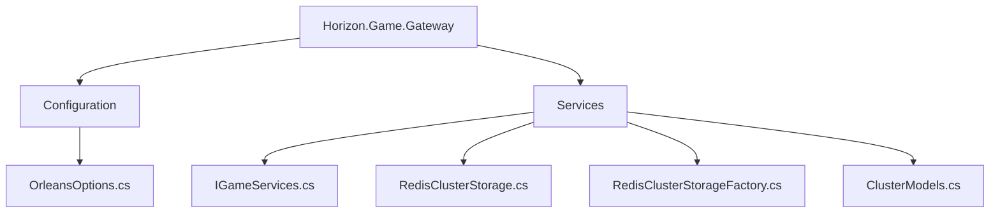
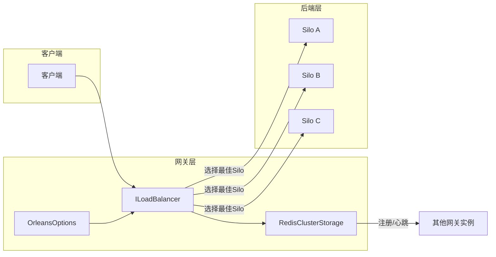
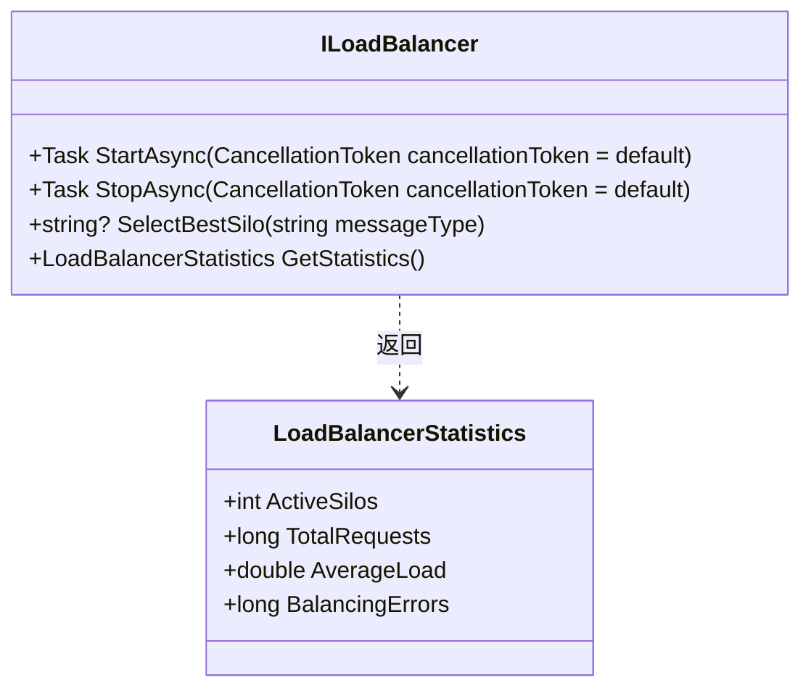
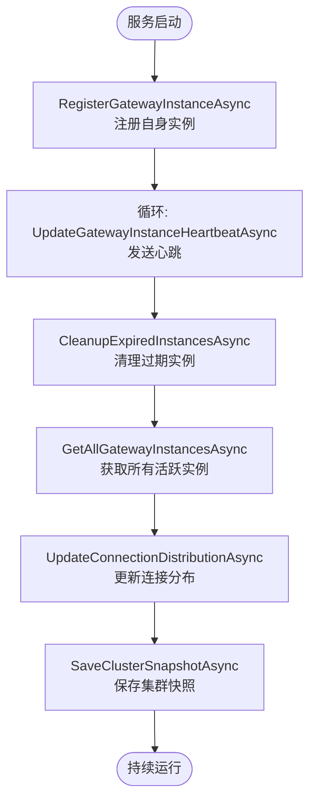
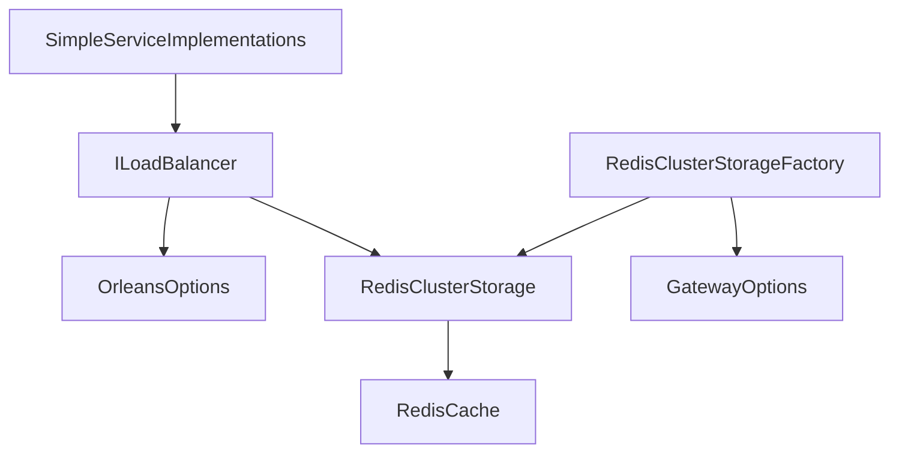

# 负载均衡

<cite>
**本文档中引用的文件**   
- [OrleansOptions.cs](file://Horizon.Game.Gateway/Configuration/OrleansOptions.cs)
- [IGameServices.cs](file://Horizon.Game.Gateway/Services/IGameServices.cs)
- [RedisClusterStorage.cs](file://Horizon.Game.Gateway/Services/RedisClusterStorage.cs)
- [RedisClusterStorageFactory.cs](file://Horizon.Game.Gateway/Services/RedisClusterStorageFactory.cs)
- [ClusterModels.cs](file://Horizon.Game.Gateway/Services/ClusterModels.cs)
</cite>

## 目录
1. [简介](#简介)
2. [项目结构](#项目结构)
3. [核心组件](#核心组件)
4. [架构概述](#架构概述)
5. [详细组件分析](#详细组件分析)
6. [依赖分析](#依赖分析)
7. [性能考虑](#性能考虑)
8. [故障排除指南](#故障排除指南)
9. [结论](#结论)

## 简介
本文档旨在深入解析多Silo环境下基于ILoadBalancer接口的负载均衡策略。文档将阐述负载均衡器如何利用OrleansOptions中的SiloEndpoints配置初始化与后端Silo集群的连接，解释连接重试机制（RetryCount、RetryInterval）在网络波动时的容错作用，以及ResponseTimeout设置对系统响应性和稳定性的影响。同时，分析负载均衡器如何监控各Silo节点的健康状态并动态调整流量分配，并提供基于RedisClusterStorage实现的集群协调服务细节，展示节点发现和状态同步的过程。

## 项目结构
本项目的负载均衡功能主要集中在`Horizon.Game.Gateway`模块中，其核心配置、服务接口和协调机制分布在特定的子目录下。

**图示来源**
- [OrleansOptions.cs](file://Horizon.Game.Gateway/Configuration/OrleansOptions.cs#L7-L59)
- [IGameServices.cs](file://Horizon.Game.Gateway/Services/IGameServices.cs#L37-L59)
- [RedisClusterStorage.cs](file://Horizon.Game.Gateway/Services/RedisClusterStorage.cs#L13-L418)
- [ClusterModels.cs](file://Horizon.Game.Gateway/Services/ClusterModels.cs#L8-L102)

**章节来源**
- [OrleansOptions.cs](file://Horizon.Game.Gateway/Configuration/OrleansOptions.cs#L1-L61)
- [IGameServices.cs](file://Horizon.Game.Gateway/Services/IGameServices.cs#L37-L236)
- [RedisClusterStorage.cs](file://Horizon.Game.Gateway/Services/RedisClusterStorage.cs#L1-L419)
- [ClusterModels.cs](file://Horizon.Game.Gateway/Services/ClusterModels.cs#L1-L103)

## 核心组件
负载均衡的核心由三个关键部分构成：定义行为的`ILoadBalancer`接口、包含连接信息的`OrleansOptions`配置类，以及负责集群状态协调的`RedisClusterStorage`服务。

**章节来源**
- [IGameServices.cs](file://Horizon.Game.Gateway/Services/IGameServices.cs#L37-L59)
- [OrleansOptions.cs](file://Horizon.Game.Gateway/Configuration/OrleansOptions.cs#L7-L59)
- [RedisClusterStorage.cs](file://Horizon.Game.Gateway/Services/RedisClusterStorage.cs#L13-L418)

## 架构概述
整个负载均衡系统的架构围绕网关实例与后端Silo集群的交互展开。`OrleansOptions`提供了初始连接信息，`ILoadBalancer`根据这些信息和从`RedisClusterStorage`获取的实时集群状态来做出路由决策。

**图示来源**
- [OrleansOptions.cs](file://Horizon.Game.Gateway/Configuration/OrleansOptions.cs#L7-L59)
- [IGameServices.cs](file://Horizon.Game.Gateway/Services/IGameServices.cs#L37-L59)
- [RedisClusterStorage.cs](file://Horizon.Game.Gateway/Services/RedisClusterStorage.cs#L13-L418)

## 详细组件分析

### ILoadBalancer 接口分析
`ILoadBalancer`是负载均衡功能的核心契约，它定义了启动、停止、选择最佳Silo节点以及获取统计信息的方法。

#### 接口方法

**图示来源**
- [IGameServices.cs](file://Horizon.Game.Gateway/Services/IGameServices.cs#L37-L59)
- [IGameServices.cs](file://Horizon.Game.Gateway/Services/IGameServices.cs#L194-L215)

**章节来源**
- [IGameServices.cs](file://Horizon.Game.Gateway/Services/IGameServices.cs#L37-L236)

### OrleansOptions 配置分析
`OrleansOptions`类封装了负载均衡器所需的全部配置参数，是系统初始化的关键。

#### 配置属性
| 属性 | 类型 | 描述 | 默认值 |
| :--- | :--- | :--- | :--- |
| `ClusterId` | string | 集群唯一标识符 | "Dev" |
| `ServiceId` | string | 服务唯一标识符 | "BaseService" |
| `SiloEndpoints` | string[] | 后端Silo节点的地址数组 | ["localhost:11111"] |
| `GatewayPort` | int | 当前网关监听的端口 | 30000 |
| `RetryCount` | int | 连接失败时的最大重试次数 | 5 |
| `RetryInterval` | int | 每次重试之间的间隔（毫秒） | 1000 |
| `ResponseTimeout` | int | 等待Silo响应的超时时间（毫秒） | 30000 |
| `EnableStatistics` | bool | 是否启用统计功能 | true |
| `EnablePerformanceCounters` | bool | 是否启用性能计数器 | true |

**章节来源**
- [OrleansOptions.cs](file://Horizon.Game.Gateway/Configuration/OrleansOptions.cs#L7-L59)

### RedisClusterStorage 协调服务分析
`RedisClusterStorage`是实现分布式协调的核心，它使用Redis作为共享存储，确保所有网关实例对集群状态有一致的视图。

#### 服务流程

**图示来源**
- [RedisClusterStorage.cs](file://Horizon.Game.Gateway/Services/RedisClusterStorage.cs#L117-L169)
- [RedisClusterStorage.cs](file://Horizon.Game.Gateway/Services/RedisClusterStorage.cs#L13-L418)

**章节来源**
- [RedisClusterStorage.cs](file://Horizon.Game.Gateway/Services/RedisClusterStorage.cs#L1-L419)
- [ClusterModels.cs](file://Horizon.Game.Gateway/Services/ClusterModels.cs#L8-L102)

## 依赖分析
负载均衡系统依赖于多个内部和外部组件协同工作。

**图示来源**
- [OrleansOptions.cs](file://Horizon.Game.Gateway/Configuration/OrleansOptions.cs#L7-L59)
- [RedisClusterStorage.cs](file://Horizon.Game.Gateway/Services/RedisClusterStorage.cs#L13-L418)
- [RedisClusterStorageFactory.cs](file://Horizon.Game.Gateway/Services/RedisClusterStorageFactory.cs#L28-L35)

**章节来源**
- [OrleansOptions.cs](file://Horizon.Game.Gateway/Configuration/OrleansOptions.cs#L1-L61)
- [RedisClusterStorage.cs](file://Horizon.Game.Gateway/Services/RedisClusterStorage.cs#L1-L419)
- [RedisClusterStorageFactory.cs](file://Horizon.Game.Gateway/Services/RedisClusterStorageFactory.cs#L1-L45)

## 性能考虑
为了在高并发场景下优化负载均衡性能，建议采取以下措施：
1.  **合理设置`ResponseTimeout`**：过短的超时可能导致正常请求被误判为失败，增加重试负担；过长则会阻塞线程，影响整体吞吐量。应根据实际业务响应时间进行压测调优。
2.  **优化`RetryCount`和`RetryInterval`**：在网络不稳定的环境中，适当的重试可以提高成功率，但过多的重试会产生“雪崩效应”。建议采用指数退避算法替代固定间隔。
3.  **Redis性能**：`RedisClusterStorage`的性能直接决定了集群状态同步的效率。应确保Redis服务器有足够的资源，并考虑使用Redis集群以提高可用性和扩展性。
4.  **缓存策略**：在`ILoadBalancer`内部，可以对从`RedisClusterStorage`获取的实例列表进行短暂的本地缓存，避免每次请求都访问Redis，从而降低延迟。

## 故障排除指南
当遇到负载均衡相关问题时，可参考以下步骤进行排查：
1.  **检查`OrleansOptions.SiloEndpoints`**：确认配置的Silo地址是否正确且网络可达。
2.  **验证Redis连接**：通过日志检查`RedisClusterStorage`是否成功初始化，确保Redis服务正常运行且连接字符串正确。
3.  **查看实例注册状态**：使用Redis客户端工具检查`cluster:{ClusterId}:gateway_instances`键是否存在，确认网关实例是否成功注册。
4.  **分析日志中的错误**：重点关注`RetryCount`达到上限或`ResponseTimeout`相关的日志条目，这通常指向网络或后端服务问题。
5.  **检查实例心跳**：如果某个网关实例长时间未更新心跳，它将被视为失效并从活跃列表中移除，这可能是该实例所在主机出现故障。

## 结论
本文档详细阐述了基于`ILoadBalancer`接口的负载均衡架构。该设计通过`OrleansOptions`进行灵活配置，利用`RedisClusterStorage`实现了可靠的分布式协调，能够有效应对网络波动并动态适应集群变化。通过合理配置重试和超时参数，并结合高性能的Redis存储，该方案为多Silo环境下的游戏网关提供了稳定、高效的流量分发能力。未来的优化方向可以包括引入更复杂的负载计算模型（如CPU、内存利用率）和更智能的路由算法。