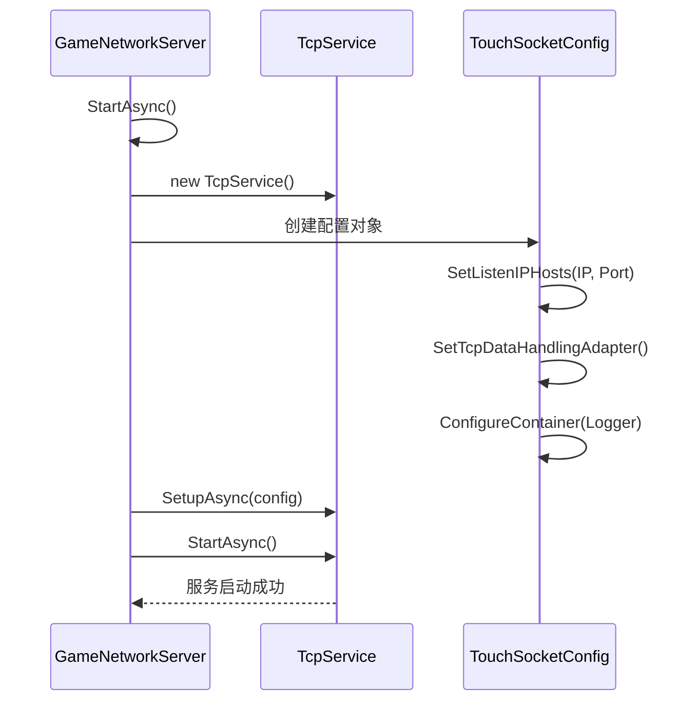
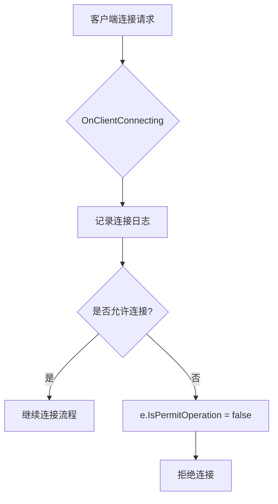
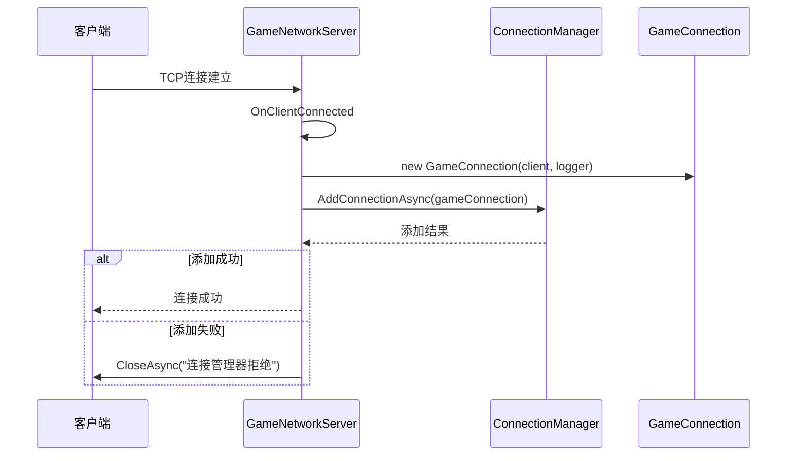
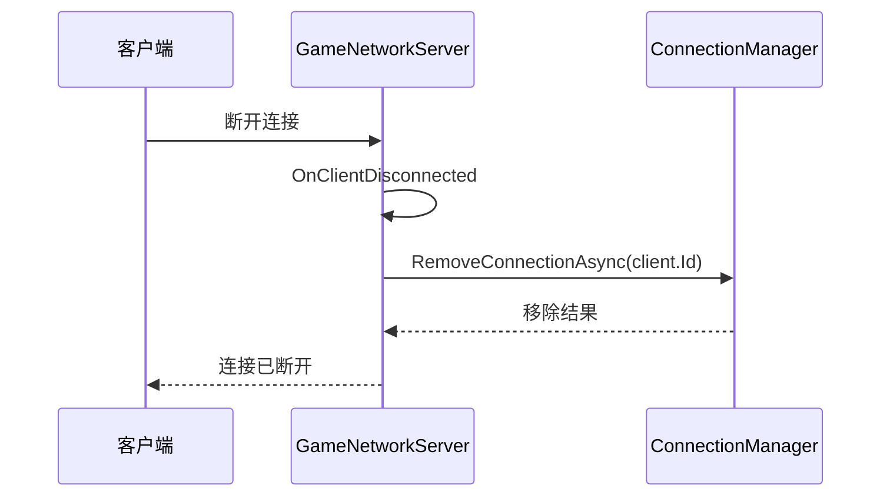
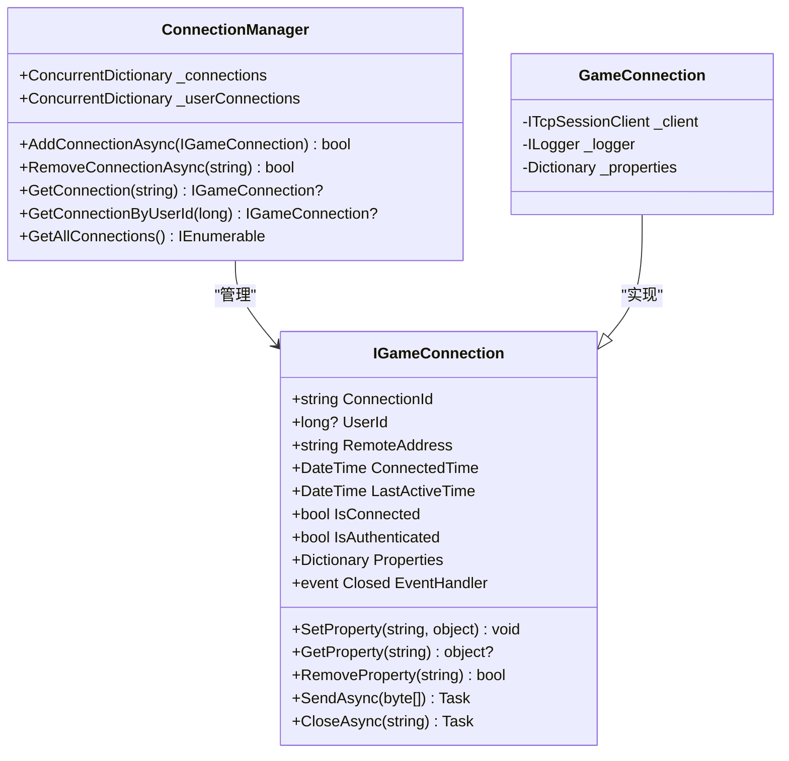
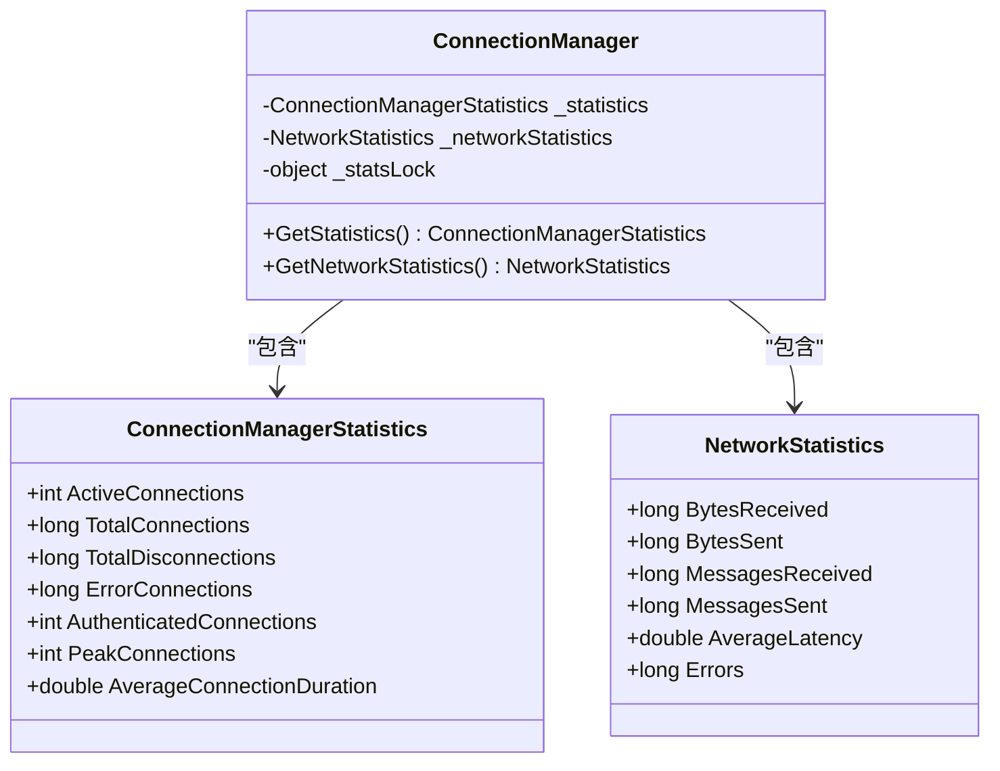
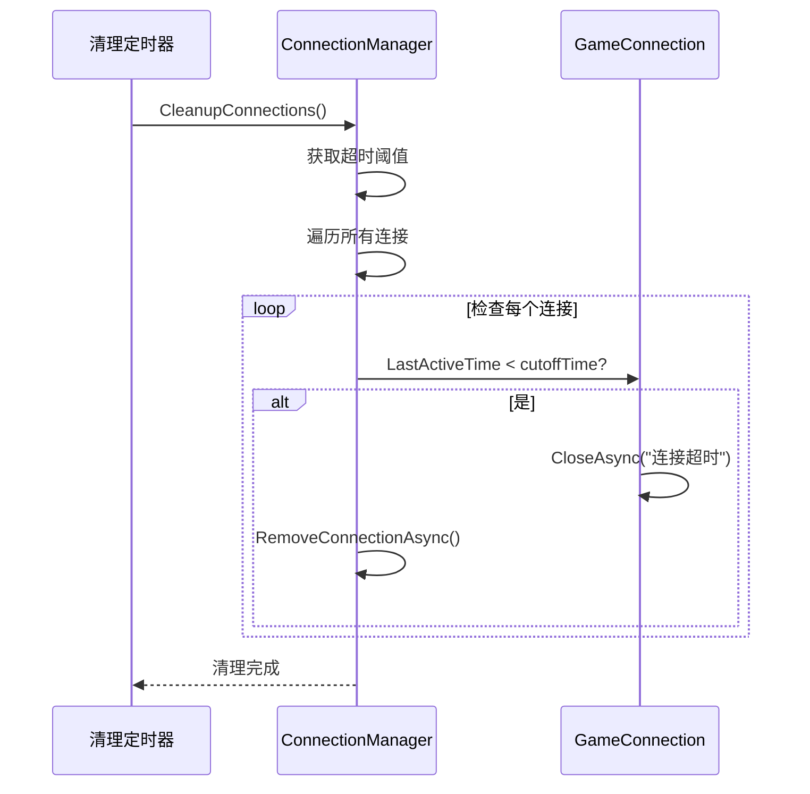
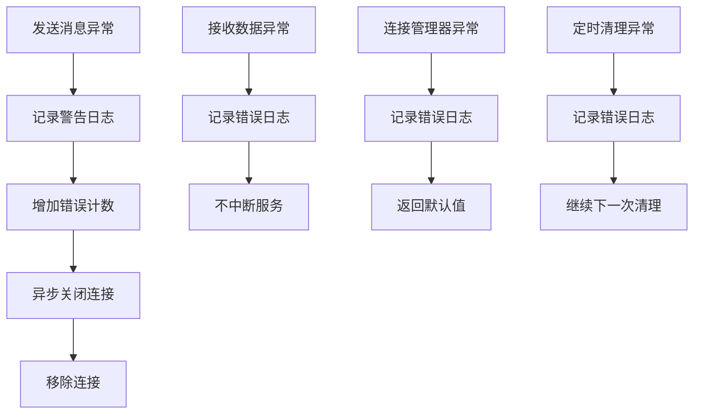
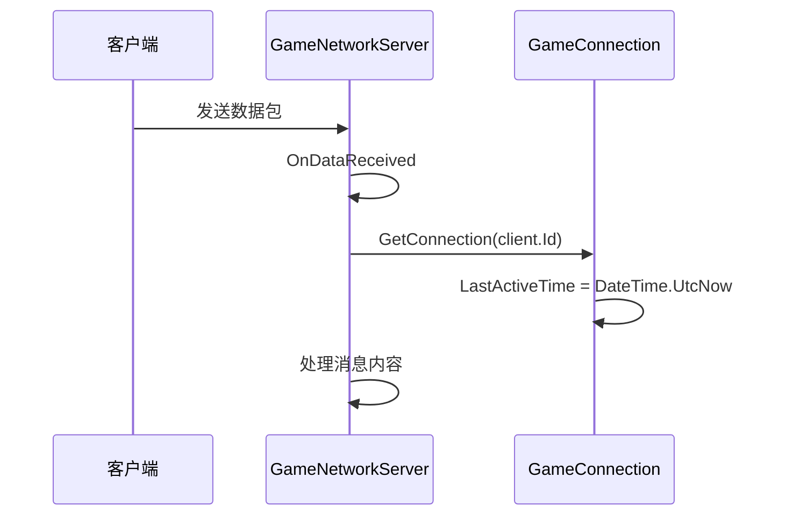

# 连接管理

<cite>
**Referenced Files in This Document **   
- [GameNetworkServer.cs](file://Horizon.Game.Gateway/Network/GameNetworkServer.cs)
- [ConnectionManager.cs](file://Horizon.Game.Gateway/Services/ConnectionManager.cs)
- [GameConnection.cs](file://Horizon.Game.Gateway/Network/GameConnection.cs)
- [NetworkOptions.cs](file://Horizon.Game.Gateway/Configuration/NetworkOptions.cs)
- [GatewayOptions.cs](file://Horizon.Game.Gateway/Configuration/GatewayOptions.cs)
- [IConnectionManager.cs](file://Horizon.Game.Gateway/Services/IConnectionManager.cs)
</cite>

## Table of Contents
1. [连接监听与启动流程](#连接监听与启动流程)
2. [连接事件处理机制](#连接事件处理机制)
3. [连接管理器核心功能](#连接管理器核心功能)
4. [连接统计信息收集](#连接统计信息收集)
5. [连接超时与异常处理](#连接超时与异常处理)
6. [连接状态监控与恢复策略](#连接状态监控与恢复策略)

## 连接监听与启动流程

游戏网络服务器通过TouchSocket框架实现TCP连接的监听和管理。`GameNetworkServer`类负责初始化和配置TCP服务，使用`NetworkOptions`中的`TcpPort`属性定义监听端口。



**Diagram sources**
- [GameNetworkServer.cs](file://Horizon.Game.Gateway/Network/GameNetworkServer.cs#L100-L137)

**Section sources**
- [GameNetworkServer.cs](file://Horizon.Game.Gateway/Network/GameNetworkServer.cs#L100-L137)
- [NetworkOptions.cs](file://Horizon.Game.Gateway/Configuration/NetworkOptions.cs#L7-L81)

## 连接事件处理机制

`GameNetworkServer`实现了完整的连接生命周期事件处理器，包括连接前验证、连接建立和断开连接处理。

### 连接前验证 (OnClientConnecting)

在客户端尝试连接时触发，可用于执行连接前的验证逻辑，如IP白名单检查：



**Diagram sources**
- [GameNetworkServer.cs](file://Horizon.Game.Gateway/Network/GameNetworkServer.cs#L138-L159)

### 连接建立 (OnClientConnected)

当客户端成功建立连接后，创建`GameConnection`对象并添加到连接管理器：



**Diagram sources**
- [GameNetworkServer.cs](file://Horizon.Game.Gateway/Network/GameNetworkServer.cs#L161-L178)
- [ConnectionManager.cs](file://Horizon.Game.Gateway/Services/ConnectionManager.cs#L43-L80)
- [GameConnection.cs](file://Horizon.Game.Gateway/Network/GameConnection.cs#L63-L73)

### 断开连接 (OnClientDisconnected)

当客户端断开连接时，从连接管理器中移除对应连接：



**Diagram sources**
- [GameNetworkServer.cs](file://Horizon.Game.Gateway/Network/GameNetworkServer.cs#L180-L194)
- [ConnectionManager.cs](file://Horizon.Game.Gateway/Services/ConnectionManager.cs#L85-L123)

## 连接管理器核心功能

`ConnectionManager`类实现了对活跃连接的集中管理，提供连接的添加、移除和查询功能。

### 连接管理数据结构



**Diagram sources**
- [ConnectionManager.cs](file://Horizon.Game.Gateway/Services/ConnectionManager.cs#L15-L448)
- [IConnectionManager.cs](file://Horizon.Game.Gateway/Services/IConnectionManager.cs#L101-L179)
- [GameConnection.cs](file://Horizon.Game.Gateway/Network/GameConnection.cs#L12-L191)

### 连接添加与验证

连接管理器在添加新连接时会进行容量检查，确保不超过最大连接数限制：

```mermaid
flowchart TD
A[收到新连接] --> B{连接数 < 最大限制?}
B --> |是| C[尝试添加到_connections]
B --> |否| D[关闭连接 "服务器连接数已满"]
C --> E{添加成功?}
E --> |是| F[注册Closed事件]
E --> |否| G[记录警告日志]
F --> H[更新统计信息]
H --> I[返回成功]
```

**Section sources**
- [ConnectionManager.cs](file://Horizon.Game.Gateway/Services/ConnectionManager.cs#L43-L80)

## 连接统计信息收集

连接管理器提供了详细的连接统计信息，包括当前连接数、峰值连接数等关键指标。

### 统计信息数据模型



**Diagram sources**
- [IConnectionManager.cs](file://Horizon.Game.Gateway/Services/IConnectionManager.cs#L184-L256)
- [ConnectionManager.cs](file://Horizon.Game.Gateway/Services/ConnectionManager.cs#L318-L355)

### 统计信息更新机制

统计信息在多个关键点被更新，确保数据的实时性和准确性：

```mermaid
flowchart LR
A[添加连接] --> B[TotalConnections++]
A --> C[ActiveConnections = _connections.Count]
A --> D[PeakConnections = Max(Peak, Active)]
E[移除连接] --> F[TotalDisconnections++]
E --> G[ActiveConnections = _connections.Count]
E --> H[计算AverageConnectionDuration]
I[发送消息] --> J[MessagesSent++]
I --> K[BytesSent += message.Length]
L[发送失败] --> M[Errors++]
```

**Section sources**
- [ConnectionManager.cs](file://Horizon.Game.Gateway/Services/ConnectionManager.cs#L43-L123)

## 连接超时与异常处理

系统实现了完善的连接超时处理和异常恢复策略，确保服务的稳定性和可靠性。

### 超时连接清理

连接管理器通过定时器定期检查并清理超时连接：



**Section sources**
- [ConnectionManager.cs](file://Horizon.Game.Gateway/Services/ConnectionManager.cs#L377-L410)
- [GatewayOptions.cs](file://Horizon.Game.Gateway/Configuration/GatewayOptions.cs#L45-L48)

### 异常断开恢复策略

系统采用多层次的异常处理机制来应对各种网络异常情况：



**Section sources**
- [ConnectionManager.cs](file://Horizon.Game.Gateway/Services/ConnectionManager.cs#L300-L315)
- [GameNetworkServer.cs](file://Horizon.Game.Gateway/Network/GameNetworkServer.cs#L196-L287)

## 连接状态监控与恢复策略

系统通过多种机制监控连接状态，确保及时发现和处理异常连接。

### 连接状态维护

连接对象通过多个属性维护其状态信息：

```mermaid
classDiagram
class GameConnection {
+string ConnectionId
+long? UserId
+string RemoteAddress
+DateTime ConnectedTime
+DateTime LastActiveTime
+bool IsConnected
+bool IsAuthenticated
+Dictionary<string, object> Properties
}
note right of GameConnection
ConnectedTime : 连接建立时间\n
LastActiveTime : 最后活跃时间用于超时检测\n
IsConnected : 从ITcpSessionClient.Online获取\n
IsAuthenticated : 认证状态标志\n
Properties : 可扩展的连接元数据存储
end
```

**Section sources**
- [GameConnection.cs](file://Horizon.Game.Gateway/Network/GameConnection.cs#L12-L191)

### 心跳与活跃性检测

系统通过更新`LastActiveTime`属性来实现连接的活跃性检测：



**Section sources**
- [GameNetworkServer.cs](file://Horizon.Game.Gateway/Network/GameNetworkServer.cs#L220-L222)