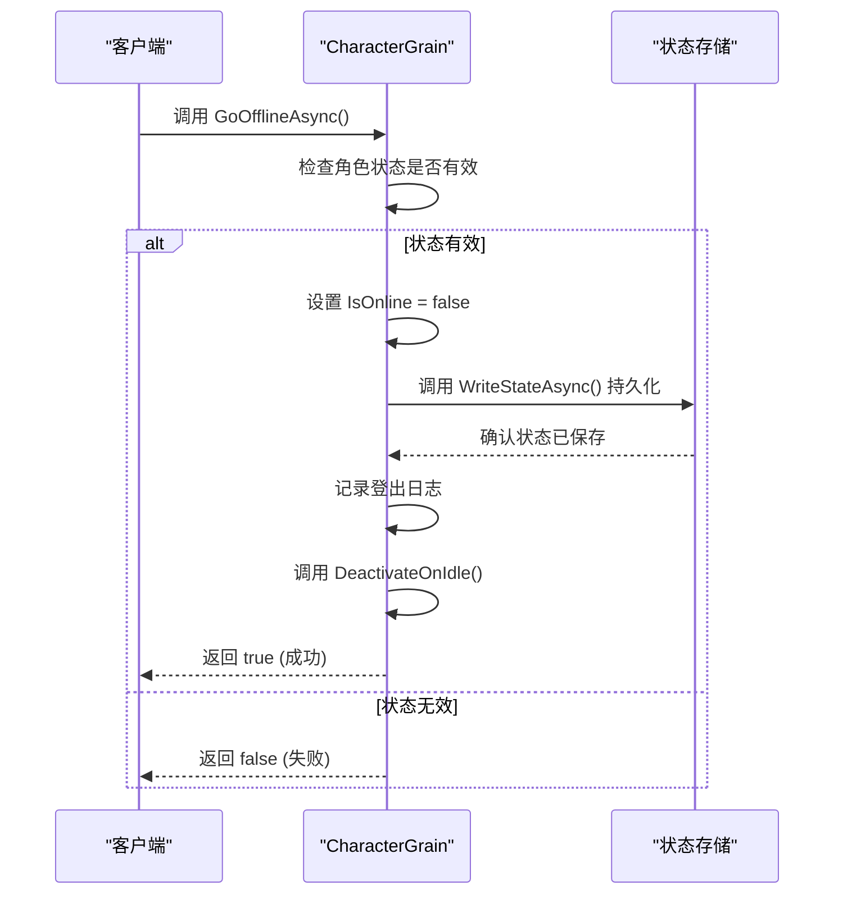
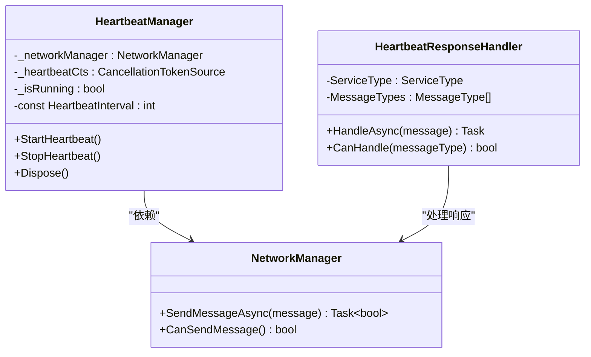

# 离线处理

<cite>
**Referenced Files in This Document **   
- [PassportGrain.cs](file://Horizon.Orleans.Grains/PassportGrain.cs)
- [CharacterGrain.cs](file://Horizon.Orleans.Grains/CharacterGrain.cs)
- [IPassportGrain.cs](file://Horizon.Orleans.Interface/IPassportGrain.cs)
- [ICharacterGrain.cs](file://Horizon.Orleans.Interface/ICharacterGrain.cs)
- [HeartbeatManager.cs](file://HundunWorld/Source/Game/Network/HeartbeatManager.cs)
- [HeartbeatResponseHandler.cs](file://HundunWorld/Source/Game/Network/MessageHandlers/HeartbeatResponseHandler.cs)
</cite>

## 目录
1. [引言](#引言)
2. [核心组件分析](#核心组件分析)
3. [角色离线处理流程](#角色离线处理流程)
4. [Orleans Grain生命周期管理](#orleans-grain生命周期管理)
5. [异常断线检测机制](#异常断线检测机制)
6. [监控与日志配置](#监控与日志配置)
7. [状态一致性保障](#状态一致性保障)
8. [结论](#结论)

## 引言

本文档全面阐述了系统中角色离线处理的完整机制。文档详细介绍了`GoOfflineAsync`方法的执行流程，包括将角色置为离线状态、持久化最终状态以及通过`DeactivateOnIdle`释放资源等关键步骤。同时，文档深入探讨了基于Orleans框架的Grain生命周期管理策略，解释了`DeactivateOnIdle`如何帮助系统回收空闲资源以提升整体吞吐量。此外，还描述了在异常断线情况下，由心跳检测触发的自动登出补充机制，并提供了确保登出行为可追踪的监控日志配置建议。最后，讨论了防止离线期间发生数据竞争或丢失的状态一致性保障措施。

## 核心组件分析

本节分析实现离线处理功能的核心代码组件。

**Section sources**
- [CharacterGrain.cs](file://Horizon.Orleans.Grains/CharacterGrain.cs#L42-L43)
- [CharacterGrain.cs](file://Horizon.Orleans.Grains/CharacterGrain.cs#L202-L216)

## 角色离线处理流程

角色的离线处理主要由`CharacterGrain`中的`GoOfflineAsync`方法驱动。该流程是一个有序的序列，确保了状态变更、数据持久化和资源清理的正确性。



**Diagram sources **
- [CharacterGrain.cs](file://Horizon.Orleans.Grains/CharacterGrain.cs#L202-L216)

**Section sources**
- [CharacterGrain.cs](file://Horizon.Orleans.Grains/CharacterGrain.cs#L202-L216)

### 执行步骤详解

1.  **状态检查**: 方法首先检查`_characterState.State.CharacterInfo`是否为空。如果为空，说明角色状态未初始化，直接返回`false`。
2.  **置为离线**: 如果状态有效，则将`_characterState.State.IsOnline`属性设置为`false`，标记该角色实例当前处于离线状态。
3.  **状态持久化**: 调用`_characterState.WriteStateAsync()`方法，将包含最新离线状态（`IsOnline=false`）的角色状态对象异步写入后端存储（如数据库）。这是确保状态一致性的关键一步。
4.  **日志记录**: 使用`_logger.LogInformation`记录一条信息级别的日志，表明指定角色已成功下线，便于后续追踪和审计。
5.  **资源释放**: 最后，调用`DeactivateOnIdle()`方法，向Orleans运行时发出信号，请求在适当的时候停用此Grain实例，从而释放其占用的内存等服务器资源。

## Orleans Grain生命周期管理

Orleans框架采用一种称为"虚拟Actor"的模型，其中Grain是无状态的逻辑单元，其生命周期由Orleans Silo（服务端）自动管理。`DeactivateOnIdle`是这种管理策略的核心组成部分。

```mermaid
flowchart TD
A[Grain 被创建] --> B{收到消息?}
B -- 是 --> C[处理消息]
C --> D{调用 DeactivateOnIdle()?}
D -- 否 --> B
D -- 是 --> E[进入待停用队列]
E --> F{空闲超时到期?}
F -- 否 --> G[仍在内存中]
F -- 是 --> H[从内存中移除<br/>释放所有资源]
I[新消息到达] --> J[重新激活Grain]
J --> C
```

**Diagram sources **
- [CharacterGrain.cs](file://Horizon.Orleans.Grains/CharacterGrain.cs#L213)

**Section sources**
- [CharacterGrain.cs](file://Horizon.Orleans.Grains/CharacterGrain.cs#L213)

### `DeactivateOnIdle` 的作用与优势

*   **主动提示**: `DeactivateOnIdle()`并非立即销毁Grain，而是向Silo发送一个“建议”，表明此Grain在完成当前工作后可以被停用。
*   **资源回收**: 当Grain被停用后，其占用的内存会被释放，相关的托管对象会被垃圾回收。这对于管理大量长期存在的Grain（如玩家角色）至关重要。
*   **提升吞吐量**: 通过及时回收空闲Grain的资源，Silo可以将这些资源分配给活跃的Grain，从而支持更多的并发用户，显著提升系统的整体吞吐量和可扩展性。
*   **透明性**: 对于客户端而言，Grain的停用和后续的重新激活是完全透明的。当下次有消息发给该Grain时，Silo会自动将其重新激活并加载其状态。

## 异常断线检测机制

除了正常的主动登出流程，系统还必须处理因网络故障、客户端崩溃等导致的异常断线情况。为此，系统实现了基于心跳包的心跳检测机制。



**Diagram sources **
- [HeartbeatManager.cs](file://HundunWorld/Source/Game/Network/HeartbeatManager.cs#L0-L138)
- [HeartbeatResponseHandler.cs](file://HundunWorld/Source/Game/Network/MessageHandlers/HeartbeatResponseHandler.cs#L0-L48)

**Section sources**
- [HeartbeatManager.cs](file://HundunWorld/Source/Game/Network/HeartbeatManager.cs#L0-L138)
- [HeartbeatResponseHandler.cs](file://HundunWorld/Source/Game/Network/MessageHandlers/HeartbeatResponseHandler.cs#L0-L48)

### 心跳机制工作原理

1.  **客户端发送心跳**: 客户端的`HeartbeatManager`会启动一个后台任务，每隔20秒（`HeartbeatInterval`）向服务器发送一次`HeartbeatMessage`。
2.  **服务器响应**: 服务器接收到心跳消息后，会处理并返回一个`HeartbeatResponse`，其中包含了计算出的网络延迟（Latency）。
3.  **客户端接收响应**: 客户端的`HeartbeatResponseHandler`负责处理`HeartbeatResponse`消息，并可以利用延迟信息更新UI或进行其他诊断。
4.  **超时判定**: 服务器端会维护每个连接的心跳状态。如果在预设的超时时间内（例如60秒）没有收到来自某个客户端的心跳包，则判定该客户端已异常断开。
5.  **触发自动登出**: 一旦服务器判定客户端断线，它会代表该客户端调用相应的`GoOfflineAsync`方法，执行与正常登出相同的流程，确保角色状态被正确置为离线并持久化，避免出现“幽灵在线”状态。

## 监控与日志配置

为了确保离线处理行为的可追踪性和可审计性，合理的监控和日志配置至关重要。

**Section sources**
- [CharacterGrain.cs](file://Horizon.Orleans.Grains/CharacterGrain.cs#L211)

### 日志记录建议

*   **关键操作日志**: 如`CharacterGrain`所示，在`GoOfflineAsync`成功执行后，应使用`ILogger`记录一条信息级别（Information）的日志，明确指出哪个角色已下线。这为运营和问题排查提供了直接依据。
*   **错误日志**: 在状态持久化（`WriteStateAsync`）或任何其他步骤中发生异常时，必须捕获并记录详细的错误日志（Error Level），包括异常堆栈，以便快速定位问题根源。
*   **诊断日志**: `HeartbeatManager`和`HeartbeatResponseHandler`中的`EnhancedDiagnostics.LogDiagnostic`和`LogNetworkOperation`可用于记录更细粒度的诊断信息，如“开始发送心跳包”、“心跳包发送成功/失败”等，有助于分析网络健康状况。

### 监控指标建议

*   **Grain 停用率**: 监控单位时间内被`DeactivateOnIdle`停用的Grain数量，可以反映系统的资源回收效率。
*   **心跳成功率**: 统计客户端发送的心跳包的成功率，低成功率可能预示着网络问题。
*   **异常断线率**: 监控因心跳超时而触发的自动登出事件数量，高频率的异常断线需要重点关注。

## 状态一致性保障

在分布式系统中，确保数据的一致性是首要任务。本系统通过以下措施来防止离线期间的数据竞争或丢失：

**Section sources**
- [CharacterGrain.cs](file://Horizon.Orleans.Grains/CharacterGrain.cs#L209)

### 关键保障措施

1.  **单线程执行**: Orleans保证同一个Grain实例的所有方法调用都是单线程顺序执行的。这意味着在`GoOfflineAsync`执行过程中，不会有其他并发操作修改`_characterState`，从根本上避免了数据竞争。
2.  **原子性状态写入**: `WriteStateAsync()`方法通常会与底层存储（如ADO.NET或Redis）结合，利用事务或乐观锁机制，确保状态的读取、修改和写入作为一个原子操作完成，防止中间状态被破坏。
3.  **最终一致性**: 即使在极端情况下（如Silo崩溃），由于状态是持久化的，当Grain在另一个Silo上被重新激活时，它会从存储中加载最新的状态，从而保证了数据的最终一致性。`DeactivateOnIdle`不会影响已持久化的状态。

## 结论

本系统通过结合主动的`GoOfflineAsync`流程和被动的心跳检测机制，构建了一套健壮、可靠的离线处理方案。`DeactivateOnIdle`作为Orleans生命周期管理的关键，有效地提升了系统的资源利用率和整体性能。通过强制的单线程执行模型和原子性的状态持久化，系统在保证高并发的同时，也确保了角色状态的一致性和完整性。完善的日志和监控配置则为系统的稳定运行和问题排查提供了有力支持。