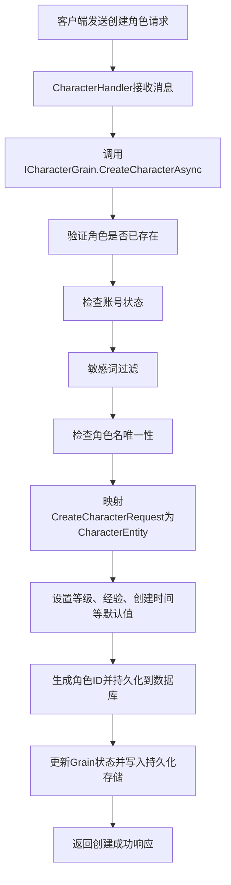
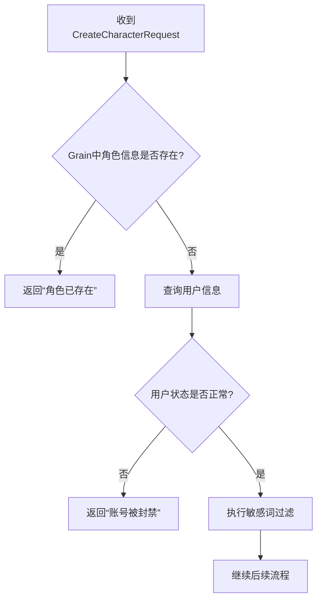

# 角色创建

<cite>
**本文档引用的文件**  
- [CharacterGrain.cs](file://Horizon.Orleans.Grains/CharacterGrain.cs)
- [CharacterHandler.cs](file://Horizon.Game.Core/Handlers/CharacterHandler.cs)
- [ICharacterGrain.cs](file://Horizon.Orleans.Interface/ICharacterGrain.cs)
- [AccountMessages.cs](file://Horizon.Game.Message/Network/AccountMessages.cs)
- [CharacterEntity.cs](file://Horizon.Model/GameModel/CharacterEntity.cs)
- [PlayerIdGenerator.cs](file://Horizon.Core/Helper/PlayerIdGenerator.cs)
- [PlayerIdGeneratorConfig.cs](file://Horizon.Core/Helper/PlayerIdGeneratorConfig.cs)
- [GameProfile.cs](file://Horizon.Mapper/GameProfile.cs)
</cite>

## 目录
1. [角色创建流程概述](#角色创建流程概述)  
2. [请求参数验证与敏感词过滤](#请求参数验证与敏感词过滤)  
3. [角色名唯一性检查](#角色名唯一性检查)  
4. [角色实体映射与默认值设置](#角色实体映射与默认值设置)  
5. [角色ID生成机制与Orleans Grain Key绑定](#角色id生成机制与orleans-grain-key绑定)  
6. [数据库持久化与状态写入](#数据库持久化与状态写入)  
7. [高并发场景下的重复创建保障策略](#高并发场景下的重复创建保障策略)  
8. [常见错误处理与返回码说明](#常见错误处理与返回码说明)  
9. [新用户注册后创建角色的代码示例](#新用户注册后创建角色的代码示例)

## 角色创建流程概述

角色创建功能是游戏用户进入游戏世界的核心入口，其主要流程包括：接收客户端创建角色请求、验证用户状态与角色名合法性、通过对象映射生成角色实体、设置初始属性、持久化到数据库并更新Orleans Grain状态。该功能由`CharacterHandler`接收网络消息，调用`ICharacterGrain`接口的`CreateCharacterAsync`方法，在`CharacterGrain`中完成核心逻辑。



**Diagram sources**  
- [CharacterHandler.cs](file://Horizon.Game.Core/Handlers/CharacterHandler.cs#L270-L294)
- [CharacterGrain.cs](file://Horizon.Orleans.Grains/CharacterGrain.cs#L96-L138)

**Section sources**  
- [CharacterHandler.cs](file://Horizon.Game.Core/Handlers/CharacterHandler.cs#L270-L294)
- [CharacterGrain.cs](file://Horizon.Orleans.Grains/CharacterGrain.cs#L96-L138)

## 请求参数验证与敏感词过滤

在创建角色前，系统首先对请求参数进行验证。`CreateCharacterRequest`对象包含用户ID、角色名、职业、性别、外观信息等字段。系统会检查该Grain实例是否已存在角色信息，若存在则直接返回“角色已存在”的错误。

随后，系统通过`_gameUserContext`查询用户实体，验证用户是否被封禁（`Status > 0`）。若账号被封禁，则返回“账号被封禁，无法创建角色”的提示。

接着，系统对角色名进行敏感词过滤。调用`FilterSensitiveWords(sensitiveWords: null)`方法，该方法会使用内置的敏感词库对角色名进行过滤和替换，确保角色名符合社区规范。



**Diagram sources**  
- [CharacterGrain.cs](file://Horizon.Orleans.Grains/CharacterGrain.cs#L97-L104)

**Section sources**  
- [CharacterGrain.cs](file://Horizon.Orleans.Grains/CharacterGrain.cs#L97-L104)

## 角色名唯一性检查

为确保角色名的全局唯一性，系统在`_gameCharacterContext`中查询数据库，检查是否存在相同角色名的记录。通过`QueryFirstOrDefaultAsync(c => c.CharacterName == request.CharacterName)`执行数据库查询。

若查询结果不为空，说明角色名已被占用，系统返回“角色名已存在，请重新创建角色失败”的错误信息。此检查在数据库层面通过`[Required]`和唯一性约束保证，防止并发创建时出现重复角色名。

**Section sources**  
- [CharacterGrain.cs](file://Horizon.Orleans.Grains/CharacterGrain.cs#L105-L108)
- [CharacterEntity.cs](file://Horizon.Model/GameModel/CharacterEntity.cs#L25-L30)

## 角色实体映射与默认值设置

系统使用AutoMapper将`CreateCharacterRequest`对象映射为`CharacterEntity`实体。该映射关系在`GameProfile.cs`中定义：

```csharp
CreateMap<CreateCharacterRequest, CharacterEntity>();
```

映射完成后，系统为`CharacterEntity`设置默认初始值：
- **等级（Level）**: 设置为1级
- **经验值（Experience）**: 设置为0
- **创建时间（CreateTime）**: 设置为`DateTime.UtcNow`
- **服务器ID（ServerId）、分区ID（AreaId）、游戏ID（GameId）**: 从请求中获取
- **用户ID（UserId）和游戏用户ID（GameUserId）**: 从请求和查询的用户实体中获取

这些默认值确保了新创建的角色具有合理的初始状态。

**Section sources**  
- [CharacterGrain.cs](file://Horizon.Orleans.Grains/CharacterGrain.cs#L110-L118)
- [GameProfile.cs](file://Horizon.Mapper/GameProfile.cs#L10)

## 角色ID生成机制与Orleans Grain Key绑定

角色ID的生成采用基于雪花算法（Snowflake Algorithm）的`PlayerIdGenerator`。该生成器由`PlayerIdGeneratorConfig`配置，包含机器ID（WorkerId）和数据中心ID（DataCenterId），确保在分布式环境下生成的ID全局唯一且有序。

生成的64位长整型ID由时间戳、数据中心ID、机器ID和序列号组成。`PlayerIdGenerator`通过`NextId()`方法生成ID，并可通过`ParseTimestamp`等方法解析ID中的信息。

在`CharacterGrain`中，角色ID（`CharacterId`）作为Orleans Grain的Key（即Grain的唯一标识符）。当角色创建成功后，`CharacterId`被设置为数据库生成的实体ID，实现了角色数据与Grain实例的绑定，确保后续对该角色的所有操作都能路由到正确的Grain实例。

**Section sources**  
- [PlayerIdGenerator.cs](file://Horizon.Core/Helper/PlayerIdGenerator.cs#L9-L264)
- [PlayerIdGeneratorConfig.cs](file://Horizon.Core/Helper/PlayerIdGeneratorConfig.cs#L7-L53)
- [CharacterGrain.cs](file://Horizon.Orleans.Grains/CharacterGrain.cs#L125)

## 数据库持久化与状态写入

角色实体（`CharacterEntity`）通过`_gameCharacterContext.AddAsync(characterEntity)`方法异步添加到数据库，并返回包含新生成ID的实体。此操作将角色数据持久化到`Game_HunduShijie_Character`表中。

随后，系统将`CharacterEntity`映射回`CharacterInfo`对象，并赋值给Grain状态`_characterState.State.CharacterInfo`。同时，设置`IsOnline`为`false`，表示角色离线。

最后，调用`await _characterState.WriteStateAsync()`将更新后的状态写入持久化存储（如Redis或数据库），确保Grain状态的可靠性。日志记录角色创建成功的信息。

**Section sources**  
- [CharacterGrain.cs](file://Horizon.Orleans.Grains/CharacterGrain.cs#L119-L127)

## 高并发场景下的重复创建保障策略

系统通过多层机制保障在高并发下不会出现重复创建：
1. **Grain单例性**：Orleans的Grain模型保证了对同一Grain Key（如用户ID）的请求会被串行化处理，避免了同一用户并发创建的冲突。
2. **数据库唯一约束**：`CharacterEntity`的`CharacterName`字段具有唯一性约束，数据库层面阻止了同名角色的插入。
3. **状态检查**：在方法开始时检查`_characterState.State.CharacterInfo`是否为null，若不为null则直接返回失败，防止重复创建。
4. **事务性操作**：从状态检查到数据库写入的整个流程在Grain的上下文中执行，保证了操作的原子性。

这些策略共同确保了即使在高并发场景下，角色创建操作也是安全且幂等的。

**Section sources**  
- [CharacterGrain.cs](file://Horizon.Orleans.Grains/CharacterGrain.cs#L97-L108)

## 常见错误处理与返回码

系统在创建角色过程中会返回不同的错误信息和状态码：
- **角色已存在**：当Grain状态中已有角色信息时，返回`IsSuccess = false`和消息“Character already exists in this grain.”。
- **账号被封禁**：当用户`Status > 0`时，返回“账号被封禁，无法创建角色，请联系游戏管理员。”。
- **角色名已存在**：当数据库查询到同名角色时，返回“角色名已存在，请重新创建角色失败。”。
- **其他错误**：在`CharacterHandler`中捕获异常，返回“创建角色失败”的通用错误。

这些错误信息帮助客户端准确地向用户展示失败原因。

**Section sources**  
- [CharacterGrain.cs](file://Horizon.Orleans.Grains/CharacterGrain.cs#L97-L108)
- [CharacterHandler.cs](file://Horizon.Game.Core/Handlers/CharacterHandler.cs#L288-L294)

## 新用户注册后创建角色的代码示例

以下是一个新用户注册后调用接口创建角色的完整代码示例：

```csharp
// 1. 用户注册成功后，获取用户ID
ulong userId = newUser.UserId;

// 2. 构造创建角色请求
var createRequest = new CreateCharacterRequest
{
    UserId = userId,
    CharacterName = "新玩家",
    Profession = Profession.Swordman, // 假设职业枚举
    Gender = 0, // 0为男性
    Appearance = new AppearanceInfo 
    { 
        HairModel = 1, 
        HairColor = 2, 
        FaceModel = 0, 
        Clothing = 101 
    },
    GameId = 1,
    ZoneId = 101,
    ServerId = 2001
};

// 3. 获取Orleans Grain引用
var characterGrain = clusterClient.GetGrain<ICharacterGrain>(0); // 此处0为临时Grain Key，实际应为用户ID或生成的角色ID

// 4. 调用异步创建方法
var response = await characterGrain.CreateCharacterAsync(createRequest);

// 5. 处理响应
if (response.IsSuccess)
{
    Console.WriteLine($"角色创建成功！角色ID: {response.Character.CharacterId}, 名称: {response.Character.CharacterName}");
    // 可以进行后续操作，如进入游戏
}
else
{
    Console.WriteLine($"角色创建失败: {response.Message}");
    // 根据Message内容提示用户
}
```

**Section sources**  
- [ICharacterGrain.cs](file://Horizon.Orleans.Interface/ICharacterGrain.cs#L20)
- [AccountMessages.cs](file://Horizon.Game.Message/Network/AccountMessages.cs#L378-L440)