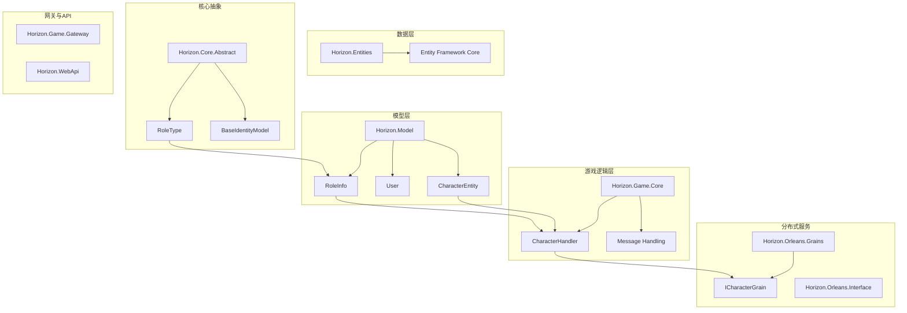
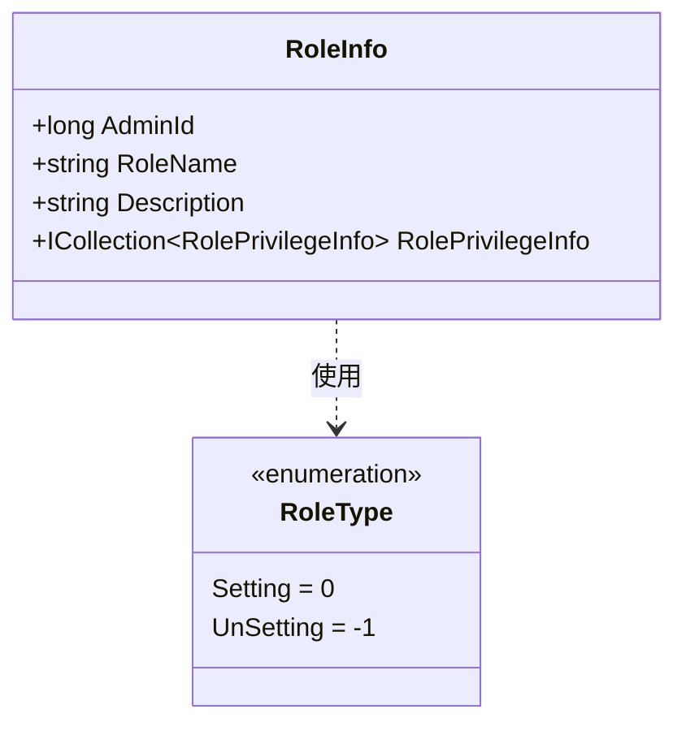
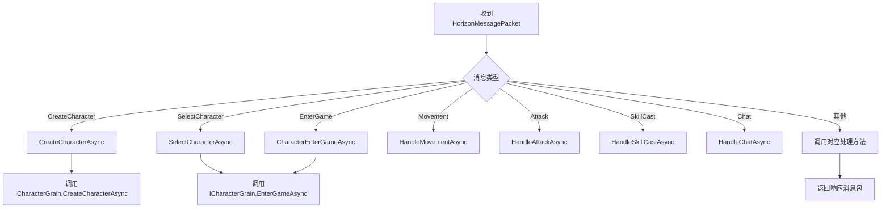
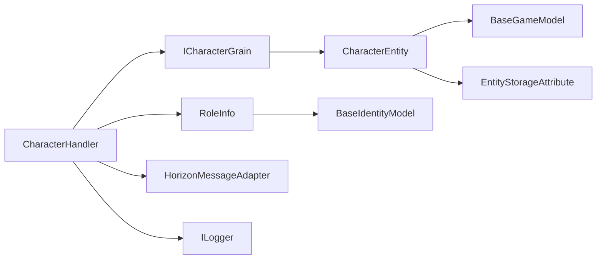

# 角色基础

<cite>
**本文档中引用的文件**  
- [CharacterEntity.cs](file://Horizon.Model/GameModel/CharacterEntity.cs)
- [RoleInfo.cs](file://Horizon.Model/Basic/RoleInfo.cs)
- [User.cs](file://Horizon.Model/Basic/User.cs)
- [RoleType.cs](file://Horizon.Core.Abstract/Enums/RoleType.cs)
- [CharacterHandler.cs](file://Horizon.Game.Core/Handlers/CharacterHandler.cs)
</cite>

## 目录
1. [简介](#简介)
2. [项目结构](#项目结构)
3. [核心组件](#核心组件)
4. [角色实体模型分析](#角色实体模型分析)
5. [角色类型与权限](#角色类型与权限)
6. [角色消息处理机制](#角色消息处理机制)
7. [依赖关系分析](#依赖关系分析)
8. [结论](#结论)

## 简介
本项目为一个基于Orleans分布式计算框架的多人在线游戏后端系统，核心功能围绕游戏角色管理、状态同步、交互逻辑与权限控制展开。本文档聚焦于“角色”这一核心概念，深入分析其数据模型、行为逻辑与系统集成方式，旨在为开发与维护提供清晰的技术参考。

## 项目结构
系统采用分层架构设计，模块职责清晰，主要包括核心库、实体定义、游戏逻辑、网关服务与Web API接口层。角色相关功能分散在多个模块中，通过Grain粒度服务进行解耦与通信。

**图示来源**  
- [CharacterEntity.cs](file://Horizon.Model/GameModel/CharacterEntity.cs)
- [RoleInfo.cs](file://Horizon.Model/Basic/RoleInfo.cs)
- [RoleType.cs](file://Horizon.Core.Abstract/Enums/RoleType.cs)
- [CharacterHandler.cs](file://Horizon.Game.Core/Handlers/CharacterHandler.cs)

**本节来源**  
- [Horizon.Model/GameModel/CharacterEntity.cs](file://Horizon.Model/GameModel/CharacterEntity.cs)
- [Horizon.Model/Basic/RoleInfo.cs](file://Horizon.Model/Basic/RoleInfo.cs)
- [Horizon.Core.Abstract/Enums/RoleType.cs](file://Horizon.Core.Abstract/Enums/RoleType.cs)

## 核心组件
系统围绕Orleans的Grain模型构建，角色作为核心业务实体，其生命周期由`ICharacterGrain`管理。`CharacterHandler`负责接收客户端消息并路由至对应Grain进行处理。数据持久化通过EF Core与`CharacterEntity`映射实现，权限与角色类型由`RoleInfo`和`RoleType`枚举定义。

**本节来源**  
- [CharacterEntity.cs](file://Horizon.Model/GameModel/CharacterEntity.cs)
- [CharacterHandler.cs](file://Horizon.Game.Core/Handlers/CharacterHandler.cs)
- [RoleInfo.cs](file://Horizon.Model/Basic/RoleInfo.cs)
- [RoleType.cs](file://Horizon.Core.Abstract/Enums/RoleType.cs)

## 角色实体模型分析
`CharacterEntity`类定义了游戏中角色的完整数据结构，继承自`BaseGameModel<long>`，并使用EF Core的Data Annotations进行数据库映射配置。

### 主要属性说明
| 属性名 | 类型 | 数据库列名 | 描述 |
|--------|------|------------|------|
| Id | long | character_id | 角色唯一标识 |
| UserId | long | user_id | 关联的用户ID |
| CharacterName | string | character_name | 角色名称（20字符限制） |
| Level | int | level | 当前等级 |
| Experience | long | experience | 当前经验值 |
| Profession | int | profession | 职业类型（0:剑客, 1:刀客等） |
| Gender | int | gender | 性别（0:男, 1:女） |
| Sect | int | sect | 所属门派 |
| Faction | int | faction | 阵营（0:中立, 1:正派等） |
| PositionX/Y/Z | float | position_x/y/z | 三维坐标位置 |
| Rotation | float | rotation | 朝向角度 |
| CurrentTitleId | int? | current_title_id | 当前称号ID |
| ChivalryPoints/EvilPoints | int | chivalry_points/evil_points | 侠义值与恶名值 |
| CreateTime/LastLoginTime | DateTime | create_time/last_login_time | 创建与最后登录时间 |

### 数据库映射特性
- **[Table]**: 显式指定表名为 `Game_HunduShijie_Character`。
- **[EntityStorage]**: 标记实体存储于 "Game" 数据库。
- **[Column]**: 精确控制列名、数据类型和顺序。
- **[Comment]**: 提供数据库级别的字段注释。
- **[TableDescription]**: 自定义属性，用于生成数据字典。

**本节来源**  
- [CharacterEntity.cs](file://Horizon.Model/GameModel/CharacterEntity.cs#L1-L230)

## 角色类型与权限
系统通过`RoleInfo`和`RoleType`两个核心组件实现角色与权限管理。

### RoleInfo 类
`RoleInfo`代表系统中的角色实体，存储于 `Basics_Sys_Role` 表中，主要包含：
- **AdminId**: 关联的系统用户ID（0表示系统内置角色）
- **RoleName**: 角色名称
- **Description**: 角色简述
- **RolePrivilegeInfo**: 与权限的导航属性（一对多关系）

### RoleType 枚举
`RoleType` 定义了角色的可操作性级别：
- **Setting (0)**: 可设置角色与权限的类型，通常为管理员。
- **UnSetting (-1)**: 不可操作角色与权限的类型，通常为普通用户或受限角色。

该枚举使用 `[Description]` 特性提供中文标签，便于在UI或日志中展示。

**图示来源**  
- [RoleInfo.cs](file://Horizon.Model/Basic/RoleInfo.cs#L1-L40)
- [RoleType.cs](file://Horizon.Core.Abstract/Enums/RoleType.cs#L1-L26)

**本节来源**  
- [RoleInfo.cs](file://Horizon.Model/Basic/RoleInfo.cs)
- [RoleType.cs](file://Horizon.Core.Abstract/Enums/RoleType.cs)

## 角色消息处理机制
`CharacterHandler` 是处理所有与角色相关客户端消息的核心处理器，继承自 `MessageHandlerBase`。

### 消息类型支持
处理器通过 `MessageTypes` 属性声明其支持的100+种消息类型，涵盖：
- **角色管理**: `CreateCharacter`, `SelectCharacter`, `EnterGame`
- **移动与动画**: `Movement`, `PlayerAnimation`, `PlayerSpawn`
- **战斗系统**: `Attack`, `SkillCast`, `ComboAttack`, `Death`, `Resurrect`
- **门派系统**: `JoinSect`, `SectSkill`, `SectQuest`
- **社交与任务**: `Friend`, `Team`, `Guild`, `AcceptQuest`, `CompleteQuest`
- **物品与技能**: `UseItem`, `EquipItem`, `LearnSkill`, `UpgradeSkill`
- **聊天系统**: `Chat`

### 消息路由流程

**图示来源**  
- [CharacterHandler.cs](file://Horizon.Game.Core/Handlers/CharacterHandler.cs#L1-L800)

**本节来源**  
- [CharacterHandler.cs](file://Horizon.Game.Core/Handlers/CharacterHandler.cs)

## 依赖关系分析
角色系统依赖于多个核心模块，形成一个松耦合但高内聚的架构。

**图示来源**  
- [CharacterHandler.cs](file://Horizon.Game.Core/Handlers/CharacterHandler.cs)
- [CharacterEntity.cs](file://Horizon.Model/GameModel/CharacterEntity.cs)
- [RoleInfo.cs](file://Horizon.Model/Basic/RoleInfo.cs)

**本节来源**  
- [CharacterHandler.cs](file://Horizon.Game.Core/Handlers/CharacterHandler.cs)
- [CharacterEntity.cs](file://Horizon.Model/GameModel/CharacterEntity.cs)
- [RoleInfo.cs](file://Horizon.Model/Basic/RoleInfo.cs)

## 结论
本系统中的“角色”是一个贯穿数据、逻辑与服务的复杂实体。从`CharacterEntity`的数据定义，到`CharacterHandler`的消息处理，再到`ICharacterGrain`的分布式状态管理，形成了完整的角色生命周期闭环。权限系统通过`RoleInfo`和`RoleType`提供了灵活的访问控制基础。整体设计体现了分层清晰、职责明确、可扩展性强的特点，为游戏核心玩法的实现奠定了坚实基础。