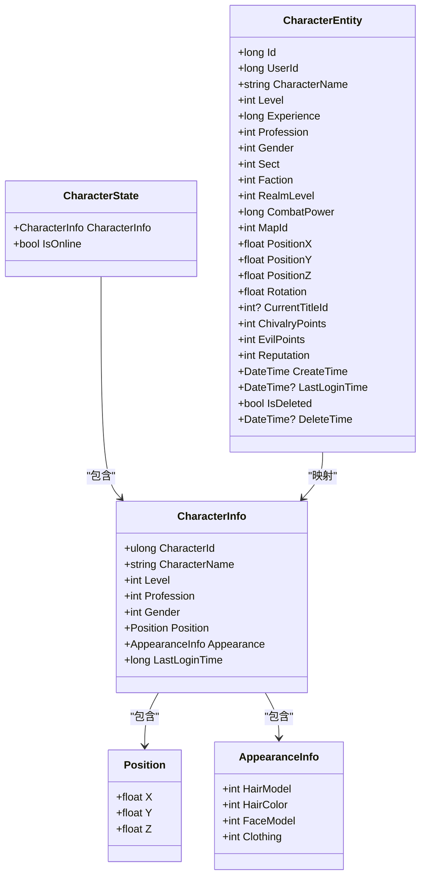
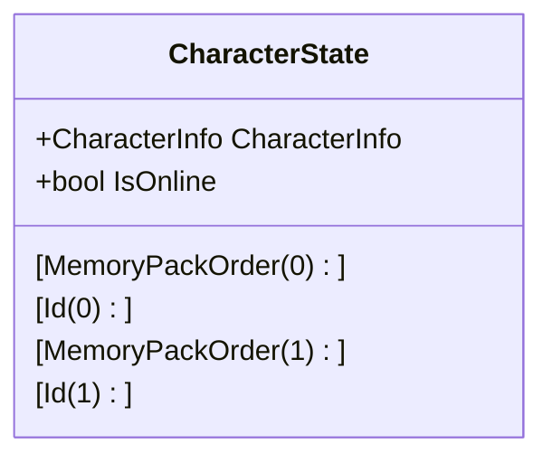
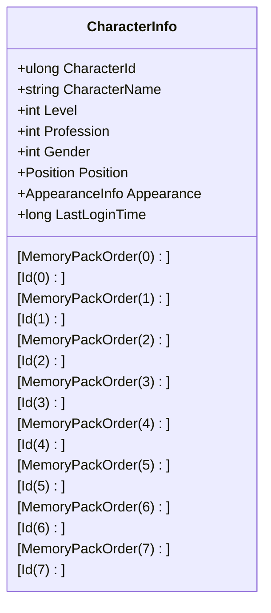
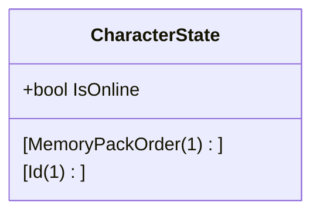
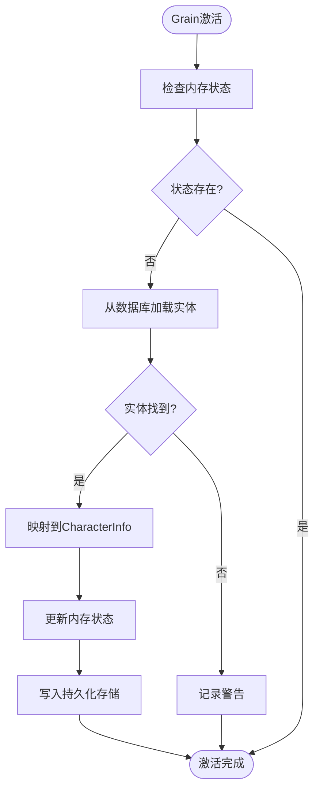
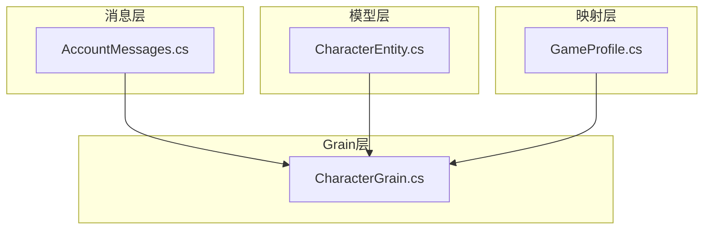

# 角色状态管理

<cite>
**本文档引用的文件**
- [CharacterGrain.cs](file://Horizon.Orleans.Grains/CharacterGrain.cs)
- [AccountMessages.cs](file://Horizon.Game.Message/Network/AccountMessages.cs)
- [CharacterEntity.cs](file://Horizon.Model/GameModel/CharacterEntity.cs)
- [GameProfile.cs](file://Horizon.Mapper/GameProfile.cs)
</cite>

## 目录
1. [简介](#简介)
2. [核心组件](#核心组件)
3. [架构概述](#架构概述)
4. [详细组件分析](#详细组件分析)
5. [依赖分析](#依赖分析)
6. [性能考虑](#性能考虑)
7. [故障排除指南](#故障排除指南)
8. [结论](#结论)

## 简介
本技术文档系统阐述了基于Orleans分布式计算框架和MemoryPack序列化库的角色状态管理系统。该系统通过`CharacterState`类实现高效的状态存储与恢复，利用`CharacterInfo`对象结构化地管理角色基础属性、位置、装备等关键信息。文档深入分析了`IsOnline`标志位在在线状态管理中的核心作用，详细描述了`OnActivateAsync`方法中从数据库恢复状态的完整流程及延迟加载优化策略。同时探讨了状态版本控制、并发写入冲突解决机制（如乐观锁）以及状态快照保存与恢复的最佳实践。

## 核心组件

[对核心组件进行深入分析，包括代码片段和解释]

**本节来源**
- [CharacterGrain.cs](file://Horizon.Orleans.Grains/CharacterGrain.cs#L26-L35)
- [AccountMessages.cs](file://Horizon.Game.Message/Network/AccountMessages.cs#L240-L302)

## 架构概述

[系统架构的全面可视化和说明]

**图表来源**
- [CharacterGrain.cs](file://Horizon.Orleans.Grains/CharacterGrain.cs#L26-L35)
- [AccountMessages.cs](file://Horizon.Game.Message/Network/AccountMessages.cs#L240-L302)
- [CharacterEntity.cs](file://Horizon.Model/GameModel/CharacterEntity.cs#L0-L187)

## 详细组件分析

[对每个关键组件进行彻底分析，包括图表、代码片段路径和解释]

### CharacterState 类分析
`CharacterState`是Orleans Grain的核心状态类，负责持久化存储角色数据。它被设计为部分类，并应用了`[MemoryPackable]`、`[GenerateSerializer]`和`[Serializable]`属性，以支持高效的二进制序列化和跨网络传输。

#### 对象导向组件：

**图表来源**
- [CharacterGrain.cs](file://Horizon.Orleans.Grains/CharacterGrain.cs#L26-L35)

### CharacterInfo 结构分析
`CharacterInfo`结构定义了角色的基础属性，包括ID、名称、等级、职业、性别、位置和外观等。这些字段使用`[MemoryPackOrder]`和`[Id]`属性进行标记，确保序列化时的一致性和效率。

#### 对象导向组件：

**图表来源**
- [AccountMessages.cs](file://Horizon.Game.Message/Network/AccountMessages.cs#L240-L302)

### 在线状态管理分析
`IsOnline`标志位是管理角色在线状态的核心。当角色进入游戏时，此标志被设置为`true`；当角色离线或登出时，它被设置为`false`。这个简单的布尔值对于确定角色是否活跃至关重要。

#### 对象导向组件：

**图表来源**
- [CharacterGrain.cs](file://Horizon.Orleans.Grains/CharacterGrain.cs#L32-L34)

### 状态恢复流程分析
`OnActivateAsync`方法实现了从数据库恢复状态的完整流程。当Grain激活时，如果内存中没有状态，系统会尝试从数据库加载对应的`CharacterEntity`，并将其映射到`CharacterInfo`，从而实现状态的延迟加载和恢复。

#### 流程图：

**图表来源**
- [CharacterGrain.cs](file://Horizon.Orleans.Grains/CharacterGrain.cs#L65-L95)

**本节来源**
- [CharacterGrain.cs](file://Horizon.Orleans.Grains/CharacterGrain.cs#L65-L95)
- [CharacterEntity.cs](file://Horizon.Model/GameModel/CharacterEntity.cs#L0-L187)
- [GameProfile.cs](file://Horizon.Mapper/GameProfile.cs#L0-L29)

## 依赖分析

[分析组件之间的依赖关系及其可视化]

**图表来源**
- [CharacterGrain.cs](file://Horizon.Orleans.Grains/CharacterGrain.cs#L43-L43)
- [AccountMessages.cs](file://Horizon.Game.Message/Network/AccountMessages.cs#L240-L302)
- [CharacterEntity.cs](file://Horizon.Model/GameModel/CharacterEntity.cs#L0-L187)
- [GameProfile.cs](file://Horizon.Mapper/GameProfile.cs#L0-L29)

## 性能考虑

[关于性能的通用讨论，不涉及特定文件分析]
[由于本节提供一般性指导，无需添加来源]

## 故障排除指南

[错误处理代码和调试工具的分析]

**本节来源**
- [CharacterGrain.cs](file://Horizon.Orleans.Grains/CharacterGrain.cs#L65-L95)
- [CharacterGrain.cs](file://Horizon.Orleans.Grains/CharacterGrain.cs#L100-L115)

## 结论

[发现总结和建议]
[由于本节汇总信息而不分析特定文件，无需添加来源]