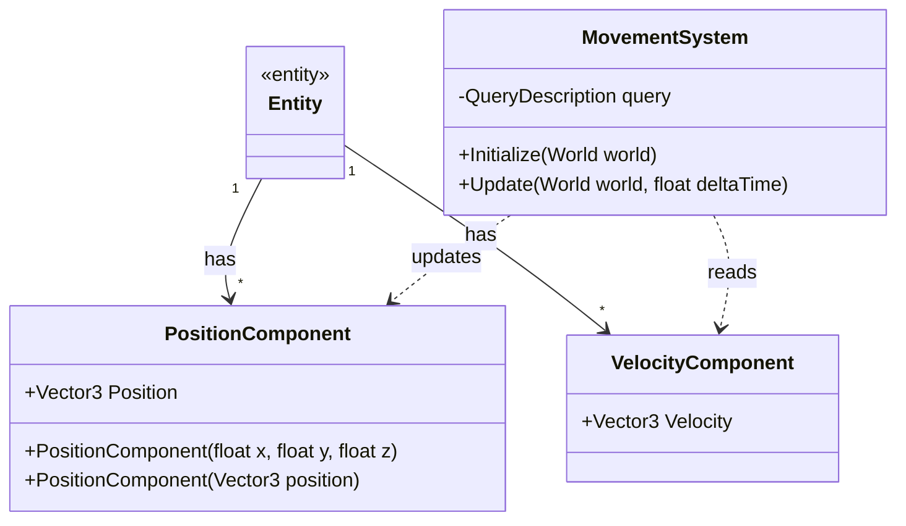
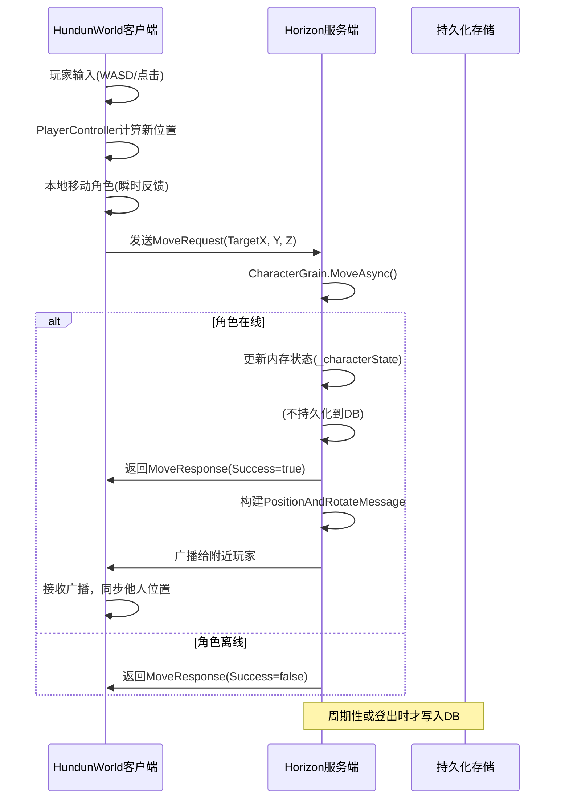

# 角色移动

<cite>
**Referenced Files in This Document **  
- [CharacterGrain.cs](file://Horizon.Orleans.Grains/CharacterGrain.cs)
- [PositionComponent.cs](file://HundunWorld/Source/Game/ECS/Components/PositionComponent.cs)
- [PlayerController.cs](file://HundunWorld/Source/Game/PlayerController.cs)
- [MovementSystem.cs](file://HundunWorld/Source/Game/ECS/Systems/MovementSystem.cs)
- [PositionAndRotateMessage.cs](file://Horizon.Share/Commones/PositionAndRotateMessage.cs)
</cite>

## 目录
1. [引言](#引言)  
2. [核心组件分析](#核心组件分析)  
3. [MoveAsync方法实现机制](#moveasync方法实现机制)  
4. [Position组件设计原则与ECS架构作用](#position组件设计原则与ecs架构作用)  
5. [客户端PlayerController与服务端同步机制](#客户端playercontroller与服务端同步机制)  
6. [低延迟移动同步优化建议](#低延迟移动同步优化建议)  
7. [性能瓶颈分析与解决方案](#性能瓶颈分析与解决方案)  

## 引言
本文档旨在深入解析游戏系统中角色移动功能的技术实现。重点阐述`MoveAsync`方法的执行流程、前置校验逻辑及高性能设计考量，剖析`PositionComponent`在ECS（实体-组件-系统）架构中的核心作用，并结合HundunWorld客户端的`PlayerController`实现，说明服务端接收到移动请求后的广播策略与状态同步机制。同时，提供针对低延迟移动体验的高级优化技巧，并指出频繁持久化状态可能引发的性能问题及其解决方案。

## 核心组件分析

本节对支撑角色移动功能的核心代码组件进行分析，涵盖服务端角色状态管理、客户端输入处理以及ECS架构下的位置更新逻辑。

**Section sources**
- [CharacterGrain.cs](file://Horizon.Orleans.Grains/CharacterGrain.cs#L172-L200)
- [PositionComponent.cs](file://HundunWorld/Source/Game/ECS/Components/PositionComponent.cs#L8-L39)
- [PlayerController.cs](file://HundunWorld/Source/Game/PlayerController.cs#L7-L517)

## MoveAsync方法实现机制

`MoveAsync`方法是服务端处理角色移动请求的核心入口，其位于`CharacterGrain`类中，负责验证移动合法性并更新角色在世界中的位置。

### 在线状态前置校验
方法首先检查角色的在线状态。通过访问`_characterState.State.IsOnline`属性，确保只有处于在线状态的角色才能执行移动操作。若角色不在线，则直接返回一个失败的响应，阻止非法或过期的移动请求被处理。
```csharp
if (!_characterState.State.IsOnline)
{
    return Task.FromResult(new MoveResponse { Success = false });
}
```

### 位置坐标更新逻辑
当校验通过后，方法会从`MoveRequest`请求对象中提取目标坐标（`TargetX`, `TargetY`, `TargetZ`），并直接更新`_characterState.State.CharacterInfo.Position`字段。此操作将新的位置信息写入该角色Grain的内存状态中，使其成为当前最新的权威位置。

### 高性能设计考量：非实时持久化
一个关键的设计决策体现在注释中：“In a real game, you would not write state for every move.”（在真实游戏中，你不会为每一次移动都写入状态）。该方法**并未调用**`await _characterState.WriteStateAsync();`来将状态持久化到数据库或分布式存储中。这是因为：
1.  **性能开销巨大**：每次移动都触发一次I/O操作（尤其是网络I/O）会产生极高的延迟和吞吐量压力。
2.  **数据冗余**：角色每秒可能移动数十次，产生大量几乎相同的位置记录，造成存储浪费。
3.  **最终一致性**：游戏通常采用“最终一致性”模型。角色的权威状态保留在内存中（Orleans Grain），而持久化操作仅在特定时机进行，如角色登出(`GoOfflineAsync`)、切换地图区域或定期快照时。这极大地提升了系统的响应速度和可扩展性。

**Section sources**
- [CharacterGrain.cs](file://Horizon.Orleans.Grains/CharacterGrain.cs#L172-L200)

## Position组件设计原则与ECS架构作用

`PositionComponent`是ECS架构中用于表示实体空间位置的基础组件。

### 设计原则
-  **数据纯粹性**：该结构体（`struct`）仅包含一个`Vector3`类型的`Position`字段，严格遵循ECS中“组件只持有数据”的原则，不包含任何行为逻辑。
-  **轻量化**：使用`struct`而非`class`可以减少堆内存分配和垃圾回收压力，对于需要大量实例化的角色、怪物等实体至关重要。
-  **构造函数便利性**：提供了多个构造函数重载，允许通过XYZ分量或一个`Vector3`向量来初始化位置，提高了使用的灵活性。

### ECS架构中的作用
在ECS模式下，`PositionComponent`作为“组件”，与“实体”（Entity）关联。例如，一个玩家角色实体会被赋予`PositionComponent`、`VelocityComponent`等多个组件。`MovementSystem`（见下文）则作为“系统”，通过查询所有同时拥有`PositionComponent`和`VelocityComponent`的实体，统一地应用物理规则（位置 += 速度 * 时间增量），实现了逻辑与数据的解耦，便于维护和扩展。



**Diagram sources **
- [PositionComponent.cs](file://HundunWorld/Source/Game/ECS/Components/PositionComponent.cs#L8-L39)
- [MovementSystem.cs](file://HundunWorld/Source/Game/ECS/Systems/MovementSystem.cs#L22-L30)

**Section sources**
- [PositionComponent.cs](file://HundunWorld/Source/Game/ECS/Components/PositionComponent.cs#L8-L39)
- [MovementSystem.cs](file://HundunWorld/Source/Game/ECS/Systems/MovementSystem.cs#L22-L30)

## 客户端PlayerController与服务端同步机制

角色移动是一个典型的客户端-服务端交互过程，涉及本地预测和服务器权威校验。

### 客户端PlayerController实现
`PlayerController`脚本负责处理玩家的输入（键盘、鼠标点击地面）并驱动角色在客户端的视觉表现。
-   **输入处理**：`HandleCharacterMovement`方法监听WASD键或手柄摇杆，获取移动方向。
-   **坐标系转换**：将基于摄像机视角的输入方向（前/后/左/右）转换为世界坐标系下的移动向量。
-   **本地移动**：直接修改`Actor.Position`，使角色立即在屏幕上移动，提供即时反馈。
-   **朝向旋转**：根据移动方向平滑地旋转角色朝向。

### 服务端接收与广播策略
1.  **发送请求**：当玩家开始移动或到达关键点时，客户端通过`GatewayConnector.SendMessageToGatewayAsync`方法，将包含目标坐标的`MoveRequest`消息发送至服务端。
2.  **服务端校验与更新**：服务端的`CharacterGrain.MoveAsync`方法接收请求，执行前述的在线校验和位置更新。
3.  **状态广播**：虽然`MoveAsync`本身不负责广播，但其成功更新了角色的权威状态。系统其他部分（如`WorldManager`或专门的`BroadcastMessages`服务）会监听到状态变化，然后构建`PositionAndRotateMessage`消息。
4.  **同步给附近玩家**：该`PositionAndRotateMessage`消息被广播给同一游戏区域内（AOI, Area of Interest）的所有其他玩家客户端。消息包含`UserRoleId`、`Position`和`Rotate`，确保所有玩家看到的角色位置和朝向保持一致。



**Diagram sources **
- [PlayerController.cs](file://HundunWorld/Source/Game/PlayerController.cs#L170-L326)
- [CharacterGrain.cs](file://Horizon.Orleans.Grains/CharacterGrain.cs#L172-L200)
- [PositionAndRotateMessage.cs](file://Horizon.Share/Commones/PositionAndRotateMessage.cs#L1-L35)

**Section sources**
- [PlayerController.cs](file://HundunWorld/Source/Game/PlayerController.cs#L170-L326)
- [CharacterGrain.cs](file://Horizon.Orleans.Grains/CharacterGrain.cs#L172-L200)
- [PositionAndRotateMessage.cs](file://Horizon.Share/Commones/PositionAndRotateMessage.cs#L1-L35)

## 低延迟移动同步优化建议

为了在高延迟网络环境下提供流畅的移动体验，需采用以下高级技巧：

### 插值（Interpolation）
客户端在收到其他角色的新位置广播时，不应立即将其“跳跃”到新位置。相反，应记录上一个已知位置和时间戳，在两个位置之间进行线性插值（Lerp），让角色平滑地移动过去。这能有效掩盖网络抖动和丢包造成的卡顿。

### 预测（Prediction）
客户端在发送`MoveRequest`后，假设服务器会接受该请求，于是立即在本地执行移动。如果服务器确认（`MoveResponse.Success=true`），则一切正常。如果服务器因作弊检测等原因拒绝，则客户端需要执行“纠错”，将角色拉回服务器认可的位置，并可能播放一个短暂的“回滚”动画以减轻突兀感。

### 帧同步补偿
对于精确的战斗或技能释放，可采用帧同步机制。客户端在发送移动指令时附带一个本地帧号或时间戳。服务器按固定的逻辑帧率处理所有指令，并将结果广播给所有客户端。每个客户端根据自己的渲染帧率，将收到的权威状态应用于正确的逻辑帧，从而保证所有玩家的游戏世界状态完全一致。

## 性能瓶颈分析与解决方案

### 频繁写状态导致的性能瓶颈
如前所述，若`MoveAsync`方法每次都被调用`WriteStateAsync()`，将导致：
-   **数据库压力剧增**：大量的小规模写入操作会使数据库I/O成为瓶颈。
-   **网络延迟升高**：每次移动都需要等待数据库响应，显著增加操作延迟。
-   **系统吞吐量下降**：Orleans集群的处理能力被大量持久化请求占用，影响其他业务逻辑。

### 解决方案
1.  **批量持久化**：收集一段时间内的状态变更，在后台线程或定时任务中批量写入数据库。
2.  **事件溯源（Event Sourcing）**：不直接存储状态，而是存储“移动了X米”这样的事件。状态可以通过重放事件流来重建，更适合高频更新场景。
3.  **内存缓存+异步刷盘**：利用Redis等内存数据库作为第一层存储，再由后台服务异步地将数据同步到主数据库。
4.  **选择性持久化**：仅在关键节点（如进入新区域、拾取物品、完成任务）才进行持久化，忽略中间的移动过程。

通过以上设计，系统在保证数据安全性和一致性的同时，实现了高性能的角色移动功能。