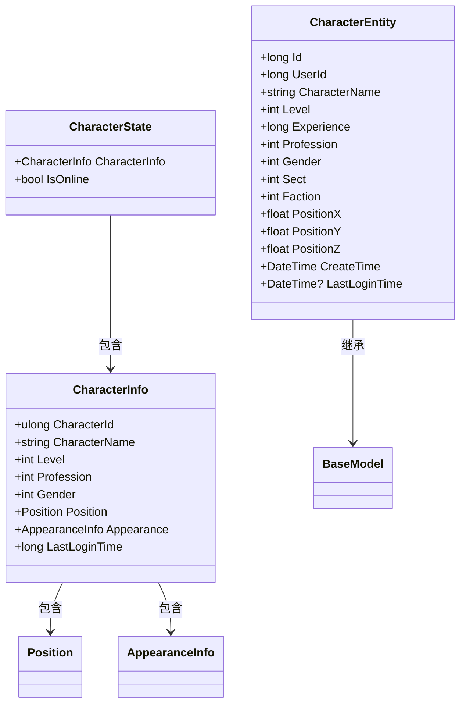
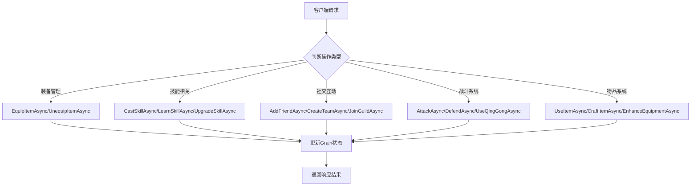
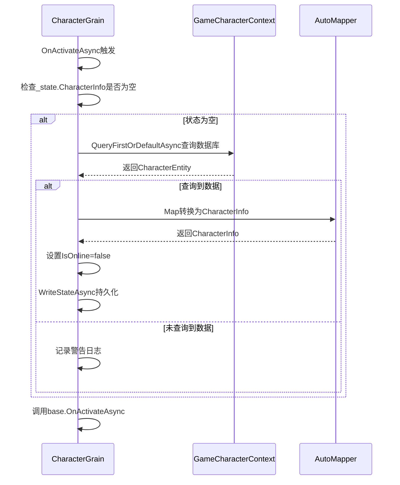
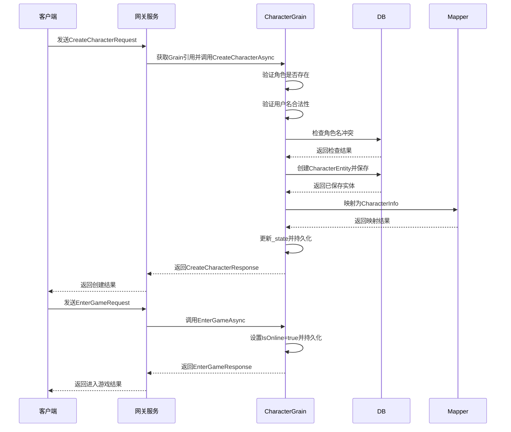

# 角色管理系统

<cite>
**本文档引用文件**  
- [CharacterGrain.cs](file://Horizon.Orleans.Grains/CharacterGrain.cs)
- [ICharacterGrain.cs](file://Horizon.Orleans.Interface/ICharacterGrain.cs)
- [CharacterState.cs](file://Horizon.Orleans.Grains/CharacterGrain.cs#L26-L35)
- [CharacterEntity.cs](file://Horizon.Model/GameModel/CharacterEntity.cs)
- [CharacterInfo.cs](file://Horizon.Game.Message/Network/AccountMessages.cs#L240-L302)
</cite>

## 目录
1. [简介](#简介)
2. [核心组件](#核心组件)
3. [角色状态持久化](#角色状态持久化)
4. [关键操作实现机制](#关键操作实现机制)
5. [属性同步与功能接口](#属性同步与功能接口)
6. [激活时状态恢复逻辑](#激活时状态恢复逻辑)
7. [角色ID与Grain Key映射关系](#角色id与grain-key映射关系)
8. [典型使用场景示例](#典型使用场景示例)
9. [高并发下状态一致性保障](#高并发下状态一致性保障)

## 简介
本系统基于Orleans框架构建，采用Grain模型管理游戏中的角色数据和行为。通过无共享架构确保每个角色的独立性和线程安全性，支持大规模并发访问。系统实现了角色创建、登录、移动、离线等核心功能，并提供装备、技能、任务等多种扩展接口。

## 核心组件

**Section sources**
- [CharacterGrain.cs](file://Horizon.Orleans.Grains/CharacterGrain.cs#L40-L657)
- [ICharacterGrain.cs](file://Horizon.Orleans.Interface/ICharacterGrain.cs#L13-L334)

## 角色状态持久化

**Diagram sources**
- [CharacterState.cs](file://Horizon.Orleans.Grains/CharacterGrain.cs#L26-L35)
- [CharacterInfo.cs](file://Horizon.Game.Message/Network/AccountMessages.cs#L240-L302)
- [CharacterEntity.cs](file://Horizon.Model/GameModel/CharacterEntity.cs)

**Section sources**
- [CharacterState.cs](file://Horizon.Orleans.Grains/CharacterGrain.cs#L26-L35)

## 关键操作实现机制

### 角色创建（CreateCharacterAsync）
该方法在Grain中创建新角色，首先检查是否已存在角色数据，验证用户状态和角色名唯一性后，将请求映射为实体并存入数据库，同时更新Grain状态。

### 进入游戏（EnterGameAsync）
设置角色在线状态为true并持久化，返回包含角色信息的响应对象，完成登录流程。

### 移动（MoveAsync）
更新角色位置信息，仅当角色在线时才允许移动操作，避免无效状态变更。

### 离线（GoOfflineAsync）
将角色状态设为离线并持久化，随后调用DeactivateOnIdle释放资源，提高系统效率。

**Section sources**
- [CharacterGrain.cs](file://Horizon.Orleans.Grains/CharacterGrain.cs#L96-L216)

## 属性同步与功能接口

**Diagram sources**
- [ICharacterGrain.cs](file://Horizon.Orleans.Interface/ICharacterGrain.cs)

**Section sources**
- [ICharacterGrain.cs](file://Horizon.Orleans.Interface/ICharacterGrain.cs)

## 激活时状态恢复逻辑

**Diagram sources**
- [CharacterGrain.cs](file://Horizon.Orleans.Grains/CharacterGrain.cs#L72-L95)

**Section sources**
- [CharacterGrain.cs](file://Horizon.Orleans.Grains/CharacterGrain.cs#L72-L95)

## 角色ID与Grain Key映射关系
角色ID作为Grain的整数键（IGrainWithIntegerKey），由客户端传递并在Grain激活时用于加载对应状态。CharacterId字段在Grain内部维护，与Grain的标识保持一致，确保每次调用都能定位到正确的实例。

**Section sources**
- [CharacterGrain.cs](file://Horizon.Orleans.Grains/CharacterGrain.cs#L49-L49)
- [ICharacterGrain.cs](file://Horizon.Orleans.Interface/ICharacterGrain.cs)

## 典型使用场景示例

**Diagram sources**
- [CharacterGrain.cs](file://Horizon.Orleans.Grains/CharacterGrain.cs#L96-L170)

**Section sources**
- [CharacterGrain.cs](file://Horizon.Orleans.Grains/CharacterGrain.cs#L96-L170)

## 高并发下状态一致性保障
系统利用Orleans的单线程执行模型保证每个Grain在同一时间只处理一个消息，天然避免了竞态条件。所有状态变更都通过WriteStateAsync进行持久化，结合ADO.NET存储提供ACID事务支持。对于高频操作如移动，采用批量更新或延迟写入策略减少数据库压力，在保证最终一致性的同时提升性能。

**Section sources**
- [CharacterGrain.cs](file://Horizon.Orleans.Grains/CharacterGrain.cs)
- [IDataContext.cs](file://Horizon.Core.Abstract/IDataContext.cs)