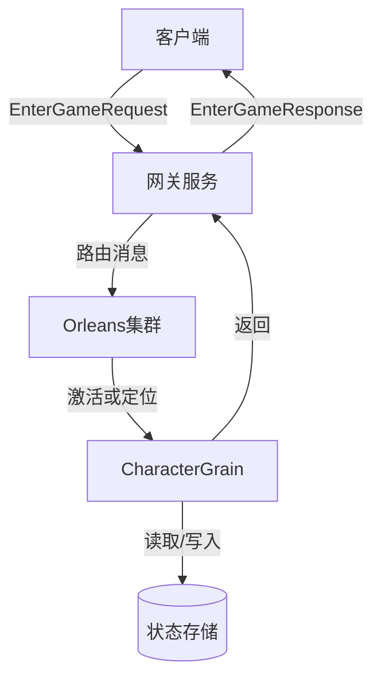
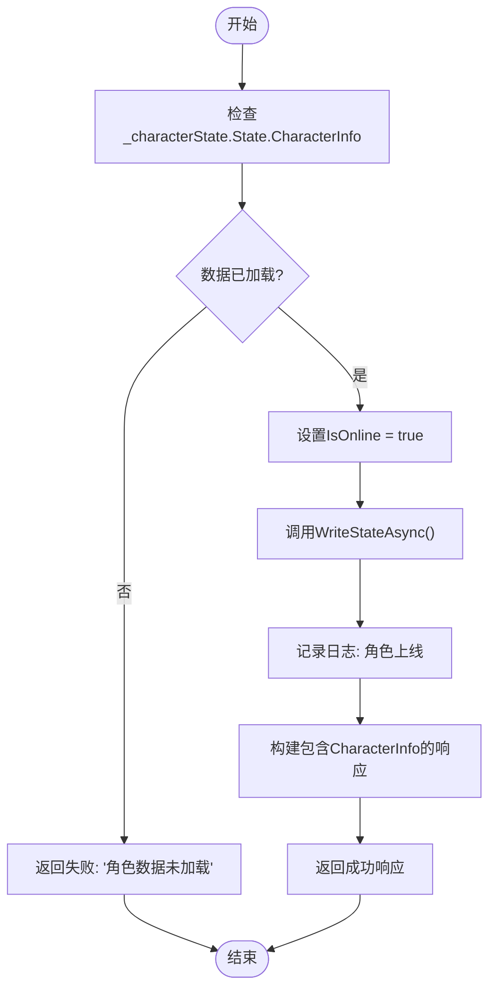
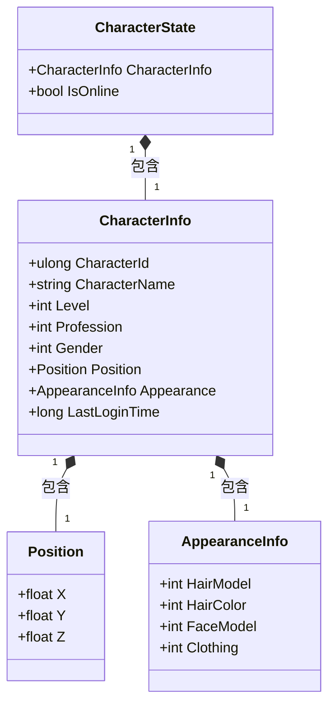
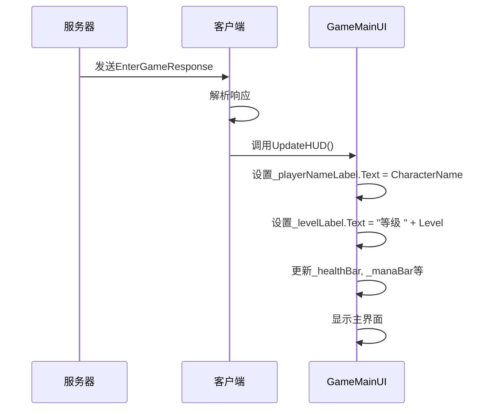
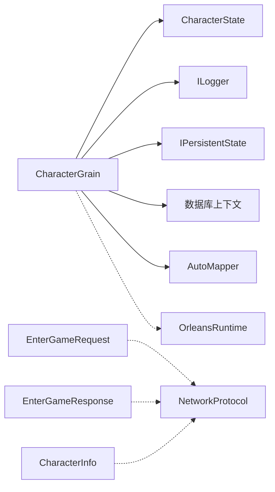

# 进入游戏

<cite>
**Referenced Files in This Document **   
- [CharacterGrain.cs](file://Horizon.Orleans.Grains/CharacterGrain.cs)
- [AccountMessages.cs](file://Horizon.Game.Message/Network/AccountMessages.cs)
- [GameMainUI.cs](file://HundunWorld/Source/Game/UI/GameMain/GameMainUI.cs)
</cite>

## 目录
1. [简介](#简介)
2. [核心组件分析](#核心组件分析)
3. [架构概览](#架构概览)
4. [详细组件分析](#详细组件分析)
5. [依赖关系分析](#依赖关系分析)
6. [性能考量](#性能考量)
7. [故障排除指南](#故障排除指南)
8. [结论](#结论)

## 简介
本文档详细阐述了游戏系统中“进入游戏”功能的实现机制。该功能是玩家从登录流程过渡到游戏世界的关键环节，主要负责验证角色数据加载状态、更新角色在线标识、持久化状态变更，并向客户端返回初始化所需的角色信息。文档深入解析了`EnterGameAsync`方法的执行逻辑，说明了`CharacterState`中`IsOnline`字段的作用与`WriteStateAsync`调用的意义，描述了成功响应中`CharacterInfo`结构体的应用场景，并探讨了此操作在整体登录流程中的位置及其后续可能触发的数据加载动作。

## 核心组件分析
本节分析实现“进入游戏”功能的核心代码组件，包括处理请求的粒度（Grain）、承载角色状态的数据模型以及用于网络通信的消息定义。

**Section sources**
- [CharacterGrain.cs](file://Horizon.Orleans.Grains/CharacterGrain.cs#L151-L170)
- [AccountMessages.cs](file://Horizon.Game.Message/Network/AccountMessages.cs#L240-L302)
- [AccountMessages.cs](file://Horizon.Game.Message/Network/AccountMessages.cs#L477-L497)
- [AccountMessages.cs](file://Horizon.Game.Message/Network/AccountMessages.cs#L502-L529)

## 架构概览
“进入游戏”功能是基于Orleans框架的Actor模型（在Orleans中称为Grain）实现的。客户端通过网关服务发送`EnterGameRequest`消息，该消息被路由到特定的`CharacterGrain`实例进行处理。`CharacterGrain`作为角色的唯一逻辑实体，持有并管理其状态`CharacterState`。整个流程体现了无共享、高并发的分布式系统设计思想。

**Diagram sources **
- [CharacterGrain.cs](file://Horizon.Orleans.Grains/CharacterGrain.cs)
- [AccountMessages.cs](file://Horizon.Game.Message/Network/AccountMessages.cs)

## 详细组件分析
本节对“进入游戏”功能涉及的关键组件进行深度剖析。

### EnterGameAsync 方法分析
`EnterGameAsync`方法是处理“进入游戏”请求的核心入口点。它首先校验角色数据是否已成功加载。

#### 校验与状态更新流程

**Diagram sources **
- [CharacterGrain.cs](file://Horizon.Orleans.Grains/CharacterGrain.cs#L151-L170)

**Section sources**
- [CharacterGrain.cs](file://Horizon.Orleans.Grains/CharacterGrain.cs#L151-L170)

### CharacterState 与状态持久化
`CharacterState`类定义了角色在Orleans Grains中的持久化状态。

#### 状态模型与持久化

**Diagram sources **
- [CharacterGrain.cs](file://Horizon.Orleans.Grains/CharacterGrain.cs#L26-L35)
- [AccountMessages.cs](file://Horizon.Game.Message/Network/AccountMessages.cs#L240-L302)

**Section sources**
- [CharacterGrain.cs](file://Horizon.Orleans.Grains/CharacterGrain.cs#L26-L35)
- [AccountMessages.cs](file://Horizon.Game.Message/Network/AccountMessages.cs#L240-L302)

### 客户端界面集成
`EnterGameResponse`中的`CharacterInfo`被客户端用于初始化主游戏界面。

#### 客户端UI初始化流程

**Diagram sources **
- [AccountMessages.cs](file://Horizon.Game.Message/Network/AccountMessages.cs#L502-L529)
- [GameMainUI.cs](file://HundunWorld/Source/Game/UI/GameMain/GameMainUI.cs#L558-L558)

**Section sources**
- [AccountMessages.cs](file://Horizon.Game.Message/Network/AccountMessages.cs#L502-L529)
- [GameMainUI.cs](file://HundunWorld/Source/Game/UI/GameMain/GameMainUI.cs)

## 依赖关系分析
“进入游戏”功能依赖于多个核心模块和外部服务。

**Diagram sources **
- [CharacterGrain.cs](file://Horizon.Orleans.Grains/CharacterGrain.cs)
- [AccountMessages.cs](file://Horizon.Game.Message/Network/AccountMessages.cs)

## 性能考量
- `EnterGameAsync`操作是一次轻量级的状态更新，通常非常快速。
- `WriteStateAsync`会将状态写入后端存储（如Redis或数据库），其性能取决于所配置的存储提供程序。
- 在高并发场景下，Orleans的Grain激活和去激活机制能有效管理内存资源。

## 故障排除指南
当“进入游戏”功能出现问题时，可按以下路径进行诊断：

1.  **检查日志**: 首先查看`CharacterGrain`的日志输出。如果出现`"Character data not loaded."`，则表明角色数据未能正确加载。
2.  **验证数据库**: 检查`GameEntityContext`数据库中是否存在对应的角色记录。
3.  **检查Grain激活**: 确认`OnActivateAsync`方法是否正常执行，特别是从数据库加载数据的逻辑。
4.  **网络消息格式**: 使用工具抓包，确认`EnterGameRequest`和`EnterGameResponse`的消息格式是否符合`AccountMessages.cs`中的定义。
5.  **客户端解析**: 如果客户端收不到预期信息，检查`GameMainUI`中解析`EnterGameResponse`的逻辑。

## 结论
“进入游戏”功能通过`CharacterGrain.EnterGameAsync`方法实现了安全、可靠的角色上线流程。它利用Orleans的持久化状态机制来维护角色的在线状态，并通过精心设计的`CharacterInfo`消息结构为客户端提供了丰富的初始化数据。该功能是连接认证系统与游戏世界的核心枢纽，其稳定性和效率对用户体验至关重要。