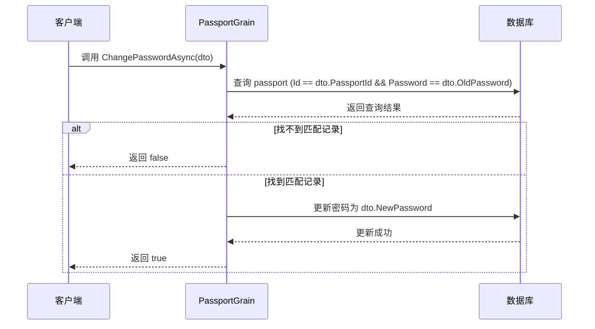
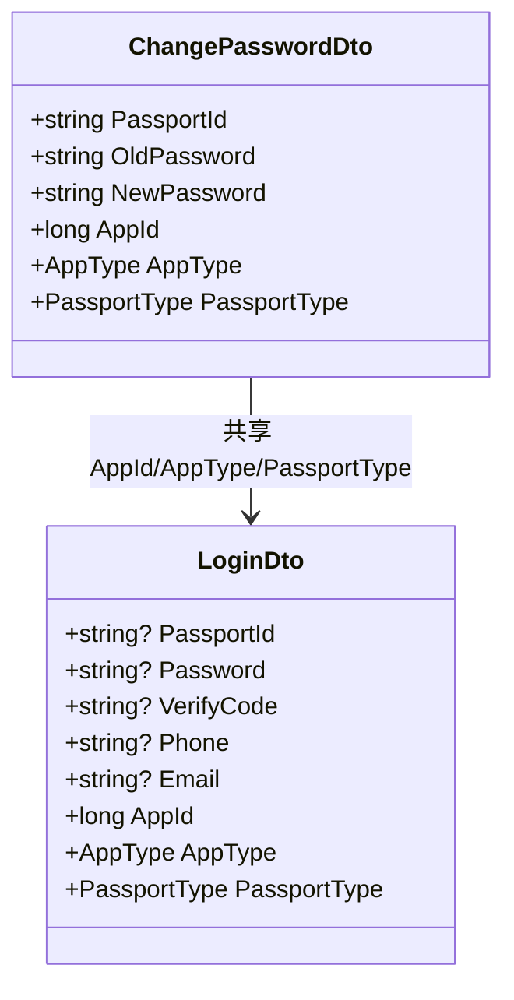
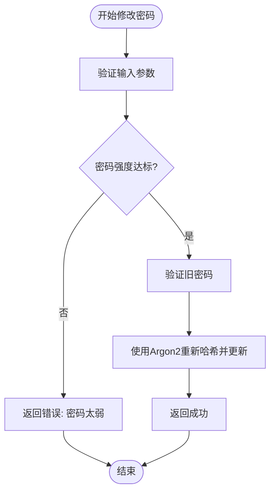

# 密码管理

<cite>
**本文档中引用的文件**  
- [PassportGrain.cs](file://Horizon.Orleans.Grains/PassportGrain.cs)
- [ChangePasswordDto.cs](file://Horizon.Share/Dtos/User/ChangePasswordDto.cs)
- [LoginDto.cs](file://Horizon.Share/Dtos/User/LoginDto.cs)
- [Passport.cs](file://Horizon.Model/Basic/Passport.cs)
- [PassportHelper.cs](file://Horizon.Core/PassportHelper.cs)
- [LongAes.cs](file://Horizon.Core/LongAes.cs)
</cite>

## 目录
1. [简介](#简介)
2. [核心组件分析](#核心组件分析)
3. [密码修改流程详解](#密码修改流程详解)
4. [数据结构设计与复用关系](#数据结构设计与复用关系)
5. [当前密码存储方案的安全缺陷](#当前密码存储方案的安全缺陷)
6. [安全改进方案](#安全改进方案)
7. [敏感操作保护建议](#敏感操作保护建议)
8. [结论](#结论)

## 简介
本文档深入剖析身份认证服务中的密码管理功能，重点分析`PassportGrain.ChangePasswordAsync`方法的实现机制。揭示当前系统在密码验证、更新和存储方面存在的严重安全隐患，并提出紧急改进措施以提升整体安全性。

## 核心组件分析

### PassportGrain.ChangePasswordAsync 方法实现
该方法负责处理用户密码变更请求，其核心逻辑包括旧密码比对与新密码赋值更新两个关键步骤。



**图示来源**
- [PassportGrain.cs](file://Horizon.Orleans.Grains/PassportGrain.cs#L144-L154)

**本节来源**
- [PassportGrain.cs](file://Horizon.Orleans.Grains/PassportGrain.cs#L144-L154)

## 密码修改流程详解

### 旧密码比对机制
系统通过直接字符串比较的方式验证旧密码是否正确：
```csharp
var passport = await _dataContext.QueryFirstOrDefaultAsync(m => m.Id == loginDto.PassportId && m.Password == loginDto.OldPassword, true);
```
此方式存在重大安全隐患：若攻击者获取数据库访问权限，即可直接读取明文或弱加密密码进行比对尝试。

### 新密码更新过程
一旦旧密码验证通过，系统将新密码直接赋值并持久化：
```csharp
passport.Password = loginDto.NewPassword;
await _dataContext.UpdateAsync(passport, passport.Id);
```
整个过程中未引入盐值、迭代次数等增强安全性的参数。

**本节来源**
- [PassportGrain.cs](file://Horizon.Orleans.Grains/PassportGrain.cs#L144-L154)

## 数据结构设计与复用关系

### ChangePasswordDto 结构分析
`ChangePasswordDto`用于封装密码修改请求所需的数据字段。

| 属性名 | 类型 | 描述 |
|--------|------|------|
| PassportId | string | 用户通行证ID |
| OldPassword | string | 原始密码 |
| NewPassword | string | 新密码 |
| AppId | long | 应用ID |
| AppType | AppType | 应用类型 |
| PassportType | PassportType | 通行证类型 |

### 与 LoginDto 的复用关系
`ChangePasswordDto`与`LoginDto`共享部分字段定义（如AppId、AppType、PassportType），体现了设计上的模块化思想，但同时也暴露了潜在的风险——登录接口也可能面临类似的密码安全问题。



**图示来源**
- [ChangePasswordDto.cs](file://Horizon.Share/Dtos/User/ChangePasswordDto.cs#L12-L31)
- [LoginDto.cs](file://Horizon.Share/Dtos/User/LoginDto.cs#L12-L50)

**本节来源**
- [ChangePasswordDto.cs](file://Horizon.Share/Dtos/User/ChangePasswordDto.cs#L12-L31)
- [LoginDto.cs](file://Horizon.Share/Dtos/User/LoginDto.cs#L12-L50)

## 当前密码存储方案的安全缺陷

### 明文或弱哈希存储风险
尽管密码在传输和初步处理时经过AES加密（见`PassportHelper.SetPasportPassword`），但最终存储形式仍基于可预测的密钥生成机制（使用通行证ID动态生成AES密钥）。更严重的是，数据库中`Passport`实体的`Password`字段为纯字符串类型，极易被批量导出和离线破解。

```csharp
public class Passport : BaseNoneModel<string>
{
    [Comment("登录密码")]
    public string Password { get; set; }
}
```

### 加密算法脆弱性分析
当前使用的AES加密依赖固定密钥`Long_Aes.AesKey`和基于通行证ID生成的二次密钥，缺乏随机盐值和高强度派生函数支持，无法抵御彩虹表攻击和暴力破解。

**本节来源**
- [Passport.cs](file://Horizon.Model/Basic/Passport.cs#L28-L29)
- [PassportHelper.cs](file://Horizon.Core/PassportHelper.cs#L96-L105)
- [LongAes.cs](file://Horizon.Core/LongAes.cs#L248-L271)

## 安全改进方案

### 引入强哈希算法
立即替换现有密码存储机制，采用以下任一现代密码哈希算法：
- **PBKDF2**：NIST推荐标准，支持高迭代次数
- **bcrypt**：内置盐值，抗GPU加速破解
- **Argon2**：密码哈希竞赛冠军，内存硬化设计

### 实施传输层加密
确保所有包含密码的通信均通过TLS 1.3以上版本加密传输，防止中间人窃听。

### 增加密码强度策略校验
在`ChangePasswordAsync`中加入密码复杂度检查：
- 最小长度 ≥ 8位
- 包含大小写字母、数字、特殊字符
- 禁止使用常见弱密码（如123456、password）



**图示来源**
- [PassportGrain.cs](file://Horizon.Orleans.Grains/PassportGrain.cs#L144-L154)

**本节来源**
- [PassportGrain.cs](file://Horizon.Orleans.Grains/PassportGrain.cs#L144-L154)

## 敏感操作保护建议

### 添加验证码机制
在密码修改前要求用户提供短信或邮箱验证码，增加攻击成本。

### 启用双因素认证（MFA）
对高权限账户强制启用TOTP或硬件令牌认证，即使密码泄露也能有效阻止未授权访问。

### 操作日志审计
记录所有密码修改请求的IP地址、时间戳和设备信息，便于事后追溯异常行为。

## 结论
当前系统的密码管理机制存在严重安全漏洞，主要体现在明文/弱哈希存储、缺乏传输加密和无强度校验等方面。必须立即采取行动，引入行业标准的密码哈希算法（如Argon2）、实施全链路TLS加密，并加强身份验证流程。同时建议尽快部署双因素认证体系，全面提升用户账户安全性。