# 注册功能

<cite>
**Referenced Files in This Document**   
- [PassportGrain.cs](file://Horizon.Orleans.Grains/PassportGrain.cs)
- [RegisterDto.cs](file://Horizon.Share/Dtos/User/RegisterDto.cs)
- [CacheConst.cs](file://Horizon.Core/CacheConst.cs)
- [PassportHelper.cs](file://Horizon.Core/PassportHelper.cs)
- [PlayerIdGenerator.cs](file://Horizon.Core/Helper/PlayerIdGenerator.cs)
- [PlayerIdManager.cs](file://Horizon.Core/Helper/PlayerIdManager.cs)
- [UserEntity.cs](file://Horizon.Model/GameModel/UserEntity.cs)
- [PassportIds.cs](file://Horizon.Model/Basic/PassportIds.cs)
- [PassportFlag.cs](file://Horizon.Model/Basic/PassportFlag.cs)
- [RegisterResponseHandler.cs](file://HundunWorld - Backup/Source/Game/Network/MessageHandlers/RegisterResponseHandler.cs) - *Updated in commit '注册'*
- [AuthenticationUI.cs](file://HundunWorld - Backup/Source/Game/UI/Authentication/AuthenticationUI.cs) - *Updated in commit '注册'*
- [AuthenticationManager.cs](file://HundunWorld - Backup/Source/Game/UI/Authentication/AuthenticationManager.cs) - *Updated in commit '注册'*
</cite>

## 更新摘要
**变更内容**   
- 新增了客户端注册响应处理流程，包括成功和失败的事件处理
- 更新了注册功能的UI交互流程，增加了场景切换和状态管理
- 增强了认证管理器的功能，实现了事件总线集成
- 保持了服务端注册核心逻辑的稳定性

## 目录
1. [简介](#简介)
2. [注册流程概览](#注册流程概览)
3. [核心组件分析](#核心组件分析)
4. [数据模型与上下文](#数据模型与上下文)
5. [唯一标识生成机制](#唯一标识生成机制)
6. [密码处理流程](#密码处理流程)
7. [注册冲突与合并逻辑](#注册冲突与合并逻辑)
8. [异常处理与性能优化](#异常处理与性能优化)
9. [客户端注册响应处理](#客户端注册响应处理)
10. [UI交互与状态管理](#ui交互与状态管理)

## 简介
本文档详细解析了身份认证服务中的注册功能，重点分析了`PassportGrain.RegisterAsync`方法的完整工作机制。文档涵盖了邮箱/手机号校验、分布式锁防止并发冲突、通行证ID生成策略、密码解密与加密存储流程、游戏用户初始化以及用户唯一标识生成等核心环节。通过深入分析代码实现，为开发者提供全面的技术参考和最佳实践指导。

## 注册流程概览
用户注册流程是一个多步骤、多组件协同工作的复杂过程，涉及身份验证、数据持久化和游戏系统集成。整个流程通过Orleans框架的Grain模型实现，确保了高并发下的数据一致性和系统可靠性。

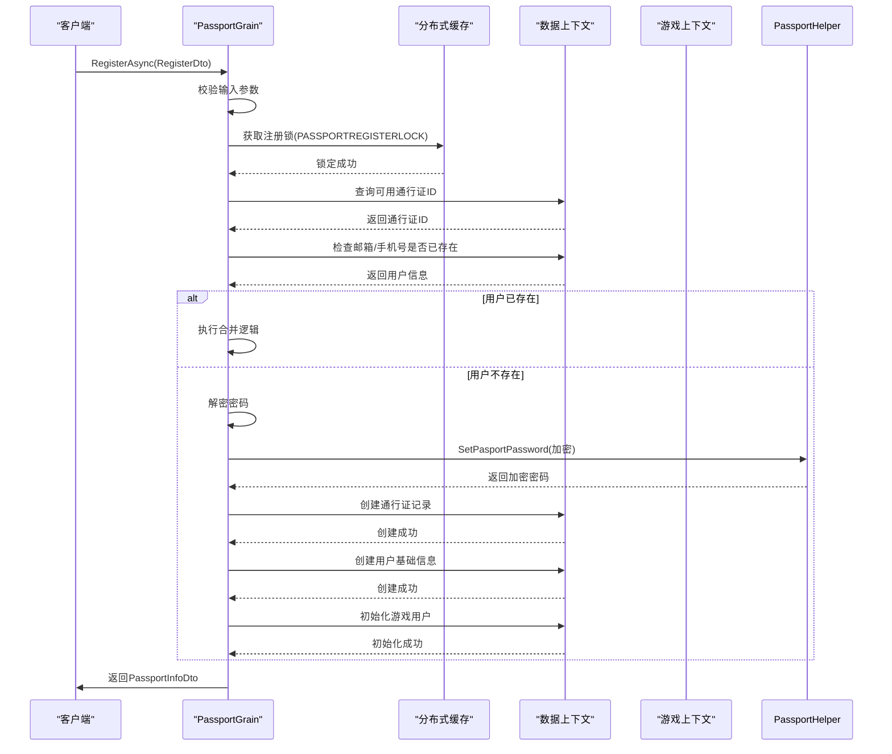

**Diagram sources**
- [PassportGrain.cs](file://Horizon.Orleans.Grains/PassportGrain.cs#L165-L260)
- [CacheConst.cs](file://Horizon.Core/CacheConst.cs#L45-L48)

**Section sources**
- [PassportGrain.cs](file://Horizon.Orleans.Grains/PassportGrain.cs#L165-L260)

## 核心组件分析

### PassportGrain.RegisterAsync 方法
`PassportGrain.RegisterAsync`是注册功能的核心方法，负责协调整个注册流程。该方法首先进行基本参数校验，然后通过分布式锁确保注册操作的原子性，避免并发冲突。

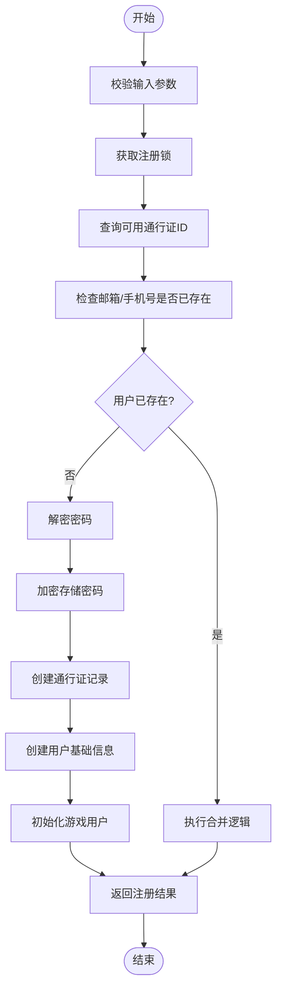

**Diagram sources**
- [PassportGrain.cs](file://Horizon.Orleans.Grains/PassportGrain.cs#L165-L260)

**Section sources**
- [PassportGrain.cs](file://Horizon.Orleans.Grains/PassportGrain.cs#L165-L260)

### RegisterDto 数据传输对象
`RegisterDto`是注册功能的输入数据模型，定义了注册所需的所有信息。该对象通过Orleans的序列化机制在不同服务间传输，确保了数据的一致性和完整性。

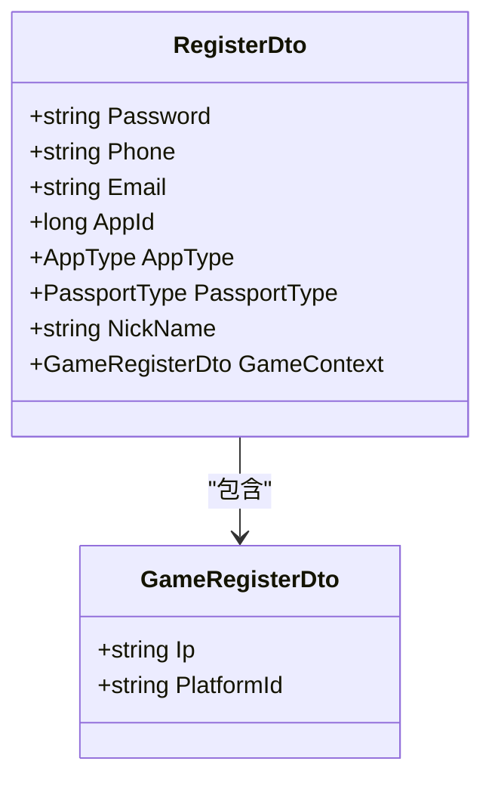

**Diagram sources**
- [RegisterDto.cs](file://Horizon.Share/Dtos/User/RegisterDto.cs#L12-L48)

**Section sources**
- [RegisterDto.cs](file://Horizon.Share/Dtos/User/RegisterDto.cs#L12-L48)

## 数据模型与上下文

### 通行证ID生成与管理
系统通过`PassportIds`实体管理可用的通行证ID池。当系统中没有可用ID时，会调用`CreatePassportIdAsync`方法批量生成新的ID，确保注册流程的连续性。

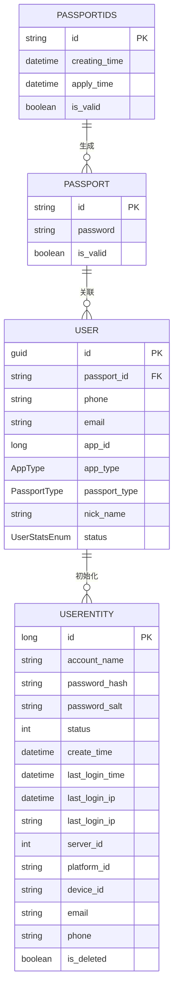

**Diagram sources**
- [PassportIds.cs](file://Horizon.Model/Basic/PassportIds.cs#L15-L30)
- [UserEntity.cs](file://Horizon.Model/GameModel/UserEntity.cs#L11-L145)

**Section sources**
- [PassportIds.cs](file://Horizon.Model/Basic/PassportIds.cs#L15-L30)
- [UserEntity.cs](file://Horizon.Model/GameModel/UserEntity.cs#L11-L145)

### 数据上下文依赖
`PassportGrain`依赖多个数据上下文来完成注册操作，这些上下文通过依赖注入在构造函数中初始化，确保了组件间的松耦合。

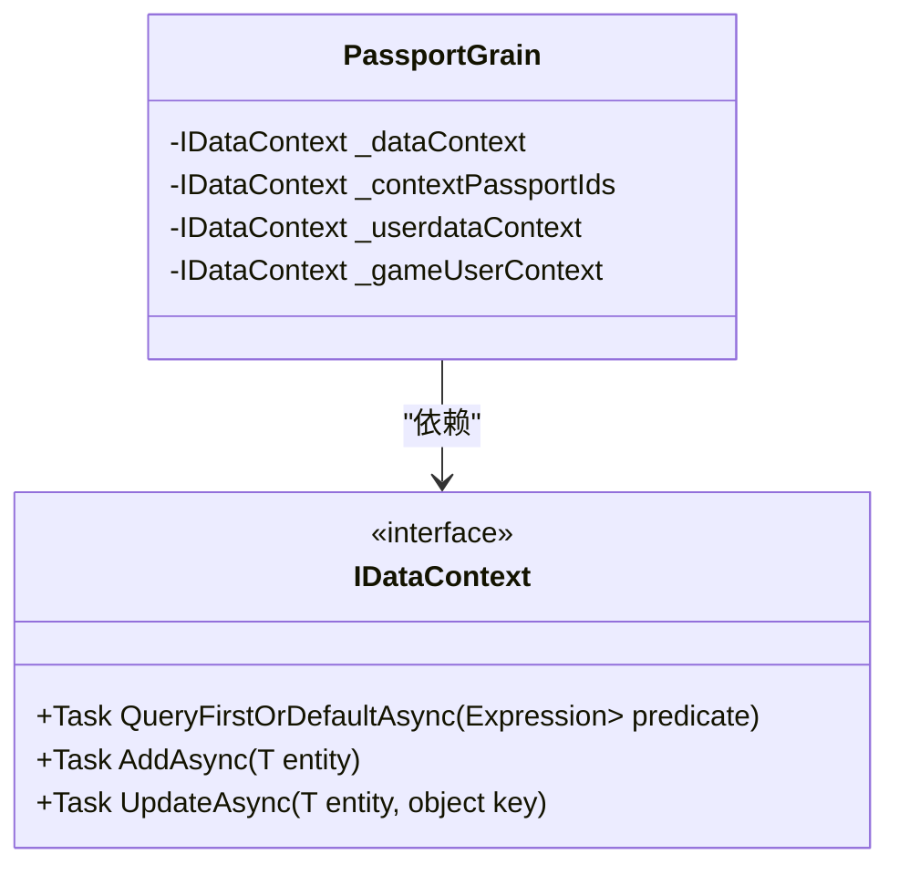

**Diagram sources**
- [PassportGrain.cs](file://Horizon.Orleans.Grains/PassportGrain.cs#L27-L31)
- [PassportGrain.cs](file://Horizon.Orleans.Grains/PassportGrain.cs#L34-L57)

**Section sources**
- [PassportGrain.cs](file://Horizon.Orleans.Grains/PassportGrain.cs#L27-L57)

## 唯一标识生成机制

### Snowflake算法实现
`PlayerIdGenerator`类实现了基于Snowflake算法的分布式唯一ID生成器，通过时间戳、机器ID、数据中心ID和序列号的位运算组合，确保在分布式环境下生成的ID全局唯一。

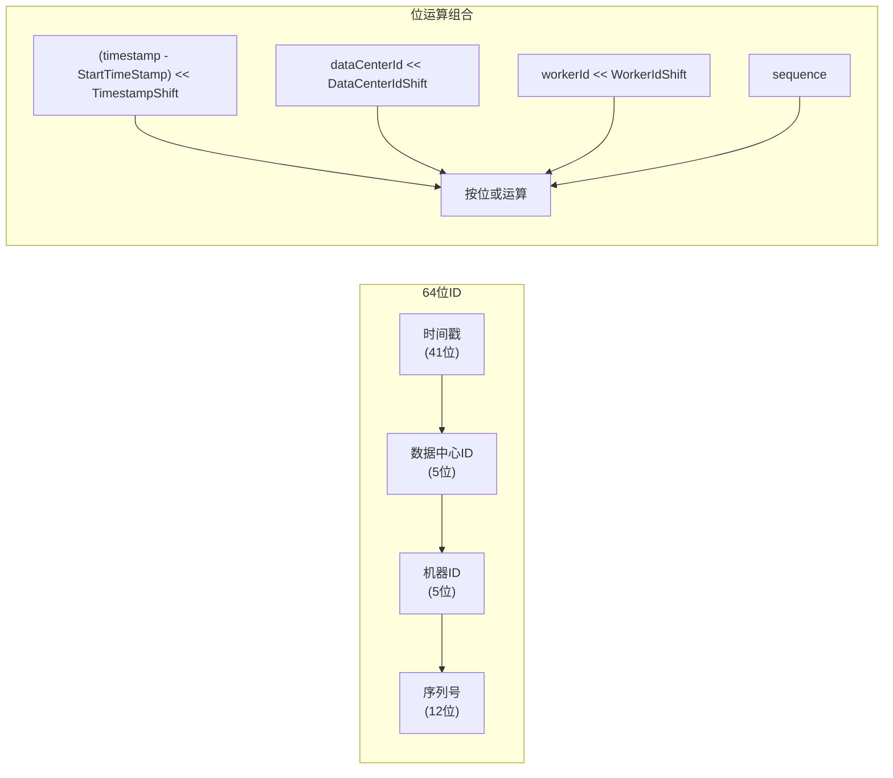

**Diagram sources**
- [PlayerIdGenerator.cs](file://Horizon.Core/Helper/PlayerIdGenerator.cs#L9-L264)

**Section sources**
- [PlayerIdGenerator.cs](file://Horizon.Core/Helper/PlayerIdGenerator.cs#L9-L264)

### ID生成器管理
`PlayerIdManager`作为单例模式的管理类，封装了`PlayerIdGenerator`的实例化和管理，自动从网络配置中获取机器ID和数据中心ID，简化了ID生成器的使用。

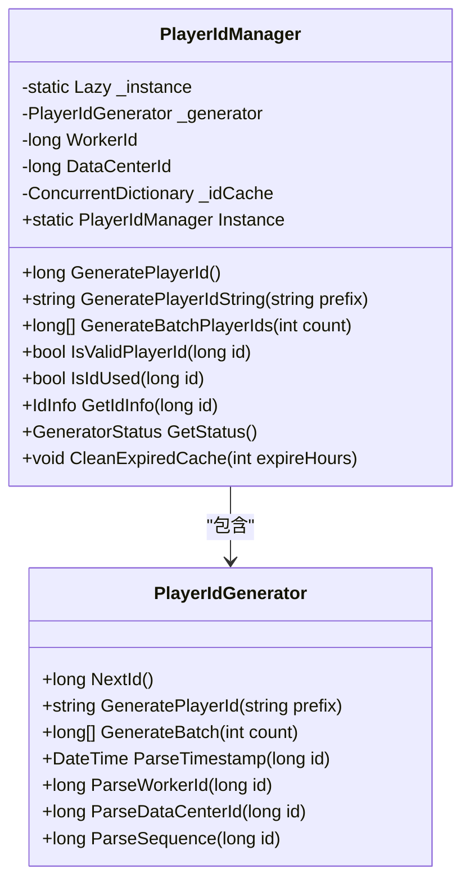

**Diagram sources**
- [PlayerIdManager.cs](file://Horizon.Core/Helper/PlayerIdManager.cs#L10-L365)

**Section sources**
- [PlayerIdManager.cs](file://Horizon.Core/Helper/PlayerIdManager.cs#L10-L365)

## 密码处理流程
注册过程中的密码处理分为两个阶段：首先对客户端传来的Base64编码密码进行解密，然后使用特定算法进行加密存储，确保用户密码的安全性。

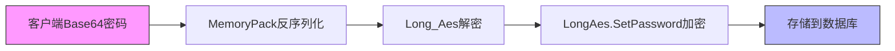

**Diagram sources**
- [PassportGrain.cs](file://Horizon.Orleans.Grains/PassportGrain.cs#L190-L194)
- [PassportHelper.cs](file://Horizon.Core/PassportHelper.cs#L96-L105)

**Section sources**
- [PassportHelper.cs](file://Horizon.Core/PassportHelper.cs#L96-L105)

## 注册冲突与合并逻辑
当用户尝试使用已存在的邮箱或手机号注册时，系统会执行合并逻辑，而不是简单地返回错误。这种设计允许用户在不同应用或场景下使用相同的联系方式进行注册。

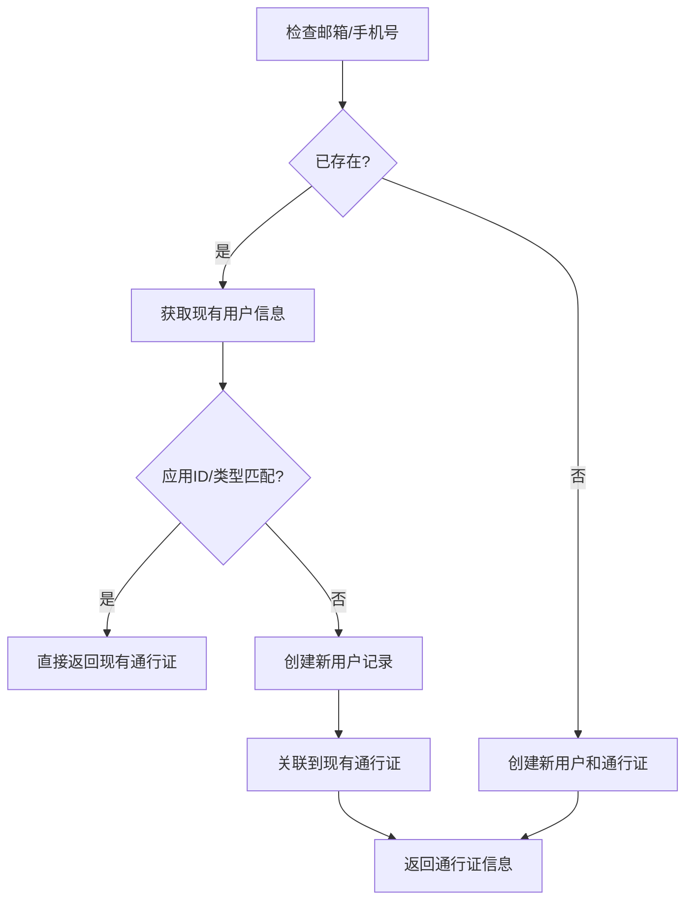

**Diagram sources**
- [PassportGrain.cs](file://Horizon.Orleans.Grains/PassportGrain.cs#L178-L188)

**Section sources**
- [PassportGrain.cs](file://Horizon.Orleans.Grains/PassportGrain.cs#L178-L188)

## 异常处理与性能优化

### 异常处理建议
注册功能中涉及多个可能的异常点，需要进行适当的异常处理和日志记录：

1. **参数校验异常**：当`RegisterDto`为空或邮箱/手机号均为空时，抛出`ArgumentNullException`
2. **分布式锁异常**：获取锁失败时，应有重试机制或返回友好的错误信息
3. **数据库操作异常**：所有数据持久化操作都应包含适当的异常处理
4. **时钟回退异常**：`PlayerIdGenerator`在检测到系统时钟回退时会抛出`InvalidOperationException`

### 性能优化方向
1. **缓存优化**：增加对常用查询结果的缓存，减少数据库访问
2. **批量操作**：对于`CreatePassportIdAsync`等批量操作，考虑使用数据库批量插入
3. **异步处理**：将非关键路径的操作（如日志记录、通知发送）改为异步处理
4. **连接池优化**：确保数据库连接池配置合理，避免连接耗尽
5. **监控与告警**：添加关键路径的性能监控和告警机制

**Section sources**
- [PassportGrain.cs](file://Horizon.Orleans.Grains/PassportGrain.cs#L165-L260)
- [PlayerIdGenerator.cs](file://Horizon.Core/Helper/PlayerIdGenerator.cs#L9-L264)

## 客户端注册响应处理
根据commit '注册'的修改，客户端新增了注册响应处理机制，通过`RegisterResponseHandler`类处理服务器返回的注册结果。

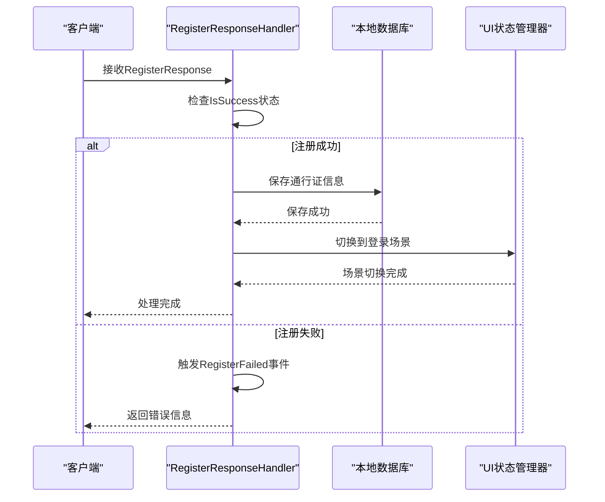

**Diagram sources**
- [RegisterResponseHandler.cs](file://HundunWorld - Backup/Source/Game/Network/MessageHandlers/RegisterResponseHandler.cs#L25-L55)

**Section sources**
- [RegisterResponseHandler.cs](file://HundunWorld - Backup/Source/Game/Network/MessageHandlers/RegisterResponseHandler.cs#L25-L55)

### 注册成功处理流程
当注册成功时，`RegisterResponseHandler`会执行以下操作：
1. 将通行证信息保存到本地数据库
2. 设置当前通行证为有效状态
3. 通过`UIStateManager`切换到登录场景
4. 触发`RegisterSuccess`事件通知其他组件

```csharp
if (registerResponse.IsSuccess)
{
    RegisterSuccess?.Invoke(registerResponse);
    
    await DatabaseManager.SetPassport(new PassportInfo
    {
        PassportId = registerResponse.PassportId,
        UserId = 0,
        IsCurrentPassport = true,
        Password = AuthenticationManager.Instance.Passport.Password,
        Token = "",
        RememberPassword = false
    });
    
    UIStateManager.Instance.TransitionToScene(SceneType.Login);
}
```

**Section sources**
- [RegisterResponseHandler.cs](file://HundunWorld - Backup/Source/Game/Network/MessageHandlers/RegisterResponseHandler.cs#L28-L45)

### 注册失败处理流程
当注册失败时，系统会处理各种可能的错误情况：

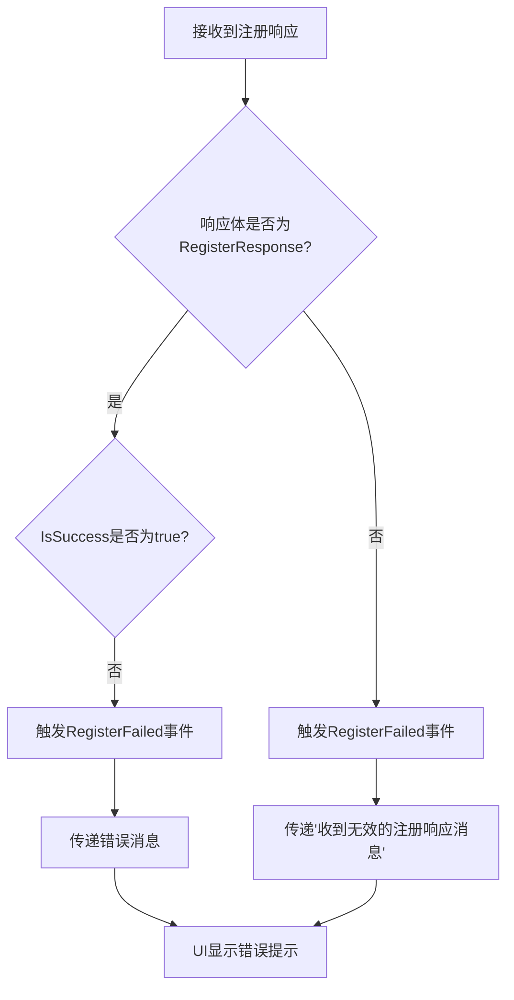

**Diagram sources**
- [RegisterResponseHandler.cs](file://HundunWorld - Backup/Source/Game/Network/MessageHandlers/RegisterResponseHandler.cs#L50-L60)

**Section sources**
- [RegisterResponseHandler.cs](file://HundunWorld - Backup/Source/Game/Network/MessageHandlers/RegisterResponseHandler.cs#L50-L60)

## UI交互与状态管理
注册功能的UI交互通过`AuthenticationUI`和`AuthenticationManager`协同工作，实现了流畅的用户体验。

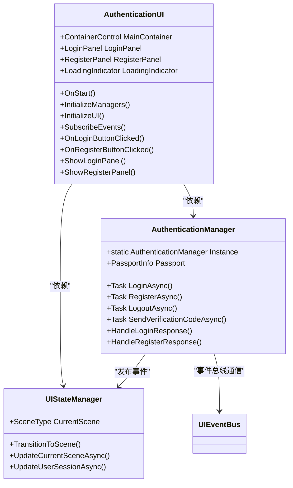

**Diagram sources**
- [AuthenticationUI.cs](file://HundunWorld - Backup/Source/Game/UI/Authentication/AuthenticationUI.cs#L50-L500)
- [AuthenticationManager.cs](file://HundunWorld - Backup/Source/Game/UI/Authentication/AuthenticationManager.cs#L50-L350)

**Section sources**
- [AuthenticationUI.cs](file://HundunWorld - Backup/Source/Game/UI/Authentication/AuthenticationUI.cs#L50-L500)
- [AuthenticationManager.cs](file://HundunWorld - Backup/Source/Game/UI/Authentication/AuthenticationManager.cs#L50-L350)

### 注册按钮点击事件处理
当用户点击注册按钮时，`AuthenticationUI`会触发相应的事件处理流程：

```csharp
private async void OnRegisterButtonClicked(RegisterPanel registerPanel)
{
    if (_isProcessing) return;

    try
    {
        _isProcessing = true;
        var success = await _authManager.RegisterAsync(registerPanel.UsernameInput.Text,
            registerPanel.PasswordInput.Text, registerPanel.EmailInput.Text,
            registerPanel.PhoneInput.Text, registerPanel.VerificationCodeInput.Text);

        if (success.IsSuccess)
        {
            if(AuthenticationManager.Instance.Passport==null)
             AuthenticationManager.Instance.Passport= new ();
            AuthenticationManager.Instance.Passport.Password = registerPanel.PasswordInput.Text;
            UIHelper.ShowSuccess("注册成功！");
        }
    }
    catch (Exception ex)
    {
        _errorManager.HandleError($"注册过程中发生错误: {ex.Message}", ErrorType.Unknown, ErrorSeverity.Error, "AuthenticationUI");
    }
    finally
    {
        _isProcessing = false;
    }
}
```

**Section sources**
- [AuthenticationUI.cs](file://HundunWorld - Backup/Source/Game/UI/Authentication/AuthenticationUI.cs#L280-L310)

### 认证管理器的注册流程
`AuthenticationManager`负责协调注册流程，与网络层和UI层进行交互：

```csharp
public async Task<AuthenticationResult> RegisterAsync(string username, string password, string email, string phone, string verificationCode)
{
    if (_isAuthenticating) 
        return new AuthenticationResult { IsSuccess = false, ErrorMessage = "正在进行认证操作" };
    
    if (string.IsNullOrEmpty(email) && string.IsNullOrEmpty(phone))
    {
        return new AuthenticationResult { IsSuccess = false, ErrorMessage = "邮箱和手机号至少填写一个" };
    }

    if (string.IsNullOrEmpty(verificationCode))
    {
        return new AuthenticationResult { IsSuccess = false, ErrorMessage = "请输入验证码" };
    }

    _isAuthenticating = true;
    
    try
    {
        var currentState = _stateManager.GetCurrentState();
        await _stateManager.UpdateCurrentSceneAsync(new SceneState
        {
            SceneType = currentState.CurrentScene,
            LoadTime = DateTime.Now,
            IsLoading = true,
            LoadingMessage = "正在注册..."
        });
        
        var success = await HundunWorldGame.Instance.NetworkManager.SendMessageAsync(new RegisterRequest
        {
            NickName = username,
            Password = Base64Encode(password),
            Email = email,
            PhoneNumber = phone,
            VerificationCode = verificationCode
        });

        if (success)
        {
            AuthenticationStateChanged?.Invoke(true);
            return new AuthenticationResult { IsSuccess = true };
        }
        else
        {
            return new AuthenticationResult { IsSuccess = false, ErrorMessage = "注册失败，请稍后重试" };
        }
    }
    catch (Exception ex)
    {
        _errorHandler.HandleError(UIErrorType.Network, $"注册过程中发生错误: {ex.Message}", ex, "register_process");
        return new AuthenticationResult { IsSuccess = false, ErrorMessage = ex.Message };
    }
    finally
    {
        _isAuthenticating = false;
        var currentState = _stateManager.GetCurrentState();
        await _stateManager.UpdateCurrentSceneAsync(new SceneState
        {
            SceneType = currentState.CurrentScene,
            LoadTime = DateTime.Now,
            IsLoading = false
        });
    }
}
```

**Section sources**
- [AuthenticationManager.cs](file://HundunWorld - Backup/Source/Game/UI/Authentication/AuthenticationManager.cs#L150-L230)