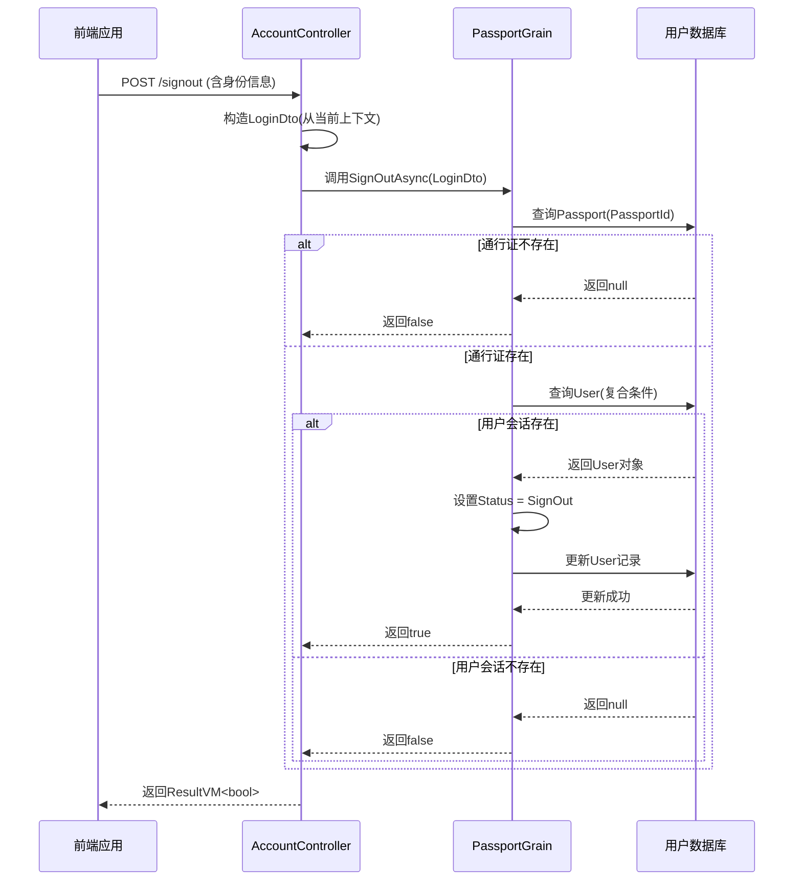
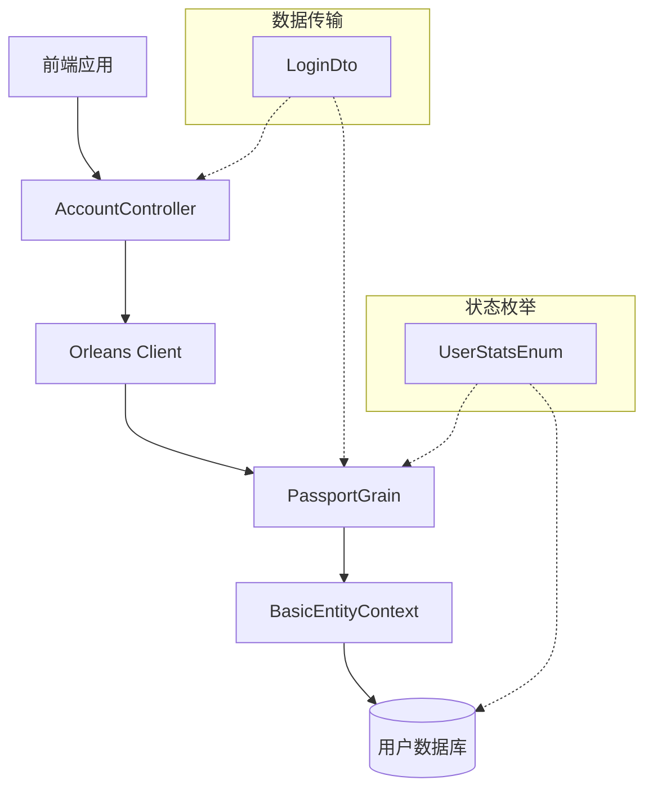

# 登出功能

<cite>
**本文档引用的文件**
- [PassportGrain.cs](file://Horizon.Orleans.Grains/PassportGrain.cs)
- [IPassportGrain.cs](file://Horizon.Orleans.Interface/IPassportGrain.cs)
- [LoginDto.cs](file://Horizon.Share/Dtos/User/LoginDto.cs)
- [User.cs](file://Horizon.Model/Basic/User.cs)
- [IUserModel.cs](file://Horizon.Model/IUserModel.cs)
- [AccountController.cs](file://Horizon.WebApi/Controllers/AccountController.cs)
</cite>

## 目录
1. [简介](#简介)
2. [核心组件分析](#核心组件分析)
3. [登出流程架构图](#登出流程架构图)
4. [详细组件分析](#详细组件分析)
5. [依赖关系分析](#依赖关系分析)
6. [性能与幂等性设计](#性能与幂等性设计)
7. [前端调用与后端清理实践](#前端调用与后端清理实践)
8. [安全风险与改进建议](#安全风险与改进建议)
9. [结论](#结论)

## 简介
本文档详细说明了基于Orleans框架的身份认证服务中登出功能的实现机制。重点分析`PassportGrain.SignOutAsync`方法如何通过`LoginDto`定位用户会话，并将`User`实体状态更新为`SignOut`以完成登出操作。文档涵盖业务意义、调用逻辑、前后端协作及安全改进建议。

## 核心组件分析

`SignOutAsync`方法是登出功能的核心，其逻辑清晰且具备良好的错误处理和幂等性设计。该方法首先验证通行证是否存在，再根据多维度条件（AppId、AppType、PassportType）精确定位用户会话，确保登出操作的准确性。

**Section sources**
- [PassportGrain.cs](file://Horizon.Orleans.Grains/PassportGrain.cs#L126-L142)

## 登出流程架构图

**Diagram sources**
- [PassportGrain.cs](file://Horizon.Orleans.Grains/PassportGrain.cs#L126-L142)
- [AccountController.cs](file://Horizon.WebApi/Controllers/AccountController.cs#L211-L244)
- [LoginDto.cs](file://Horizon.Share/Dtos/User/LoginDto.cs)

## 详细组件分析

### PassportGrain.SignOutAsync 方法分析
此方法实现了安全的登出逻辑。

#### 输入参数
`LoginDto` 包含用于定位用户的必要信息：
- `PassportId`: 通行证唯一标识
- `AppId`, `AppType`, `PassportType`: 应用上下文，确保会话隔离

#### 执行流程
1. **通行证验证**: 首先检查`PassportId`对应的通行证是否存在。
2. **用户会话定位**: 在`User`表中查询满足所有条件（包括有效性`IsValid`）的记录。
3. **状态更新**: 若找到有效会话，则将其`Status`字段更新为`UserStatsEnum.SignOut`并持久化。
4. **结果返回**: 成功更新返回`true`，否则返回`false`。

#### 返回值逻辑
- `true`: 表示成功找到了匹配的用户会话并将其状态更新为登出。
- `false`: 表示未找到匹配的用户会话（可能用户已登出或凭据无效），符合幂等性原则。

**Section sources**
- [PassportGrain.cs](file://Horizon.Orleans.Grains/PassportGrain.cs#L126-L142)
- [IPassportGrain.cs](file://Horizon.Orleans.Interface/IPassportGrain.cs#L33)
- [User.cs](file://Horizon.Model/Basic/User.cs)
- [IUserModel.cs](file://Horizon.Model/IUserModel.cs#L16-L38)

### User 实体状态管理
`User`实体继承自`UserModel<Guid>`，其`Status`属性使用`UserStatsEnum`枚举进行管理。

#### UserStatsEnum 枚举值
- `Normal (0)`: 正常在线
- `Signin (1)`: 已签入（登录）
- `SignOut (2)`: 已签出（登出）
- `Frozen (-1)`: 冻结
- `Abandoned (-4)`: 废弃

将状态设为`SignOut`在业务层面具有重要意义：
- **在线状态同步**: 其他服务可通过查询此状态判断用户是否在线。
- **资源释放**: 可触发相关服务释放为该用户分配的临时资源。
- **审计追踪**: 记录用户登出行为，便于安全审计。

**Section sources**
- [IUserModel.cs](file://Horizon.Model/IUserModel.cs#L16-L38)
- [User.cs](file://Horizon.Model/Basic/User.cs)

## 依赖关系分析

登出功能涉及多个层级和组件的协同工作。

**Diagram sources**
- [AccountController.cs](file://Horizon.WebApi/Controllers/AccountController.cs)
- [PassportGrain.cs](file://Horizon.Orleans.Grains/PassportGrain.cs)
- [LoginDto.cs](file://Horizon.Share/Dtos/User/LoginDto.cs)
- [IUserModel.cs](file://Horizon.Model/IUserModel.cs)

## 性能与幂等性设计

### 幂等性
`SignOutAsync`方法是幂等的。无论用户当前状态如何（已登出或已在线），重复调用该方法都不会产生副作用。如果用户会话不存在，方法直接返回`false`，不会抛出异常，这保证了接口的健壮性。

### 性能考量
- **查询优化**: 使用`QueryFirstOrDefaultAsync`进行单条记录查询，避免全表扫描。
- **异步执行**: 整个流程采用异步非阻塞模式，提高系统吞吐量。
- **精准定位**: 通过`PassportId`和应用上下文进行联合查询，确保高效定位。

## 前端调用与后端清理实践

### 前端调用时机建议
- **手动退出**: 用户点击“退出登录”按钮时。
- **页面关闭**: 在`window.onbeforeunload`事件中调用，确保优雅登出。
- **会话超时**: 前端检测到令牌过期时，主动发起登出请求。

### 后端状态清理最佳实践
虽然当前实现仅更新了`User`表的状态，但一个完善的登出流程应包含：
1. **会话失效**: 清理服务器端的会话缓存（如Redis中的Session）。
2. **令牌吊销**: 将当前使用的访问令牌（Access Token）加入黑名单。
3. **通知下游服务**: 通过消息队列广播用户登出事件，通知游戏服、聊天服等释放资源。

## 安全风险与改进建议

### 当前安全隐患
当前实现最大的安全风险在于**缺乏令牌吊销机制**。当用户登出后，其持有的JWT或其他形式的访问令牌仍然有效，直到自然过期。这可能导致：
- **登出不彻底**: 攻击者若获取了用户的令牌，仍可在过期前冒充用户。
- **会话劫持风险增加**: 令牌的有效期越长，被滥用的风险越高。

### 改进建议
1. **引入Redis黑名单**:
    - 用户登出时，将令牌的`jti`(JWT ID)或`sid`(Session ID)存入Redis，并设置与令牌剩余有效期相同的过期时间。
    - 在全局鉴权中间件中，每次请求都检查该ID是否存在于黑名单中。

2. **缩短JWT有效期并强化Refresh Token**:
    - 将Access Token有效期缩短至几分钟。
    - 依赖Refresh Token来获取新的Access Token。
    - 登出时，不仅使Access Token失效，更要立即使Refresh Token失效。

3. **结合事件驱动架构**:
    - `SignOutAsync`成功后，发布`UserSignedOutEvent`事件。
    - 订阅该事件的服务（如网关、游戏服）可以立即清理本地缓存和连接。

## 结论
`PassportGrain.SignOutAsync`方法提供了一个基础但可靠的登出功能，通过精确的会话定位和状态更新实现了用户登出。其幂等的设计保证了接口的稳定性。然而，为了达到更高的安全标准，必须补充令牌吊销机制。推荐采用“短时效Access Token + Redis黑名单”的方案，在保障用户体验的同时，最大限度地降低安全风险。