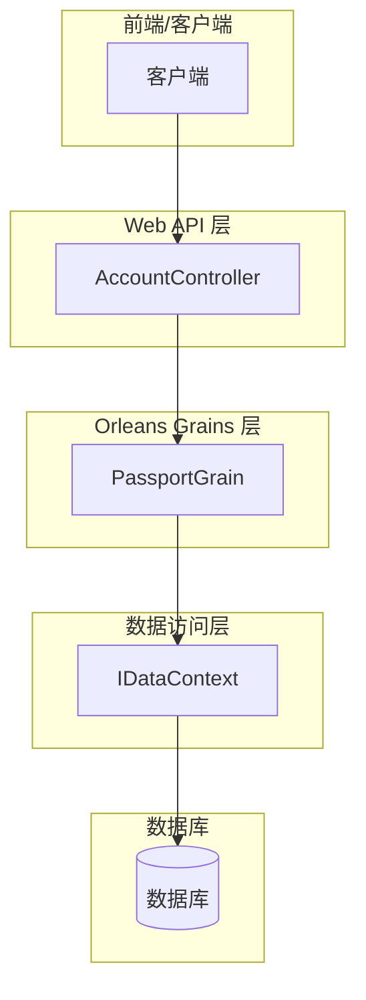
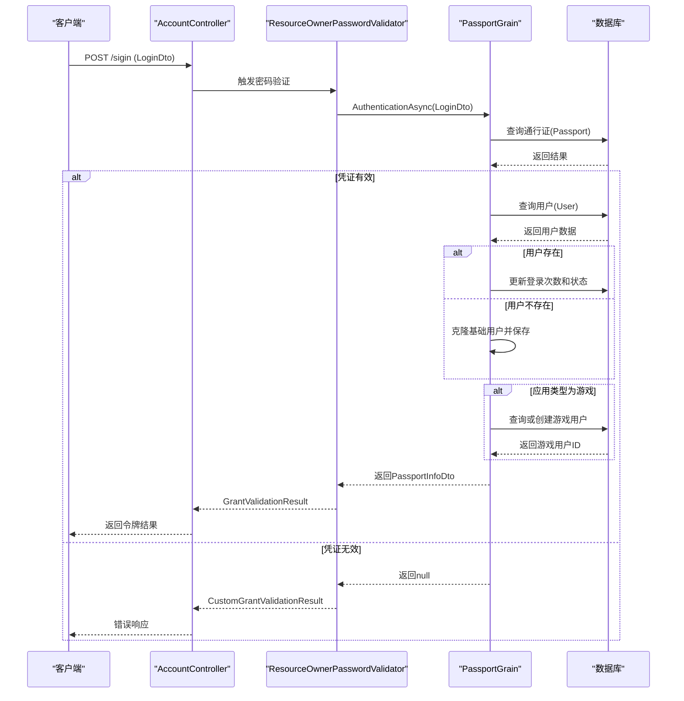
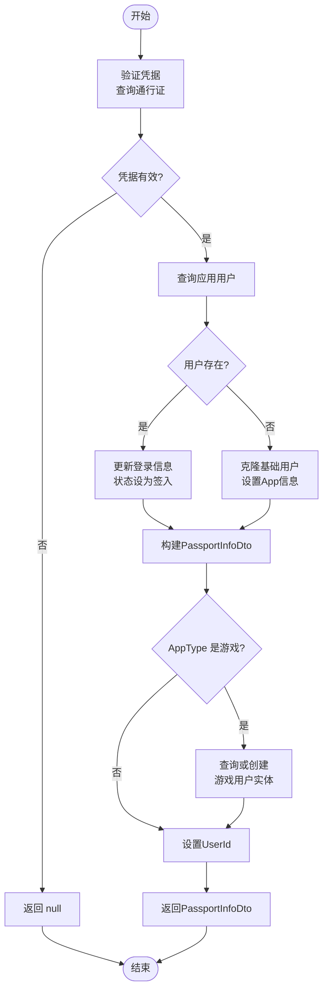
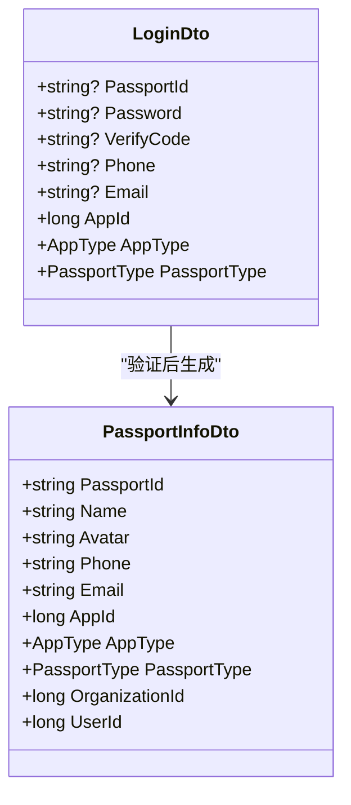
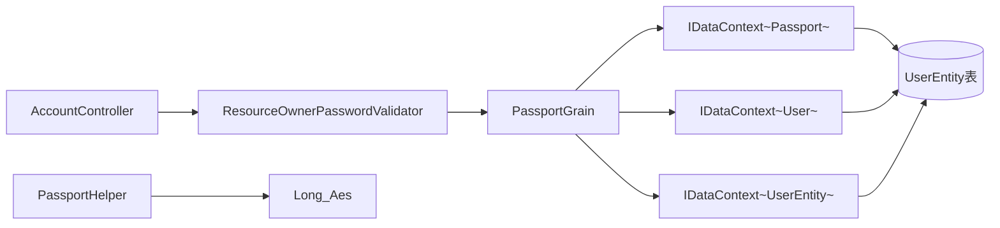

# 登录功能

<cite>
**本文档引用的文件**  
- [PassportGrain.cs](file://Horizon.Orleans.Grains\PassportGrain.cs)
- [AccountController.cs](file://Horizon.WebApi\Controllers\AccountController.cs)
- [LoginDto.cs](file://Horizon.Share\Dtos\User\LoginDto.cs)
- [PassportInfoDto.cs](file://Horizon.Share\Dtos\User\PassportInfoDto.cs)
- [ResourceOwnerPasswordValidator.cs](file://Horizon.WebApi\Identity\ResourceOwnerPasswordValidator.cs)
- [PassportHelper.cs](file://Horizon.Core\PassportHelper.cs)
</cite>

## 目录
1. [简介](#简介)
2. [项目结构](#项目结构)
3. [核心组件](#核心组件)
4. [架构概述](#架构概述)
5. [详细组件分析](#详细组件分析)
6. [依赖分析](#依赖分析)
7. [性能考虑](#性能考虑)
8. [故障排除指南](#故障排除指南)
9. [结论](#结论)

## 简介
本文档深入解析身份认证服务中的登录功能，重点阐述 `PassportGrain.AuthenticationAsync` 方法的完整执行流程。涵盖凭据验证、用户数据查询与克隆逻辑、游戏用户上下文创建等关键步骤。同时说明 `LoginDto` 请求对象各字段用途及校验规则，并解释 `PassportInfoDto` 响应对象的构建过程及其在多应用环境下的适配机制。提供 HTTP API 调用示例和 Orleans Grain 调用方式的代码片段。描述登录失败的常见场景（如账号不存在、密码错误、状态无效）及其返回处理策略。记录与 `AccountController` 的集成方式以及安全考虑，例如密码未二次哈希的问题风险提示。

## 项目结构
本系统采用分层微服务架构，结合 Orleans 分布式计算框架实现高并发身份认证服务。主要模块包括：
- **Horizon.Orleans.Grains**: 核心业务逻辑，包含 PassportGrain 等 Grain 实现
- **Horizon.WebApi**: 提供 RESTful 接口，通过 AccountController 暴露登录等功能
- **Horizon.Share.Dtos**: 数据传输对象定义，如 LoginDto 和 PassportInfoDto
- **Horizon.Core**: 公共工具类和辅助方法，如 PassportHelper
- **Horizon.Model**: 领域模型定义，包含 User、Passport 等实体

**图源**
- [AccountController.cs](file://Horizon.WebApi\Controllers\AccountController.cs)
- [PassportGrain.cs](file://Horizon.Orleans.Grains\PassportGrain.cs)

**节源**
- [AccountController.cs](file://Horizon.WebApi\Controllers\AccountController.cs)
- [PassportGrain.cs](file://Horizon.Orleans.Grains\PassportGrain.cs)

## 核心组件
登录功能的核心是 `PassportGrain.AuthenticationAsync` 方法，它负责处理完整的身份验证流程。该方法接收 `LoginDto` 对象作为输入，经过凭据验证、用户数据查询或克隆、游戏上下文创建等步骤后，返回 `PassportInfoDto` 对象。整个过程通过 Orleans 分布式框架协调，确保高可用性和可扩展性。

**节源**
- [PassportGrain.cs](file://Horizon.Orleans.Grains\PassportGrain.cs)
- [LoginDto.cs](file://Horizon.Share\Dtos\User\LoginDto.cs)
- [PassportInfoDto.cs](file://Horizon.Share\Dtos\User\PassportInfoDto.cs)

## 架构概述
系统采用基于 Orleans 的 Actor 模型架构，将每个用户视为一个独立的 Grain 实体进行管理。HTTP 请求首先由 Web API 层的 `AccountController` 接收，然后通过 IdentityServer4 的资源所有者密码凭证流触发 `ResourceOwnerPasswordValidator`，最终调用底层的 `PassportGrain` 完成实际的身份验证逻辑。

**图源**
- [AccountController.cs](file://Horizon.WebApi\Controllers\AccountController.cs)
- [ResourceOwnerPasswordValidator.cs](file://Horizon.WebApi\Identity\ResourceOwnerPasswordValidator.cs)
- [PassportGrain.cs](file://Horizon.Orleans.Grains\PassportGrain.cs)

## 详细组件分析

### PassportGrain.AuthenticationAsync 执行流程分析
`AuthenticationAsync` 方法是登录功能的核心，其执行流程如下：

1. **凭据验证**：使用 `_dataContext.QueryFirstOrDefaultAsync` 查询通行证表，验证 `PassportId`、`Password` 和有效性。
2. **用户数据查询**：若凭据正确，则根据 `AppId` 和 `AppType` 查询对应的应用用户数据。
3. **用户状态更新或克隆**：
   - 若用户存在，更新其登录次数、最后登录时间和状态为“签入”。
   - 若用户不存在，则从基础用户数据克隆一份新用户，并设置相应的 `AppId`、`AppType` 和 `PassportType`。
4. **构建响应对象**：创建 `PassportInfoDto` 并填充相关信息。
5. **游戏上下文创建**：当 `AppType` 为 `Game` 时，检查并创建对应的游戏用户实体，将其 ID 填入响应对象。

**图源**
- [PassportGrain.cs](file://Horizon.Orleans.Grains\PassportGrain.cs)

**节源**
- [PassportGrain.cs](file://Horizon.Orleans.Grains\PassportGrain.cs)

### LoginDto 与 PassportInfoDto 分析
`LoginDto` 是登录请求的数据载体，包含以下关键字段：
- **PassportId**: 通行证号，用于唯一标识用户。
- **Password**: 密码，在传输前已加密。
- **AppId**: 应用ID，区分不同应用实例。
- **AppType**: 应用类型，枚举值如 `Basic`, `OA`, `Game` 等。
- **PassportType**: 通行证类型，如 `System`, `Normal`, `Member` 等。

`PassportInfoDto` 是登录成功后的响应对象，包含用户基本信息及上下文信息，用于后续的会话管理和权限控制。

**图源**
- [LoginDto.cs](file://Horizon.Share\Dtos\User\LoginDto.cs)
- [PassportInfoDto.cs](file://Horizon.Share\Dtos\User\PassportInfoDto.cs)

**节源**
- [LoginDto.cs](file://Horizon.Share\Dtos\User\LoginDto.cs)
- [PassportInfoDto.cs](file://Horizon.Share\Dtos\User\PassportInfoDto.cs)

## 依赖分析
登录功能涉及多个组件间的协作，其依赖关系如下：

**图源**
- [AccountController.cs](file://Horizon.WebApi\Controllers\AccountController.cs)
- [ResourceOwnerPasswordValidator.cs](file://Horizon.WebApi\Identity\ResourceOwnerPasswordValidator.cs)
- [PassportGrain.cs](file://Horizon.Orleans.Grains\PassportGrain.cs)
- [PassportHelper.cs](file://Horizon.Core\PassportHelper.cs)

**节源**
- [AccountController.cs](file://Horizon.WebApi\Controllers\AccountController.cs)
- [ResourceOwnerPasswordValidator.cs](file://Horizon.WebApi\Identity\ResourceOwnerPasswordValidator.cs)
- [PassportGrain.cs](file://Horizon.Orleans.Grains\PassportGrain.cs)

## 性能考虑
- **异步操作**：所有数据库操作均采用异步模式，避免阻塞线程，提高吞吐量。
- **缓存机制**：虽然当前代码未直接体现，但 Orleans 框架本身具备强大的状态管理和缓存能力。
- **数据库查询优化**：`QueryFirstOrDefaultAsync` 方法针对单条记录查询进行了优化。
- **密码处理**：密码在存储前经过 AES 加密和特定算法处理，保证安全性的同时考虑了计算开销。

## 故障排除指南
### 常见登录失败场景
1. **账号不存在或密码错误**：
   - **现象**：返回 "用户名或密码错误"。
   - **原因**：`_dataContext.QueryFirstOrDefaultAsync` 未找到匹配的通行证记录。
   - **解决**：检查输入的 `PassportId` 和 `Password` 是否正确。

2. **用户状态无效**：
   - **现象**：凭据正确但无法登录。
   - **原因**：用户记录的 `IsValid` 字段为 `false`。
   - **解决**：检查用户账户是否被禁用或注销。

3. **密码未二次哈希问题**：
   - **风险**：在 `PassportHelper.SetPasportPassword` 中，密码先被 AES 加密，再通过 `LongAes.SetPassword` 处理。若此过程不够安全，可能导致密码泄露风险。
   - **建议**：审查 `LongAes.SetPassword` 的实现，确保其使用了现代密码学标准（如 PBKDF2, bcrypt, scrypt）进行哈希。

4. **游戏用户创建失败**：
   - **现象**：登录成功但无法进入游戏。
   - **原因**：`_gameUserContext.AddAsync` 执行失败。
   - **解决**：检查游戏数据库连接和 `UserEntity` 表结构。

**节源**
- [PassportGrain.cs](file://Horizon.Orleans.Grains\PassportGrain.cs)
- [ResourceOwnerPasswordValidator.cs](file://Horizon.WebApi\Identity\ResourceOwnerPasswordValidator.cs)
- [PassportHelper.cs](file://Horizon.Core\PassportHelper.cs)

## 结论
本文档全面解析了身份认证服务的登录功能，从 API 调用到核心 Grain 逻辑，再到数据模型和安全考量。系统设计合理，利用 Orleans 框架实现了高并发下的稳定身份验证。然而，密码处理环节存在潜在的安全风险，建议进一步强化密码哈希机制。整体而言，该登录功能具备良好的扩展性和维护性，能够满足多应用场景下的身份认证需求。