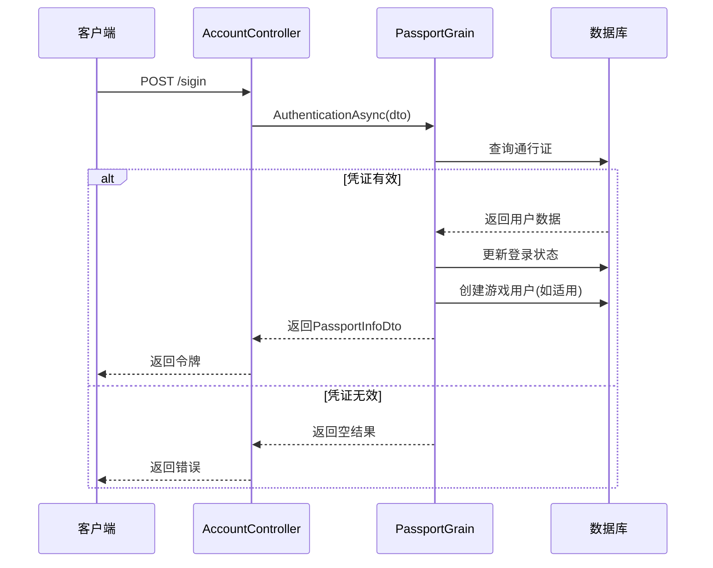
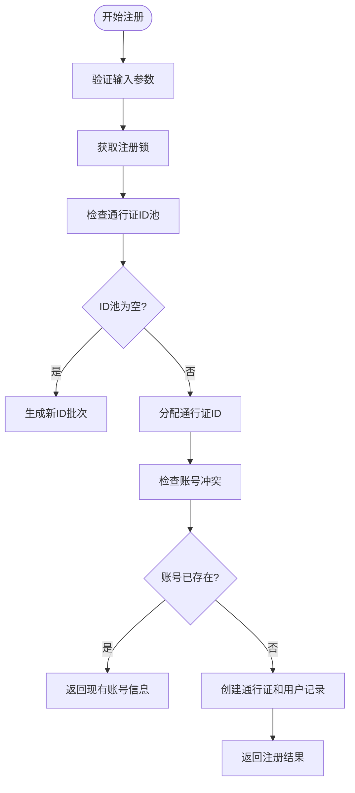
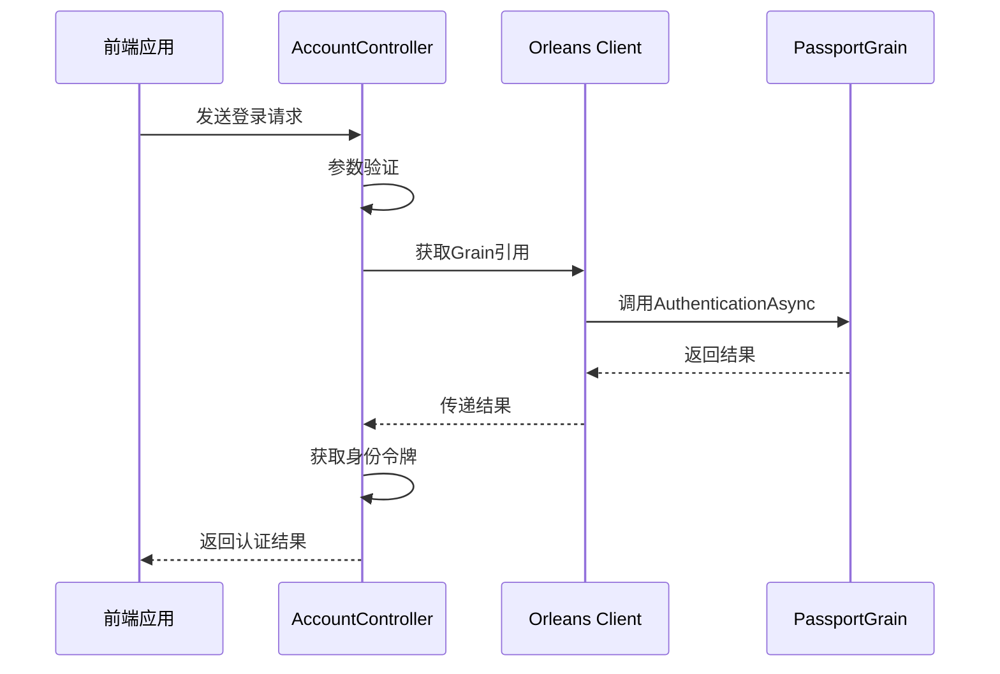
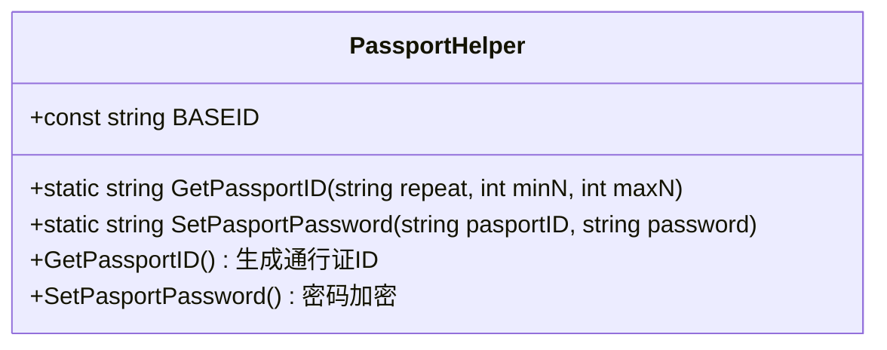

# 身份认证服务

<cite>
**本文档引用的文件**
- [PassportGrain.cs](file://Horizon.Orleans.Grains/PassportGrain.cs)
- [IPassportGrain.cs](file://Horizon.Orleans.Interface/IPassportGrain.cs)
- [AccountController.cs](file://Horizon.WebApi/Controllers/AccountController.cs)
- [PassportInfoDto.cs](file://Horizon.Share/Dtos/User/PassportInfoDto.cs)
- [LoginDto.cs](file://Horizon.Share/Dtos/User/LoginDto.cs)
- [RegisterDto.cs](file://Horizon.Share/Dtos/User/RegisterDto.cs)
- [ChangePasswordDto.cs](file://Horizon.Share/Dtos/User/ChangePasswordDto.cs)
- [PassportHelper.cs](file://Horizon.Core/PassportHelper.cs)
- [CacheConst.cs](file://Horizon.Core/CacheConst.cs)
- [Passport.cs](file://Horizon.Model/Basic/Passport.cs)
- [User.cs](file://Horizon.Model/Basic/User.cs)
- [UserEntity.cs](file://Horizon.Model/GameModel/UserEntity.cs)
</cite>

## 目录
1. [简介](#简介)
2. [核心组件](#核心组件)
3. [数据传输对象设计](#数据传输对象设计)
4. [Web API控制器实现](#web-api控制器实现)
5. [用户唯一标识生成逻辑](#用户唯一标识生成逻辑)
6. [账号锁定机制](#账号锁定机制)
7. [API调用示例](#api调用示例)
8. [异常处理与安全措施](#异常处理与安全措施)
9. [常见问题排查](#常见问题排查)

## 简介
本系统提供基于Orleans框架的身份认证服务，支持用户登录、注册、登出和修改密码等核心功能。系统采用分布式Grain架构，通过PassportGrain实现业务逻辑，并由AccountController对外暴露RESTful接口。

## 核心组件

### PassportGrain 实现细节

#### 用户登录 (AuthenticationAsync)
该方法验证用户凭据并返回通行证信息。首先查询通行证表进行密码匹配，然后根据应用类型创建或更新用户会话记录。对于游戏应用，还会在游戏用户表中创建关联记录。



**图源**
- [PassportGrain.cs](file://Horizon.Orleans.Grains/PassportGrain.cs#L51-L124)
- [AccountController.cs](file://Horizon.WebApi/Controllers/AccountController.cs#L55-L100)

#### 用户注册 (RegisterAsync)
实现线程安全的用户注册流程。使用分布式锁防止并发冲突，检查手机号或邮箱是否已存在。从预生成的通行证ID池中分配ID，对密码进行加密存储，并为不同应用场景创建相应的用户记录。



**图源**
- [PassportGrain.cs](file://Horizon.Orleans.Grains/PassportGrain.cs#L165-L260)
- [CacheConst.cs](file://Horizon.Core/CacheConst.cs#L132)

**节源**
- [PassportGrain.cs](file://Horizon.Orleans.Grains/PassportGrain.cs#L165-L260)

#### 登出操作 (SignOutAsync)
更新指定用户的登录状态为登出。需要提供完整的身份标识信息来定位正确的用户会话。

**节源**
- [PassportGrain.cs](file://Horizon.Orleans.Grains/PassportGrain.cs#L126-L142)

#### 修改密码 (ChangePasswordAsync)
验证旧密码正确性后更新为新密码。直接比较明文密码（已在客户端加密）。

**节源**
- [PassportGrain.cs](file://Horizon.Orleans.Grains/PassportGrain.cs#L144-L154)

## 数据传输对象设计

### PassportInfoDto
包含用户身份的核心信息，用于在系统间传递认证结果。

**字段说明：**
- `PassportId`: 通行证编号
- `Name`: 用户姓名
- `Avatar`: 头像URL
- `Phone`: 手机号码
- `Email`: 邮箱地址
- `AppId`: 应用ID
- `AppType`: 应用类型
- `PassportType`: 通行证类型
- `OrganizationId`: 机构ID
- `UserId`: 游戏用户ID

**节源**
- [PassportInfoDto.cs](file://Horizon.Share/Dtos/User/PassportInfoDto.cs)

### LoginDto
封装登录请求所需的所有参数。

**字段说明：**
- `PassportId`: 通行证号
- `Password`: 加密后的密码
- `VerifyCode`: 验证码
- `Phone`: 手机号
- `Email`: 邮箱
- `AppId`: 应用ID
- `AppType`: 应用类型
- `PassportType`: 通行证类型

**节源**
- [LoginDto.cs](file://Horizon.Share/Dtos/User/LoginDto.cs)

### RegisterDto
定义用户注册时提交的数据结构。

**字段说明：**
- `Password`: 基64编码的加密密码
- `Phone`: 手机号
- `Email`: 邮箱
- `AppId`: 应用ID
- `AppType`: 应用类型
- `PassportType`: 通行证类型
- `NickName`: 昵称
- `GameContext`: 游戏上下文信息

**节源**
- [RegisterDto.cs](file://Horizon.Share/Dtos/User/RegisterDto.cs)

### ChangePasswordDto
用于密码修改操作的数据传输对象。

**字段说明：**
- `PassportId`: 用户通行证ID
- `OldPassword`: 旧密码
- `NewPassword`: 新密码
- `AppId`: 应用ID
- `AppType`: 应用类型
- `PassportType`: 通行证类型

**节源**
- [ChangePasswordDto.cs](file://Horizon.Share/Dtos/User/ChangePasswordDto.cs)

## Web API控制器实现

### AccountController 请求处理流程
Web API控制器作为前端与Grain之间的桥梁，负责HTTP请求的接收、验证和转发。



**图源**
- [AccountController.cs](file://Horizon.WebApi/Controllers/AccountController.cs)

**节源**
- [AccountController.cs](file://Horizon.WebApi/Controllers/AccountController.cs)

## 用户唯一标识生成逻辑

### PassportIdGenerator 实现
通过PassportHelper类中的GetPassportID方法生成6-11位数字组成的唯一ID。

**生成规则：**
- 使用随机长度（6-11位）
- 基于BASEID字符集"0123567890987"生成
- 避免以0开头的情况
- 检测重复并递归重试



**图源**
- [PassportHelper.cs](file://Horizon.Core/PassportHelper.cs#L75-L94)

**节源**
- [PassportHelper.cs](file://Horizon.Core/PassportHelper.cs)

## 账号锁定机制

### 分布式锁实现
使用Redis实现的分布式锁确保关键操作的线程安全性。

**主要锁类型：**
- `PASSPORTREGISTERLOCK`: 注册操作锁，超时3秒
- `PASSPORTCREATINGLOCK`: ID生成操作锁，超时10秒

**锁管理：**
- 通过Cache.AcquireLockAsync方法获取锁
- 使用using语句确保自动释放
- 设置合理的超时时间防止死锁

**节源**
- [CacheConst.cs](file://Horizon.Core/CacheConst.cs)
- [Cache.cs](file://Horizon.Core/Cache.cs)

## API调用示例

### 登录API调用
```http
POST /Account/sigin HTTP/1.1
Content-Type: application/json

{
  "passportId": "123456",
  "password": "encrypted_password",
  "appId": 1,
  "appType": 0
}
```

### 注册API调用
```http
POST /Account/register HTTP/1.1
Content-Type: application/json

{
  "password": "base64_encrypted_password",
  "phone": "13800138000",
  "email": "user@example.com",
  "appId": 1,
  "appType": 0,
  "nickName": "用户名"
}
```

**节源**
- [AccountController.cs](file://Horizon.WebApi/Controllers/AccountController.cs)

## 异常处理与安全措施

### 密码安全策略
- 客户端预加密：使用AesHelper进行双重加密
- 服务端存储：明文存储已加密的密码
- 密码派生：结合通行证ID生成最终密码哈希

### 防重放攻击
- 所有敏感操作都需要有效的身份令牌
- 使用HTTPS加密传输
- 关键操作添加验证码验证

### 异常处理
- 统一的ResultVM包装返回结果
- 详细的错误描述信息
- 敏感异常信息不直接暴露给客户端

**节源**
- [PassportHelper.cs](file://Horizon.Core/PassportHelper.cs#L96-L105)

## 常见问题排查

### 登录失败可能原因
1. **凭证错误**：检查通行证ID和密码是否正确
2. **账户状态**：确认账户未被禁用或删除
3. **应用匹配**：验证AppId和AppType是否匹配
4. **网络问题**：检查服务连接状态

### 注册冲突解决方案
1. **手机号/邮箱占用**：提示用户使用找回密码功能
2. **分布式锁超时**：检查Redis连接状态
3. **数据库约束**：验证通行证ID的唯一性约束
4. **ID池耗尽**：调用CreatingAsync接口补充ID池

**节源**
- [PassportGrain.cs](file://Horizon.Orleans.Grains/PassportGrain.cs)
- [AccountController.cs](file://Horizon.WebApi/Controllers/AccountController.cs)