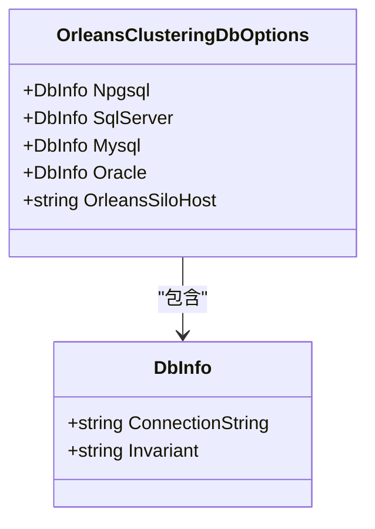
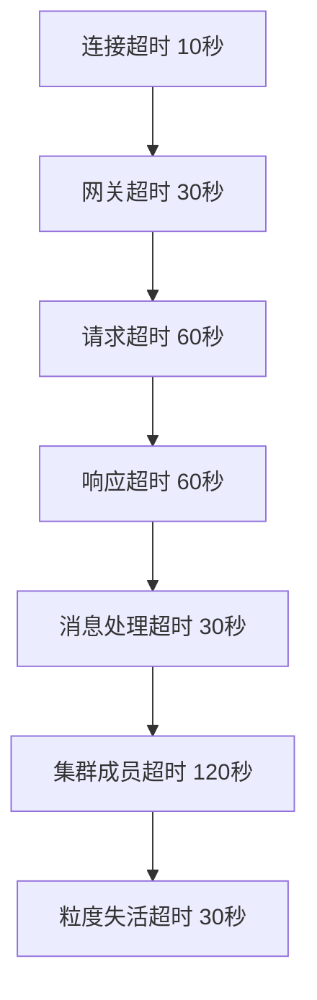
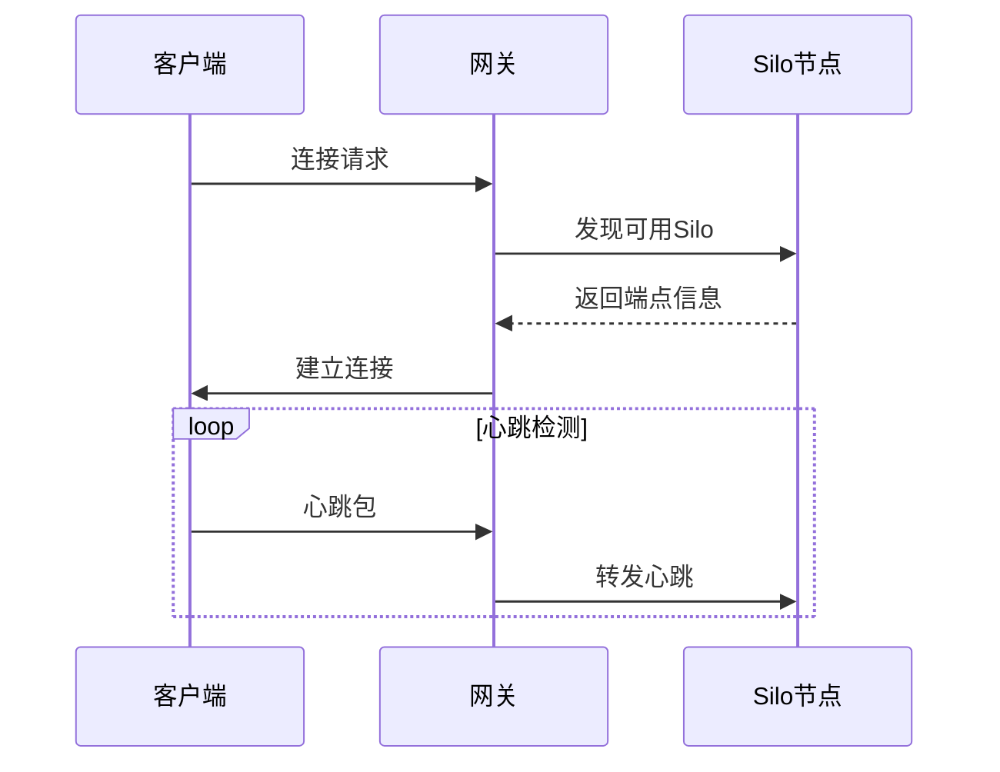

# Orleans集群配置

<cite>
**本文档引用的文件**
- [OrleansClusteringDbOptions.cs](file://Horizon.Core\Options\OrleansClusteringDbOptions.cs)
- [HorizonTimeoutConfiguration.cs](file://Horizon.Orleans.Silo\Configuration\HorizonTimeoutConfiguration.cs)
- [OrleansOptions.cs](file://Horizon.Game.Gateway\Configuration\OrleansOptions.cs)
- [appsettings.json](file://Horizon.Game.Gateway\appsettings.json)
- [appsettings.Production.json](file://Horizon.Orleans.Silo\appsettings.Production.json)
</cite>

## 目录
1. [简介](#简介)
2. [集群数据库配置](#集群数据库配置)
3. [超时配置详解](#超时配置详解)
4. [网关与Silo通信配置](#网关与silo通信配置)
5. [不同部署环境的典型配置](#不同部署环境的典型配置)
6. [性能调优建议](#性能调优建议)
7. [结论](#结论)

## 简介
本文档详细阐述了Orleans分布式计算框架在"混沌世界"游戏项目中的集群配置方案。重点介绍集群协调、超时管理、网关通信等核心配置项，为开发、测试和生产环境提供标准化配置指导。

## 集群数据库配置

`OrleansClusteringDbOptions`类定义了Orleans集群协调所需的数据库连接配置，支持多种数据库类型，并包含Silo通信地址设置。



**图表来源**
- [OrleansClusteringDbOptions.cs](file://Horizon.Core\Options\OrleansClusteringDbOptions.cs#L9-L31)

**章节来源**
- [OrleansClusteringDbOptions.cs](file://Horizon.Core\Options\OrleansClusteringDbOptions.cs#L9-L31)

### 成员资格表数据源设置
成员资格表用于存储集群中所有Silo的状态信息，确保集群成员的一致性视图。通过`UseAdoNetClustering`方法配置：

- **SqlServer**: 使用SQL Server作为成员资格存储，连接字符串包含身份验证信息和服务器地址
- **Npgsql**: 使用PostgreSQL作为成员资格存储，配置包括主机、端口、数据库名和认证凭据
- **Mysql/Oracle**: 支持MySQL和Oracle数据库作为备选方案

### 提醒器服务数据源设置
提醒器服务（Reminder Service）用于实现定时任务和延迟操作，使用与成员资格相同的数据库配置：

```csharp
siloBuilder.UseAdoNetReminderService(options =>
{
    options.ConnectionString = sql.ConnectionString;
    options.Invariant = sql.Invariant;
});
```

**章节来源**
- [Program.cs](file://Horizon.Orleans.Silo\Program.cs#L258-L288)

## 超时配置详解

`HorizonTimeoutConfiguration`类集中管理Orleans系统中各项超时阈值，对系统稳定性和容错能力有重要影响。



**图表来源**
- [HorizonTimeoutConfiguration.cs](file://Horizon.Orleans.Silo\Configuration\HorizonTimeoutConfiguration.cs#L7-L242)

**章节来源**
- [HorizonTimeoutConfiguration.cs](file://Horizon.Orleans.Silo\Configuration\HorizonTimeoutConfiguration.cs#L7-L242)

### 关键超时参数及其影响
| 参数名称 | 默认值 | 影响说明 |
|---------|-------|---------|
| ConnectionTimeoutMs | 10000毫秒 | Silo间建立连接的最长时间，过短可能导致网络波动时连接失败 |
| GatewayTimeoutMs | 30000毫秒 | 网关响应客户端请求的超时时间，直接影响用户体验 |
| RequestTimeoutMs | 60000毫秒 | 消息请求的等待时间，过长可能造成资源堆积 |
| ResponseTimeoutMs | 60000毫秒 | 等待响应的最大时间，需与RequestTimeout协调设置 |
| ClusterMembershipTimeoutMs | 120000毫秒 | 集群成员状态失效时间，影响故障检测速度 |
| GrainDeactivationTimeoutMs | 30000毫秒 | 粒度失活前的等待时间，影响内存回收效率 |

### 超时配置验证机制
系统提供了完整的配置验证功能，确保超时参数的合理性：

```csharp
public List<string> ValidateConfiguration()
{
    var warnings = new List<string>();
    if (ConnectionTimeoutMs <= 0)
        warnings.Add("连接超时必须大于0");
    // ...其他验证规则
    return warnings;
}
```

**章节来源**
- [HorizonTimeoutConfiguration.cs](file://Horizon.Orleans.Silo\Configuration\HorizonTimeoutConfiguration.cs#L154-L186)

## 网关与Silo通信配置

`OrleansOptions`类定义了网关与Silo间通信的核心配置项，确保客户端能够正确发现和连接到集群。



**图表来源**
- [OrleansOptions.cs](file://Horizon.Game.Gateway\Configuration\OrleansOptions.cs#L7-L59)

**章节来源**
- [OrleansOptions.cs](file://Horizon.Game.Gateway\Configuration\OrleansOptions.cs#L7-L59)

### 网关发现机制
- **ClusterId**: 集群标识符，用于区分不同的Orleans集群
- **ServiceId**: 服务标识符，同一集群内不同服务的区分
- **SiloEndpoints**: Silo节点的端点列表，支持多节点配置

### 客户端重连策略
- **RetryCount**: 最大重试次数，默认5次
- **RetryInterval**: 重试间隔时间，默认1000毫秒
- **ResponseTimeout**: 响应超时时间，默认30000毫秒

这些参数共同决定了客户端在网络异常时的恢复能力和用户体验。

## 不同部署环境的典型配置

根据部署环境的不同，Orleans配置需要进行相应调整，以平衡性能、可靠性和资源消耗。

### 开发环境配置
开发环境注重快速启动和调试便利性：

```json
{
  "Orleans": {
    "ClusterId": "dev",
    "ServiceId": "BaseService",
    "SiloEndpoints": [ "localhost:11111" ],
    "GatewayPort": 30000,
    "RetryCount": 5,
    "RetryInterval": 1000,
    "ResponseTimeout": 30000
  }
}
```

**章节来源**
- [appsettings.json](file://Horizon.Game.Gateway\appsettings.json#L130-L145)

### 生产环境配置
生产环境强调高可用性和性能优化：

```json
{
  "Orleans": {
    "ClusterId": "dev",
    "ServiceId": "HorizonGame",
    "GatewayPort": 30000,
    "ConnectionTimeout": 30,
    "OpenConnectionTimeout": 10,
    "GatewayListRefreshPeriod": 10
  }
}
```

**章节来源**
- [appsettings.Production.json](file://Horizon.Orleans.Silo\appsettings.Production.json#L119-L126)

## 性能调优建议

针对Orleans系统的高级参数配置，可显著提升系统性能和资源利用率。

### 流订阅批处理大小
合理设置流订阅的批处理大小，可以减少网络开销和提高吞吐量。虽然具体配置未在代码中直接体现，但可通过Orleans内置的流配置进行调整。

### 激活垃圾回收间隔
通过`GrainCollectionOptions`配置粒度集合选项，优化内存回收策略：

```csharp
siloBuilder.Configure<GrainCollectionOptions>(options =>
{
    options.CollectionAge = configuredCollectionAge > minCollectionAge 
        ? configuredCollectionAge 
        : minCollectionAge;
    options.CollectionQuantum = TimeSpan.FromMinutes(1);
    options.DeactivationTimeout = TimeSpan.FromSeconds(30);
});
```

此配置确保了内存的有效利用，同时避免了过于频繁的垃圾回收对性能的影响。

**章节来源**
- [HorizonTimeoutConfigurationExtensions.cs](file://Horizon.Orleans.Silo\Extensions\HorizonTimeoutConfigurationExtensions.cs#L125-L148)

## 结论
Orleans集群配置是确保分布式系统稳定运行的关键。通过合理的数据库连接配置、超时阈值设置和通信参数优化，可以构建高性能、高可用的游戏后端服务。不同部署环境应采用相应的配置策略，并结合性能监控持续优化系统表现。