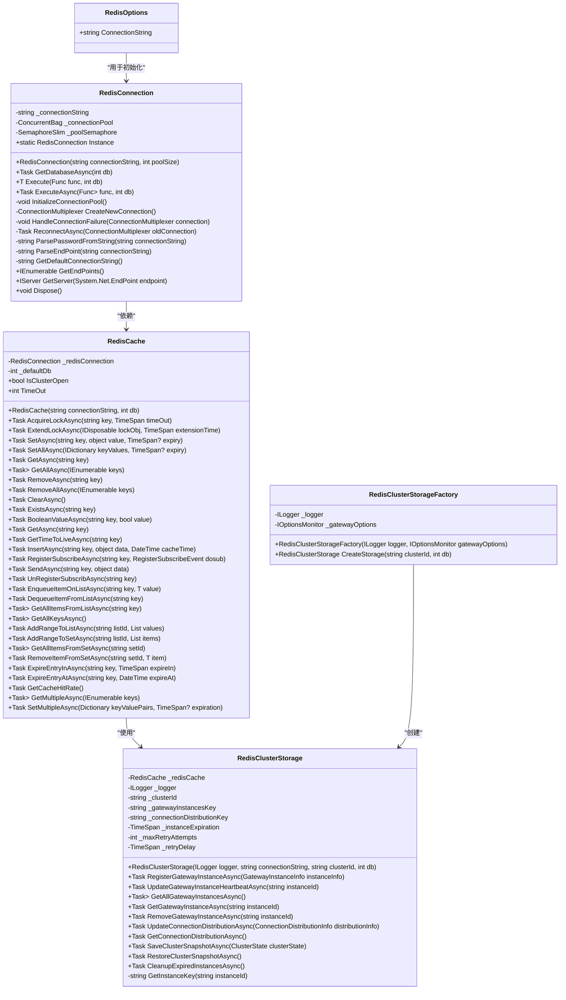
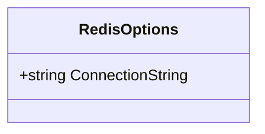
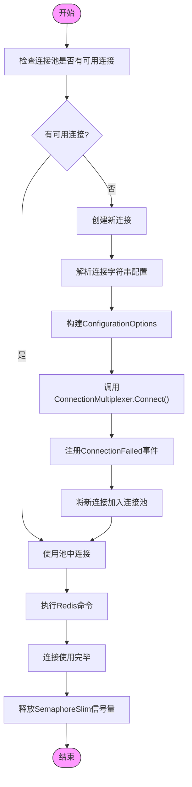
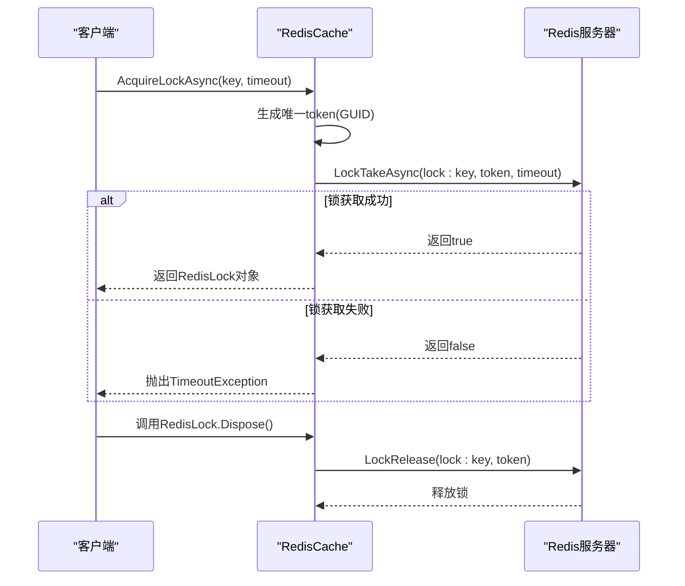
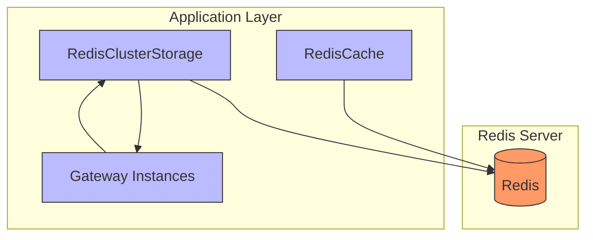
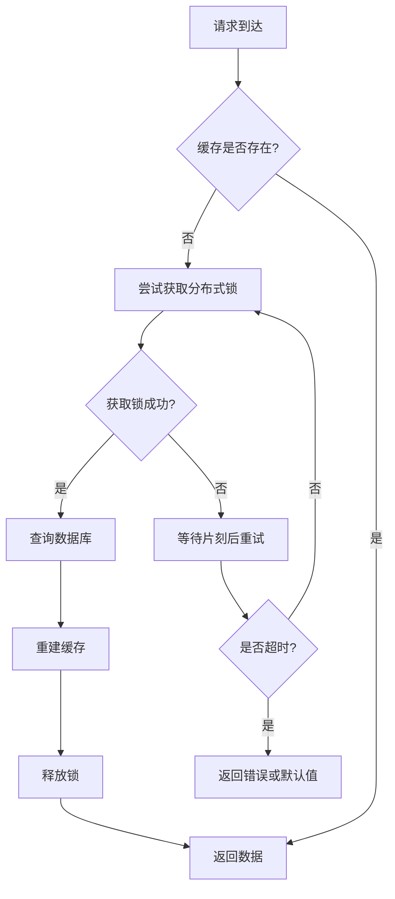

# Redis缓存配置

<cite>
**Referenced Files in This Document**   
- [RedisOptions.cs](file://Horizon.Core/Options/RedisOptions.cs)
- [RedisConnection.cs](file://Horizon.Strategy.Storage.Redis/RedisConnection.cs)
- [RedisCache.cs](file://Horizon.Strategy.Storage.Redis/RedisCache.cs)
- [appsettings.json](file://Horizon.Game.Gateway/appsettings.json)
- [ICache.cs](file://Horizon.Core.Abstract/ICache.cs)
- [RedisClusterStorage.cs](file://Horizon.Game.Gateway/Services/RedisClusterStorage.cs)
- [RedisClusterStorageFactory.cs](file://Horizon.Game.Gateway/Services/RedisClusterStorageFactory.cs)
</cite>

## 目录
1. [引言](#引言)
2. [核心组件分析](#核心组件分析)
3. [RedisOptions配置解析](#redisoptions配置解析)
4. [RedisConnection连接管理](#redisconnection连接管理)
5. [RedisCache功能支持](#rediscache功能支持)
6. [集群与哨兵模式配置](#集群与哨兵模式配置)
7. [缓存问题预防策略](#缓存问题预防策略)
8. [监控与慢查询配置](#监控与慢查询配置)
9. [结论](#结论)

## 引言

本文档全面解析了项目中Redis缓存的配置体系，重点阐述了`RedisOptions`中的关键参数、`RedisConnection`类如何建立持久化连接以及`RedisCache`对分布式锁、过期策略和批量操作的支持。文档还对比了Redis集群模式与哨兵模式的配置差异，并提供了针对缓存穿透、雪崩、击穿等问题的预防方案，以及监控指标采集和慢查询分析的配置指引。

## 核心组件分析

本系统中的Redis缓存体系由多个核心组件构成，形成了完整的缓存解决方案。`RedisOptions`类定义了基础的连接配置，`RedisConnection`负责管理连接池和持久化连接，而`RedisCache`则提供了丰富的缓存操作接口。此外，`RedisClusterStorage`和`RedisClusterStorageFactory`为网关服务提供了集群协调存储能力。



**Diagram sources**
- [RedisOptions.cs](file://Horizon.Core/Options/RedisOptions.cs#L8-L11)
- [RedisConnection.cs](file://Horizon.Strategy.Storage.Redis/RedisConnection.cs#L15-L337)
- [RedisCache.cs](file://Horizon.Strategy.Storage.Redis/RedisCache.cs#L9-L483)
- [RedisClusterStorage.cs](file://Horizon.Game.Gateway/Services/RedisClusterStorage.cs#L13-L418)
- [RedisClusterStorageFactory.cs](file://Horizon.Game.Gateway/Services/RedisClusterStorageFactory.cs#L9-L36)

**Section sources**
- [RedisOptions.cs](file://Horizon.Core/Options/RedisOptions.cs#L8-L11)
- [RedisConnection.cs](file://Horizon.Strategy.Storage.Redis/RedisConnection.cs#L15-L337)
- [RedisCache.cs](file://Horizon.Strategy.Storage.Redis/RedisCache.cs#L9-L483)
- [RedisClusterStorage.cs](file://Horizon.Game.Gateway/Services/RedisClusterStorage.cs#L13-L418)
- [RedisClusterStorageFactory.cs](file://Horizon.Game.Gateway/Services/RedisClusterStorageFactory.cs#L9-L36)

## RedisOptions配置解析

`RedisOptions`类是Redis配置的核心，它定义了连接到Redis服务器所需的基本参数。该类位于`Horizon.Core/Options/RedisOptions.cs`文件中，其主要属性如下：



**Diagram sources**
- [RedisOptions.cs](file://Horizon.Core/Options/RedisOptions.cs#L8-L11)

**Section sources**
- [RedisOptions.cs](file://Horizon.Core/Options/RedisOptions.cs#L8-L11)

### 连接字符串格式

`ConnectionString`属性支持多种格式：
- **无密码格式**: `host:port` (如 `localhost:6379`)
- **带密码格式**: `password=your_password@host:port` (如 `password=DB65F7F9C@122.9.148.88:9379`)

从`appsettings.json`文件中可以看到实际的配置示例：

```json
"DataBase": {
  "RedisMasters": [
    {
      "Host": "122.9.148.88",
      "Port": "9379",
      "Password": "DB65F7F9C"
    }
  ],
  "RedisSlaves": [
    {
      "Host": "122.9.148.88",
      "Port": "9679",
      "Password": "DB65F7F9C"
    }
  ],
  "RedisSentinels": [
    {
      "Host": "127.0.0.1",
      "Port": "6379"
    }
  ]
}
```

**Section sources**
- [appsettings.json](file://Horizon.Game.Gateway/appsettings.json#L50-L75)

### 默认数据库索引

虽然`RedisOptions`类本身没有直接定义数据库索引，但`RedisCache`构造函数接受一个可选的`db`参数（默认值为-1），允许指定使用的数据库索引。当`db`为-1时，将使用Redis服务器的默认数据库。

### 连接超时配置

连接超时配置在`RedisConnection`类中硬编码定义，而非通过`RedisOptions`配置：
- **连接超时**: 5秒 (`DefaultConnectTimeout`)
- **同步超时**: 5秒 (`DefaultSyncTimeout`)

这些值在`RedisConnection`类的私有区域中定义为静态只读字段，确保了连接操作的及时性。

### 重试策略

`RedisConnection`实现了自动重连机制，其重试策略如下：
- **最大重试次数**: 3次
- **重试间隔**: 随着尝试次数增加而递增（1秒、2秒、3秒）
- **触发条件**: 当连接失败事件被触发且连接仍处于连接状态时

重连逻辑封装在`ReconnectAsync`方法中，采用异步方式执行，避免阻塞主线程。

## RedisConnection连接管理

`RedisConnection`类负责管理与Redis服务器的连接，实现了连接池模式以提高性能和资源利用率。

### 单例模式实现

`RedisConnection`采用懒加载单例模式，确保整个应用程序域中只有一个实例：

```csharp
private static readonly Lazy<RedisConnection> _instance =
    new Lazy<RedisConnection>(() => new RedisConnection());
public static RedisConnection Instance => _instance.Value;
```

这种设计保证了连接资源的全局唯一性和线程安全性。

### 连接池机制

连接池是`RedisConnection`的核心特性，其工作机制如下：
- **默认池大小**: 10个连接
- **同步控制**: 使用`SemaphoreSlim`限制并发访问
- **连接获取**: 通过`_connectionPool.TryTake(out var connection)`从池中获取连接
- **连接归还**: 操作完成后通过`_poolSemaphore.Release()`释放信号量

这种设计有效避免了频繁创建和销毁连接带来的性能开销。

### 连接创建流程

当需要创建新连接时，`CreateNewConnection`方法会：
1. 创建`ConfigurationOptions`实例
2. 设置连接失败不中断(`AbortOnConnectFail = false`)
3. 配置超时参数
4. 解析密码和端点信息
5. 建立`ConnectionMultiplexer`连接
6. 注册连接失败事件处理器



**Diagram sources**
- [RedisConnection.cs](file://Horizon.Strategy.Storage.Redis/RedisConnection.cs#L15-L337)

**Section sources**
- [RedisConnection.cs](file://Horizon.Strategy.Storage.Redis/RedisConnection.cs#L15-L337)

### 辅助解析方法

`RedisConnection`包含两个重要的辅助方法用于解析连接字符串：
- `ParsePasswordFromString`: 从连接字符串中提取密码部分
- `ParseEndPoint`: 从连接字符串中提取主机和端口信息

这两个方法支持灵活的连接字符串格式，提高了配置的适应性。

## RedisCache功能支持

`RedisCache`类实现了`ICache`接口，提供了全面的缓存操作功能。

### 分布式锁支持

`RedisCache`通过Redis的原子操作实现了可靠的分布式锁机制：



**Diagram sources**
- [RedisCache.cs](file://Horizon.Strategy.Storage.Redis/RedisCache.cs#L9-L483)

**Section sources**
- [RedisCache.cs](file://Horizon.Strategy.Storage.Redis/RedisCache.cs#L9-L483)

#### 锁扩展功能

`ExtendLockAsync`方法允许在锁即将过期时延长其有效期，防止因业务处理时间过长而导致锁提前释放。

### 过期策略

`RedisCache`支持多种过期策略配置：
- **绝对过期**: 指定具体的过期时间点
- **相对过期**: 指定相对于当前时间的过期时长
- **永不过期**: 不设置过期时间

这些策略通过`InsertAsync`系列重载方法提供，开发者可以根据业务需求选择合适的过期方式。

### 批量操作支持

`RedisCache`提供了高效的批量操作支持：
- `SetAllAsync`: 批量设置多个键值对
- `GetAllAsync`: 批量获取多个键的值
- `RemoveAllAsync`: 批量删除多个键
- `AddRangeToListAsync`: 批量向列表添加元素
- `AddRangeToSetAsync`: 批量向集合添加元素

批量操作通过Redis的管道(pipeline)技术实现，显著减少了网络往返次数，提升了性能。

## 集群与哨兵模式配置

### 集群模式配置

从`appsettings.json`文件可以看出，系统配置了Redis主从架构，但并未直接使用Redis Cluster模式。相反，通过`RedisClusterStorage`类实现了应用层的集群协调功能。

`RedisClusterStorage`用于存储网关实例信息和连接分布数据，支持容灾恢复。其主要功能包括：
- 注册和心跳更新网关实例
- 获取所有有效的网关实例列表
- 更新和获取连接分布信息
- 保存和恢复集群状态快照



**Diagram sources**
- [RedisClusterStorage.cs](file://Horizon.Game.Gateway/Services/RedisClusterStorage.cs#L13-L418)

**Section sources**
- [RedisClusterStorage.cs](file://Horizon.Game.Gateway/Services/RedisClusterStorage.cs#L13-L418)

### 哨兵模式配置

在`appsettings.json`中配置了Redis Sentinel节点：

```json
"RedisSentinels": [
  {
    "Host": "127.0.0.1",
    "Port": "6379"
  },
  {
    "Host": "127.0.0.1",
    "Port": "6379"
  }
]
```

然而，当前的`RedisConnection`实现并未直接集成Sentinel功能。要启用哨兵模式，需要修改连接配置，让`ConnectionMultiplexer`能够通过Sentinel自动发现主节点。

### 配置差异对比

| 特性 | 集群模式 | 哨兵模式 |
|------|---------|---------|
| 数据分片 | 支持，自动分片 | 不支持，单一主节点 |
| 高可用 | 多主多从，故障转移 | 单主多从，故障转移 |
| 配置复杂度 | 较高，需配置多个节点 | 较低，只需配置Sentinel |
| 客户端支持 | 需要支持集群的客户端 | 标准客户端即可 |
| 当前实现 | 应用层模拟集群协调 | 已配置但未完全集成 |

**Section sources**
- [appsettings.json](file://Horizon.Game.Gateway/appsettings.json#L50-L75)
- [RedisClusterStorage.cs](file://Horizon.Game.Gateway/Services/RedisClusterStorage.cs#L13-L418)

## 缓存问题预防策略

### 缓存穿透预防

缓存穿透指查询不存在的数据，导致每次请求都穿透到数据库。预防方案包括：
- **空值缓存**: 对查询结果为空的情况也进行缓存，设置较短的过期时间
- **布隆过滤器**: 在缓存层前增加布隆过滤器，快速判断键是否存在

虽然当前代码未直接实现这些策略，但`RedisCache`提供的`ExistsAsync`方法可用于实现简单的存在性检查。

### 缓存雪崩预防

缓存雪崩指大量缓存同时过期，导致数据库压力骤增。预防措施包括：
- **随机过期时间**: 在基础过期时间上增加随机偏移量
- **多级缓存**: 结合本地缓存和分布式缓存
- **热点数据永不过期**: 对核心热点数据设置较长或永久的缓存时间

`RedisCache`的`InsertAsync`方法支持灵活的过期时间设置，便于实现上述策略。

### 缓存击穿预防

缓存击穿指热点数据过期瞬间，大量并发请求同时穿透到数据库。解决方案：
- **互斥锁**: 使用`AcquireLockAsync`获取分布式锁，只有一个请求能重建缓存
- **逻辑过期**: 设置逻辑过期时间，在后台异步更新缓存

`RedisCache`提供的分布式锁功能完美支持互斥锁方案：



**Diagram sources**
- [RedisCache.cs](file://Horizon.Strategy.Storage.Redis/RedisCache.cs#L9-L483)

**Section sources**
- [RedisCache.cs](file://Horizon.Strategy.Storage.Redis/RedisCache.cs#L9-L483)

## 监控与慢查询配置

### 监控指标采集

`RedisCache`提供了基本的监控能力：
- `GetCacheHitRate`: 计算缓存命中率（当前实现返回固定值1，需完善）
- `GetAllKeysAsync`: 获取所有缓存键，可用于监控缓存大小

建议增强监控功能，采集以下指标：
- 连接池使用情况
- 各操作的响应时间
- 缓存命中/未命中统计
- 内存使用情况

### 慢查询分析

当前实现缺乏慢查询分析功能。建议配置Redis服务器的`slowlog`参数：

```bash
# redis.conf配置
slowlog-log-slower-than 10000  # 记录超过10ms的查询
slowlog-max-len 1000           # 最多保存1000条慢查询记录
```

同时，在应用层可以添加操作耗时监控：

```csharp
public async Task<T> ExecuteWithMonitoringAsync<T>(Func<IDatabase, Task<T>> func, int db = -1, string operationName = "")
{
    var stopwatch = Stopwatch.StartNew();
    try
    {
        return await ExecuteAsync(func, db);
    }
    finally
    {
        stopwatch.Stop();
        if (stopwatch.ElapsedMilliseconds > SLOW_QUERY_THRESHOLD)
        {
            _logger.LogWarning("Slow Redis operation: {Operation} took {Duration}ms", operationName, stopwatch.ElapsedMilliseconds);
        }
    }
}
```

此功能需要在`RedisConnection`中扩展，目前尚未实现。

## 结论

本文档详细解析了项目的Redis缓存配置体系。`RedisOptions`提供了基础的连接配置，`RedisConnection`通过连接池和重连机制确保了连接的稳定性和高效性，而`RedisCache`则提供了丰富的功能支持，包括分布式锁、多种过期策略和批量操作。

系统已配置了Redis主从和哨兵架构，但在应用层面通过`RedisClusterStorage`实现了自定义的集群协调功能。对于缓存穿透、雪崩、击穿等常见问题，系统提供了相应的预防工具，特别是强大的分布式锁机制。

未来建议增强监控和慢查询分析功能，完善缓存命中率统计，并考虑更深入地集成Redis Sentinel的自动故障转移能力。整体而言，当前的Redis缓存配置体系结构合理，功能完备，为系统的高性能和高可用性提供了坚实的基础。