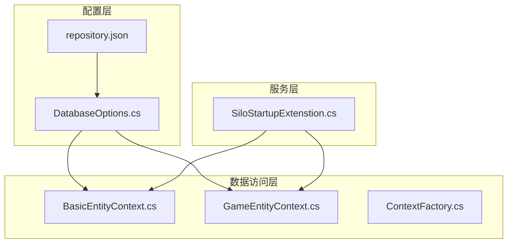
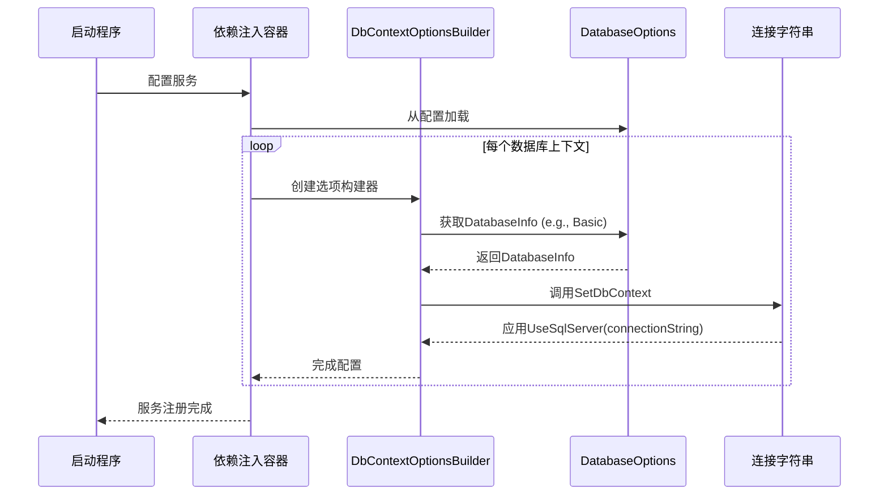
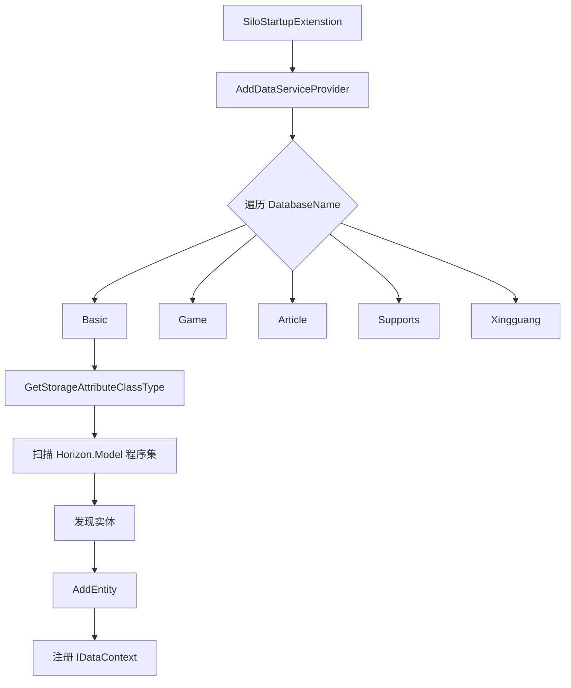

# 数据库配置

<cite>
**本文档引用的文件**
- [DatabaseOptions.cs](file://Horizon.Core\Options\DatabaseOptions.cs)
- [BasicEntityContext.cs](file://Horizon.Entities\BasicEntityContext.cs)
- [GameEntityContext.cs](file://Horizon.Entities\GameEntityContext.cs)
- [DatabaseName.cs](file://Horizon.Entities\DatabaseName.cs)
- [repository.json](file://Horizon.Entities\repository.json)
- [SiloStartupExtenstion.cs](file://Horizon.Orleans.Silo\SiloStartupExtenstion.cs)
</cite>

## 目录
1. [简介](#简介)
2. [项目结构](#项目结构)
3. [核心组件](#核心组件)
4. [架构概述](#架构概述)
5. [详细组件分析](#详细组件分析)
6. [依赖关系分析](#依赖关系分析)
7. [性能考虑](#性能考虑)
8. [故障排除指南](#故障排除指南)
9. [结论](#结论)

## 简介
本文档详细说明了系统中数据库配置的设计与实现，涵盖 `DatabaseOptions` 类的属性定义、EF Core 通过依赖注入绑定选项的机制、`BasicEntityContext` 和 `GameEntityContext` 的实际应用、数据库迁移管理策略、多数据库支持机制以及连接池优化和常见异常排查方法。

## 项目结构
项目采用分层架构设计，数据库相关代码主要分布在 `Horizon.Core`、`Horizon.Entities` 和 `Horizon.Orleans.Silo` 模块中。`Horizon.Core.Options` 包含配置类，`Horizon.Entities` 负责数据访问上下文和实体映射，而 `Horizon.Orleans.Silo` 处理服务启动时的依赖注入配置。

**图示来源**
- [DatabaseOptions.cs](file://Horizon.Core\Options\DatabaseOptions.cs)
- [BasicEntityContext.cs](file://Horizon.Entities\BasicEntityContext.cs)
- [GameEntityContext.cs](file://Horizon.Entities\GameEntityContext.cs)
- [SiloStartupExtenstion.cs](file://Horizon.Orleans.Silo\SiloStartupExtenstion.cs)

**本节来源**
- [DatabaseOptions.cs](file://Horizon.Core\Options\DatabaseOptions.cs)
- [BasicEntityContext.cs](file://Horizon.Entities\BasicEntityContext.cs)
- [GameEntityContext.cs](file://Horizon.Entities\GameEntityContext.cs)

## 核心组件

### DatabaseOptions 类详解
`DatabaseOptions` 类定义了系统中所有业务数据库的配置选项，每个属性对应一个特定用途的数据库实例。

**Section sources**
- [DatabaseOptions.cs](file://Horizon.Core\Options\DatabaseOptions.cs#L10-L32)

#### 属性说明
- **Basic**: 基础数据库配置，用于存储用户账户、组织机构等核心基础数据。
- **Game**: 游戏数据库配置，专门用于存储游戏相关的角色、物品、技能等动态数据。
- **Article**: 文章类数据库配置，负责文章内容、评论、分类等信息的持久化。
- **Support**: 支持点赞数据库配置，独立存储点赞、收藏等社交互动数据。
- **Xingguang**: 星光数据库配置，用于特定业务场景的数据存储。

每个数据库配置项均为 `DatabaseInfo` 记录类型，包含：
- **Type**: 数据库类型（如 SqlServer），决定使用的 EF Core 提供程序。
- **ConnectionString**: 数据库连接字符串，包含服务器地址、数据库名、认证信息等关键参数。

### DatabaseName 枚举的作用
`DatabaseName` 类通过常量定义了系统中所有数据库的逻辑名称，这些名称与 `DatabaseOptions` 中的属性一一对应，为多数据库路由和依赖注入提供了统一的标识符。

**Section sources**
- [DatabaseName.cs](file://Horizon.Entities\DatabaseName.cs#L9-L36)

## 架构概述
系统采用多数据库分离架构，通过 EF Core 的 `DbContext` 实现数据隔离。每个 `DbContext`（如 `BasicEntityContext`）在初始化时从 `DatabaseOptions` 获取对应的 `DatabaseInfo`，并通过扩展方法 `SetDbContext` 绑定到具体的连接字符串。

**图示来源**
- [SiloStartupExtenstion.cs](file://Horizon.Orleans.Silo\SiloStartupExtenstion.cs#L83-L108)
- [DatabaseOptions.cs](file://Horizon.Core\Options\DatabaseOptions.cs)

## 详细组件分析

### BasicEntityContext 和 GameEntityContext 应用
这两个 `DbContext` 是系统的核心数据访问入口，它们共享相同的初始化模式。

**Section sources**
- [BasicEntityContext.cs](file://Horizon.Entities\BasicEntityContext.cs)
- [GameEntityContext.cs](file://Horizon.Entities\GameEntityContext.cs)

#### 初始化流程
1. **无参构造函数**: 仅用于设计时工具（如迁移），不执行实际连接。
2. **CreateDbContext 方法**: 读取 `repository.json` 文件中的连接字符串，创建并返回配置好的 `DbContext` 实例，主要用于 EF Core CLI 工具。
3. **带 DbContextOptions 的构造函数**: 这是运行时的主要入口，接收由 DI 容器提供的已配置选项，并设置上下文行为（如自动保存点、变更追踪）。

#### 关键配置
- `Database.AutoSavepointsEnabled = true`: 启用自动保存点，支持嵌套事务。
- `Database.AutoTransactionBehavior = AutoTransactionBehavior.WhenNeeded`: EF Core 自动管理事务，仅在必要时开启。
- `ChangeTracker.AutoDetectChangesEnabled = true`: 启用自动变更检测，确保 SaveChanges 能正确识别修改。

### 数据库迁移管理策略
迁移文件位于 `Horizon.Entities\Migrations` 目录下，按上下文分组（如 `BasicEntity`、`Games`）。

**Section sources**
- [BasicEntityContext.cs](file://Horizon.Entities\BasicEntityContext.cs#L117-L127)
- [GameEntityContext.cs](file://Horizon.Entities\GameEntityContext.cs#L121-L132)
- [ContextFactory.cs](file://Horizon.Entities\ContextFactory.cs)

#### 初始迁移
使用 `dotnet ef migrations add Initial` 命令生成初始迁移脚本，该脚本基于当前 `DbContext` 和实体模型的状态。

#### 增量更新
当实体模型发生变化时，再次运行 `migrations add` 命令生成新的增量迁移文件。开发者需手动检查生成的 SQL 是否符合预期。

#### 生产环境部署
1. 在开发环境中生成迁移脚本。
2. 将迁移脚本或使用 `dotnet ef database update` 命令在生产环境执行。
3. 建议在部署前对迁移脚本进行代码审查，避免意外的破坏性操作。

## 依赖关系分析
系统通过 `SiloStartupExtenstion.AddDataServiceProvider` 方法批量注册所有数据服务，利用反射扫描 `Horizon.Model` 程序集，根据 `EntityStorageAttribute` 将实体与正确的 `DbContext` 关联。

**图示来源**
- [SiloStartupExtenstion.cs](file://Horizon.Orleans.Silo\SiloStartupExtenstion.cs#L65-L82)
- [DataServiceProvide.cs](file://Horizon.Entities\DataServiceProvide.cs)

**本节来源**
- [SiloStartupExtenstion.cs](file://Horizon.Orleans.Silo\SiloStartupExtenstion.cs)
- [DataServiceProvide.cs](file://Horizon.Entities\DataServiceProvide.cs)

## 性能考虑

### 连接池优化建议
`repository.json` 中的连接字符串明确配置了连接池参数：
- `Pooling=False`: 当前配置禁用了连接池。**强烈建议在生产环境中启用 (`Pooling=True`) 以重用数据库连接，显著提升性能**。
- `Max Pool Size=200`: 最大连接池大小，应根据数据库服务器的承载能力和应用并发量调整。
- `MultipleActiveResultSets=True`: 允许单个连接上存在多个活动结果集，适用于复杂的查询场景。

### 查询性能调优技巧
- 使用 `DbContextExtenstion` 中的 `WhereIf`、`IncludeIf` 等扩展方法，实现条件化的查询和导航属性加载，避免不必要的数据检索。
- 合理使用 `AsNoTracking()` 查询只读数据，减少变更追踪的开销。
- 对频繁查询的字段建立数据库索引。

## 故障排除指南
### 常见连接异常及排查方法
- **"DatabaseInfo cannot be null"**: 检查 `appsettings.json` 或 `repository.json` 中 `DatabaseOptions` 的配置是否完整，确保所有必需的数据库（Basic, Game 等）都已定义。
- **"ConnectionString ... is null or empty"**: 核对 `repository.json` 中的连接字符串名称（如 `BasicSqlServer`）是否与 `DatabaseOptions` 中指定的名称完全匹配。
- **数据库提供程序不支持**: 当前代码仅支持 `DataContextType.SqlServer`，尝试其他类型会抛出 `NotSupportedException`。
- **连接超时**: 检查网络连通性、数据库服务器状态和防火墙设置。确认连接字符串中的 IP 地址和端口正确。

**本节来源**
- [SiloStartupExtenstion.cs](file://Horizon.Orleans.Silo\SiloStartupExtenstion.cs#L83-L108)
- [repository.json](file://Horizon.Entities\repository.json)

## 结论
本系统通过 `DatabaseOptions` 类实现了灵活的多数据库配置，结合 `DbContext` 和依赖注入，构建了一个可扩展、易维护的数据访问层。尽管当前连接池被禁用，但其架构为性能优化预留了空间。遵循文档中的迁移管理和故障排查指南，可以确保数据库操作的稳定性和高效性。