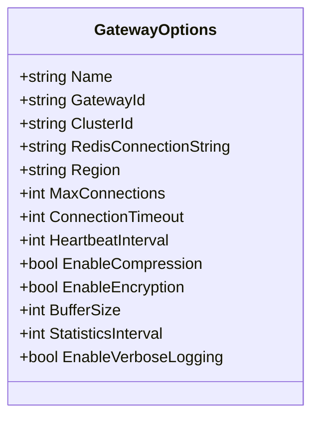
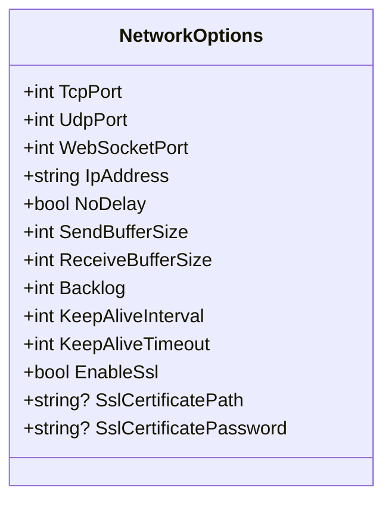
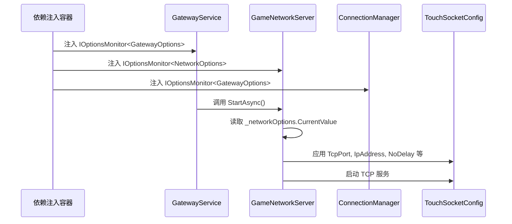
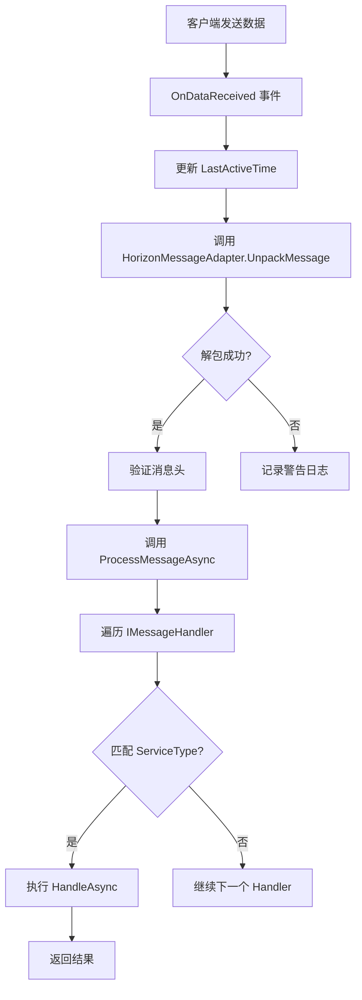

# 网关服务配置

<cite>
**本文档引用文件**  
- [GatewayOptions.cs](file://Horizon.Game.Gateway/Configuration/GatewayOptions.cs)
- [NetworkOptions.cs](file://Horizon.Game.Gateway/Configuration/NetworkOptions.cs)
- [GatewayService.cs](file://Horizon.Game.Gateway/Services/GatewayService.cs)
- [GameNetworkServer.cs](file://Horizon.Game.Gateway/Network/GameNetworkServer.cs)
- [ConnectionManager.cs](file://Horizon.Game.Gateway/Services/ConnectionManager.cs)
- [HorizonMessageAdapter.cs](file://Horizon.Game.Core/Adapters/HorizonMessageAdapter.cs)
</cite>

## 目录
1. [引言](#引言)
2. [核心配置选项解析](#核心配置选项解析)
3. [网关服务实现与运行机制](#网关服务实现与运行机制)
4. [网络性能优化配置](#网络性能优化配置)
5. [高并发场景调参建议](#高并发场景调参建议)
6. [典型配置案例](#典型配置案例)
7. [结论](#结论)

## 引言
本文档深入解析“混沌世界”游戏网关服务的配置体系，重点阐述 `GatewayOptions` 和 `NetworkOptions` 两类核心配置参数。通过分析其在 `GatewayService` 中的实际应用，说明这些配置如何影响客户端连接行为、系统资源使用和整体网络性能。同时，提供在高并发场景下的调优策略，并列举适用于不同环境的典型配置方案。

## 核心配置选项解析

### GatewayOptions 配置详解
`GatewayOptions` 类定义了网关服务的核心业务逻辑与全局行为参数。



**图表来源**
- [GatewayOptions.cs](file://Horizon.Game.Gateway/Configuration/GatewayOptions.cs#L7-L80)

**关键参数说明：**

- **最大并发连接数 (MaxConnections)**: 默认值为 10000，范围 1-100000。此参数由 `ConnectionManager` 在添加新连接时进行检查，若达到上限则拒绝新连接并关闭客户端。
- **连接超时时间 (ConnectionTimeout)**: 默认 300 秒，范围 10-3600 秒。用于判定连接是否因长时间无活动而被视为超时，由 `ConnectionManager` 的定时清理任务 (`CleanupTimeoutConnectionsAsync`) 使用。
- **心跳间隔 (HeartbeatInterval)**: 默认 30 秒，范围 10-300 秒。指导客户端发送心跳包的频率，以维持连接活跃状态。
- **消息缓冲区大小 (BufferSize)**: 默认 8192 字节，范围 1024-1048576 字节。影响单个消息处理的内存分配和吞吐能力。
- **统计信息更新间隔 (StatisticsInterval)**: 默认 60 秒，范围 1-300 秒。控制网关内部性能指标（CPU、内存、网络流量）的更新频率。

**章节来源**
- [GatewayOptions.cs](file://Horizon.Game.Gateway/Configuration/GatewayOptions.cs#L7-L80)

### NetworkOptions 配置详解
`NetworkOptions` 类专注于底层网络通信的设置，直接影响 TCP/IP 协议栈的行为。



**图表来源**
- [NetworkOptions.cs](file://Horizon.Game.Gateway/Configuration/NetworkOptions.cs#L7-L81)

**关键参数说明：**

- **监听端口**: 分别为 TCP (默认 7789)、UDP (默认 8889) 和 WebSocket (默认 8890) 设置独立端口，支持多协议接入。
- **监听IP地址 (IpAddress)**: 默认 "0.0.0.0"，表示监听所有可用网络接口。
- **Nagle算法控制 (NoDelay)**: 默认 `true`，即禁用 Nagle 算法。这会立即发送小数据包，减少延迟，但可能增加网络开销，适合实时性要求高的游戏场景。
- **Socket 缓冲区大小**: 发送和接收缓冲区均默认为 32768 字节，可有效提升突发流量的处理能力。
- **监听队列长度 (Backlog)**: 默认 100，决定了等待 accept() 的连接请求的最大数量。
- **Keep-Alive 参数**: `KeepAliveInterval` (默认 30000ms) 控制探测包的发送间隔，`KeepAliveTimeout` (默认 5000ms) 定义等待响应的超时时间，共同用于检测死连接。

**章节来源**
- [NetworkOptions.cs](file://Horizon.Game.Gateway/Configuration/NetworkOptions.cs#L7-L81)

## 网关服务实现与运行机制

### 配置加载与依赖注入
网关服务通过 .NET Core 的 `IOptionsMonitor<T>` 模式动态加载配置。`GatewayService` 和 `GameNetworkServer` 等核心组件在其构造函数中接收 `IOptionsMonitor<GatewayOptions>` 和 `IOptionsMonitor<NetworkOptions>`，实现了配置的松耦合和热更新能力。



**图表来源**
- [GatewayService.cs](file://Horizon.Game.Gateway/Services/GatewayService.cs#L35-L53)
- [GameNetworkServer.cs](file://Horizon.Game.Gateway/Network/GameNetworkServer.cs#L30-L43)
- [ConnectionManager.cs](file://Horizon.Game.Gateway/Services/ConnectionManager.cs#L31-L34)

**章节来源**
- [GatewayService.cs](file://Horizon.Game.Gateway/Services/GatewayService.cs#L14-L278)
- [GameNetworkServer.cs](file://Horizon.Game.Gateway/Network/GameNetworkServer.cs#L20-L286)

### 运行时动态调整
`IOptionsMonitor<T>` 提供了对配置变更的监听能力。虽然当前代码未显式注册变更回调，但任何需要获取最新配置的地方都应使用 `_options.CurrentValue` 属性。例如，在 `StartStatisticsTimer` 方法中，统计间隔直接从 `_gatewayOptions.CurrentValue.StatisticsInterval` 获取，确保了配置更新后能及时生效。

## 网络性能优化配置

### TCP 延迟确认与 Nagle 算法
TCP 的延迟确认（Delayed ACK）和 Nagle 算法通常协同工作以减少小数据包的数量。然而，在低延迟要求的游戏场景中，这种合并可能会引入不可接受的延迟。

- **NoDelay = true**: 显式禁用 Nagle 算法，强制每个 `Send()` 调用的数据立即发出，避免了算法等待更多数据以填充一个完整报文段的延迟。这是降低网络延迟的关键配置。

### 异步 I/O 与消息处理
系统基于 TouchSocket 框架，天然支持异步非阻塞 I/O。`OnDataReceived` 事件处理器是异步的，能够高效处理大量并发连接。

- **消息适配器 (HorizonMessageAdapter)**: 负责消息的封包与解包，包含校验和计算、压缩（LZ4）等功能。其性能直接影响吞吐量。
- **消息缓冲区 (BufferSize)**: 较大的缓冲区可以减少内存分配次数，但会增加单次 GC 的压力。需根据平均消息大小进行权衡。



**图表来源**
- [HorizonMessageAdapter.cs](file://Horizon.Game.Core/Adapters/HorizonMessageAdapter.cs#L22-L312)
- [GameNetworkServer.cs](file://Horizon.Game.Gateway/Network/GameNetworkServer.cs#L20-L286)

**章节来源**
- [HorizonMessageAdapter.cs](file://Horizon.Game.Core/Adapters/HorizonMessageAdapter.cs#L22-L312)

## 高并发场景调参建议

针对不同的部署环境，应采用差异化的配置策略：

| 配置项 | 测试环境 (低延迟模式) | 生产环境 (高吞吐量模式) |
| :--- | :--- | :--- |
| **MaxConnections** | 5000 | 50000 |
| **ConnectionTimeout** | 120 秒 | 600 秒 |
| **HeartbeatInterval** | 15 秒 | 60 秒 |
| **BufferSize** | 4096 字节 | 16384 字节 |
| **SendBufferSize / ReceiveBufferSize** | 16384 字节 | 65536 字节 |
| **NoDelay** | `true` | `true` |
| **EnableCompression** | `false` | `true` |
| **StatisticsInterval** | 10 秒 | 120 秒 |
| **EnableVerboseLogging** | `true` | `false` |

**说明：**
- **测试环境** 侧重于快速发现问题，因此缩短超时和心跳间隔，开启详细日志，牺牲部分性能换取调试便利性。
- **生产环境** 侧重于稳定性和资源效率，增大连接数和缓冲区以应对高峰流量，启用压缩减少带宽消耗，降低日志级别以减轻磁盘 I/O 压力。

## 典型配置案例

### 测试环境配置 (appsettings.test.json)
```json
{
  "GatewayOptions": {
    "Name": "混沌世界测试网关",
    "MaxConnections": 5000,
    "ConnectionTimeout": 120,
    "HeartbeatInterval": 15,
    "BufferSize": 4096,
    "StatisticsInterval": 10,
    "EnableVerboseLogging": true
  },
  "NetworkOptions": {
    "TcpPort": 7789,
    "IpAddress": "0.0.0.0",
    "NoDelay": true,
    "SendBufferSize": 16384,
    "ReceiveBufferSize": 16384,
    "EnableSsl": false
  }
}
```

### 生产环境配置 (appsettings.Production.json)
```json
{
  "GatewayOptions": {
    "Name": "混沌世界生产网关",
    "MaxConnections": 50000,
    "ConnectionTimeout": 600,
    "HeartbeatInterval": 60,
    "BufferSize": 16384,
    "EnableCompression": true,
    "StatisticsInterval": 120,
    "EnableVerboseLogging": false
  },
  "NetworkOptions": {
    "TcpPort": 7789,
    "IpAddress": "0.0.0.0",
    "NoDelay": true,
    "SendBufferSize": 65536,
    "ReceiveBufferSize": 65536,
    "Backlog": 500,
    "EnableSsl": true,
    "SslCertificatePath": "/certs/gateway.pfx",
    "SslCertificatePassword": "securepassword"
  }
}
```

## 结论
通过对 `GatewayOptions` 和 `NetworkOptions` 的精细配置，可以显著优化“混沌世界”游戏网关的性能和稳定性。理解每个参数的含义及其在 `GatewayService` 实现中的作用，是进行有效调优的基础。在实际部署中，应根据具体的应用场景（如测试 vs 生产）选择合适的配置组合，并持续监控性能指标以进行迭代优化。