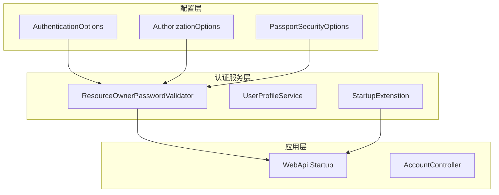
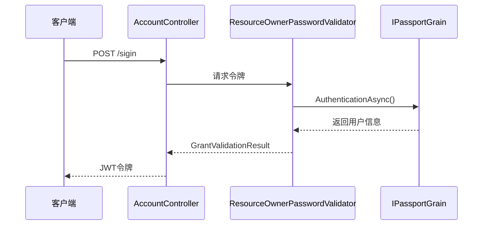
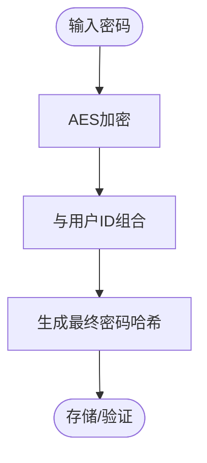
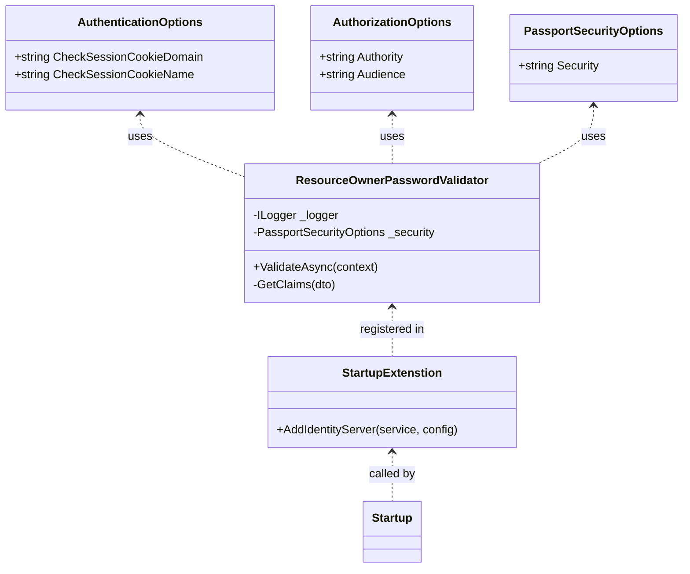

# 身份认证配置

<cite>
**本文档中引用的文件**
- [AuthenticationOptions.cs](file://Horizon.Core/Options/AuthenticationOptions.cs)
- [AuthorizationOptions.cs](file://Horizon.Core/Options/AuthorizationOptions.cs)
- [PassportSecurityOptions.cs](file://Horizon.Core/Options/PassportSecurityOptions.cs)
- [ResourceOwnerPasswordValidator.cs](file://Horizon.WebApi/Identity/ResourceOwnerPasswordValidator.cs)
- [StartupExtenstion.cs](file://Horizon.WebApi/Identity/StartupExtenstion.cs)
- [Config.cs](file://Horizon.WebApi/Identity/Config.cs)
- [appsettings.json](file://Horizon.WebApi/appsettings.json)
- [PassportHelper.cs](file://Horizon.Core/PassportHelper.cs)
</cite>

## 目录
1. [简介](#简介)
2. [项目结构](#项目结构)
3. [核心组件](#核心组件)
4. [架构概述](#架构概述)
5. [详细组件分析](#详细组件分析)
6. [依赖关系分析](#依赖关系分析)
7. [性能考虑](#性能考虑)
8. [故障排除指南](#故障排除指南)
9. [结论](#结论)

## 简介
本文档系统介绍身份认证系统的配置机制，涵盖JWT令牌管理、安全策略控制、OAuth 2.0/OpenID Connect集成及敏感信息保护实践。重点解析`AuthenticationOptions`中的JWT相关参数、`PassportSecurityOptions`的安全控制选项，并结合`ResourceOwnerPasswordValidator`验证逻辑说明认证流程与配置项的交互关系。

## 项目结构
本项目采用分层架构设计，核心身份认证功能集中于`Horizon.Core.Options`和`Horizon.WebApi.Identity`模块。配置类定义在`Horizon.Core\Options`目录下，而认证逻辑实现在`Horizon.WebApi\Identity`包中。



**Diagram sources**
- [AuthenticationOptions.cs](file://Horizon.Core/Options/AuthenticationOptions.cs)
- [AuthorizationOptions.cs](file://Horizon.Core/Options/AuthorizationOptions.cs)
- [PassportSecurityOptions.cs](file://Horizon.Core/Options/PassportSecurityOptions.cs)
- [ResourceOwnerPasswordValidator.cs](file://Horizon.WebApi/Identity/ResourceOwnerPasswordValidator.cs)
- [StartupExtenstion.cs](file://Horizon.WebApi/Identity/StartupExtenstion.cs)

**Section sources**
- [AuthenticationOptions.cs](file://Horizon.Core/Options/AuthenticationOptions.cs)
- [AuthorizationOptions.cs](file://Horizon.Core/Options/AuthorizationOptions.cs)
- [PassportSecurityOptions.cs](file://Horizon.Core/Options/PassportSecurityOptions.cs)

## 核心组件

### AuthenticationOptions 配置
该类定义了认证相关的基础选项，包括会话检查Cookie的域名和名称设置。

**Section sources**
- [AuthenticationOptions.cs](file://Horizon.Core/Options/AuthenticationOptions.cs#L9-L13)

### AuthorizationOptions 配置
包含JWT令牌的关键安全参数：颁发者（Authority）和受众（Audience），用于确保令牌的有效性和目标服务匹配。

**Section sources**
- [AuthorizationOptions.cs](file://Horizon.Core/Options/AuthorizationOptions.cs#L9-L12)

### PassportSecurityOptions 配置
提供密码加密所需的安全密钥配置，通过`Security`属性存储主加密密钥。

**Section sources**
- [PassportSecurityOptions.cs](file://Horizon.Core/Options/PassportSecurityOptions.cs#L6-L12)

## 架构概述
系统基于IdentityServer4实现OAuth 2.0资源所有者密码凭证模式，通过自定义验证器完成用户认证，并签发JWT令牌。



**Diagram sources**
- [AccountController.cs](file://Horizon.WebApi/Controllers/AccountController.cs#L39-L70)
- [ResourceOwnerPasswordValidator.cs](file://Horizon.WebApi/Identity/ResourceOwnerPasswordValidator.cs#L20-L95)
- [PassportGrain.cs](file://Horizon.Orleans.Grains/PassportGrain.cs)

## 详细组件分析

### 认证流程与配置交互
`ResourceOwnerPasswordValidator`是认证流程的核心，它接收用户名密码请求，调用后端服务进行验证，并根据结果生成相应的授权结果。

#### 密码处理机制
系统使用双重加密机制保护用户密码：
1. 使用AES对原始密码加密
2. 结合用户ID进行最终哈希处理



**Diagram sources**
- [PassportHelper.cs](file://Horizon.Core/PassportHelper.cs#L96-L105)
- [ResourceOwnerPasswordValidator.cs](file://Horizon.WebApi/Identity/ResourceOwnerPasswordValidator.cs#L50-L55)

**Section sources**
- [ResourceOwnerPasswordValidator.cs](file://Horizon.WebApi/Identity/ResourceOwnerPasswordValidator.cs#L20-L95)
- [PassportHelper.cs](file://Horizon.Core/PassportHelper.cs#L96-L105)

### OAuth 2.0/OpenID Connect 集成配置
系统通过`StartupExtenstion.AddIdentityServer`方法完成OAuth集成配置，支持内存式客户端、API资源和作用域管理。

#### 客户端配置
| 参数 | 值 | 说明 |
|------|-----|------|
| ClientId | api_client | 客户端标识 |
| AllowedGrantTypes | ResourceOwnerPassword | 支持资源所有者密码模式 |
| AccessTokenLifetime | 604800秒(7天) | 访问令牌有效期 |
| RefreshTokenExpiration | Sliding | 刷新令牌滑动过期 |
| SlidingRefreshTokenLifetime | 432000秒(5天) | 滑动刷新生命周期 |

**Section sources**
- [Config.cs](file://Horizon.WebApi/Identity/Config.cs#L43-L66)
- [StartupExtenstion.cs](file://Horizon.WebApi/Identity/StartupExtenstion.cs#L30-L33)

### 敏感信息保护最佳实践
建议将敏感配置信息如数据库连接字符串、加密密钥等通过环境变量或密钥管理服务注入，而非硬编码在配置文件中。

```json
{
  "PassportSecurityOptions": {
    "Security": "${PASSPORT_SECURITY_KEY}"
  },
  "AdoNetOptions": {
    "ConnectionString": "${DATABASE_CONNECTION_STRING}"
  }
}
```

生产环境中应使用Azure Key Vault、AWS Secrets Manager或Hashicorp Vault等专业密钥管理服务。

**Section sources**
- [appsettings.json](file://Horizon.WebApi/appsettings.json)

## 依赖关系分析
系统各组件间存在明确的依赖关系，确保认证功能的完整实现。



**Diagram sources**
- [AuthenticationOptions.cs](file://Horizon.Core/Options/AuthenticationOptions.cs)
- [AuthorizationOptions.cs](file://Horizon.Core/Options/AuthorizationOptions.cs)
- [PassportSecurityOptions.cs](file://Horizon.Core/Options/PassportSecurityOptions.cs)
- [ResourceOwnerPasswordValidator.cs](file://Horizon.WebApi/Identity/ResourceOwnerPasswordValidator.cs)
- [StartupExtenstion.cs](file://Horizon.WebApi/Identity/StartupExtenstion.cs)

## 性能考虑
- JWT令牌有效期设置为7天，平衡安全性与用户体验
- 启用滑动刷新令牌机制，减少频繁登录
- 使用Orleans分布式Actor模型处理高并发认证请求
- Redis缓存用于存储设备流和持久化授权数据（注释代码显示扩展点）

## 故障排除指南
常见问题及解决方案：

1. **令牌验证失败**
   - 检查`Authority`和`Audience`配置是否匹配
   - 确认RSA签名证书路径正确

2. **密码验证始终失败**
   - 验证`PassportSecurityOptions.Security`密钥配置
   - 检查`SetPasportPassword`逻辑是否正常执行

3. **跨服务调用异常**
   - 确保各微服务使用相同的加密密钥
   - 检查Orleans集群配置一致性

**Section sources**
- [ResourceOwnerPasswordValidator.cs](file://Horizon.WebApi/Identity/ResourceOwnerPasswordValidator.cs)
- [PassportHelper.cs](file://Horizon.Core/PassportHelper.cs)

## 结论
本系统实现了完整的身份认证配置体系，通过模块化设计分离关注点，支持灵活的安全策略调整。建议在生产环境中加强密钥管理和审计日志记录，持续优化认证性能和安全性。