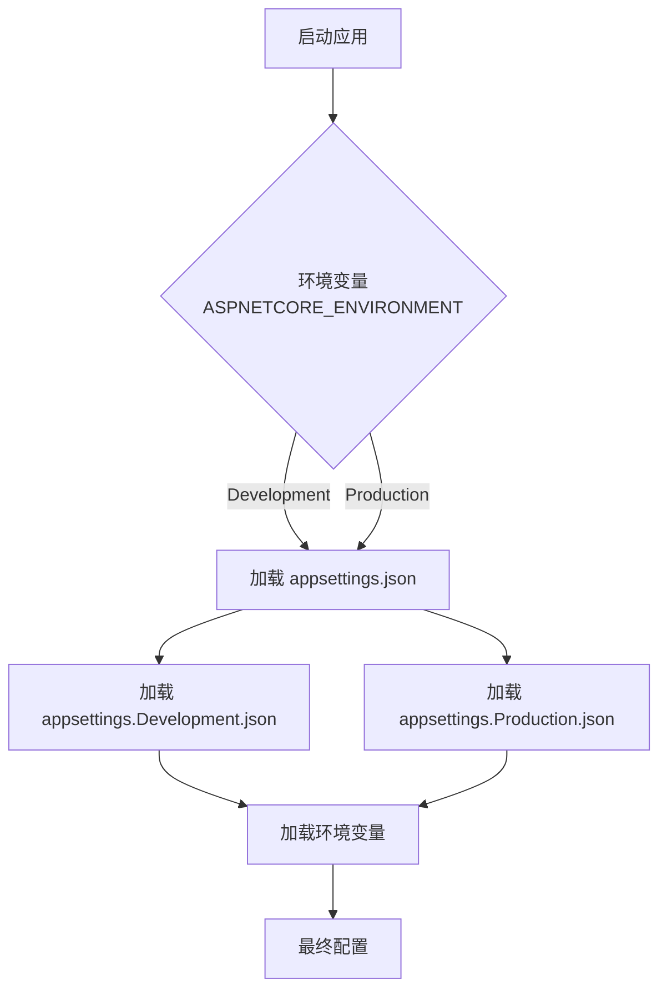
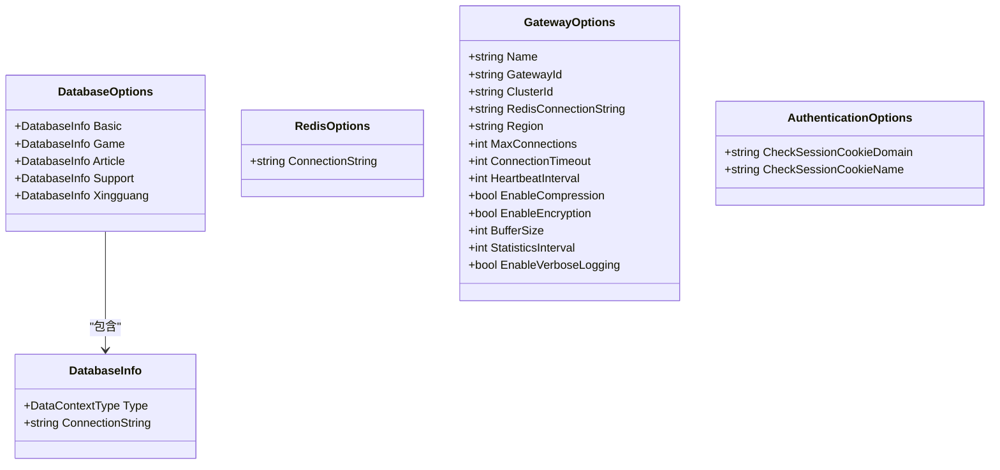

# 配置管理

<cite>
**Referenced Files in This Document**  
- [appsettings.json](file://Horizon.Game.Gateway/appsettings.json)
- [appsettings.Production.json](file://Horizon.Orleans.Silo/appsettings.Production.json)
- [appsettings.Development.json](file://Horizon.WebApi/appsettings.Development.json)
- [DatabaseOptions.cs](file://Horizon.Core/Options/DatabaseOptions.cs)
- [RedisOptions.cs](file://Horizon.Core/Options/RedisOptions.cs)
- [AuthenticationOptions.cs](file://Horizon.Core/Options/AuthenticationOptions.cs)
- [GatewayOptions.cs](file://Horizon.Game.Gateway/Configuration/GatewayOptions.cs)
</cite>

## 目录
1. [引言](#引言)
2. [配置文件结构与核心配置项](#配置文件结构与核心配置项)
3. [环境配置加载与覆盖规则](#环境配置加载与覆盖规则)
4. [强类型选项模式与验证机制](#强类型选项模式与验证机制)
5. [敏感信息保护方案](#敏感信息保护方案)
6. [配置热更新支持情况](#配置热更新支持情况)
7. [可配置参数总览](#可配置参数总览)
8. [结论](#结论)

## 引言

本配置管理文档旨在全面介绍项目中 `appsettings.json` 文件的各项配置用途，涵盖数据库连接、Redis地址、认证选项等关键设置。文档详细说明了不同环境（开发、生产）下配置文件的加载优先级与覆盖规则，解析了强类型选项模式（如 `DatabaseOptions`、`GatewayOptions`）的绑定机制与数据验证规则。同时，文档提供了敏感信息的加密存储建议，并评估了配置热更新的实现能力。最后，文档汇总了所有可配置参数的默认值、取值范围及其影响范围，为系统管理员和开发者提供权威的配置参考。

## 配置文件结构与核心配置项

项目采用基于 JSON 的配置文件系统，核心配置文件 `appsettings.json` 位于多个服务模块中，如 `Horizon.Game.Gateway` 和 `Horizon.Orleans.Silo`。该文件采用分层结构，将配置项按功能模块组织，确保配置的清晰与可维护性。

### 核心配置模块

配置文件主要包含以下核心模块：

- **`Logging`**: 定义日志记录级别和输出格式，控制不同命名空间的日志详细程度。
- **`Gateway`**: 网关服务的专用配置，包含网关名称、ID、最大连接数等。
- **`Network`**: 网络通信配置，指定TCP、UDP和WebSocket端口及网络参数。
- **`DataBase`**: Redis集群的主从节点和哨兵节点连接信息。
- **`DatabaseOptions`**: 业务数据库（基础、游戏、文章等）的连接字符串和类型。
- **`ClusteringSiloOptions`**: Orleans集群所使用的数据库（如SQL Server, PostgreSQL）的连接配置。
- **`Configs`**: 第三方服务（如阿里云OSS、百度AI）的密钥和端点配置。

**Section sources**
- [appsettings.json](file://Horizon.Game.Gateway/appsettings.json#L1-L175)

## 环境配置加载与覆盖规则

系统遵循 .NET Core 的标准配置加载机制，通过环境变量 `ASPNETCORE_ENVIRONMENT` 来区分不同的运行环境。配置文件的加载遵循特定的优先级顺序，后加载的配置会覆盖先前加载的同名配置项。

### 加载优先级

1.  **`appsettings.json`**: 作为基础配置文件，包含所有环境的通用设置。
2.  **`appsettings.{Environment}.json`**: 环境特定的配置文件，例如 `appsettings.Production.json` 或 `appsettings.Development.json`。此文件中的配置会覆盖 `appsettings.json` 中的同名项。
3.  **环境变量**: 来自操作系统的环境变量具有最高优先级，可以覆盖所有文件中的配置。

### 环境示例

- **开发环境 (Development)**: 系统会加载 `appsettings.json` 和 `appsettings.Development.json`。`appsettings.Development.json` 通常只包含日志级别等简单配置，不包含敏感信息。
- **生产环境 (Production)**: 系统会加载 `appsettings.json` 和 `appsettings.Production.json`。`appsettings.Production.json` 位于 `Horizon.Orleans.Silo` 模块，包含了生产环境的集群ID、主机地址等关键配置。

此机制允许在不同环境中使用不同的数据库连接、日志级别和功能开关，而无需修改代码。

**Diagram sources**
- [appsettings.json](file://Horizon.Game.Gateway/appsettings.json#L1-L175)
- [appsettings.Production.json](file://Horizon.Orleans.Silo/appsettings.Production.json#L1-L136)
- [appsettings.Development.json](file://Horizon.WebApi/appsettings.Development.json#L1-L9)

**Section sources**
- [appsettings.json](file://Horizon.Game.Gateway/appsettings.json#L1-L175)
- [appsettings.Production.json](file://Horizon.Orleans.Silo/appsettings.Production.json#L1-L136)
- [appsettings.Development.json](file://Horizon.WebApi/appsettings.Development.json#L1-L9)

## 强类型选项模式与验证机制

项目广泛采用 .NET Core 的 `IOptions<T>` 模式，将 JSON 配置文件中的扁平化键值对绑定到 C# 类（POCOs）上，实现类型安全的配置访问。

### 强类型选项类

- **`DatabaseOptions`**: 该类定义了五个数据库（`Basic`, `Game`, `Article`, `Support`, `Xingguang`）的配置。每个数据库由一个 `DatabaseInfo` 记录类型表示，包含 `ConnectionString`（连接字符串）和 `Type`（数据库类型，枚举）。
- **`RedisOptions`**: 结构简单，仅包含一个 `ConnectionString` 属性，用于存储Redis服务器的连接地址。
- **`GatewayOptions`**: 定义了游戏网关的各项参数，如 `Name`, `MaxConnections`, `HeartbeatInterval` 等。
- **`AuthenticationOptions`**: 包含认证相关的Cookie配置，如 `CheckSessionCookieDomain` 和 `CheckSessionCookieName`。

### 数据验证 (DataAnnotations)

`GatewayOptions` 类大量使用了 `System.ComponentModel.DataAnnotations` 命名空间中的特性来定义验证规则，确保配置值的有效性：
- **`[Required]`**: 标记 `Name` 和 `GatewayId` 为必填项。
- **`[Range(min, max)]`**: 对数值型配置进行范围限制，例如 `MaxConnections` 必须在1到100000之间，`ConnectionTimeout` 必须在10到3600秒之间。

这些验证规则在应用程序启动时由框架自动执行，如果配置值不满足条件，应用将启动失败，从而避免了因错误配置导致的运行时问题。

**Diagram sources**
- [DatabaseOptions.cs](file://Horizon.Core/Options/DatabaseOptions.cs#L10-L32)
- [RedisOptions.cs](file://Horizon.Core/Options/RedisOptions.cs#L8-L11)
- [GatewayOptions.cs](file://Horizon.Game.Gateway/Configuration/GatewayOptions.cs#L7-L80)
- [AuthenticationOptions.cs](file://Horizon.Core/Options/AuthenticationOptions.cs#L9-L13)

**Section sources**
- [DatabaseOptions.cs](file://Horizon.Core/Options/DatabaseOptions.cs#L1-L50)
- [RedisOptions.cs](file://Horizon.Core/Options/RedisOptions.cs#L1-L13)
- [GatewayOptions.cs](file://Horizon.Game.Gateway/Configuration/GatewayOptions.cs#L1-L81)
- [AuthenticationOptions.cs](file://Horizon.Core/Options/AuthenticationOptions.cs#L1-L15)

## 敏感信息保护方案

当前配置文件中直接包含了数据库密码、云服务密钥等敏感信息（如 `AliOSSAccessKeySecret`, `BaiDuSecretKey`），这是一种不安全的做法。

### 推荐的加密存储方案

为了提升安全性，应采用以下方案之一来保护敏感信息：

1.  **环境变量 (Environment Variables)**:
    *   **实现方式**: 将敏感信息（如密码、密钥）移出 `appsettings.json` 文件，通过操作系统的环境变量注入。
    *   **优点**: 简单易行，是 .NET Core 内置支持的机制。配置文件中只保留占位符或引用。
    *   **缺点**: 密钥仍以明文形式存在于服务器的环境变量中，需要额外的系统级保护。

2.  **Azure Key Vault (或类似服务)**:
    *   **实现方式**: 使用 Azure Key Vault、AWS Secrets Manager 或 HashiCorp Vault 等专用密钥管理服务。应用程序在启动时通过身份验证从密钥库中获取敏感信息。
    *   **优点**: 提供了企业级的安全性，包括访问控制、审计日志、密钥轮换和加密存储。
    *   **集成**: .NET Core 提供了 `Azure.Extensions.AspNetCore.Configuration.Secrets` 包，可以轻松地将 Azure Key Vault 集成到配置系统中，作为配置源之一。

3.  **用户机密 (User Secrets)**:
    *   **实现方式**: 仅适用于开发环境。使用 `dotnet user-secrets` 命令将敏感信息存储在用户目录下的一个加密文件中。
    *   **优点**: 防止开发者的敏感信息意外提交到版本控制系统（如Git）。
    *   **缺点**: 不适用于生产环境。

**结论**: 对于生产环境，强烈建议采用 **Azure Key Vault** 或同等的密钥管理服务，以实现最高级别的安全性和合规性。

**Section sources**
- [appsettings.json](file://Horizon.Game.Gateway/appsettings.json#L1-L175)

## 配置热更新支持情况

根据现有代码分析，当前系统**不支持**配置的热更新。

### 原因分析

1.  **配置绑定时机**: 强类型选项（如 `IOptions<GatewayOptions>`）在应用程序启动时通过依赖注入容器进行一次性绑定。一旦应用启动，这些选项实例的值就固定了。
2.  **缺乏监听机制**: 代码中没有发现使用 `IOptionsSnapshot<T>` 或 `IOptionsMonitor<T>` 的迹象。`IOptionsSnapshot<T>` 在每次请求时重新读取配置，`IOptionsMonitor<T>` 则能监听配置文件的变化并触发回调。
3.  **无文件监听代码**: 没有代码显示在监听 `appsettings.json` 文件的 `FileSystemWatcher` 或类似的文件变更事件。

### 实现热更新

要实现配置热更新，需要进行以下改造：
- 将服务中注入的 `IOptions<T>` 替换为 `IOptionsSnapshot<T>`。
- 对于需要实时响应配置变更的场景，使用 `IOptionsMonitor<T>` 并注册 `OnChange` 回调。
- 确保配置提供程序（如 `FileConfigurationProvider`）启用了 `reloadOnChange` 选项（通常在 `Program.cs` 中配置）。

**Section sources**
- [GatewayOptions.cs](file://Horizon.Game.Gateway/Configuration/GatewayOptions.cs#L1-L81)
- [DatabaseOptions.cs](file://Horizon.Core/Options/DatabaseOptions.cs#L1-L50)

## 可配置参数总览

下表汇总了系统中主要的可配置参数、其默认值、取值范围和影响范围。

| 配置路径 | 参数名称 | 默认值 | 取值范围 | 影响范围 | 来源 |
| :--- | :--- | :--- | :--- | :--- | :--- |
| `Gateway.Name` | 网关名称 | "混沌世界游戏网关" | 任意字符串 | 网关服务标识 | `GatewayOptions` |
| `Gateway.GatewayId` | 网关ID | "TYMYD-Gateway-001" | 任意字符串 | 集群内唯一标识 | `GatewayOptions` |
| `Gateway.MaxConnections` | 最大并发连接数 | 10000 | 1 - 100000 | 网络连接容量 | `GatewayOptions` |
| `Gateway.ConnectionTimeout` | 连接超时时间(秒) | 300 | 10 - 3600 | 客户端连接管理 | `GatewayOptions` |
| `Gateway.HeartbeatInterval` | 心跳间隔(秒) | 30 | 10 - 300 | 心跳检测频率 | `GatewayOptions` |
| `Gateway.EnableCompression` | 启用消息压缩 | true | true/false | 网络带宽与CPU消耗 | `GatewayOptions` |
| `Network.TcpPort` | TCP端口 | 7789 | 1 - 65535 | 客户端TCP连接 | `appsettings.json` |
| `Network.WebSocketPort` | WebSocket端口 | 8890 | 1 - 65535 | 客户端WebSocket连接 | `appsettings.json` |
| `DatabaseOptions.Basic.ConnectionString` | 基础库连接字符串 | (见文件) | 有效SQL Server连接字符串 | 基础数据访问 | `DatabaseOptions` |
| `DatabaseOptions.Game.ConnectionString` | 游戏库连接字符串 | (见文件) | 有效SQL Server连接字符串 | 游戏数据访问 | `DatabaseOptions` |
| `DataBase.RedisMasters[0].Host` | Redis主节点主机 | "122.9.148.88" | 有效IP或域名 | Redis集群连接 | `appsettings.json` |
| `DataBase.RedisMasters[0].Port` | Redis主节点端口 | "9379" | 1 - 65535 | Redis集群连接 | `appsettings.json` |
| `AuthenticationOptions.CheckSessionCookieDomain` | Cookie域 | null | 有效域名 | Web会话认证 | `AuthenticationOptions` |

**Section sources**
- [appsettings.json](file://Horizon.Game.Gateway/appsettings.json#L1-L175)
- [GatewayOptions.cs](file://Horizon.Game.Gateway/Configuration/GatewayOptions.cs#L7-L80)
- [DatabaseOptions.cs](file://Horizon.Core/Options/DatabaseOptions.cs#L10-L32)
- [AuthenticationOptions.cs](file://Horizon.Core/Options/AuthenticationOptions.cs#L9-L13)

## 结论

本项目已建立了一套基于 `appsettings.json` 和强类型选项的配置管理体系，结构清晰，易于维护。通过环境特定的配置文件实现了开发与生产环境的分离。然而，存在两个主要改进点：一是敏感信息（如数据库密码、云服务密钥）目前以明文形式存储在配置文件中，存在安全风险，建议迁移到 Azure Key Vault 等专业密钥管理服务；二是系统不支持配置热更新，修改配置后需要重启服务，影响可用性，可通过引入 `IOptionsSnapshot<T>` 或 `IOptionsMonitor<T>` 来解决。实施这两项改进将显著提升系统的安全性和运维效率。