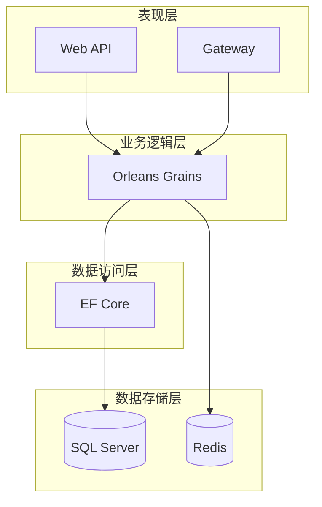
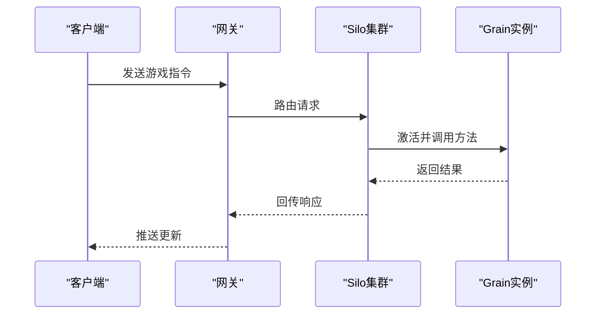
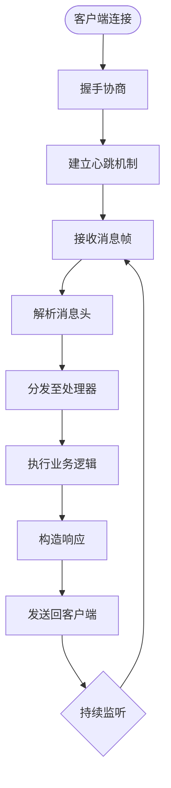

# 项目概述

<cite>
**本文档引用的文件**  
- [PassportGrain.cs](file://Horizon.Orleans.Grains\PassportGrain.cs)
- [CharacterGrain.cs](file://Horizon.Orleans.Grains\CharacterGrain.cs)
- [IPassportGrain.cs](file://Horizon.Orleans.Interface\IPassportGrain.cs)
- [ICharacterGrain.cs](file://Horizon.Orleans.Interface\ICharacterGrain.cs)
- [Program.cs](file://Horizon.Orleans.Silo\Program.cs)
- [Program.cs](file://Horizon.Game.Gateway\Program.cs)
- [Startup.cs](file://Horizon.WebApi\Startup.cs)
- [appsettings.json](file://Horizon.Orleans.Silo\appsettings.json)
- [appsettings.json](file://Horizon.Game.Gateway\appsettings.json)
- [appsettings.json](file://Horizon.WebApi\appsettings.json)
- [HorizonMessagePacket.cs](file://Horizon.Game.Message\Network\HorizonMessagePacket.cs)
</cite>

## 目录
1. [简介](#简介)
2. [技术栈与架构设计](#技术栈与架构设计)
3. [系统分层结构](#系统分层结构)
4. [Orleans 分布式计算框架详解](#orleans-分布式计算框架详解)
5. [核心功能模块分析](#核心功能模块分析)
6. [身份认证管理机制](#身份认证管理机制)
7. [网关与客户端通信](#网关与客户端通信)
8. [数据流与系统上下文图](#数据流与系统上下文图)
9. [性能优化与高并发支持](#性能优化与高并发支持)
10. [配置管理与部署策略](#配置管理与部署策略)

## 简介

FlaxProjcts 是一个基于 Orleans 分布式计算框架构建的大型游戏后端系统，旨在为大规模在线游戏提供稳定、高效、低延迟的服务支持。该项目通过 Orleans 的 Actor 模型实现了高度可扩展的业务逻辑处理能力，能够有效应对海量用户并发连接的需求。系统不仅支持复杂的角色操作和实时交互，还集成了统一的身份认证管理机制，确保用户数据的安全性和一致性。整体架构采用微服务设计理念，结合 C#、Entity Framework Core、ASP.NET Core、Redis 等主流技术栈，形成了从前端 API 到后端数据存储的完整闭环。本项目特别适用于需要高吞吐量和低响应时间的游戏场景，如 MMORPG 或实时对战类游戏。

## 技术栈与架构设计

FlaxProjcts 项目采用了现代化的技术栈组合，以满足高性能、高可用性的需求。核心技术包括：

- **C#**: 作为主要开发语言，利用其强大的类型安全和丰富的库生态。
- **Orleans**: 提供分布式虚拟 Actor 模型，简化了并发编程复杂性，并实现自动伸缩和服务发现。
- **Entity Framework Core**: 负责与 SQL Server 数据库进行交互，提供对象关系映射（ORM）功能。
- **ASP.NET Core**: 构建 RESTful Web API 接口，处理外部请求并暴露服务。
- **Redis**: 用作缓存层和消息中间件，提升读取速度并支持会话共享。
- **AutoMapper**: 实现 DTO（Data Transfer Object）与领域模型之间的自动映射，减少手动转换代码。

这些技术协同工作，构成了一个松耦合、易维护且具备良好扩展性的系统架构。其中，Orleans 扮演着核心角色，它将业务逻辑封装在 Grain 中，每个 Grain 实例代表一个独立的状态单元，可以被远程调用而无需关心底层网络细节。



**图表来源**
- [Program.cs](file://Horizon.Orleans.Silo\Program.cs#L1-L530)
- [Startup.cs](file://Horizon.WebApi\Startup.cs#L1-L187)

## 系统分层结构

FlaxProjcts 遵循典型的分层架构模式，各层职责明确，便于团队协作和后期维护。

### 表现层（Web API、Gateway）

表现层由两个关键组件构成：**Web API** 和 **Gateway**。Web API 基于 ASP.NET Core 构建，对外暴露标准化的 HTTP 接口，主要用于非实时性操作，例如用户注册、登录验证等。Gateway 则是专门为游戏客户端设计的长连接入口点，使用 TouchSocket 框架处理 TCP/UDP/WebSocket 协议，负责接收来自客户端的游戏指令并转发至相应的 Orleans Grain 进行处理。此外，Gateway 还承担负载均衡、心跳检测和断线重连等功能，保证了通信链路的稳定性。

### 业务逻辑层（Orleans Grains）

业务逻辑层是整个系统的中枢神经，所有核心玩法逻辑均在此实现。通过定义不同的 Grain 类型（如 `PassportGrain`、`CharacterGrain`），将用户账户、角色状态等实体抽象成具有唯一标识的虚拟 Actor。每个 Grain 在运行时会被 Orleans 自动激活或钝化，从而动态调整资源占用。Grain 之间可以通过异步方法调用来交换信息，形成复杂的工作流。

### 数据访问层（EF Core）

数据访问层借助 Entity Framework Core 完成数据库 CRUD 操作。为了提高效率，系统针对不同类型的业务数据创建了多个 DbContext，分别对应基础信息、游戏数据、文章内容等模块。同时，通过依赖注入机制将 DataContext 注入到各个 Grain 中，使得持久化操作变得透明且易于测试。

### 数据存储层（SQL Server、Redis）

最终的数据持久化发生在 SQL Server 上，所有重要业务数据都保存于此，确保事务完整性和持久性。与此同时，Redis 被广泛应用于缓存高频访问的数据项（如用户会话、排行榜）、分布式锁以及发布/订阅消息传递，显著降低了数据库的压力。

**章节来源**
- [Program.cs](file://Horizon.Orleans.Silo\Program.cs#L1-L530)
- [Program.cs](file://Horizon.Game.Gateway\Program.cs#L1-L238)
- [Startup.cs](file://Horizon.WebApi\Startup.cs#L1-L187)

## Orleans 分布式计算框架详解

Orleans 是 FlaxProjcts 的基石，它引入了一种称为“虚拟 Actor”的编程模型，允许开发者像编写单机程序一样编写分布式应用。在这种模型下，每一个 Grain 都像是一个轻量级的对象实例，拥有自己的状态和行为，但实际运行在集群中的某台服务器上。

### Grain 生命周期

Grain 的生命周期由 Orleans 运行时完全托管。当收到第一个请求时，对应的 Grain 会被自动激活（Activate），此时会执行 `OnActivateAsync` 方法初始化状态；当一段时间内无任何活动时，则可能被钝化（Deactivate），释放内存资源。这种按需激活的方式极大地提高了资源利用率。

### 状态持久化

为了防止因节点故障导致数据丢失，Orleans 支持多种存储提供程序来保存 Grain 状态。在本项目中，配置了 AdoNetGrainStorage，将状态序列化后存入 SQL Server 特定表中。每次状态变更可通过显式调用 `WriteStateAsync()` 触发写入，或者设置自动刷新策略。

### 消息传递机制

Grain 间的通信基于异步消息传递，发送方无需等待接收方立即响应即可继续执行后续任务。Orleans 内部使用高效的序列化协议（如 MemoryPack）压缩消息体，并通过 Silo 集群内部的消息总线进行路由。对于跨 Silo 的调用，框架会自动处理网络分区、重试和超时等问题，保障了通信的可靠性。



**图表来源**
- [PassportGrain.cs](file://Horizon.Orleans.Grains\PassportGrain.cs#L1-L394)
- [CharacterGrain.cs](file://Horizon.Orleans.Grains\CharacterGrain.cs#L1-L657)

## 核心功能模块分析

通过对源码的深入剖析，我们识别出几个关键的功能模块，它们共同支撑起整个游戏世界的运作。

### PassportGrain：用户身份管理

`PassportGrain` 是处理用户认证相关操作的核心 Grain，实现了 `IPassportGrain` 接口。该 Grain 提供了诸如登录 (`AuthenticationAsync`)、登出 (`SignOutAsync`)、修改密码 (`ChangePasswordAsync`) 和注册 (`RegisterAsync`) 等方法。值得注意的是，在注册过程中，系统会对手机号或邮箱进行唯一性校验，并生成唯一的通行证 ID，随后创建关联的用户记录及游戏账号。

### CharacterGrain：角色状态管理

`CharacterGrain` 继承自 `IGrainWithIntegerKey`，用于管理玩家角色的各项属性。除了基本的创建 (`CreateCharacterAsync`) 和进入游戏 (`EnterGameAsync`) 外，还包括移动 (`MoveAsync`)、攻击 (`AttackAsync`)、装备穿戴等一系列动作。所有状态变更都会反映在其持久化状态 `_characterState` 上，并在必要时刻同步到底层数据库。

### Grain 接口契约

接口定义位于 `Horizon.Orleans.Interface` 项目中，明确了各 Grain 应遵循的行为规范。例如，`IPassportGrain` 规定了所有与用户身份相关的操作签名，而 `ICharacterGrain` 则涵盖了角色生命周期内的各种事件。这种分离关注点的做法有助于保持代码整洁，并促进团队间的并行开发。

**章节来源**
- [PassportGrain.cs](file://Horizon.Orleans.Grains\PassportGrain.cs#L1-L394)
- [CharacterGrain.cs](file://Horizon.Orleans.Grains\CharacterGrain.cs#L1-L657)
- [IPassportGrain.cs](file://Horizon.Orleans.Interface\IPassportGrain.cs#L1-L83)
- [ICharacterGrain.cs](file://Horizon.Orleans.Interface\ICharacterGrain.cs#L1-L334)

## 身份认证管理机制

身份认证是任何在线服务不可或缺的一环，FlaxProjcts 通过多层次的安全措施确保了用户凭证的安全传输与存储。

### 认证流程

用户首次登录时，需提交用户名（或手机号/邮箱）和密码。系统首先查询 `Passport` 表验证凭据有效性，若成功则查找或克隆对应的 `User` 记录，并更新最后登录时间和登录次数。对于游戏应用，还会检查是否存在匹配的 `UserEntity`，不存在则自动创建新条目。

### 密码加密

用户的密码不会明文保存，而是经过哈希算法处理后再入库。具体来说，`PassportHelper.SetPasportPassword` 方法结合通行证 ID 和原始密码生成不可逆的摘要值，即使数据库泄露也无法轻易还原原始密码。

### 会话管理

一旦认证成功，系统会返回包含用户基本信息的 `PassportInfoDto` 对象，其中包含可用于后续请求的身份令牌。此令牌通常附加在 HTTP Header 或 WebSocket Frame 中，由网关或 API 层解析验证，决定是否授予访问权限。

**章节来源**
- [PassportGrain.cs](file://Horizon.Orleans.Grains\PassportGrain.cs#L51-L124)
- [PassportGrain.cs](file://Horizon.Orleans.Grains\PassportGrain.cs#L165-L260)

## 网关与客户端通信

网关作为客户端与后端服务之间的桥梁，扮演着至关重要的角色。它不仅要处理大量的并发连接，还需保证消息传递的及时性和准确性。

### 连接建立

客户端启动后，首先尝试连接指定 IP 和端口的网关服务。一旦连接成功，即刻发起握手协议，交换必要的元数据（如版本号、设备信息）。此后，双方维持长连接状态，定期发送心跳包以检测链路健康状况。

### 消息格式

所有通信均采用自定义的二进制协议，消息头包含长度前缀和命令码，消息体则使用 MemoryPack 序列化为紧凑的字节数组。这种方式相比 JSON/XML 更节省带宽，也更适合高频次的小数据包传输。

### 消息处理

网关接收到原始数据后，先解析出 `HorizonMessagePacket` 结构，然后根据 `ServiceType` 字段将其分发给对应的消息处理器（MessageHandler）。目前实现了账户、角色、聊天等多个子系统的处理器，未来可轻松扩展更多功能。



**图表来源**
- [Program.cs](file://Horizon.Game.Gateway\Program.cs#L1-L238)
- [HorizonMessagePacket.cs](file://Horizon.Game.Message\Network\HorizonMessagePacket.cs#L1-L341)

## 数据流与系统上下文图

理解数据在整个系统中的流动路径对于把握整体架构至关重要。以下描述了一个典型用户从登录到参与游戏全过程的数据流转情况。

1. 用户通过 Web 浏览器或原生 App 向 Web API 发起登录请求；
2. API 层调用 `PassportGrain.AuthenticationAsync` 方法完成身份验证；
3. 认证成功后，返回带有 Token 的响应，客户端凭此连接游戏网关；
4. 网关接受连接并向 Orleans 集群查询目标 `CharacterGrain`；
5. Grain 激活后加载角色状态，并通知客户端准备就绪；
6. 客户端开始发送游戏操作指令，经由网关转发至相应 Grain；
7. Grain 更新状态并将结果广播给周围玩家；
8. 所有变更最终通过 EF Core 持久化至 SQL Server。

```mermaid
erDiagram
USER ||--o{ PASSPORT : "拥有"
USER ||--o{ USERENTITY : "关联"
PASSPORT }|--|| PASSPORTIDS : "分配ID"
CHARACTERENTITY ||--|| USERENTITY : "归属"
USERENTITY ||--|| GAMEUSERCONTEXT : "存在于"
GAMEUSERCONTEXT }|--|| GAMEDB : "存储于"
REDIS ||--|| SESSION : "缓存会话"
WEB_API --> PASSPORTGRAIN : "调用认证"
GATEWAY --> CHARACTERGRAIN : "转发指令"
CHARACTERGRAIN --> SQLSERVER : "持久化状态"
CHARACTERGRAIN --> REDIS : "更新缓存"
```

**图表来源**
- [PassportGrain.cs](file://Horizon.Orleans.Grains\PassportGrain.cs#L1-L394)
- [CharacterGrain.cs](file://Horizon.Orleans.Grains\CharacterGrain.cs#L1-L657)
- [Program.cs](file://Horizon.Game.Gateway\Program.cs#L1-L238)

## 性能优化与高并发支持

面对数万乃至数十万级别的并发用户，FlaxProjcts 在多个层面进行了针对性优化。

### 并行初始化

在 Silo 启动阶段，采用并行方式获取可用端口和加载配置文件，大幅缩短了冷启动时间。此外，非关键服务被标记为延迟初始化，避免阻塞主线程。

### 缓存策略

广泛使用 Redis 缓存热点数据，如用户资料、排行榜、配置参数等，减少了对数据库的直接访问频率。同时，借助分布式锁（`Cache.AcquireLockAsync`）防止并发修改引发的数据竞争问题。

### 异步非阻塞IO

无论是 Web API 还是 Gateway，全部采用异步编程模型处理 I/O 操作，确保即使在高负载情况下也能维持良好的响应速度。特别是 Gateway 使用了 TouchSocket 的高性能 Socket 库，进一步提升了网络吞吐量。

### 负载均衡

网关内置简单的轮询算法实现客户端连接的负载均衡，未来可集成 Consul 等服务发现工具实现更智能的调度策略。

**章节来源**
- [Program.cs](file://Horizon.Orleans.Silo\Program.cs#L1-L530)
- [Program.cs](file://Horizon.Game.Gateway\Program.cs#L1-L238)

## 配置管理与部署策略

合理的配置管理和灵活的部署方案是保障系统稳定运行的前提。

### 多环境配置

项目提供了 `appsettings.json`、`appsettings.Production.json` 和 `appsettings.test.json` 三种配置文件，分别对应开发、生产与测试环境。通过环境变量切换，可以在不改动代码的情况下适配不同部署场景。

### 敏感信息保护

数据库连接字符串、API 密钥等敏感信息并未硬编码在配置文件中，而是通过环境变量注入或密钥管理服务获取，降低了泄露风险。

### 容器化部署

虽然当前未见 Dockerfile，但从项目结构来看已具备容器化条件。建议将 Silo、Gateway 和 Web API 分别打包为独立镜像，利用 Kubernetes 编排实现弹性伸缩和故障恢复。

**章节来源**
- [appsettings.json](file://Horizon.Orleans.Silo\appsettings.json#L1-L150)
- [appsettings.json](file://Horizon.Game.Gateway\appsettings.json#L1-L176)
- [appsettings.json](file://Horizon.WebApi\appsettings.json#L1-L56)