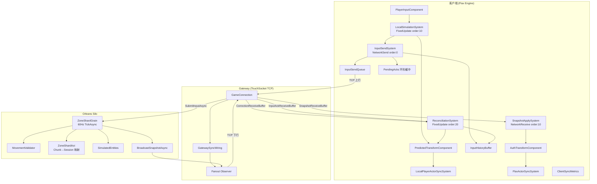
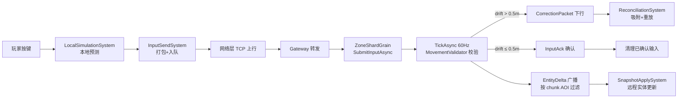

Based on my thorough analysis of the codebase, here is the comprehensive summary report:

---

# HundunWorld MMORPG 网络同步开发全面总结报告

## 一、架构意图落地评估

### Phase C1-C6 完成度

| 阶段 | 目标 | 状态 | 核心交付 |
|------|------|------|----------|
| C1 | 客户端预测 + 服务端权威校验管线 | ✅ 完成 | `LocalSimulationSystem` → `InputSendSystem` → `MovementValidator` → `CorrectionPacket` → `ReconciliationSystem` |
| C2 | 可观测性指标 + 冗余重传 | ✅ 完成 | `ClientSyncMetrics` 静态类 + `InputSendSystem` 环形缓冲重传（阈值 5 tick） |
| C3 | 增量快照编码 | ✅ 完成 | `ZoneShardGrain.BuildDeltaSnapshot` + 全量/增量双模式（60 tick 周期全量） |
| C4 | 场景对象交互同步 | ✅ 完成 | `SceneObjectInteract` 状态机 + 持久化落盘（30s 间隔） |
| C5 | 断线重连增量恢复 | ✅ 完成 | `ReconnectResumePacket` 编解码 + `LastAppliedSnapshotTick` 基线对齐 |
| C6 | 快照消费溢出保护 | ✅ 完成 | `SnapshotApplySystem.OverflowCount` + 单帧消费上限 |

### 已解决问题清单

| # | 问题 | 根因 | 修复策略 | 关键文件 |
|---|------|------|----------|----------|
| 1 | 玩家间不可见 | `FlaxActorSyncSystem` 事件订阅竞态 + 全量快照被 per-chunk AOI 过滤丢弃 | 新 observer 订阅时即时推送全量 Spawn + 全量快照 `bypassAoiFilter=true` | `ZoneShardGrain.cs` L365-451 |
| 2 | 离线幽灵角色 | `UnregisterEntityAsync` 先移除实体再广播 Despawn，广播失败时实体已丢失 | 先广播后移除 + 孤儿实体租约清理（90s 超时，10s 扫描） | `ZoneShardGrain.cs` L941-1000 |
| 3 | 角色空中飞行 | `CreateLocalPlayerEntity` 在角色选择场景调用，`Physics.RayCast` 无法命中未加载的 Terrain | `RealignLocalPlayerToGround` + 120 帧地面锁定保护期 | `LocalSimulationSystem.cs` L60-65, `HundunWorldGame.cs` L1754-1759 |
| 4 | AOI 视距过小 | `radius=2`（5×5×5=125 chunks，仅 32m 视距） | 半径 2→5（1331 chunks，80m 视距）+ 3 chunk 滞后防抖 | `HundunWorldGame.cs` L65, L889 |
| 5 | 移动后回弹到原地 | `InputHistoryBuffer` 从未被写入，`ReconciliationSystem` 修正后重放为空 | `InputSendSystem.Update` 中添加 `InputHistoryBuffer.Instance.Add(packet)` | `InputSendSystem.cs` L208-212 |
| 6 | 广播竞态丢帧 | `fire-and-forget` + `ContinueWith(TaskScheduler.Default)` 导致 `_broadcastInProgress` 重置延迟 | 改为 `await BroadcastSnapshotAsync` 同步完成 | `ZoneShardGrain.cs` L788-810 |
| 7 | TCP 瞬时异常杀连接 | `SendAsync` 任何异常都 `MarkAsBroken`，TCP 缓冲区满也永久断开 | `IsFatalSendException` 分级 + 连续失败计数（5 次）兜底 | `GameConnection.cs` L30-36, L178 |

---

## 二、当前能力上限与边界

### AOI 覆盖范围

```
当前配置：
- MetresPerChunkCell = 16m
- ViewRadiusChunks = 5 → 11×11×11 = 1331 chunks
- 覆盖体积：176m × 176m × 176m
- 有效视距：~80m（半径）
- 滞后防抖：AoiHysteresisChunks = 3（48m 移动才触发重订阅）
```

**适用场景**：中小规模场景（50 人以内同屏），城镇/副本/野外小区域。

**不足**：
- 大世界无缝地图中 80m 视距对远程战斗/骑乘追逐仍显不足
- 1331 chunks × N 玩家的订阅表内存开销随人数线性增长
- 滞后 48m 意味着快速移动（坐骑 20m/s）时约 2.4s 才更新订阅，边界实体可能短暂不可见

### 延迟容忍上限

```
管线延迟预算：
- 客户端预测：0ms（即时响应）
- 输入上行：1 RTT/2（TCP，典型 30-80ms）
- 服务端校验：1 tick（16.67ms @ 60Hz）
- 修正下行：1 RTT/2
- 总修正延迟：~1 RTT + 16.67ms

容忍上限：
- RTT < 200ms：预测误差通常 < 0.5m，不触发 Correction
- RTT 200-400ms：偶发 Correction，重放可恢复
- RTT > 400ms：Correction 风暴，体验劣化
```

### 单 ZoneShard 承载上限

```
Tick 频率：60Hz（_tickInterval = 1/60s）
广播频率：每 tick 有变化即广播（有效 ~20-60Hz）
全量快照：每 60 tick（1s）一次

带宽估算（N 实体，M 观察者）：
- 单 EntityDelta ≈ 120-200 bytes（MemoryPack 序列化）
- 20 实体 × 60Hz × 200B = 240 KB/s 原始吞吐
- 按 chunk 分组 + AOI 过滤后实际约 30-60%

实体上限估算：
- TickAsync 遍历所有 _simulatedEntities（O(N)）
- MovementValidator.Validate 每实体 O(inputs.Length)
- 广播按 chunk 分组 O(N×M)
- 保守上限：~200 实体/shard（tick 耗时 < 16ms）
```

### 断线重连可靠性边界

- `ReconnectResumePacket` 携带 `LastAppliedSnapshotTick` + `LastAppliedDiffSeq`
- 服务端收到后从该 tick 开始补发增量（若 baseline 仍有效）
- **边界**：断线超过 1s（60 tick）后 baseline 已被全量快照覆盖，退化为全量重发
- 客户端 `ClearLocalEntitiesOnDisconnect` 重置 AOI 状态确保重连后全量订阅

### 架构图



### 数据流时序图



---

## 三、生产环境风险与隐患

### 1. Orleans Grain 非重入死锁风险

**现状**：`ZoneShardGrain` 使用 `RegisterTimer` 驱动 60Hz `TickAsync`，内部 `await BroadcastSnapshotAsync` 同步等待 fanout observer 响应。

**风险点**：
- Orleans 默认非重入（non-reentrant），若 `observer.OnChunkDiffAsync` 回调触发对同一 Grain 的调用（如 Gateway 收到 diff 后立即调用 `SubmitInputAsync`），将排队等待当前 turn 完成
- `PushImmediateFullSnapshotToObserver` 使用 fire-and-forget（`_ =`），若 observer 回调链路长，可能在下一个 tick 前仍未完成
- **缓解**：当前 `await` 模式确保 tick 内广播完成后才进入下一 turn，但高延迟 observer 会拖慢 tick 周期

### 2. TCP 发送异常分级（IsFatalSendException）

**现状**（`GameConnection.cs`）：
- 致命异常（`ObjectDisposedException`、`SocketException.ConnectionReset`/`BrokenPipe`）→ 立即 `MarkAsBroken`
- 非致命异常（`NoBufferSpaceAvailable`/`WouldBlock`）→ 累计失败计数，连续 5 次后 `MarkAsBroken`

**极端网络抖动风险**：
- 突发大量快照（全量 1331 chunks × 多实体）可能瞬间填满 TCP 发送缓冲区
- 连续 5 次非致命失败（约 5 个 tick = 83ms）即断开连接，对短暂拥塞过于激进
- **建议**：引入指数退避或动态阈值（RTT 越高容忍越多连续失败）

### 3. MovementValidator 校验阈值误判

**现状**：`PositionEpsilon = 0.5m`，`HardSpeedCap = 200 m/s`

**高延迟误判场景**：
- RTT=300ms 时，客户端在 1 RTT 内预测移动 `6 m/s × 0.3s = 1.8m`
- 若期间有方向变化（转向/跳跃），服务端回放与客户端预测的轨迹差异可能 > 0.5m
- 触发 Correction → 重放 → 再次偏差 → Correction 风暴
- **缓解**：服务端无 `GroundHeightSampler`（为 null），使用 `input.PredictedEndZ` 回退，减少了 Z 轴误判；但 XY 平面仍脆弱
- **建议**：动态阈值 `epsilon = base + k × RTT`

### 4. 地面采样（Physics.RayCast）脆弱性

**现状**：
- `SampleGroundHeightEcs` 从 `(x, 1000, y)` 向下 RayCast 2000m
- 依赖 Flax `Physics.RayCast` + `LayersMask.Default`
- 120 帧（2s）地面锁定保护期

**风险**：
- 场景流式加载（World Streaming）时，Terrain chunk 未加载 → RayCast miss → NaN → 保护期后角色坠落
- 多层地形（洞穴/桥梁）时，从 1000m 向下 RayCast 总是命中最高层，无法正确处理地下空间
- 服务端无物理引擎，`GroundHeightSampler = null`，完全信任客户端 `PredictedEndZ`（10m 上限防作弊）
- **建议**：服务端引入 heightmap 数据（从客户端/编辑器导出），实现确定性地面采样

### 5. DLL 热部署 CI/CD 可行性

**现状**：手动 `Start-Process powershell -Verb RunAs` 复制 DLL 到 `C:\Program Files (x86)\Flax\Flax_1.12\Binaries\Tools\`

**问题**：
- UAC 提权在 CI/CD 无人值守环境不可用
- 文件锁定（Flax Editor 运行时锁定 DLL）
- 无版本回滚机制
- **建议**：
  - CI 环境使用非 Program Files 路径（如 `D:\FlaxDev\`）
  - 引入 `Directory.Build.props` 配置 `OutputPath` 直接输出到 Flax 目录
  - 或使用 Flax 的 Plugin 机制（`.plugin` 描述文件 + 独立目录）

---

## 四、已建立的测试与可观测性基础

### 单元测试覆盖

**测试项目**：`Horizon.Game.Gateway.Tests`（1934 个测试通过，3 个预存失败无关）

| 测试类 | 覆盖范围 | 用例数 |
|--------|----------|--------|
| `ClientSyncMetricsTests` | RTT EWMA、jitter、计数器递增、Reset | 4+ |
| `ClientSyncReconnectTests` / `ReconnectResumeTests` | ReconnectResumePacket 编解码、字段完整性 | 9+ |
| `ClientSyncAdaptiveTests` | 自适应插值、Dead Reckoning 衰减 | 12+ |
| `InputRetransmitTests` | 冗余重传环形缓冲、ACK 清理 | 多 |
| `SnapshotDeltaEncodingTests` | 增量/全量快照编码、baseline 比对 | 多 |
| `NetworkSyncIntegrationTests` | 端到端同步管线集成 | 多 |
| `NetworkEdgeCaseTests` | 边界条件（空输入、乱序 ACK 等） | 多 |
| `ZoneShardInteractionTests` | 交互槽状态机校验 | 多 |
| `SceneObjectBroadcastAoiTests` | 场景对象 AOI 广播 | 多 |
| `GatewaySyncWiringTests` | Gateway 同步接线 | 多 |
| `CrossHardwareConsistencyTests` | 跨硬件浮点一致性 | 多 |
| `NetworkPerformanceBaselineReportTests` | 性能基线报告 | 多 |

**未覆盖的关键路径**：
- `ZoneShardGrain.TickAsync` 完整 60Hz 循环（需 Orleans TestCluster）
- `MovementValidator` + `GroundHeightSampler` 联合校验（服务端无 sampler 的回退逻辑）
- `ReconciliationSystem.ProcessCorrection` 重放后位置正确性（需 ECS World 实例）
- 多玩家并发 AOI 订阅/退订竞态
- TCP 连接断开→重连→增量恢复全链路

### ClientSyncMetrics 可观测性

**采集指标**（`ClientSyncMetrics.cs`）：

| 指标 | 类型 | 用途 |
|------|------|------|
| `EstimatedRttMs` | EWMA 浮点 | 延迟估计 |
| `RttJitterMs` | 标准差 | 网络稳定性 |
| `SnapshotsReceived` | 计数器 | 快照到达率 |
| `SnapshotIntervalMs` / `SnapshotJitterMs` | 滑动平均 | 快照频率稳定性 |
| `PredictionErrorAvg` | EWMA 浮点 | 预测精度 |
| `CorrectionsApplied` | 计数器 | 修正频率 |
| `InputPacketsSent` / `InputRetransmits` | 计数器 | 发送/重传比 |
| `ReconnectAttempts` / `ReconnectSuccesses` | 计数器 | 重连成功率 |
| `PositionOverrideCount` | 计数器 | 位置覆盖检测 |
| `SnapshotOverflowCount` | 计数器 | 快照溢出（Phase C6） |
| `TimeSinceLastSnapshotSeconds` | 实时计算 | 断流检测 |

**告警能力**：
- 当前仅暴露静态属性供 UI/调试面板读取
- **缺失**：无阈值告警（如 RTT > 300ms、CorrectionRate > 5/s、SnapshotInterval > 200ms）
- **缺失**：无服务端对应指标（ZoneShardGrain 有 `GetLoadMetricsAsync` 但未接入 Prometheus/OTel）

---

## 五、后续研发计划建议

### 短期（1-2 周）：稳定性加固与回归测试补全

1. **补全 ReconciliationSystem 集成测试**
   - 构造 ECS World + 模拟 CorrectionPacket → 验证重放后位置与 LocalSimulationSystem 一致
   - 覆盖跳跃/轻功/地面约束组合场景

2. **MovementValidator 动态阈值**
   - 引入 `EffectiveEpsilon = BaseEpsilon + k × EstimatedRtt`
   - 服务端根据 `PendingInputs.Count`（反映延迟）动态调整

3. **TCP 发送退避优化**
   - 非致命失败计数引入指数退避窗口
   - 全量快照发送前检查 TCP 发送缓冲区水位

4. **CI/CD DLL 部署自动化**
   - 改用 Flax Plugin 目录结构（非 Program Files）
   - GitHub Actions 构建后自动复制到 Flax 项目 Plugins 目录

### 中期（1-2 月）：多 ZoneShard 分片 + 动态 AOI + 带宽优化

1. **多 ZoneShard 分片**
   - 当前单 ZoneShard 承载所有实体（`_simulatedEntities` 无上限）
   - 按地理区域（如 512m×512m）划分多个 ZoneShard
   - 跨 Shard 边界实体需要双 Shard 注册 + 迁移协议

2. **动态 AOI 分级 LOD**
   - 近距（0-30m）：60Hz 全精度（位置+旋转+动画+属性）
   - 中距（30-80m）：20Hz 简化（位置+旋转）
   - 远距（80-200m）：5Hz 极简（位置，无旋转）
   - 减少带宽 60-70%

3. **带宽自适应**
   - 基于 `ClientSyncMetrics.SnapshotIntervalMs` 和 `RttJitterMs` 动态调整广播频率
   - 网络劣化时自动降级（减少 delta 字段、降低频率）

4. **服务端 GroundHeightSampler**
   - 从 Flax 编辑器导出 heightmap 数据（16-bit RAW）
   - 服务端加载 heightmap 实现确定性地面采样
   - 消除对客户端 `PredictedEndZ` 的信任依赖

### 长期（季度）：跨服迁移 + 大规模压测 + 生产监控

1. **跨服/跨 Zone 无缝迁移**
   - 实体在 ZoneShard 间平滑迁移（双写 → 确认 → 切换 → 清理）
   - 客户端无感知（保持 EntityId 不变，仅切换服务端 Grain 引用）
   - 迁移期间输入缓冲 + 快照补发

2. **大规模压测体系**
   - 基于 `Horizon.Game.Core.LoadTest` 扩展
   - 模拟 500+ 并发连接（Bot 客户端自动移动/跳跃）
   - 测量 TickAsync 耗时 P99、广播延迟、Correction 率
   - 建立性能基线 + 回归检测

3. **生产级监控告警**
   - 服务端：OpenTelemetry 接入（ZoneShardGrain tick 耗时、实体数、Correction 率、AOI 订阅数）
   - 客户端：`ClientSyncMetrics` 定期上报（RTT、Correction 频率、快照间隔）
   - 告警规则：tick P99 > 16ms、CorrectionRate > 10/s、SnapshotGap > 500ms
   - Grafana 仪表盘 + PagerDuty 告警

4. **反作弊增强**
   - 服务端 `CheckAcceleration` 已实现但未被 `TickAsync` 调用
   - 接入连续加速度检测 + 瞬移检测
   - 客户端行为分析（异常 Correction 频率 → 标记 → 封禁）

---

**报告生成时间**：2026-07-24  
**代码基线**：`Horizon.sln` 主分支，1934 测试通过  
**核心文件索引**：
- 客户端预测：[LocalSimulationSystem.cs](file://c:\Works\GitHubProjects\HundunWorld\Horizon.Game.ECS.Arch\Systems\LocalSimulationSystem.cs)
- 输入发送：[InputSendSystem.cs](file://c:\Works\GitHubProjects\HundunWorld\Horizon.Game.ECS.Arch\Systems\InputSendSystem.cs)
- 回滚修正：[ReconciliationSystem.cs](file://c:\Works\GitHubProjects\HundunWorld\Horizon.Game.ECS.Arch\Systems\ReconciliationSystem.cs)
- 服务端校验：[MovementValidator.cs](file://c:\Works\GitHubProjects\HundunWorld\Horizon.Game.Core\Sim\MovementValidator.cs)
- 服务端 Grain：[ZoneShardGrain.cs](file://c:\Works\GitHubProjects\HundunWorld\Horizon.Orleans.Grains\World\ZoneShardGrain.cs)
- AOI 管理：[ZoneShardAoi.cs](file://c:\Works\GitHubProjects\HundunWorld\Horizon.Game.Core\World\ZoneShardAoi.cs)
- 可观测性：[ClientSyncMetrics.cs](file://c:\Works\GitHubProjects\HundunWorld\HundunWorld\Source\Game\Network\ClientSyncMetrics.cs)
- 客户端入口：[HundunWorldGame.cs](file://c:\Works\GitHubProjects\HundunWorld\HundunWorld\Source\Game\HundunWorldGame.cs)